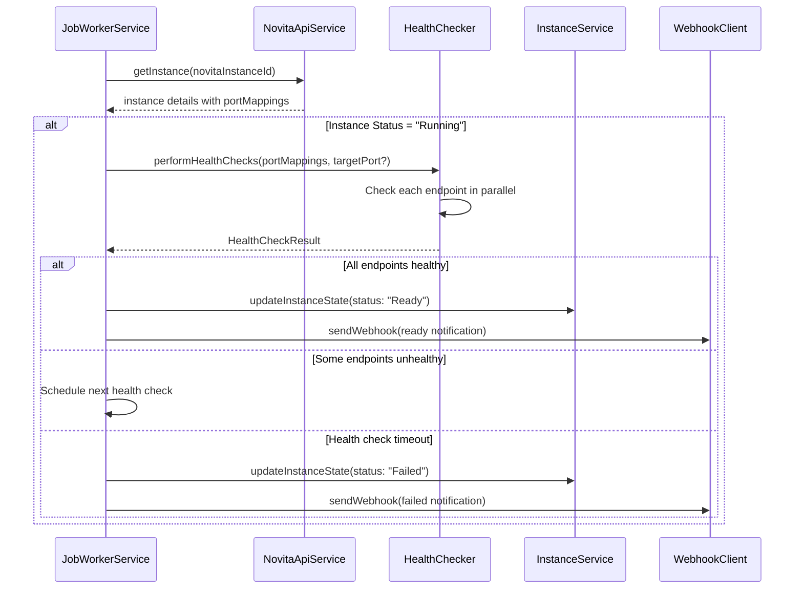

# Design Document

## Overview

This design document outlines the enhancement to the instance monitoring system to include application-level health checks. The enhancement extends the existing `handleMonitorInstance` method in the `JobWorkerService` to perform HTTP health checks on application endpoints after an instance reaches the "Running" state, ensuring applications are truly ready to serve requests.

## Architecture

### Current Flow Enhancement

The existing monitoring flow will be extended as follows:

1. **Instance Status Check** (existing) - Monitor until instance status becomes "Running"
2. **Health Check Phase** (new) - Perform HTTP health checks on application endpoints
3. **Ready State** (new) - Mark instance as "Ready" when all health checks pass
4. **Webhook Notification** (enhanced) - Include health check results in notifications

### Component Interactions



## Components and Interfaces

### 1. Enhanced Instance Status

Add new status to track health check progress:

```typescript
export enum InstanceStatus {
  CREATING = 'creating',
  CREATED = 'created', 
  STARTING = 'starting',
  RUNNING = 'running',
  HEALTH_CHECKING = 'health_checking', // New status
  READY = 'ready', // New status
  STOPPING = 'stopping',
  STOPPED = 'stopped',
  FAILED = 'failed',
  TERMINATED = 'terminated'
}
```

### 2. Health Check Types

```typescript
export interface HealthCheckConfig {
  timeoutMs: number;
  retryAttempts: number;
  retryDelayMs: number;
  maxWaitTimeMs: number;
  targetPort?: number; // If specified, only check this port
}

export interface EndpointHealthCheck {
  port: number;
  endpoint: string;
  type: string;
  status: 'pending' | 'healthy' | 'unhealthy';
  lastChecked?: Date;
  error?: string;
  responseTime?: number;
}

export interface HealthCheckResult {
  overallStatus: 'healthy' | 'unhealthy' | 'partial';
  endpoints: EndpointHealthCheck[];
  checkedAt: Date;
  totalResponseTime: number;
}
```

### 3. Enhanced Instance State

```typescript
export interface InstanceState {
  // ... existing fields
  healthCheck?: {
    status: 'pending' | 'in_progress' | 'completed' | 'failed';
    config: HealthCheckConfig;
    results: HealthCheckResult[];
    startedAt?: Date;
    completedAt?: Date;
  };
}
```

### 4. Enhanced Job Payload

```typescript
export interface MonitorInstanceJobPayload {
  instanceId: string;
  novitaInstanceId: string;
  webhookUrl?: string;
  startTime: Date;
  maxWaitTime: number;
  healthCheckConfig?: HealthCheckConfig; // New field
}
```

## Data Models

### Health Check Configuration

Default configuration values:
- `timeoutMs`: 10000 (10 seconds per endpoint check)
- `retryAttempts`: 3
- `retryDelayMs`: 2000 (2 seconds between retries)
- `maxWaitTimeMs`: 300000 (5 minutes total for health checks)

### Endpoint Health Check Logic

1. **HTTP Request**: Perform GET request to each endpoint
2. **Success Criteria**: 2xx or 3xx status codes
3. **Failure Criteria**: 4xx, 5xx status codes, timeouts, or connection errors
4. **Retry Logic**: Exponential backoff with jitter

## Error Handling

### Health Check Failures

1. **Individual Endpoint Failures**: Log and retry according to configuration
2. **Partial Health**: Continue monitoring if some endpoints are healthy
3. **Complete Failure**: Mark instance as failed after timeout
4. **Network Issues**: Distinguish between temporary and permanent failures

### Error Categories

```typescript
export enum HealthCheckErrorType {
  TIMEOUT = 'timeout',
  CONNECTION_REFUSED = 'connection_refused',
  BAD_GATEWAY = 'bad_gateway',
  SERVER_ERROR = 'server_error',
  UNKNOWN = 'unknown'
}
```

## Testing Strategy

### Unit Tests

1. **Health Check Logic**: Test individual endpoint checking
2. **Configuration Handling**: Test default and custom configurations
3. **Error Scenarios**: Test various failure modes
4. **Retry Logic**: Test exponential backoff and retry limits

### Integration Tests

1. **End-to-End Flow**: Test complete monitoring with health checks
2. **Webhook Integration**: Test webhook notifications with health check data
3. **Multiple Endpoints**: Test parallel health checking
4. **Timeout Scenarios**: Test health check timeouts

### Test Scenarios

```typescript
describe('Health Check Enhancement', () => {
  describe('handleMonitorInstance', () => {
    it('should perform health checks after instance becomes running');
    it('should check all endpoints by default');
    it('should check only target port when specified');
    it('should retry failed health checks');
    it('should timeout after maxWaitTime');
    it('should send webhook with health check results');
  });
});
```

## Implementation Details

### 1. Health Checker Service

Create a dedicated service for performing health checks:

```typescript
export class HealthChecker {
  async performHealthChecks(
    portMappings: Array<{port: number, endpoint: string, type: string}>,
    config: HealthCheckConfig
  ): Promise<HealthCheckResult>;
  
  private async checkEndpoint(
    endpoint: string,
    config: HealthCheckConfig
  ): Promise<EndpointHealthCheck>;
}
```

### 2. Enhanced Monitoring Logic

Modify `handleMonitorInstance` to include health check phase:

1. Check instance status (existing logic)
2. If status is "Running", transition to "health_checking"
3. Perform health checks based on configuration
4. Update instance state based on results
5. Send appropriate webhook notifications

### 3. Configuration Integration

Extend the existing configuration system to include health check settings:

```typescript
export interface Config {
  // ... existing config
  healthCheck: {
    defaultTimeoutMs: number;
    defaultRetryAttempts: number;
    defaultRetryDelayMs: number;
    defaultMaxWaitTimeMs: number;
  };
}
```

## Performance Considerations

### Parallel Processing

- Perform health checks for multiple endpoints in parallel
- Use Promise.allSettled to handle individual failures gracefully
- Implement connection pooling for HTTP requests

### Resource Management

- Limit concurrent health check operations
- Implement request timeouts to prevent hanging connections
- Use circuit breaker pattern for consistently failing endpoints

### Monitoring Metrics

Track health check performance:
- Average response times per endpoint
- Success/failure rates
- Health check duration distribution
- Resource utilization during health checks