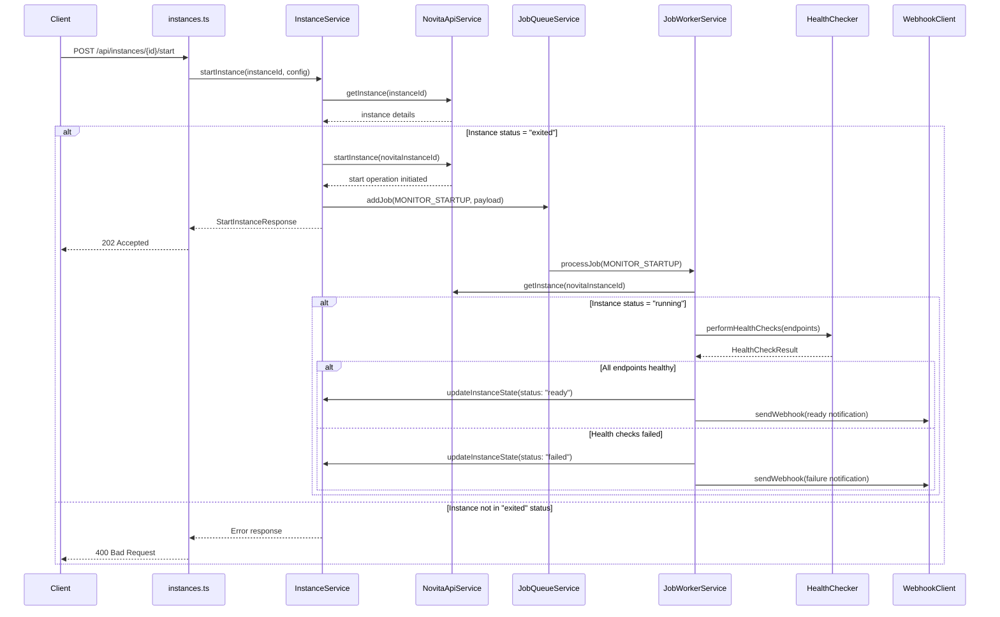

# Design Document

## Overview

This design document outlines the implementation of the Instance Start API feature, which adds endpoints to start GPU instances that are in "exited" status. The design integrates with the existing instance management system, health check enhancement, and job queue infrastructure to provide a complete startup workflow with monitoring and webhook notifications.

## Architecture

### API Endpoints

The feature adds two new endpoints to the instances router:

1. **POST /api/instances/{instanceId}/start** - Start instance by ID
2. **POST /api/instances/start** - Start instance by name (provided in request body)

### Startup Workflow



## Components and Interfaces

### 1. New API Types

```typescript
export interface StartInstanceRequest {
  instanceName?: string; // For name-based starting
  healthCheckConfig?: HealthCheckConfig;
  targetPort?: number;
  webhookUrl?: string;
}

export interface StartInstanceResponse {
  instanceId: string;
  novitaInstanceId: string;
  status: InstanceStatus;
  message: string;
  operationId: string;
  estimatedReadyTime?: string;
}

export interface StartInstanceJobPayload {
  instanceId: string;
  novitaInstanceId: string;
  webhookUrl?: string;
  healthCheckConfig: HealthCheckConfig;
  targetPort?: number;
  startTime: Date;
  maxWaitTime: number;
}
```

### 2. Enhanced Job Types

```typescript
export enum JobType {
  CREATE_INSTANCE = 'create_instance',
  MONITOR_INSTANCE = 'monitor_instance',
  MONITOR_STARTUP = 'monitor_startup', // New job type
  SEND_WEBHOOK = 'send_webhook'
}
```

### 3. Instance Status Validation

```typescript
export enum StartableStatus {
  EXITED = 'exited'
}

export enum NonStartableStatus {
  CREATING = 'creating',
  STARTING = 'starting', 
  RUNNING = 'running',
  READY = 'ready',
  STOPPING = 'stopping',
  FAILED = 'failed',
  TERMINATED = 'terminated'
}
```

## Data Models

### Instance Lookup Strategy

For name-based instance starting, the system will:

1. **Local State Search**: First check local instance states by name
2. **Novita API Search**: If not found locally, query Novita.ai API for instances with matching names
3. **Cache Results**: Cache the lookup results to improve performance

### Startup Operation Tracking

```typescript
export interface StartupOperation {
  operationId: string;
  instanceId: string;
  novitaInstanceId: string;
  status: 'initiated' | 'monitoring' | 'health_checking' | 'completed' | 'failed';
  startedAt: Date;
  phases: {
    startRequested: Date;
    instanceStarting?: Date;
    instanceRunning?: Date;
    healthCheckStarted?: Date;
    healthCheckCompleted?: Date;
    ready?: Date;
  };
  error?: string;
}
```

## Error Handling

### Status Validation Errors

```typescript
export class InstanceNotStartableError extends Error {
  constructor(
    public instanceId: string,
    public currentStatus: string,
    public reason: string
  ) {
    super(`Instance ${instanceId} cannot be started: ${reason} (current status: ${currentStatus})`);
    this.name = 'InstanceNotStartableError';
  }
}

export class InstanceNotFoundError extends Error {
  constructor(public identifier: string, public searchType: 'id' | 'name') {
    super(`Instance not found: ${identifier} (searched by ${searchType})`);
    this.name = 'InstanceNotFoundError';
  }
}
```

### Duplicate Operation Handling

The system will track active startup operations to prevent duplicates:

```typescript
private activeStartupOperations: Map<string, StartupOperation> = new Map();

private isStartupInProgress(instanceId: string): boolean {
  const operation = this.activeStartupOperations.get(instanceId);
  return operation && ['initiated', 'monitoring', 'health_checking'].includes(operation.status);
}
```

## Testing Strategy

### Unit Tests

1. **Route Handler Tests**
   - Test both endpoint variants (by ID and by name)
   - Test request validation and error responses
   - Test successful startup initiation

2. **Instance Service Tests**
   - Test instance lookup by ID and name
   - Test status validation logic
   - Test startup operation tracking

3. **Job Worker Tests**
   - Test startup monitoring job handler
   - Test health check integration
   - Test webhook notification sending

### Integration Tests

1. **End-to-End Startup Flow**
   - Test complete startup workflow from API call to ready state
   - Test health check integration during startup
   - Test webhook notifications

2. **Error Scenarios**
   - Test starting non-existent instances
   - Test starting instances in non-startable states
   - Test API failures during startup process

### Test Data Setup

```typescript
const mockExitedInstance = {
  id: 'test-instance-1',
  name: 'test-gpu-instance',
  status: 'exited',
  novitaInstanceId: 'novita-123',
  // ... other properties
};

const mockStartupConfig = {
  healthCheckConfig: {
    timeoutMs: 10000,
    retryAttempts: 3,
    retryDelayMs: 2000,
    maxWaitTimeMs: 300000
  },
  targetPort: 8080
};
```

## Implementation Details

### 1. Router Implementation

Add two new route handlers to `src/routes/instances.ts`:

```typescript
/**
 * POST /api/instances/:instanceId/start
 * Start instance by ID
 */
router.post('/:instanceId/start', asyncHandler(async (req: Request, res: Response): Promise<void> => {
  // Implementation details
}));

/**
 * POST /api/instances/start  
 * Start instance by name
 */
router.post('/start', asyncHandler(async (req: Request, res: Response): Promise<void> => {
  // Implementation details
}));
```

### 2. Instance Service Enhancement

Add new methods to `InstanceService`:

```typescript
async startInstance(
  identifier: string, 
  config: StartInstanceRequest,
  searchBy: 'id' | 'name' = 'id'
): Promise<StartInstanceResponse>;

async findInstanceByName(name: string): Promise<InstanceDetails>;

private validateInstanceStartable(instance: InstanceDetails): void;

private createStartupOperation(instanceId: string, novitaInstanceId: string): StartupOperation;
```

### 3. Job Worker Enhancement

Add new job handler to `JobWorkerService`:

```typescript
private async handleMonitorStartup(job: Job): Promise<void> {
  const payload = job.payload as StartInstanceJobPayload;
  
  // Monitor instance status until running
  // Perform health checks when ready
  // Send webhook notifications
  // Handle timeouts and failures
}
```

### 4. Configuration Integration

Extend configuration to include startup-specific settings:

```typescript
export interface Config {
  // ... existing config
  instanceStartup: {
    defaultMaxWaitTime: number;
    defaultHealthCheckConfig: HealthCheckConfig;
    enableNameBasedLookup: boolean;
    operationTimeoutMs: number;
  };
}
```

## Performance Considerations

### Caching Strategy

1. **Instance Lookup Cache**: Cache instance details to reduce API calls
2. **Name-to-ID Mapping**: Cache name-to-ID mappings for faster lookups
3. **Operation Status Cache**: Cache startup operation status for quick status queries

### Concurrent Operations

1. **Operation Deduplication**: Prevent multiple startup operations for the same instance
2. **Resource Limits**: Limit concurrent startup operations to prevent resource exhaustion
3. **Queue Management**: Use job priorities to manage startup operation queuing

### Monitoring and Metrics

Track startup operation metrics:
- Average startup time by instance type
- Success/failure rates for startup operations
- Health check performance during startup
- API response times for startup requests

## Security Considerations

### Input Validation

1. **Instance ID Validation**: Validate instance ID format and existence
2. **Instance Name Validation**: Sanitize and validate instance names
3. **Configuration Validation**: Validate health check and timeout configurations

### Access Control

1. **Instance Ownership**: Ensure users can only start instances they own
2. **Rate Limiting**: Implement rate limiting for startup operations
3. **Audit Logging**: Log all startup operations for security auditing

## Deployment Considerations

### Backward Compatibility

The new endpoints are additive and don't modify existing functionality, ensuring backward compatibility.

### Configuration Migration

New configuration options will have sensible defaults and won't require immediate configuration updates.

### Monitoring Integration

The startup operations will integrate with existing monitoring and logging infrastructure for operational visibility.