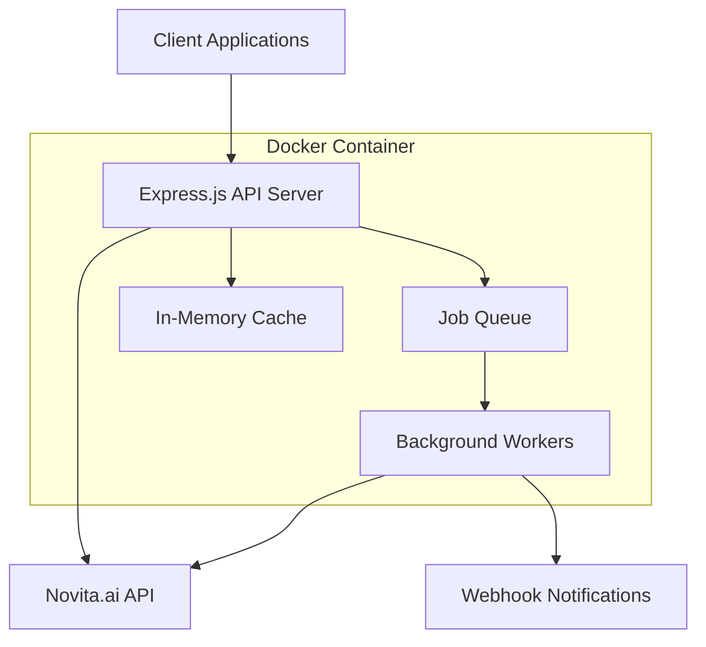

# Design Document

## Overview

The Novita GPU Instance API is a Node.js/Express.js microservice that provides a simplified interface for creating and managing Novita.ai GPU instances. The service abstracts the complexity of the Novita.ai API by automatically selecting optimal pricing, handling instance lifecycle management, and providing webhook notifications when instances are ready.

The system follows a RESTful API design with asynchronous processing for long-running operations like instance creation and status monitoring. It uses a job queue pattern to handle the multi-step workflow of creating, starting, and monitoring instances.

## Architecture

### High-Level Architecture



### Service Components

1. **API Server**: Express.js REST API handling HTTP requests
2. **Job Queue**: In-memory queue for managing asynchronous tasks
3. **Background Workers**: Process instance creation and monitoring jobs
4. **HTTP Client**: Axios-based client for Novita.ai API interactions
5. **Cache Layer**: In-memory storage for instance state and API responses
6. **Webhook Client**: HTTP client for sending notifications

### Request Flow

1. Client sends POST request to create instance
2. API validates request and queues creation job
3. Background worker processes job:
   - Fetches optimal product pricing
   - Retrieves template configuration
   - Creates instance via Novita.ai API
   - Starts instance automatically
   - Monitors status until running
   - Sends webhook notification
4. Client can query instance status via GET endpoints

## Components and Interfaces

### API Endpoints

#### POST /api/instances
Creates a new GPU instance with automatic lifecycle management.

**Request Body:**
```typescript
interface CreateInstanceRequest {
  name: string;                    // Instance name
  productName: string;             // GPU product name (e.g., "RTX 4090 24GB")
  templateId: string;              // Template ID for configuration
  gpuNum?: number;                 // Number of GPUs (default: 1)
  rootfsSize?: number;             // Root filesystem size (default: 60)
  region?: string;                 // Preferred region (default: "CN-HK-01")
  webhookUrl?: string;             // Notification webhook URL
}
```

**Response:**
```typescript
interface CreateInstanceResponse {
  instanceId: string;              // Created instance ID
  status: 'creating' | 'starting' | 'running' | 'failed';
  message: string;                 // Status message
  estimatedReadyTime?: string;     // ISO timestamp estimate
}
```

#### GET /api/instances/{instanceId}
Retrieves current status and details of a specific instance.

**Response:**
```typescript
interface InstanceDetails {
  id: string;
  name: string;
  status: string;
  gpuNum: number;
  region: string;
  portMappings: Array<{
    port: number;
    endpoint: string;
    type: string;
  }>;
  connectionDetails?: {
    ssh?: string;
    jupyter?: string;
    webTerminal?: string;
  };
  createdAt: string;
  readyAt?: string;
}
```

#### GET /api/instances
Lists all managed instances with their current status.

#### GET /health
Health check endpoint for container monitoring.

### Core Services

#### ProductService
Handles product selection and pricing optimization.

```typescript
class ProductService {
  async getOptimalProduct(productName: string, region: string): Promise<Product> {
    // Query products API with filters
    // Sort by spot price ascending
    // Return lowest price product in specified region
  }
}
```

#### TemplateService
Manages template configuration retrieval.

```typescript
class TemplateService {
  async getTemplate(templateId: string): Promise<Template> {
    // Fetch template configuration
    // Cache results for performance
  }
}
```

#### InstanceService
Core service for instance lifecycle management.

```typescript
class InstanceService {
  async createInstance(request: CreateInstanceRequest): Promise<string> {
    // Orchestrate instance creation workflow
    // Queue background monitoring job
  }
  
  async getInstanceStatus(instanceId: string): Promise<InstanceDetails> {
    // Fetch current status from Novita.ai API
    // Return cached data if API unavailable
  }
}
```

#### JobQueue
Manages asynchronous background tasks.

```typescript
class JobQueue {
  async addJob(type: JobType, payload: any): Promise<void> {
    // Add job to in-memory queue
    // Trigger worker processing
  }
}

enum JobType {
  CREATE_INSTANCE = 'create_instance',
  MONITOR_INSTANCE = 'monitor_instance',
  SEND_WEBHOOK = 'send_webhook'
}
```

### HTTP Client Configuration

The service uses Axios with the following configuration:
- Base URL: `https://api.novita.ai`
- Timeout: 30 seconds for API calls, 10 seconds for webhooks
- Retry logic: 3 attempts with exponential backoff
- Rate limiting: Respect API limits with request queuing
- Error handling: Comprehensive error categorization and logging

```typescript
const novitaClient = axios.create({
  baseURL: 'https://api.novita.ai',
  timeout: 30000,
  headers: {
    'Content-Type': 'application/json',
    'Authorization': `Bearer ${process.env.NOVITA_API_KEY}`
  }
});

// Add retry interceptor
novitaClient.interceptors.response.use(
  response => response,
  async error => {
    if (error.response?.status >= 500 || error.code === 'ECONNABORTED') {
      return retryRequest(error.config);
    }
    throw error;
  }
);
```

## Data Models

### Instance State Model
```typescript
interface InstanceState {
  id: string;
  name: string;
  status: InstanceStatus;
  novitaInstanceId?: string;
  productId: string;
  templateId: string;
  configuration: {
    gpuNum: number;
    rootfsSize: number;
    region: string;
    imageUrl: string;
    imageAuth?: string;
    ports: Port[];
    envs: EnvVar[];
  };
  timestamps: {
    created: Date;
    started?: Date;
    ready?: Date;
    failed?: Date;
  };
  webhookUrl?: string;
  lastError?: string;
}

enum InstanceStatus {
  CREATING = 'creating',
  STARTING = 'starting', 
  RUNNING = 'running',
  FAILED = 'failed',
  STOPPED = 'stopped'
}
```

### Job Model
```typescript
interface Job {
  id: string;
  type: JobType;
  payload: any;
  status: JobStatus;
  attempts: number;
  maxAttempts: number;
  createdAt: Date;
  processedAt?: Date;
  completedAt?: Date;
  error?: string;
}

enum JobStatus {
  PENDING = 'pending',
  PROCESSING = 'processing',
  COMPLETED = 'completed',
  FAILED = 'failed'
}
```

## Error Handling

### Error Categories

1. **Validation Errors (400)**: Invalid request parameters
2. **Authentication Errors (401)**: Invalid or missing API keys
3. **Authorization Errors (403)**: Insufficient permissions
4. **Not Found Errors (404)**: Instance or resource not found
5. **Rate Limit Errors (429)**: API rate limits exceeded
6. **Server Errors (500)**: Internal service errors
7. **Service Unavailable (503)**: Novita.ai API unavailable

### Error Response Format
```typescript
interface ErrorResponse {
  error: {
    code: string;
    message: string;
    details?: any;
    timestamp: string;
    requestId: string;
  };
}
```

### Retry Strategy

- **Network Errors**: Exponential backoff (1s, 2s, 4s)
- **Rate Limits**: Respect Retry-After header
- **Server Errors**: 3 attempts with 5-second intervals
- **Webhook Delivery**: 3 attempts with exponential backoff

### Circuit Breaker Pattern

Implement circuit breaker for Novita.ai API calls:
- **Closed**: Normal operation
- **Open**: Fast-fail after threshold failures
- **Half-Open**: Test recovery with limited requests

## Testing Strategy

### Unit Tests
- Service layer methods with mocked dependencies
- Utility functions and data transformations
- Error handling scenarios
- Configuration validation

### Integration Tests
- API endpoint functionality with test database
- Novita.ai API integration with mock responses
- Webhook delivery with test servers
- Job queue processing with test jobs

### End-to-End Tests
- Complete instance creation workflow
- Status monitoring and webhook delivery
- Error scenarios and recovery
- Performance under load

### Test Environment Setup
```typescript
// Mock Novita.ai API responses
const mockNovitaAPI = {
  products: mockProductsResponse,
  templates: mockTemplateResponse,
  instances: mockInstanceResponse
};

// Test configuration
const testConfig = {
  novitaApiKey: 'test-key',
  webhookUrl: 'http://localhost:3001/webhook',
  logLevel: 'debug'
};
```

### Performance Testing
- Load testing with multiple concurrent instance creations
- Memory usage monitoring during long-running operations
- API response time benchmarks
- Webhook delivery reliability under load

## Security Considerations

### API Security
- API key validation and secure storage
- Request rate limiting per client
- Input validation and sanitization
- CORS configuration for browser clients

### Environment Variables
```bash
NOVITA_API_KEY=your_api_key_here
WEBHOOK_SECRET=webhook_signing_secret
LOG_LEVEL=info
PORT=3000
NODE_ENV=production
```

### Data Protection
- No persistent storage of sensitive data
- API keys stored in environment variables only
- Webhook URLs validated for security
- Request/response logging excludes sensitive fields

## Monitoring and Observability

### Logging Strategy
- Structured JSON logging with correlation IDs
- Different log levels: ERROR, WARN, INFO, DEBUG
- Request/response logging with sanitized data
- Performance metrics and timing information

### Health Checks
- `/health` endpoint for container orchestration
- Dependency health checks (Novita.ai API connectivity)
- Memory and CPU usage monitoring
- Job queue status and backlog monitoring

### Metrics Collection
- Request count and response times
- Instance creation success/failure rates
- Webhook delivery success rates
- API error rates by category
- Job processing times and queue depth