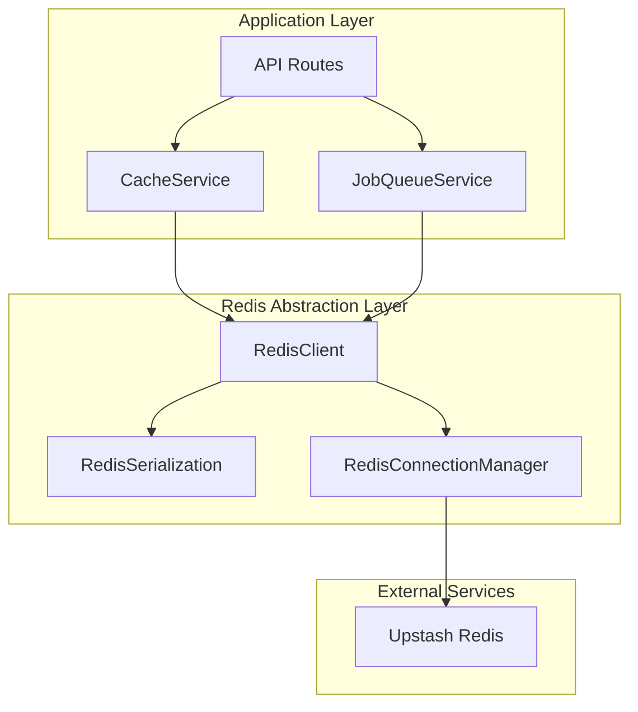

# Design Document

## Overview

This design outlines the complete replacement of all in-memory storage with Redis-only solutions using Upstash for both cache and job queue services. This Redis-only architecture eliminates fallback mechanisms and dual-mode operations, ensuring all data persistence relies exclusively on Redis while maintaining API compatibility.

## Architecture

### High-Level Architecture



### Migration Strategy

1. **Redis-Only Operation**: Replace all in-memory services with Redis-backed implementations
2. **Complete Replacement**: Remove all in-memory cache and job queue implementations
3. **No Fallback Mechanism**: Redis becomes a hard dependency for the application
4. **API Compatibility**: Maintain existing method signatures and behavior
5. **Fail-Fast Approach**: Application fails to start if Redis is unavailable

## Components and Interfaces

### 1. Redis Client Abstraction

**Purpose**: Provide a unified interface for Redis operations with connection management, error handling, and serialization.

```typescript
interface IRedisClient {
  // Basic operations
  get<T>(key: string): Promise<T | null>;
  set<T>(key: string, value: T, ttlMs?: number): Promise<void>;
  del(key: string): Promise<boolean>;
  exists(key: string): Promise<boolean>;
  
  // Hash operations (for job data)
  hget<T>(key: string, field: string): Promise<T | null>;
  hset<T>(key: string, field: string, value: T): Promise<void>;
  hdel(key: string, field: string): Promise<boolean>;
  hgetall<T>(key: string): Promise<Record<string, T>>;
  
  // List operations (for job queues)
  lpush<T>(key: string, ...values: T[]): Promise<number>;
  rpop<T>(key: string): Promise<T | null>;
  lrange<T>(key: string, start: number, stop: number): Promise<T[]>;
  llen(key: string): Promise<number>;
  
  // Utility operations
  keys(pattern: string): Promise<string[]>;
  ttl(key: string): Promise<number>;
  expire(key: string, ttlMs: number): Promise<boolean>;
  
  // Connection management
  ping(): Promise<string>;
  disconnect(): Promise<void>;
}
```

### 2. Redis Connection Manager

**Purpose**: Handle connection lifecycle, retry logic, and health monitoring.

```typescript
interface RedisConnectionConfig {
  url: string;
  token: string;
  retryAttempts?: number;
  retryDelayMs?: number;
  connectionTimeoutMs?: number;
  commandTimeoutMs?: number;
}

class RedisConnectionManager {
  private config: RedisConnectionConfig;
  private client: Redis | null = null;
  private isConnected: boolean = false;
  private reconnectAttempts: number = 0;
  
  async connect(): Promise<void>;
  async disconnect(): Promise<void>;
  async ping(): Promise<boolean>;
  getClient(): Redis;
  isHealthy(): boolean;
}
```

### 3. Serialization Layer

**Purpose**: Handle serialization/deserialization of complex objects, including Date objects and nested structures.

```typescript
interface ISerializer {
  serialize<T>(value: T): string;
  deserialize<T>(value: string): T;
}

class RedisSerializer implements ISerializer {
  serialize<T>(value: T): string {
    return JSON.stringify(value, this.dateReplacer);
  }
  
  deserialize<T>(value: string): T {
    return JSON.parse(value, this.dateReviver);
  }
  
  private dateReplacer(key: string, value: any): any;
  private dateReviver(key: string, value: any): any;
}
```

### 4. Redis-Backed Cache Service

**Purpose**: Drop-in replacement for the existing CacheService with Redis persistence.

```typescript
class RedisCacheService<T = any> implements ICacheService<T> {
  private redisClient: IRedisClient;
  private keyPrefix: string;
  private metrics: CacheMetrics;
  
  constructor(
    name: string,
    redisClient: IRedisClient,
    options: CacheServiceOptions = {}
  );
  
  // Maintain existing API
  async get(key: string): Promise<T | undefined>;
  async set(key: string, value: T, ttl?: number): Promise<void>;
  async delete(key: string): Promise<boolean>;
  async has(key: string): Promise<boolean>;
  async clear(): Promise<void>;
  
  // Enhanced methods
  async getStats(): Promise<CacheStats>;
  async cleanupExpired(): Promise<number>;
}
```

### 5. Redis-Backed Job Queue Service

**Purpose**: Persistent job queue using Redis lists and hashes.

```typescript
class RedisJobQueueService implements IJobQueueService {
  private redisClient: IRedisClient;
  private queueKey: string = 'job_queue';
  private jobDataKey: string = 'job_data';
  private processingKey: string = 'job_processing';
  
  constructor(redisClient: IRedisClient, options: JobQueueOptions = {});
  
  // Maintain existing API
  async addJob(type: JobType, payload: any, priority?: JobPriority): Promise<string>;
  async getJob(jobId: string): Promise<Job | undefined>;
  async getJobs(filter?: JobFilter): Promise<Job[]>;
  async getStats(): Promise<JobQueueStats>;
  
  // Enhanced persistence methods
  private async persistJob(job: Job): Promise<void>;
  private async loadJob(jobId: string): Promise<Job | null>;
  private async moveJobToProcessing(jobId: string): Promise<void>;
  private async moveJobToCompleted(jobId: string): Promise<void>;
}
```

## Data Models

### Redis Key Structure

```
Cache Keys:
  cache:{cacheName}:{key} -> serialized cache entry
  cache:{cacheName}:meta -> cache metadata

Job Queue Keys:
  jobs:queue -> list of pending job IDs (priority ordered)
  jobs:processing -> hash of currently processing jobs
  jobs:data:{jobId} -> hash containing job data
  jobs:stats -> hash containing queue statistics
```

### Cache Entry Structure in Redis

```typescript
interface RedisCacheEntry {
  data: string; // serialized original data
  timestamp: number;
  ttl: number;
  accessCount: number;
  lastAccessed: number;
}
```

### Job Data Structure in Redis

```typescript
// Stored in jobs:data:{jobId} hash
interface RedisJobData {
  id: string;
  type: JobType;
  payload: string; // serialized payload
  status: JobStatus;
  priority: JobPriority;
  attempts: number;
  maxAttempts: number;
  createdAt: string; // ISO date string
  processedAt?: string;
  completedAt?: string;
  nextRetryAt?: string;
  error?: string;
}
```

## Error Handling

### Connection Error Handling

1. **Initial Connection Failure**: Log error and throw with clear message
2. **Connection Loss During Operation**: Implement exponential backoff retry
3. **Command Timeout**: Retry with circuit breaker pattern
4. **Authentication Errors**: Fail fast with configuration guidance

### Redis-Only Architecture

```typescript
class RedisOnlyCacheManager {
  private redisClient: IRedisClient;
  private caches: Map<string, RedisCacheService> = new Map();
  
  constructor(redisClient: IRedisClient) {
    this.redisClient = redisClient;
  }
  
  getCache<T>(name: string, options?: CacheServiceOptions): RedisCacheService<T> {
    if (!this.caches.has(name)) {
      const cache = new RedisCacheService<T>(name, this.redisClient, options);
      this.caches.set(name, cache);
    }
    return this.caches.get(name) as RedisCacheService<T>;
  }
}
```

### Error Recovery Strategies

1. **Retry Logic**: Exponential backoff for transient failures
2. **Circuit Breaker**: Prevent cascade failures during Redis outages
3. **Health Checks**: Periodic connection validation with fail-fast on startup
4. **Metrics**: Track error rates and recovery times
5. **Fail-Fast**: Application terminates if Redis becomes permanently unavailable

## Testing Strategy

### Unit Testing

1. **Mock Redis Client**: Test service logic without Redis dependency
2. **Serialization Tests**: Verify data integrity through serialize/deserialize cycles
3. **Error Handling Tests**: Simulate various failure scenarios
4. **API Compatibility Tests**: Ensure existing behavior is maintained

### Integration Testing

1. **Redis Connection Tests**: Verify connection management and retry logic
2. **Data Persistence Tests**: Validate data survives service restarts
3. **Performance Tests**: Compare Redis vs in-memory performance
4. **Failover Tests**: Test graceful degradation scenarios

### Test Environment Setup

```typescript
// Test configuration
const testRedisConfig = {
  url: process.env.TEST_REDIS_URL || 'redis://localhost:6379',
  token: process.env.TEST_REDIS_TOKEN || '',
  retryAttempts: 3,
  retryDelayMs: 100,
  connectionTimeoutMs: 5000,
  commandTimeoutMs: 2000
};

// Test utilities
class TestRedisClient extends RedisClient {
  async flushAll(): Promise<void> {
    // Clear all test data
  }
}
```

## Configuration Management

### Environment Variables

```typescript
interface RedisConfig {
  UPSTASH_REDIS_REST_URL: string;
  UPSTASH_REDIS_REST_TOKEN: string;
  REDIS_CONNECTION_TIMEOUT_MS?: number;
  REDIS_COMMAND_TIMEOUT_MS?: number;
  REDIS_RETRY_ATTEMPTS?: number;
  REDIS_RETRY_DELAY_MS?: number;
  REDIS_KEY_PREFIX?: string;
  REDIS_ENABLE_FALLBACK?: boolean;
}
```

### Configuration Validation

```typescript
const redisConfigSchema = Joi.object({
  UPSTASH_REDIS_REST_URL: Joi.string().uri().required(),
  UPSTASH_REDIS_REST_TOKEN: Joi.string().required(),
  REDIS_CONNECTION_TIMEOUT_MS: Joi.number().positive().default(10000),
  REDIS_COMMAND_TIMEOUT_MS: Joi.number().positive().default(5000),
  REDIS_RETRY_ATTEMPTS: Joi.number().integer().min(0).default(3),
  REDIS_RETRY_DELAY_MS: Joi.number().positive().default(1000),
  REDIS_KEY_PREFIX: Joi.string().default('novita_api'),
  REDIS_ENABLE_FALLBACK: Joi.boolean().default(true)
});
```

## Performance Considerations

### Optimization Strategies

1. **Connection Pooling**: Reuse connections for multiple operations
2. **Pipelining**: Batch multiple Redis commands
3. **Compression**: Compress large payloads before storage
4. **TTL Management**: Automatic cleanup of expired data

### Monitoring and Metrics

```typescript
interface RedisMetrics {
  connectionCount: number;
  commandLatency: number;
  errorRate: number;
  cacheHitRatio: number;
  queueSize: number;
  processingJobs: number;
}
```

## Migration Plan

### Phase 1: Infrastructure Setup
- Implement Redis client abstraction
- Add configuration and validation
- Create serialization layer

### Phase 2: Cache Service Migration
- Implement Redis-backed cache service
- Add fallback mechanism
- Migrate cache usage incrementally

### Phase 3: Job Queue Migration
- Implement Redis-backed job queue
- Migrate job processing
- Add job persistence and recovery

### Phase 4: Complete In-Memory Removal and Optimization
- Remove all in-memory cache and job queue implementations
- Remove fallback mechanisms and dual-mode operation
- Add performance monitoring for Redis-only operations
- Optimize Redis operations and connection management