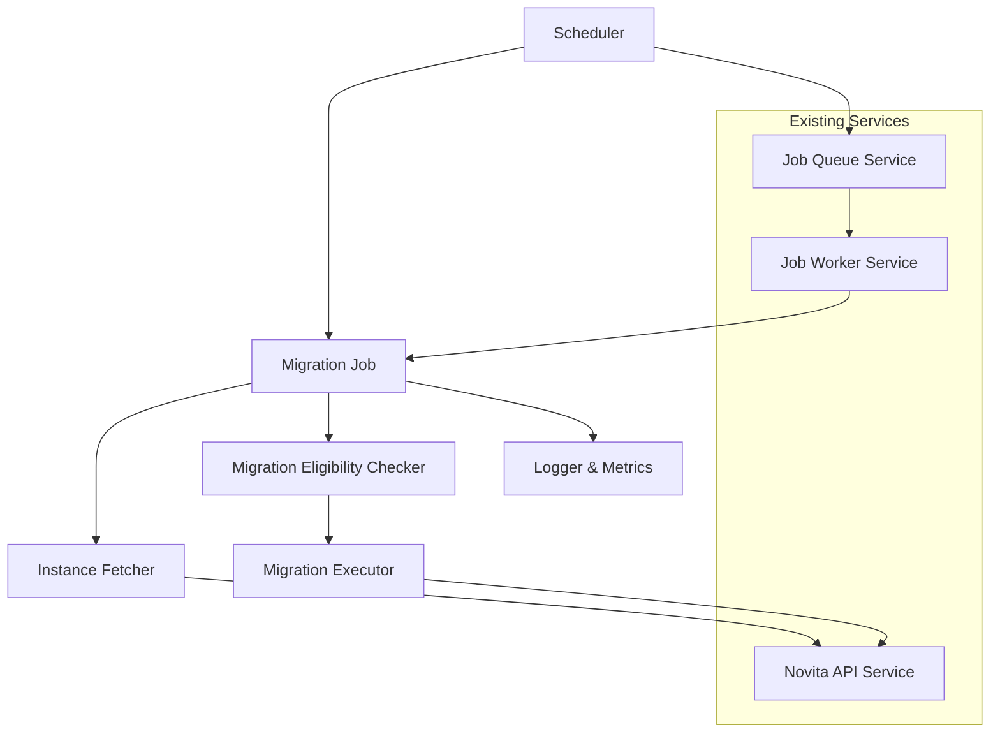

# Design Document

## Overview

The Spot Instance Auto-Migration system implements a scheduled background service that automatically detects and migrates Novita GPU instances that have been reclaimed due to spot pricing changes. The system runs as a scheduled job every 15 minutes, fetching fresh instance data from the Novita API, identifying eligible instances for migration, and executing the migration process automatically.

This design integrates seamlessly with the existing job queue architecture and leverages the current NovitaApiService for API interactions while adding new migration-specific functionality.

## Architecture

### High-Level Architecture



### Service Integration

The migration system extends the existing job queue architecture by:
- Adding a new `MIGRATE_SPOT_INSTANCES` job type
- Implementing a scheduled job that runs every 15 minutes
- Extending the JobWorkerService with migration handling capabilities
- Adding migration-specific API methods to NovitaApiService

## Components and Interfaces

### 1. Migration Job Scheduler

**Purpose**: Manages the scheduled execution of migration jobs every 15 minutes.

**Implementation**: 
- Uses Node.js `setInterval` for scheduling
- Integrates with existing JobQueueService to queue migration jobs
- Prevents overlapping executions using job queue deduplication

```typescript
interface MigrationSchedulerConfig {
  intervalMs: number; // Default: 15 * 60 * 1000 (15 minutes)
  enabled: boolean;   // Default: true
  timeoutMs: number;  // Default: 10 * 60 * 1000 (10 minutes)
}

class MigrationScheduler {
  start(): void;
  stop(): void;
  getStatus(): SchedulerStatus;
}
```

### 2. Migration Job Handler

**Purpose**: Processes migration jobs by fetching instances, checking eligibility, and executing migrations.

**Implementation**:
- Extends existing JobWorkerService with new job type handler
- Coordinates the migration workflow
- Provides comprehensive error handling and logging

```typescript
interface MigrateSpotInstancesJobPayload {
  scheduledAt: Date;
  jobId: string;
}

interface MigrationJobResult {
  totalProcessed: number;
  migrated: number;
  skipped: number;
  errors: number;
  executionTimeMs: number;
}
```

### 3. Instance Migration Service

**Purpose**: Core business logic for migration operations.

**Implementation**:
- Fetches fresh instance data from Novita API
- Implements eligibility checking logic
- Executes migration API calls
- Provides detailed logging and metrics

```typescript
interface MigrationEligibilityResult {
  eligible: boolean;
  reason: string;
  instanceId: string;
  spotStatus?: string;
  spotReclaimTime?: string;
}

class InstanceMigrationService {
  async fetchAllInstances(): Promise<InstanceResponse[]>;
  async checkMigrationEligibility(instance: InstanceResponse): Promise<MigrationEligibilityResult>;
  async migrateInstance(instanceId: string): Promise<MigrationResult>;
  async processMigrationBatch(): Promise<MigrationJobResult>;
}
```

### 4. Novita API Migration Extension

**Purpose**: Extends NovitaApiService with migration-specific API calls.

**Implementation**:
- Adds `migrateInstance` method to existing NovitaApiService
- Follows existing error handling patterns
- Maintains consistency with current API client architecture

```typescript
// Extension to existing NovitaApiService
class NovitaApiService {
  // ... existing methods ...
  
  async migrateInstance(instanceId: string): Promise<MigrationApiResponse>;
}

interface MigrationApiResponse {
  success: boolean;
  instanceId: string;
  message?: string;
  error?: string;
}
```

## Data Models

### Job Queue Integration

```typescript
// Extension to existing JobType enum
enum JobType {
  CREATE_INSTANCE = 'create_instance',
  MONITOR_INSTANCE = 'monitor_instance',
  SEND_WEBHOOK = 'send_webhook',
  MIGRATE_SPOT_INSTANCES = 'migrate_spot_instances' // New job type
}

// New job payload type
interface MigrateSpotInstancesJobPayload {
  scheduledAt: Date;
  jobId: string;
  config?: {
    dryRun?: boolean;
    maxMigrations?: number;
  };
}
```

### Migration Result Models

```typescript
interface MigrationAttempt {
  instanceId: string;
  instanceName: string;
  status: InstanceStatus;
  spotStatus?: string;
  spotReclaimTime?: string;
  eligibilityCheck: MigrationEligibilityResult;
  migrationResult?: {
    success: boolean;
    error?: string;
    responseTime: number;
  };
  processedAt: Date;
}

interface MigrationJobSummary {
  jobId: string;
  startedAt: Date;
  completedAt: Date;
  totalInstances: number;
  exitedInstances: number;
  eligibleInstances: number;
  migratedInstances: number;
  skippedInstances: number;
  errorCount: number;
  attempts: MigrationAttempt[];
}
```

### Configuration Model

```typescript
interface MigrationConfig {
  enabled: boolean;
  scheduleIntervalMs: number;
  jobTimeoutMs: number;
  maxConcurrentMigrations: number;
  dryRunMode: boolean;
  retryFailedMigrations: boolean;
  logLevel: 'debug' | 'info' | 'warn' | 'error';
}
```

## Error Handling

### Error Categories

1. **Scheduling Errors**: Issues with job scheduling or timer management
2. **API Errors**: Novita API failures during instance fetching or migration
3. **Eligibility Errors**: Issues during instance eligibility checking
4. **Migration Errors**: Failures during the actual migration process
5. **Configuration Errors**: Invalid configuration or missing required settings

### Error Handling Strategy

```typescript
interface MigrationError {
  type: 'scheduling' | 'api' | 'eligibility' | 'migration' | 'configuration';
  instanceId?: string;
  message: string;
  originalError?: Error;
  timestamp: Date;
  recoverable: boolean;
}

class MigrationErrorHandler {
  handleError(error: MigrationError): void;
  shouldRetry(error: MigrationError): boolean;
  getRetryDelay(attempt: number): number;
}
```

### Resilience Patterns

- **Circuit Breaker**: Leverage existing circuit breaker in NovitaApiService
- **Retry Logic**: Implement exponential backoff for transient failures
- **Graceful Degradation**: Continue processing other instances if individual migrations fail
- **Timeout Handling**: Implement job-level timeouts to prevent hanging executions

## Testing Strategy

### Unit Tests

1. **Migration Scheduler Tests**
   - Verify correct scheduling intervals
   - Test start/stop functionality
   - Validate job queue integration

2. **Migration Service Tests**
   - Mock Novita API responses for various instance states
   - Test eligibility checking logic with different spot status combinations
   - Verify migration execution with success/failure scenarios

3. **Job Handler Tests**
   - Test job processing workflow
   - Verify error handling and logging
   - Test job completion and result reporting

### Integration Tests

1. **End-to-End Migration Flow**
   - Test complete migration workflow with mocked Novita API
   - Verify job queue integration
   - Test scheduler integration with job processing

2. **API Integration Tests**
   - Test actual Novita API calls (with test instances)
   - Verify error handling for various API failure scenarios
   - Test rate limiting and circuit breaker behavior

### Performance Tests

1. **Batch Processing Performance**
   - Test processing large numbers of instances
   - Verify memory usage during batch operations
   - Test concurrent migration handling

2. **Scheduling Reliability**
   - Test long-running scheduler stability
   - Verify job execution timing accuracy
   - Test system behavior under high load

## Configuration Integration

### Environment Variables

```bash
# Migration Configuration
MIGRATION_ENABLED=true
MIGRATION_INTERVAL_MINUTES=15
MIGRATION_JOB_TIMEOUT_MS=600000
MIGRATION_MAX_CONCURRENT=5
MIGRATION_DRY_RUN=false
MIGRATION_LOG_LEVEL=info

# Existing configuration remains unchanged
NOVITA_API_KEY=...
NOVITA_API_BASE_URL=...
```

### Configuration Validation

Extend existing configuration validation in `config.ts` to include migration settings with appropriate defaults and validation rules.

## Monitoring and Observability

### Metrics Collection

```typescript
interface MigrationMetrics {
  totalJobsExecuted: number;
  totalInstancesProcessed: number;
  totalMigrationsPerformed: number;
  averageJobExecutionTime: number;
  errorRate: number;
  lastExecutionTime: Date;
  nextScheduledExecution: Date;
}
```

### Logging Strategy

- **Job Start/End**: Log each migration job execution with timing
- **Instance Processing**: Log each instance evaluation with decision rationale
- **Migration Actions**: Log each migration attempt with detailed results
- **Error Tracking**: Comprehensive error logging with context
- **Performance Metrics**: Log execution times and batch processing statistics

### Health Check Integration

Extend existing health check endpoint to include migration service status:

```typescript
interface EnhancedHealthCheckResponse {
  // ... existing fields ...
  migrationService: {
    enabled: boolean;
    lastExecution: Date;
    nextExecution: Date;
    status: 'healthy' | 'unhealthy' | 'disabled';
    recentErrors: number;
  };
}
```