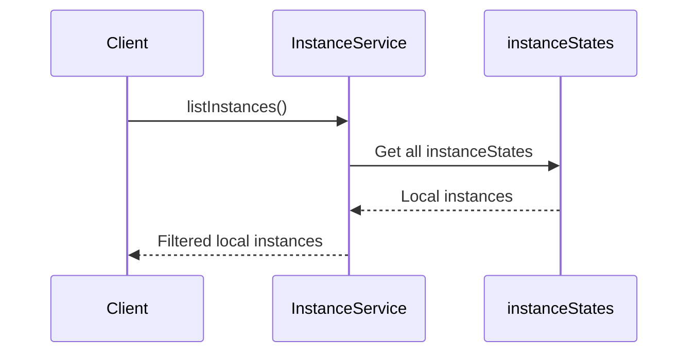
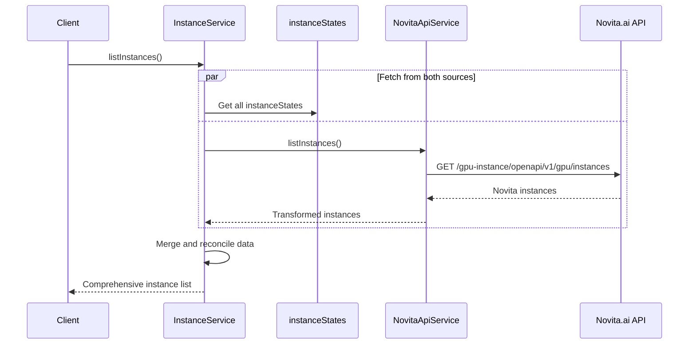

# Enhanced Instance Listing with Novita.ai API Integration

## Overview

This design document outlines the enhancement of the instance listing functionality to query instances directly from the Novita.ai API and merge them with locally managed instance data. Currently, the `listInstances` function only returns instances from local server variables (`instanceStates`), which may not reflect the complete and accurate state of instances managed by Novita.ai.

## Problem Statement

The current implementation has several limitations:

1. **Incomplete Data**: Local `instanceStates` may not contain all instances that exist in Novita.ai
2. **Stale Information**: Local state might be outdated compared to the actual instance status in Novita.ai  
3. **Data Inconsistency**: Instances created outside this service or instances that failed to sync may be missing
4. **Single Source Limitation**: Relying only on local state prevents discovery of instances created through other channels

## Architecture

### Current Flow


### Enhanced Flow


## Data Models Enhancement

### Extended Instance Response Structure

The Novita.ai API returns richer instance data that should be incorporated:

```typescript
interface NovitaInstanceResponse {
  id: string;
  name: string;
  clusterId: string;
  clusterName: string;
  status: string;
  imageUrl: string;
  imageAuthId?: string;
  command?: string;
  cpuNum: string;
  memory: string;
  gpuNum: string;
  portMappings: Array<{
    port: number;
    type: string;
  }>;
  productId: string;
  productName: string;
  rootfsSize: number;
  volumeMounts?: Array<{
    type: string;
    size: string;
    id: string;
    mountPath: string;
  }>;
  statusError?: {
    state: string;
    message: string;
  };
  envs: Array<{
    key: string;
    value: string;
  }>;
  kind: string;
  billingMode: string;
  endTime?: string;
  spotStatus?: string;
  spotReclaimTime?: string;
}
```

### Merged Instance Details

``typescript
interface EnhancedInstanceDetails extends InstanceDetails {
  // Source indicators
  source: 'local' | 'novita' | 'merged';
  dataConsistency: 'consistent' | 'local-newer' | 'novita-newer' | 'conflicted';
  
  // Additional Novita.ai fields
  clusterId?: string;
  clusterName?: string;
  productName?: string;
  cpuNum?: string;
  memory?: string;
  imageUrl?: string;
  imageAuthId?: string;
  command?: string;
  volumeMounts?: Array<{
    type: string;
    size: string;
    id: string;
    mountPath: string;
  }>;
  statusError?: {
    state: string;
    message: string;
  };
  envs?: Array<{
    key: string;
    value: string;
  }>;
  kind?: string;
  endTime?: string;
  spotStatus?: string;
  spotReclaimTime?: string;
  
  // Metadata
  lastSyncedAt?: string;
  syncErrors?: string[];
}
```

## Implementation Strategy

### 1. Novita API Service Enhancement

Update the `listInstances` method in `NovitaApiService` to use the correct endpoint:

```typescript
async listInstances(options?: {
  page?: number;
  pageSize?: number;
  status?: InstanceStatus;
}): Promise<NovitaListInstancesResponse> {
  try {
    const params: Record<string, string> = {};
    
    if (options?.page) params.page = options.page.toString();
    if (options?.pageSize) params.page_size = options.pageSize.toString();
    if (options?.status) params.status = options.status;

    // Use the correct Novita.ai API endpoint
    const response = await novitaClient.get<{ instances: NovitaInstanceResponse[] }>(
      '/gpu-instance/openapi/v1/gpu/instances',
      { params }
    );

    // Transform Novita response to our format
    const transformedInstances = this.transformNovitaInstances(response.data.instances);
    
    return {
      instances: transformedInstances,
      total: response.data.instances.length,
      page: options?.page || 1,
      pageSize: options?.pageSize || 10
    };
  } catch (error) {
    throw this.handleApiError(error, 'Failed to list instances from Novita.ai');
  }
}
```

### 2. Instance Service Enhancement

Create new methods for comprehensive instance listing:

```typescript
class InstanceService {
  /**
   * List instances with data from both local state and Novita.ai API
   */
  async listInstancesComprehensive(options?: {
    includeNovitaOnly?: boolean;
    syncLocalState?: boolean;
  }): Promise<ListInstancesResponse> {
    try {
      const startTime = Date.now();
      
      // Fetch from both sources in parallel
      const [localInstances, novitaInstances] = await Promise.all([
        this.getLocalInstances(),
        this.getNovitaInstances().catch(error => {
          logger.warn('Failed to fetch instances from Novita.ai, using local only', { error: error.message });
          return [];
        })
      ]);

      // Merge and reconcile data
      const mergedInstances = this.mergeInstanceData(localInstances, novitaInstances);
      
      // Optionally sync local state with Novita data
      if (options?.syncLocalState) {
        await this.syncLocalStateWithNovita(novitaInstances);
      }

      const processingTime = Date.now() - startTime;
      
      logger.info('Listed instances comprehensively', {
        localCount: localInstances.length,
        novitaCount: novitaInstances.length,
        mergedCount: mergedInstances.length,
        processingTimeMs: processingTime
      });

      return {
        instances: mergedInstances,
        total: mergedInstances.length
      };
    } catch (error) {
      logger.error('Failed to list instances comprehensively', { error: error.message });
      throw error;
    }
  }

  /**
   * Merge local and Novita instance data with conflict resolution
   */
  private mergeInstanceData(
    localInstances: InstanceDetails[], 
    novitaInstances: InstanceResponse[]
  ): EnhancedInstanceDetails[] {
    const mergedMap = new Map<string, EnhancedInstanceDetails>();
    
    // Add local instances first
    localInstances.forEach(localInstance => {
      const enhanced: EnhancedInstanceDetails = {
        ...localInstance,
        source: 'local',
        dataConsistency: 'consistent',
        lastSyncedAt: new Date().toISOString()
      };
      mergedMap.set(localInstance.id, enhanced);
    });

    // Process Novita instances
    novitaInstances.forEach(novitaInstance => {
      const localMatch = this.findLocalInstanceMatch(novitaInstance, localInstances);
      
      if (localMatch) {
        // Merge data for matched instances
        const existing = mergedMap.get(localMatch.id)!;
        const merged = this.mergeMatchedInstance(existing, novitaInstance);
        mergedMap.set(localMatch.id, merged);
      } else {
        // Add Novita-only instances if enabled
        const novitaOnly = this.transformNovitaToEnhanced(novitaInstance);
        mergedMap.set(novitaInstance.id, novitaOnly);
      }
    });

    // Convert to array and sort
    const mergedInstances = Array.from(mergedMap.values());
    return mergedInstances.sort((a, b) => 
      new Date(b.createdAt).getTime() - new Date(a.createdAt).getTime()
    );
  }

  /**
   * Find local instance that matches Novita instance
   */
  private findLocalInstanceMatch(
    novitaInstance: InstanceResponse, 
    localInstances: InstanceDetails[]
  ): InstanceDetails | null {
    // Try to match by Novita instance ID stored in local state
    const localState = Array.from(this.instanceStates.values());
    const stateMatch = localState.find(state => state.novitaInstanceId === novitaInstance.id);
    
    if (stateMatch) {
      return localInstances.find(local => local.id === stateMatch.id) || null;
    }

    // Fallback: match by name and creation time (approximate)
    return localInstances.find(local => 
      local.name === novitaInstance.name &&
      Math.abs(new Date(local.createdAt).getTime() - new Date(novitaInstance.createdAt).getTime()) < 60000 // 1 minute tolerance
    ) || null;
  }

  /**
   * Merge matched local and Novita instance data
   */
  private mergeMatchedInstance(
    localInstance: EnhancedInstanceDetails,
    novitaInstance: InstanceResponse
  ): EnhancedInstanceDetails {
    const localStateTime = new Date(localInstance.createdAt).getTime();
    const novitaStateTime = new Date(novitaInstance.createdAt).getTime();
    
    let dataConsistency: EnhancedInstanceDetails['dataConsistency'] = 'consistent';
    
    // Determine data consistency
    if (localInstance.status !== novitaInstance.status) {
      dataConsistency = localStateTime > novitaStateTime ? 'local-newer' : 'novita-newer';
    }

    return {
      ...localInstance,
      // Prefer Novita.ai data for most fields as it's authoritative
      status: novitaInstance.status,
      region: novitaInstance.region,
      portMappings: novitaInstance.portMappings,
      
      // Additional Novita.ai fields
      clusterId: novitaInstance.clusterId,
      clusterName: novitaInstance.clusterName,
      productName: novitaInstance.productName,
      imageUrl: novitaInstance.imageUrl,
      
      // Metadata
      source: 'merged',
      dataConsistency,
      lastSyncedAt: new Date().toISOString()
    };
  }

  /**
   * Transform Novita instance to enhanced format
   */
  private transformNovitaToEnhanced(novitaInstance: InstanceResponse): EnhancedInstanceDetails {
    return {
      id: novitaInstance.id,
      name: novitaInstance.name,
      status: novitaInstance.status,
      gpuNum: novitaInstance.gpuNum,
      region: novitaInstance.region,
      portMappings: novitaInstance.portMappings,
      createdAt: novitaInstance.createdAt,
      
      // Enhanced fields
      clusterId: novitaInstance.clusterId,
      clusterName: novitaInstance.clusterName,
      productName: novitaInstance.productName,
      imageUrl: novitaInstance.imageUrl,
      
      // Metadata
      source: 'novita',
      dataConsistency: 'consistent',
      lastSyncedAt: new Date().toISOString()
    };
  }

  /**
   * Sync local state with Novita instance data
   */
  private async syncLocalStateWithNovita(novitaInstances: InstanceResponse[]): Promise<void> {
    const syncPromises = novitaInstances.map(async (novitaInstance) => {
      const localState = Array.from(this.instanceStates.values())
        .find(state => state.novitaInstanceId === novitaInstance.id);
      
      if (localState && localState.status !== novitaInstance.status) {
        this.updateInstanceState(localState.id, {
          status: novitaInstance.status,
          timestamps: {
            ...localState.timestamps,
            lastSynced: new Date()
          }
        });
        
        logger.debug('Synced local state with Novita', {
          instanceId: localState.id,
          novitaInstanceId: novitaInstance.id,
          oldStatus: localState.status,
          newStatus: novitaInstance.status
        });
      }
    });
    
    await Promise.allSettled(syncPromises);
  }

  /**
   * Get local instances only
   */
  private async getLocalInstances(): Promise<InstanceDetails[]> {
    const instances: InstanceDetails[] = [];
    
    for (const [instanceId, instanceState] of this.instanceStates.entries()) {
      try {
        const instanceDetails = this.mapInstanceStateToDetails(instanceState);
        instances.push(instanceDetails);
      } catch (error) {
        logger.warn('Failed to process local instance state', {
          instanceId,
          error: (error as Error).message
        });
      }
    }
    
    return instances;
  }

  /**
   * Get Novita instances only
   */
  private async getNovitaInstances(): Promise<InstanceResponse[]> {
    try {
      const response = await novitaApiService.listInstances();
      return response.instances;
    } catch (error) {
      logger.error('Failed to fetch instances from Novita.ai', { error: error.message });
      throw error;
    }
  }
}
```

## Error Handling and Fallback Strategy

### Graceful Degradation
``mermaid
flowchart TD
    A[List Instances Request] --> B{Novita.ai API Available?}
    B -->|Yes| C[Fetch from Both Sources]
    B -->|No| D[Use Local Data Only]
    
    C --> E{Merge Successful?}
    E -->|Yes| F[Return Merged Data]
    E -->|No| G[Return Local Data + Warning]
    
    D --> H[Return Local Data]
    
    F --> I[Cache Results]
    G --> I
    H --> I
    
    I --> J[Response to Client]
```

### Error Scenarios

1. **Novita.ai API Unavailable**: Fall back to local data with warning logs
2. **Partial API Failure**: Return merged data with error indicators
3. **Authentication Issues**: Log error and use local data
4. **Rate Limiting**: Implement exponential backoff and cache results
5. **Network Timeouts**: Short timeout with local fallback

## Caching Strategy

### Multi-Level Caching
``typescript
interface InstanceCacheStrategy {
  // Level 1: In-memory cache for merged results
  mergedInstancesCache: CacheManager<EnhancedInstanceDetails[]>;
  
  // Level 2: Novita API response cache
  novitaApiCache: CacheManager<InstanceResponse[]>;
  
  // Level 3: Individual instance status cache (existing)
  instanceCache: CacheManager<InstanceDetails>;
}
```

### Cache Configuration
- **Merged Results**: TTL 30 seconds (balance between freshness and performance)
- **Novita API Data**: TTL 60 seconds (reduce API calls)
- **Individual Instances**: TTL 30 seconds (existing configuration)

## Backwards Compatibility

### Migration Strategy

1. **Phased Rollout**: Introduce new method `listInstancesComprehensive()` alongside existing `listInstances()`
2. **Feature Flag**: Add configuration option to enable/disable Novita.ai integration
3. **Gradual Migration**: Update API endpoints to use new method over time
4. **Fallback Mode**: Automatic fallback to old behavior if Novita.ai integration fails

### API Endpoint Updates

``typescript
// New comprehensive endpoint
GET /api/instances/comprehensive?includeNovitaOnly=true&syncLocalState=true

// Enhanced existing endpoint (backwards compatible)
GET /api/instances?source=all|local|novita&sync=true|false
```

## Performance Considerations

### Optimization Strategies

1. **Parallel Execution**: Fetch local and Novita data concurrently
2. **Smart Caching**: Cache merged results to avoid repeated processing
3. **Request Batching**: Batch individual instance status updates
4. **Connection Pooling**: Reuse HTTP connections for Novita.ai API calls
5. **Pagination Support**: Handle large instance lists efficiently

### Performance Metrics

``typescript
interface PerformanceMetrics {
  totalRequestTime: number;
  novitaApiTime: number;
  localDataTime: number;
  mergeProcessingTime: number;
  cacheHitRatio: number;
  instanceCount: {
    local: number;
    novita: number;
    merged: number;
  };
}
```

## Monitoring and Observability

### Key Metrics to Track

1. **API Response Times**: Novita.ai API call duration
2. **Error Rates**: API failures and fallback usage
3. **Data Consistency**: Frequency of data conflicts
4. **Cache Performance**: Hit ratios and eviction rates
5. **Sync Success Rate**: Local state synchronization effectiveness

### Logging Strategy

``typescript
// Enhanced logging for instance listing operations
logger.info('Instance listing operation', {
  operation: 'listInstancesComprehensive',
  requestId: correlationId,
  options: sanitizedOptions,
  performance: {
    totalTime: processingTime,
    novitaApiTime: apiTime,
    cacheHitRatio: cacheStats.hitRatio
  },
  results: {
    localCount: localInstances.length,
    novitaCount: novitaInstances.length,
    mergedCount: mergedInstances.length,
    conflicts: conflictCount
  }
});
```

## Testing Strategy

### Unit Testing
- Mock Novita.ai API responses
- Test merge logic with various data scenarios
- Validate error handling and fallback behavior
- Test caching mechanisms

### Integration Testing
- Test against actual Novita.ai API sandbox
- Verify data consistency scenarios
- Test network failure handling
- Validate performance under load

### Test Scenarios
1. **Happy Path**: Both sources return valid data
2. **Novita.ai Unavailable**: API down, use local fallback
3. **Data Conflicts**: Different status between sources
4. **Large Dataset**: Performance with many instances
5. **Partial Failures**: Some instances fail to fetch

## Future Enhancements

### Phase 2 Improvements
1. **Real-time Sync**: WebSocket integration for live status updates
2. **Advanced Conflict Resolution**: User-defined merge strategies
3. **Historical Data**: Track instance state changes over time
4. **Analytics Dashboard**: Instance usage patterns and costs
5. **Automated Reconciliation**: Background sync jobs for data consistency
