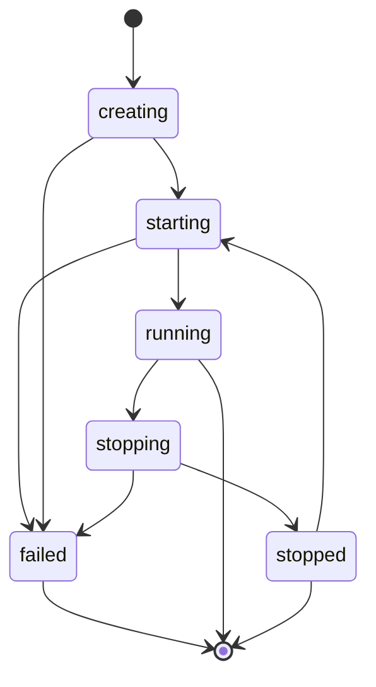
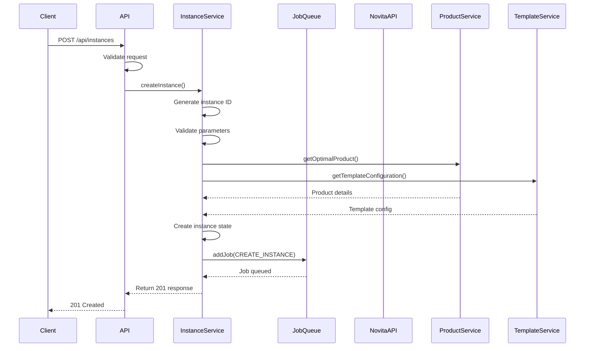

# API Reference

<cite>
**Referenced Files in This Document**   
- [instances.ts](file://src/routes/instances.ts)
- [health.ts](file://src/routes/health.ts)
- [metrics.ts](file://src/routes/metrics.ts)
- [cache.ts](file://src/routes/cache.ts)
- [api.ts](file://src/types/api.ts)
- [validation.ts](file://src/types/validation.ts)
- [errorHandler.ts](file://src/middleware/errorHandler.ts)
- [instanceService.ts](file://src/services/instanceService.ts)
</cite>

## Table of Contents
1. [Introduction](#introduction)
2. [Authentication](#authentication)
3. [Instances](#instances)
4. [Health](#health)
5. [Metrics](#metrics)
6. [Cache](#cache)
7. [Error Handling](#error-handling)
8. [Rate Limiting](#rate-limiting)
9. [Versioning](#versioning)
10. [Appendices](#appendices)

## Introduction
This document provides comprehensive API documentation for the novitai application, detailing all available RESTful endpoints. The API enables users to manage GPU instances, monitor system health, retrieve performance metrics, and manage cache operations. The documentation covers endpoint specifications, request/response schemas, authentication methods, error handling, and operational patterns.

## Authentication
All API endpoints require authentication using an API key sent in the Authorization header. The API key must be obtained through the application's authentication system and included in all requests.

**Authentication Method**: API Key via Authorization Header  
**Header Format**: `Authorization: Bearer <API_KEY>`  
**Security**: HTTPS required in production environments

**Section sources**
- [instanceService.ts](file://src/services/instanceService.ts#L1-L515)
- [errorHandler.ts](file://src/middleware/errorHandler.ts#L1-L286)

## Instances
The Instances API provides endpoints for creating, retrieving, and listing GPU instances with automated lifecycle management.

### POST /api/instances
Creates a new GPU instance with specified configuration parameters.

**HTTP Method**: POST  
**URL Pattern**: `/api/instances`  
**Authentication Required**: Yes

#### Request Body Schema (CreateInstanceRequest)
The request body must be a JSON object with the following properties:

| Field | Type | Required | Default | Description |
|-------|------|----------|---------|-------------|
| name | string | Yes | - | Instance name (1-100 chars, alphanumeric, hyphens, underscores) |
| productName | string | Yes | - | Product name for the instance |
| templateId | string | Yes | - | Template ID to use for the instance |
| gpuNum | number | No | 1 | Number of GPUs (1-8) |
| rootfsSize | number | No | 60 | Root filesystem size in GB (20-1000) |
| region | string | No | CN-HK-01 | Region for the instance (CN-HK-01, US-WEST-01, EU-WEST-01) |
| webhookUrl | string | No | - | Webhook URL for status updates (HTTP/HTTPS) |

#### Response Schema (CreateInstanceResponse)
Returns a 201 Created status with the following JSON response:

```json
{
  "instanceId": "string",
  "status": "creating",
  "message": "Instance creation initiated successfully",
  "estimatedReadyTime": "ISO timestamp"
}
```

#### Example Request
```bash
curl -X POST https://api.novitai.com/api/instances \
  -H "Authorization: Bearer YOUR_API_KEY" \
  -H "Content-Type: application/json" \
  -d '{
    "name": "my-instance",
    "productName": "gpu-basic",
    "templateId": "tmpl-12345",
    "gpuNum": 2,
    "rootfsSize": 80,
    "region": "US-WEST-01",
    "webhookUrl": "https://webhook.example.com/notify"
  }'
```

#### Example Response
```json
{
  "instanceId": "inst_1697843200_abc123",
  "status": "creating",
  "message": "Instance creation initiated successfully",
  "estimatedReadyTime": "2023-10-20T10:30:00.000Z"
}
```

**Section sources**
- [instances.ts](file://src/routes/instances.ts#L15-L52)
- [api.ts](file://src/types/api.ts#L10-L25)
- [validation.ts](file://src/types/validation.ts#L10-L85)

### GET /api/instances/:instanceId
Retrieves the current status and details of a specific instance.

**HTTP Method**: GET  
**URL Pattern**: `/api/instances/{instanceId}`  
**Authentication Required**: Yes

#### Response Schema (InstanceDetails)
Returns a 200 OK status with the following JSON response:

```json
{
  "id": "string",
  "name": "string",
  "status": "string",
  "gpuNum": "number",
  "region": "string",
  "portMappings": [
    {
      "port": "number",
      "endpoint": "string",
      "type": "string"
    }
  ],
  "connectionDetails": {
    "ssh": "string",
    "jupyter": "string",
    "webTerminal": "string"
  },
  "createdAt": "ISO timestamp",
  "readyAt": "ISO timestamp"
}
```

#### Polling Pattern for Instance Readiness
Clients should implement a polling pattern to check instance readiness:

1. Poll the endpoint every 10-15 seconds initially
2. When status changes to "starting", reduce polling to every 5 seconds
3. When status changes to "running", instance is ready for use
4. Implement exponential backoff for failed requests
5. Stop polling when status is "running", "failed", or "terminated"

Maximum polling duration should not exceed 10 minutes.

#### Example Request
```bash
curl -X GET https://api.novitai.com/api/instances/inst_1697843200_abc123 \
  -H "Authorization: Bearer YOUR_API_KEY"
```

#### Example Response
```json
{
  "id": "inst_1697843200_abc123",
  "name": "my-instance",
  "status": "running",
  "gpuNum": 2,
  "region": "US-WEST-01",
  "portMappings": [
    {
      "port": 22,
      "endpoint": "ssh://gpu-123.novitai.com:2222",
      "type": "tcp"
    }
  ],
  "connectionDetails": {
    "ssh": "ssh://gpu-123.novitai.com:2222",
    "jupyter": "https://gpu-123.novitai.com:8888"
  },
  "createdAt": "2023-10-20T10:20:00.000Z",
  "readyAt": "2023-10-20T10:28:30.000Z"
}
```

**Section sources**
- [instances.ts](file://src/routes/instances.ts#L54-L88)
- [api.ts](file://src/types/api.ts#L27-L55)
- [instanceService.ts](file://src/services/instanceService.ts#L150-L250)

### GET /api/instances
Lists all managed instances with their current status.

**HTTP Method**: GET  
**URL Pattern**: `/api/instances`  
**Authentication Required**: Yes

#### Response Schema (ListInstancesResponse)
Returns a 200 OK status with the following JSON response:

```json
{
  "instances": [
    {
      "id": "string",
      "name": "string",
      "status": "string",
      "gpuNum": "number",
      "region": "string",
      "portMappings": [],
      "createdAt": "ISO timestamp",
      "readyAt": "ISO timestamp"
    }
  ],
  "total": "number"
}
```

Instances are sorted by creation time with the newest instances first.

#### Example Request
```bash
curl -X GET https://api.novitai.com/api/instances \
  -H "Authorization: Bearer YOUR_API_KEY"
```

#### Example Response
```json
{
  "instances": [
    {
      "id": "inst_1697843200_abc123",
      "name": "my-instance",
      "status": "running",
      "gpuNum": 2,
      "region": "US-WEST-01",
      "portMappings": [],
      "createdAt": "2023-10-20T10:20:00.000Z",
      "readyAt": "2023-10-20T10:28:30.000Z"
    }
  ],
  "total": 1
}
```

**Section sources**
- [instances.ts](file://src/routes/instances.ts#L90-L132)
- [api.ts](file://src/types/api.ts#L57-L65)

## Health
The Health API provides endpoints for system monitoring and container health checks.

### GET /health
Returns the health status of the application and its dependencies.

**HTTP Method**: GET  
**URL Pattern**: `/health`  
**Authentication Required**: No

#### Response Schema (HealthCheckResponse)
Returns 200 OK for healthy systems or 503 Service Unavailable for unhealthy systems with the following JSON response:

```json
{
  "status": "healthy|unhealthy",
  "timestamp": "ISO timestamp",
  "services": {
    "novitaApi": "up|down",
    "jobQueue": "up|down",
    "cache": "up|down"
  },
  "uptime": "number",
  "performance": {
    "requestsPerMinute": "number",
    "averageResponseTime": "number",
    "errorRate": "number",
    "jobProcessingRate": "number"
  },
  "system": {
    "memory": {
      "usedMB": "number",
      "totalMB": "number",
      "externalMB": "number",
      "rss": "number"
    },
    "cpu": {
      "usage": "number",
      "loadAverage": "number[]"
    }
  }
}
```

#### Example Request
```bash
curl -X GET https://api.novitai.com/health
```

#### Example Response (Healthy)
```json
{
  "status": "healthy",
  "timestamp": "2023-10-20T10:30:00.000Z",
  "services": {
    "novitaApi": "up",
    "jobQueue": "up",
    "cache": "up"
  },
  "uptime": 3600,
  "performance": {
    "requestsPerMinute": 45.5,
    "averageResponseTime": 120,
    "errorRate": 0.2,
    "jobProcessingRate": 8.3
  },
  "system": {
    "memory": {
      "usedMB": 256,
      "totalMB": 512,
      "externalMB": 12,
      "rss": 300
    },
    "cpu": {
      "usage": 25.4,
      "loadAverage": [0.8, 0.6, 0.5]
    }
  }
}
```

**Section sources**
- [health.ts](file://src/routes/health.ts#L1-L288)
- [api.ts](file://src/types/api.ts#L67-L105)

## Metrics
The Metrics API provides endpoints for retrieving application performance metrics in Prometheus-compatible format.

### GET /metrics
Returns comprehensive application metrics.

**HTTP Method**: GET  
**URL Pattern**: `/metrics`  
**Authentication Required**: Yes

#### Response Format
Returns a 200 OK status with the following JSON response:

```json
{
  "status": "success",
  "timestamp": "ISO timestamp",
  "data": {
    "requests": {
      "total": {
        "count": "number",
        "totalDuration": "number",
        "averageDuration": "number",
        "minDuration": "number",
        "maxDuration": "number",
        "statusCodes": {
          "200": "number",
          "400": "number",
          "401": "number",
          "404": "number",
          "500": "number"
        }
      },
      "byEndpoint": {
        "POST /api/instances": {
          "count": "number",
          "averageDuration": "number"
        }
      },
      "byMethod": {
        "POST": {
          "count": "number",
          "averageDuration": "number"
        }
      }
    },
    "jobs": {
      "total": {
        "processed": "number",
        "failed": "number",
        "averageProcessingTime": "number",
        "queueSize": "number"
      },
      "byType": {
        "create_instance": {
          "processed": "number",
          "failed": "number"
        }
      }
    },
    "system": {
      "memory": {
        "rss": "number",
        "heapTotal": "number",
        "heapUsed": "number",
        "external": "number"
      },
      "cpu": {
        "usage": "number",
        "loadAverage": "number[]"
      },
      "uptime": "number"
    },
    "cache": {
      "hits": "number",
      "misses": "number",
      "hitRatio": "number",
      "totalSize": "number"
    }
  }
}
```

#### Available Metrics
- **Request Metrics**: Total requests, response times, status code distribution
- **Job Metrics**: Processed jobs, failed jobs, processing times, queue sizes
- **System Metrics**: Memory usage, CPU usage, load average, process uptime
- **Cache Metrics**: Hit/miss ratios, total size, eviction rates

#### Example Request
```bash
curl -X GET https://api.novitai.com/metrics \
  -H "Authorization: Bearer YOUR_API_KEY"
```

#### Example Response
```json
{
  "status": "success",
  "timestamp": "2023-10-20T10:30:00.000Z",
  "data": {
    "requests": {
      "total": {
        "count": 1250,
        "totalDuration": 150000,
        "averageDuration": 120,
        "minDuration": 10,
        "maxDuration": 2000,
        "statusCodes": {
          "200": 1200,
          "400": 30,
          "401": 10,
          "404": 5,
          "500": 5
        }
      }
    },
    "jobs": {
      "total": {
        "processed": 85,
        "failed": 2,
        "averageProcessingTime": 4500,
        "queueSize": 0
      }
    },
    "system": {
      "memory": {
        "rss": 300000000,
        "heapTotal": 200000000,
        "heapUsed": 150000000,
        "external": 10000000
      },
      "cpu": {
        "usage": 0.25,
        "loadAverage": [0.8, 0.6, 0.5]
      },
      "uptime": 3600
    },
    "cache": {
      "hits": 800,
      "misses": 200,
      "hitRatio": 0.8,
      "totalSize": 100
    }
  }
}
```

**Section sources**
- [metrics.ts](file://src/routes/metrics.ts#L1-L187)
- [api.ts](file://src/types/api.ts#L107-L135)
- [metricsService.ts](file://src/services/metricsService.ts#L1-L391)

## Cache
The Cache API provides endpoints for cache inspection and invalidation operations.

### GET /api/cache/stats
Retrieves comprehensive cache statistics for monitoring.

**HTTP Method**: GET  
**URL Pattern**: `/api/cache/stats`  
**Authentication Required**: Yes

### GET /api/cache/:cacheName/stats
Retrieves statistics for a specific cache.

**HTTP Method**: GET  
**URL Pattern**: `/api/cache/{cacheName}/stats`  
**Authentication Required**: Yes

### POST /api/cache/clear
Clears all caches or a specific cache by name.

**HTTP Method**: POST  
**URL Pattern**: `/api/cache/clear`  
**Authentication Required**: Yes

**Request Body**:
```json
{
  "cacheName": "string (optional)"
}
```

If cacheName is provided, only that cache is cleared. If omitted, all caches are cleared.

### POST /api/cache/cleanup
Cleans up expired entries from all caches.

**HTTP Method**: POST  
**URL Pattern**: `/api/cache/cleanup`  
**Authentication Required**: Yes

### DELETE /api/cache/:cacheName/:key
Deletes a specific key from a cache.

**HTTP Method**: DELETE  
**URL Pattern**: `/api/cache/{cacheName}/{key}`  
**Authentication Required**: Yes

#### Example Request (Clear All Caches)
```bash
curl -X POST https://api.novitai.com/api/cache/clear \
  -H "Authorization: Bearer YOUR_API_KEY" \
  -H "Content-Type: application/json"
```

#### Example Response
```json
{
  "message": "All caches cleared successfully",
  "timestamp": "2023-10-20T10:30:00.000Z"
}
```

#### Example Request (Delete Specific Cache Key)
```bash
curl -X DELETE https://api.novitai.com/api/cache/instance-details/inst_1697843200_abc123 \
  -H "Authorization: Bearer YOUR_API_KEY"
```

#### Example Response
```json
{
  "message": "Key 'inst_1697843200_abc123' deleted from cache 'instance-details'",
  "timestamp": "2023-10-20T10:30:00.000Z"
}
```

**Section sources**
- [cache.ts](file://src/routes/cache.ts#L1-L265)
- [cacheService.ts](file://src/services/cacheService.ts#L1-L490)

## Error Handling
The API returns consistent error responses across all endpoints with standardized formats.

### Error Response Format
All error responses follow this JSON structure:

```json
{
  "error": {
    "code": "string",
    "message": "string",
    "details": "object (optional)",
    "timestamp": "ISO timestamp",
    "requestId": "string",
    "correlationId": "string (optional)"
  }
}
```

### Common Error Codes
| Status Code | Error Code | Description |
|-----------|------------|-------------|
| 400 | VALIDATION_ERROR | Request validation failed |
| 400 | INVALID_INSTANCE_NAME | Instance name is invalid |
| 400 | INVALID_PRODUCT_NAME | Product name is invalid |
| 400 | INVALID_TEMPLATE_ID | Template ID is invalid |
| 400 | INVALID_GPU_NUM | GPU number is out of range |
| 400 | INVALID_ROOTFS_SIZE | Root filesystem size is out of range |
| 400 | INVALID_WEBHOOK_URL | Webhook URL is invalid |
| 401 | UNAUTHORIZED | Authentication required or failed |
| 403 | FORBIDDEN | Insufficient permissions |
| 404 | INSTANCE_NOT_FOUND | Instance not found |
| 404 | NOT_FOUND | Route not found |
| 429 | RATE_LIMIT_EXCEEDED | Rate limit exceeded |
| 408 | REQUEST_TIMEOUT | Request timeout |
| 500 | INTERNAL_SERVER_ERROR | Internal server error |
| 503 | CIRCUIT_BREAKER_OPEN | Circuit breaker is open |

### Validation Error Details
When a 400 error occurs due to validation, additional details are provided:

```json
{
  "error": {
    "code": "VALIDATION_ERROR",
    "message": "Validation failed",
    "details": [
      {
        "field": "string",
        "message": "string",
        "value": "any"
      }
    ],
    "timestamp": "ISO timestamp",
    "requestId": "string"
  }
}
```

### Example Error Response
```json
{
  "error": {
    "code": "VALIDATION_ERROR",
    "message": "Validation failed",
    "details": [
      {
        "field": "name",
        "message": "Name must be at least 1 character long",
        "value": ""
      },
      {
        "field": "gpuNum",
        "message": "GPU number must be at least 1",
        "value": 0
      }
    ],
    "timestamp": "2023-10-20T10:30:00.000Z",
    "requestId": "req_1697843200_abc123"
  }
}
```

**Section sources**
- [errorHandler.ts](file://src/middleware/errorHandler.ts#L1-L286)
- [api.ts](file://src/types/api.ts#L287-L308)

## Rate Limiting
The API implements rate limiting to ensure fair usage and system stability.

**Rate Limiting Strategy**: Token bucket algorithm  
**Default Limits**: 100 requests per minute per API key  
**Burst Capacity**: 20 additional requests  
**Header**: `Retry-After` included in 429 responses

When the rate limit is exceeded, the API returns:
- HTTP Status: 429 Too Many Requests
- Error Code: RATE_LIMIT_EXCEEDED
- Headers: `Retry-After: {seconds}`

Clients should implement exponential backoff when encountering rate limits.

**Section sources**
- [errorHandler.ts](file://src/middleware/errorHandler.ts#L1-L286)
- [api.ts](file://src/types/api.ts#L240-L250)

## Versioning
The API uses URL-based versioning to ensure backward compatibility.

**Versioning Strategy**: URL path versioning (e.g., `/v1/api/instances`)  
**Current Version**: v1 (default, no version prefix required)  
**Backward Compatibility**: Major versions may introduce breaking changes; minor versions are backward compatible  
**Deprecation Policy**: Deprecated endpoints remain available for 6 months with deprecation headers

**Section sources**
- [instances.ts](file://src/routes/instances.ts#L1-L132)
- [health.ts](file://src/routes/health.ts#L1-L288)

## Appendices

### Appendix A: Instance Status Lifecycle
The following diagram illustrates the lifecycle of instance statuses:



**Diagram sources**
- [api.ts](file://src/types/api.ts#L170-L181)
- [instanceService.ts](file://src/services/instanceService.ts#L1-L515)

### Appendix B: Request Flow for Instance Creation
The following sequence diagram illustrates the request flow for instance creation:



**Diagram sources**
- [instances.ts](file://src/routes/instances.ts#L15-L52)
- [instanceService.ts](file://src/services/instanceService.ts#L50-L150)

### Appendix C: Error Category Classification
The following table summarizes error categories and handling:

| Error Category | HTTP Status | Retryable | Description |
|---------------|------------|---------|-------------|
| CLIENT_ERROR | 400-499 | No | Client-side errors |
| SERVER_ERROR | 500 | Yes | Internal server errors |
| EXTERNAL_API_ERROR | 500, 502, 503, 504 | Yes | External API errors |
| VALIDATION_ERROR | 400 | No | Request validation errors |
| AUTHENTICATION_ERROR | 401 | No | Authentication failures |
| AUTHORIZATION_ERROR | 403 | No | Permission denied |
| RATE_LIMIT_ERROR | 429 | Yes | Rate limit exceeded |
| TIMEOUT_ERROR | 408, 504 | Yes | Request timeout |
| CIRCUIT_BREAKER_ERROR | 503 | Yes | Circuit breaker open |

**Section sources**
- [errorHandler.ts](file://src/middleware/errorHandler.ts#L50-L150)
- [api.ts](file://src/types/api.ts#L200-L230)