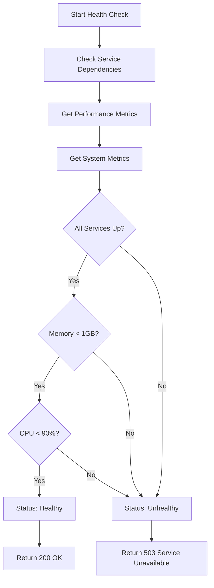

# Health API

<cite>
**Referenced Files in This Document**   
- [health.ts](file://src/routes/health.ts)
- [api.ts](file://src/types/api.ts)
- [novitaApiService.ts](file://src/services/novitaApiService.ts)
- [jobQueueService.ts](file://src/services/jobQueueService.ts)
- [cacheService.ts](file://src/services/cacheService.ts)
</cite>

## Table of Contents
1. [Introduction](#introduction)
2. [Endpoint Overview](#endpoint-overview)
3. [Response Schema](#response-schema)
4. [Health Determination Logic](#health-determination-logic)
5. [Error Response (503 Service Unavailable)](#error-response-503-service-unavailable)
6. [Timeout Mechanism](#timeout-mechanism)
7. [Debug Information in Development Mode](#debug-information-in-development-mode)
8. [Example Responses](#example-responses)
9. [Authentication Requirements](#authentication-requirements)
10. [Caching Considerations](#caching-considerations)
11. [Monitoring Integration Patterns](#monitoring-integration-patterns)
12. [Operational Guidance](#operational-guidance)

## Introduction
The Health API endpoint provides a comprehensive system health check for monitoring and operational purposes. It evaluates service dependencies, performance metrics, and system resources to determine the overall health status of the application. This document details the structure, behavior, and usage of the `GET /health` endpoint, including response formats, health logic, and integration considerations.

## Endpoint Overview
The `GET /health` endpoint returns the current health status of the system. It performs checks on critical services and system metrics to determine whether the application is operating within acceptable parameters.

**Section sources**
- [health.ts](file://src/routes/health.ts#L0-L14)

## Response Schema
The response follows the `EnhancedHealthCheckResponse` schema defined in the API types. The structure includes:

```json
{
  "status": "healthy|unhealthy",
  "timestamp": "ISO8601",
  "uptime": "number",
  "services": {
    "novitaApi": "up|down",
    "jobQueue": "up|down",
    "cache": "up|down"
  },
  "performance": {
    "requestsPerMinute": "number",
    "averageResponseTime": "number",
    "errorRate": "number",
    "jobProcessingRate": "number"
  },
  "system": {
    "memory": {
      "usedMB": "number",
      "totalMB": "number",
      "externalMB": "number",
      "rss": "number"
    },
    "cpu": {
      "usage": "number",
      "loadAverage": "number[]"
    }
  },
  "dependencies": { /* detailed service status */ }
}
```

**Section sources**
- [api.ts](file://src/types/api.ts)

## Health Determination Logic
The system is considered healthy when all of the following conditions are met:
- All service dependencies (novitaApi, jobQueue, cache) are reporting status 'up'
- Memory usage is less than 1GB
- CPU usage is below 90% (in production mode)

The health check uses concurrent execution to evaluate service dependencies and gather metrics efficiently.



**Diagram sources**
- [health.ts](file://src/routes/health.ts#L16-L45)

**Section sources**
- [health.ts](file://src/routes/health.ts#L16-L45)

## Error Response (503 Service Unavailable)
When the system is determined to be unhealthy, the endpoint returns a 503 Service Unavailable status code. This occurs when:
- Any service dependency is down
- Memory usage exceeds 1GB
- CPU usage exceeds 90% (in production)

The response body still includes detailed information to aid in troubleshooting, with the `status` field set to 'unhealthy'.

**Section sources**
- [health.ts](file://src/routes/health.ts#L16-L45)
- [health.test.ts](file://src/routes/__tests__/health.test.ts#L185-L220)

## Timeout Mechanism
External service checks are subject to a 5-second timeout. If a service does not respond within this timeframe, it is considered down. This prevents the health check from hanging indefinitely and ensures timely responses.

**Section sources**
- [health.test.ts](file://src/routes/__tests__/health.test.ts#L293-L295)

## Debug Information in Development Mode
In development mode, additional debug information is included in the response:

```json
{
  "debug": {
    "version": "string",
    "nodeVersion": "string",
    "platform": "string",
    "cacheStats": "object",
    "jobQueueStats": "object"
  }
}
```

This information is excluded in production mode for security and performance reasons.

**Section sources**
- [health.test.ts](file://src/routes/__tests__/health.test.ts#L252-L295)

## Example Responses

### Healthy System
```json
{
  "status": "healthy",
  "timestamp": "2023-12-07T10:00:00.000Z",
  "uptime": 3600.5,
  "services": {
    "novitaApi": "up",
    "jobQueue": "up",
    "cache": "up"
  },
  "performance": {
    "requestsPerMinute": 120.5,
    "averageResponseTime": 150,
    "errorRate": 0.2,
    "jobProcessingRate": 2.1
  },
  "system": {
    "memory": {
      "usedMB": 750,
      "totalMB": 2048,
      "externalMB": 100,
      "rss": 800
    },
    "cpu": {
      "usage": 0.45,
      "loadAverage": [0.8, 0.7, 0.6]
    }
  }
}
```

### Unhealthy System
```json
{
  "status": "unhealthy",
  "timestamp": "2023-12-07T10:00:00.000Z",
  "uptime": 7200.2,
  "services": {
    "novitaApi": "down",
    "jobQueue": "up",
    "cache": "up"
  },
  "performance": {
    "requestsPerMinute": 80.0,
    "averageResponseTime": 500,
    "errorRate": 15.5,
    "jobProcessingRate": 1.0
  },
  "system": {
    "memory": {
      "usedMB": 1500,
      "totalMB": 2048,
      "externalMB": 200,
      "rss": 1600
    },
    "cpu": {
      "usage": 0.85,
      "loadAverage": [2.5, 2.3, 2.1]
    }
  },
  "dependencies": {
    "novitaApi": {
      "status": "down",
      "error": "Health check timeout"
    }
  }
}
```

**Section sources**
- [health.test.ts](file://src/routes/__tests__/health.test.ts#L47-L92)
- [health.test.ts](file://src/routes/__tests__/health.test.ts#L185-L220)

## Authentication Requirements
The Health API endpoint requires authentication via API key. Requests must include a valid API key in the appropriate header for authorization.

**Section sources**
- [health.ts](file://src/routes/health.ts#L0-L14)

## Caching Considerations
Caching of health check responses is not recommended. Since the health status can change rapidly, clients should always retrieve fresh data directly from the endpoint to ensure accurate system monitoring.

## Monitoring Integration Patterns
The Health API is designed to integrate with monitoring systems and orchestration platforms. Key integration patterns include:
- Regular polling by monitoring tools
- Readiness and liveness probes in container orchestration
- Automated alerting based on performance metrics
- Dependency tracking for service mesh integration

**Section sources**
- [health.ts](file://src/routes/health.ts#L16-L45)

## Operational Guidance
For production operations, monitor the following key indicators:
- **Error Rate**: Sudden increases may indicate underlying issues
- **Memory Usage**: Approaching 1GB threshold requires investigation
- **Response Time**: Degradation may indicate performance bottlenecks
- **Service Dependencies**: Any 'down' status requires immediate attention

Regular health checks should be incorporated into automated monitoring workflows to ensure system reliability and enable proactive issue resolution.

**Section sources**
- [health.ts](file://src/routes/health.ts#L16-L45)
- [health.test.ts](file://src/routes/__tests__/health.test.ts#L372-L394)