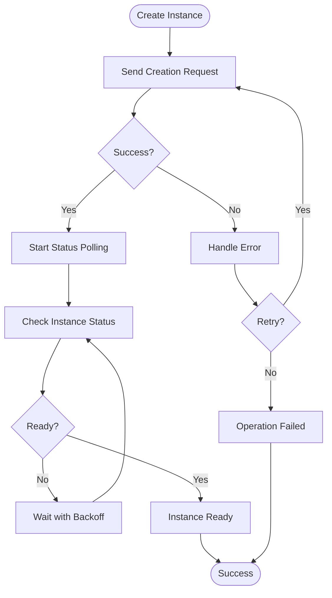
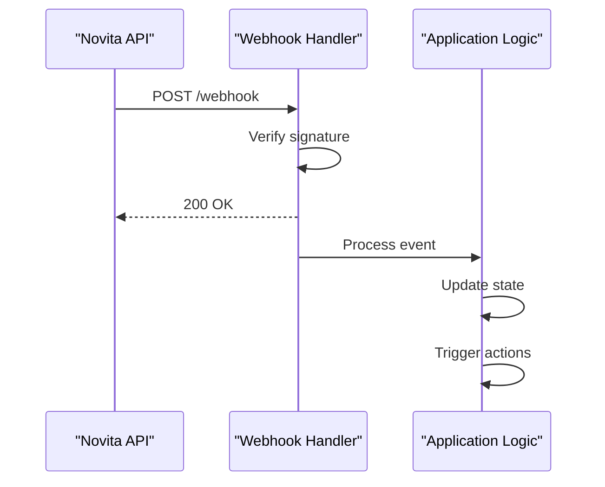

# Client Integration Guide

<cite>
**Referenced Files in This Document**   
- [create-instance.js](file://client-examples/nodejs/create-instance.js)
- [webhook-handler.js](file://client-examples/nodejs/webhook-handler.js)
- [novita_client.py](file://client-examples/python/novita_client.py)
- [monitoring.py](file://client-examples/python/monitoring.py)
- [novitaClient.ts](file://src/clients/novitaClient.ts)
- [novitaApiService.ts](file://src/services/novitaApiService.ts)
- [httpClientExample.ts](file://src/examples/httpClientExample.ts)
- [config.ts](file://src/config/config.ts)
</cite>

## Table of Contents
1. [Introduction](#introduction)
2. [Client Libraries and Setup](#client-libraries-and-setup)
3. [Authentication and Configuration](#authentication-and-configuration)
4. [Instance Management](#instance-management)
5. [Webhook Integration](#webhook-integration)
6. [Error Handling and Retry Logic](#error-handling-and-retry-logic)
7. [Performance Optimization](#performance-optimization)
8. [Security Considerations](#security-considerations)
9. [Production Implementation Guidance](#production-implementation-guidance)

## Introduction
This guide provides comprehensive instructions for integrating client applications with the Novitai API. It covers implementation patterns for both Node.js and Python clients, based on the examples provided in the client-examples directory. The documentation details recommended libraries, authentication methods, and best practices for building robust, production-ready integrations that handle various operational scenarios including network failures, service interruptions, and security requirements.

## Client Libraries and Setup

The Novitai API supports integration through officially recommended client libraries for both Node.js and Python environments. These libraries provide reliable, feature-complete access to the API with built-in resilience patterns.

### Node.js Integration
For Node.js applications, the axios library is recommended as the HTTP client. The examples in the client-examples/nodejs directory demonstrate proper setup and usage patterns. Install the required dependencies using npm:

```bash
cd client-examples/nodejs
npm install
```

The package.json file specifies axios as a dependency, ensuring consistent HTTP handling across different Node.js versions.

### Python Integration
For Python applications, the requests library is the recommended HTTP client. The client-examples/python directory contains a complete Python package with proper setup configuration. Install the dependencies using pip:

```bash
cd client-examples/python
pip install -r requirements.txt
```

Alternatively, install the package in development mode using the setup.py file:

```bash
pip install -e .
```

Both client implementations follow similar architectural patterns, providing consistent interfaces for API operations regardless of the programming language.

**Section sources**
- [package.json](file://client-examples/nodejs/package.json)
- [requirements.txt](file://client-examples/python/requirements.txt)
- [setup.py](file://client-examples/python/setup.py)

## Authentication and Configuration

Proper authentication and configuration are essential for secure and reliable API integration. The Novitai API uses API key-based authentication, with configuration managed through environment variables.

### Environment Variables
All client examples use environment variables for configuration, preventing sensitive information from being hardcoded in source code. The required configuration includes:

- **NOVITA_API_KEY**: Your API key for authentication
- **NOVITA_API_URL**: Base URL for the API endpoint
- **WEBHOOK_URL**: Endpoint for receiving webhook notifications
- **WEBHOOK_SECRET**: Secret for verifying webhook signatures

Create a .env file based on the .env.example template and populate it with your specific configuration values.

### Configuration Validation
Client applications should validate configuration on startup to ensure all required variables are present. The examples include configuration validation that checks for missing or invalid values before making API calls, preventing runtime errors due to misconfiguration.

### API Key Management
API keys should be treated as sensitive credentials and protected accordingly. Use secure secret management systems in production environments rather than plain environment files. Rotate API keys periodically and follow the principle of least privilege when assigning permissions.

**Section sources**
- [config.ts](file://src/config/config.ts)
- [create-instance.js](file://client-examples/nodejs/create-instance.js)
- [novita_client.py](file://client-examples/python/novita_client.py)

## Instance Management

Creating and managing GPU instances is a core functionality of the Novitai API. The client libraries provide methods for instance creation, status polling, and lifecycle management.

### Instance Creation
To create a new instance, provide the necessary configuration parameters including instance name, GPU type, and template. Both Node.js and Python clients offer synchronous and asynchronous methods for instance creation, allowing integration with different application architectures.

### Status Polling
After instance creation, applications should implement status polling to monitor the instance state. The recommended approach uses exponential backoff to avoid overwhelming the API with frequent requests. Start with short intervals and gradually increase the polling frequency as the instance initialization progresses.

### Instance Monitoring
For real-time monitoring, the examples demonstrate how to implement continuous polling with proper error handling. The monitoring scripts include timeout handling and automatic retry mechanisms to handle temporary network issues or service interruptions.



**Diagram sources **
- [create-instance.js](file://client-examples/nodejs/create-instance.js)
- [monitoring.py](file://client-examples/python/monitoring.py)
- [novitaApiService.ts](file://src/services/novitaApiService.ts)

**Section sources**
- [create-instance.js](file://client-examples/nodejs/create-instance.js)
- [monitoring.py](file://client-examples/python/monitoring.py)
- [httpClientExample.ts](file://src/examples/httpClientExample.ts)

## Webhook Integration

Webhook notifications provide an event-driven alternative to polling for instance status changes. Proper implementation of webhook handlers ensures timely notification of important events.

### Webhook Handler Implementation
The Node.js example includes an Express.js webhook handler that receives and processes notifications from the Novitai API. The handler should be deployed at the URL specified in the WEBHOOK_URL environment variable.

### Signature Verification
To ensure message authenticity, all webhook notifications include a signature that must be verified using the WEBHOOK_SECRET. The verification process calculates an HMAC hash of the request body using the secret key and compares it with the signature header. Only process notifications with valid signatures to prevent unauthorized access.

### Response Handling
Webhook handlers should respond promptly to notifications, typically with a 200 OK status code. Long-running processing should be delegated to background workers to avoid timeout issues. Implement proper error handling to manage cases where notification processing fails.



**Diagram sources **
- [webhook-handler.js](file://client-examples/nodejs/webhook-handler.js)
- [novitaClient.ts](file://src/clients/novitaClient.ts)

**Section sources**
- [webhook-handler.js](file://client-examples/nodejs/webhook-handler.js)
- [novitaClient.ts](file://src/clients/novitaClient.ts)

## Error Handling and Retry Logic

Robust error handling is critical for maintaining reliable client applications. The Novitai API client libraries include comprehensive error handling strategies to manage various failure scenarios.

### Error Types
The client libraries define specific error types for different failure modes:
- **RateLimitError**: Thrown when API rate limits are exceeded
- **AuthenticationError**: Indicates invalid API credentials
- **TimeoutError**: Occurs when requests exceed the timeout threshold
- **CircuitBreakerError**: Triggered when the circuit breaker is open
- **NetworkError**: Indicates connectivity issues

### Exponential Backoff
Implement retry logic with exponential backoff for transient failures. The recommended pattern starts with a short initial delay (e.g., 1 second) and doubles the delay after each failed attempt, up to a maximum threshold. This approach prevents overwhelming the API during periods of high load or temporary outages.

### Rate Limit Handling
When encountering rate limits, respect the Retry-After header returned by the API. The RateLimitError includes a retryAfter property indicating the recommended wait time before retrying the request. Implement adaptive rate limiting based on actual API usage patterns.

### Circuit Breaker Pattern
The client libraries implement the circuit breaker pattern to prevent cascading failures. When the circuit breaker is open, requests are immediately rejected without contacting the API. This allows the service time to recover from failures and prevents overwhelming a struggling backend.

**Section sources**
- [novitaClient.ts](file://src/clients/novitaClient.ts)
- [novitaApiService.ts](file://src/services/novitaApiService.ts)
- [httpClientExample.ts](file://src/examples/httpClientExample.ts)

## Performance Optimization

Optimizing client performance ensures efficient resource utilization and responsive applications. The following strategies improve the efficiency of API integrations.

### Connection Pooling
Enable connection pooling in HTTP clients to reuse TCP connections across multiple requests. This reduces the overhead of establishing new connections and improves overall performance, especially for applications making frequent API calls.

### Efficient Polling Intervals
When polling for status updates, use adaptive intervals rather than fixed timing. Start with shorter intervals during active operations and gradually increase the interval as the operation progresses. Implement jitter in polling intervals to avoid synchronized requests from multiple clients.

### Caching Strategies
Cache responses for frequently accessed, relatively static data such as product listings or template information. Implement proper cache invalidation based on TTL (time-to-live) or explicit invalidation signals from the API.

### Batch Operations
For applications that need to create multiple instances, use batch operations to reduce the number of API calls. The batch-creation.js example demonstrates how to manage concurrent instance creation with controlled concurrency to avoid rate limiting.

**Section sources**
- [batch-creation.js](file://client-examples/nodejs/batch-creation.js)
- [batch_manager.py](file://client-examples/python/batch_manager.py)
- [novitaClient.ts](file://src/clients/novitaClient.ts)

## Security Considerations

Security is paramount when integrating with external APIs. The following practices help protect both client applications and API credentials.

### API Key Protection
Never hardcode API keys in source code or version control systems. Use environment variables or secure secret management services. Restrict API key permissions to the minimum required for the application's functionality.

### Webhook Endpoint Security
Protect webhook endpoints from unauthorized access by implementing signature verification and rate limiting. Validate all incoming payloads to prevent injection attacks. Consider implementing IP filtering to only accept requests from known Novitai API endpoints.

### HTTPS Enforcement
Always use HTTPS when communicating with the Novitai API, even in development environments. This ensures that API keys and sensitive data are encrypted in transit.

### Input Validation
Validate all inputs before making API calls to prevent injection attacks and malformed requests. The client libraries include input validation for common parameters, but additional validation may be required based on specific use cases.

**Section sources**
- [webhook-handler.js](file://client-examples/nodejs/webhook-handler.js)
- [novita_client.py](file://client-examples/python/novita_client.py)
- [config.ts](file://src/config/config.ts)

## Production Implementation Guidance

The provided examples serve as starting points for production integrations. The following guidance helps transition from examples to production-ready applications.

### Configuration Management
Implement robust configuration management using established patterns such as the 12-factor app methodology. Use different configuration sets for development, staging, and production environments.

### Monitoring and Logging
Integrate comprehensive logging and monitoring to track API usage, error rates, and performance metrics. The examples include basic logging, but production applications should integrate with centralized logging systems and monitoring platforms.

### Testing Strategy
Implement thorough testing, including unit tests, integration tests, and end-to-end tests. The client-examples directory includes test files that demonstrate proper testing patterns for API integrations.

### Deployment Patterns
Consider deployment patterns such as blue-green deployments or canary releases when updating client applications. This minimizes the impact of potential issues with new versions.

### Documentation and Maintenance
Maintain up-to-date documentation for your integration implementation. Regularly review and update dependencies to ensure compatibility with API changes and security patches.

**Section sources**
- [README.md](file://client-examples/README.md)
- [create-instance.js](file://client-examples/nodejs/create-instance.js)
- [novita_client.py](file://client-examples/python/novita_client.py)