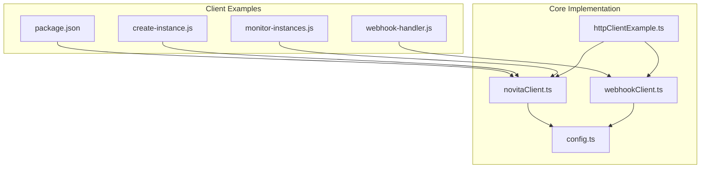
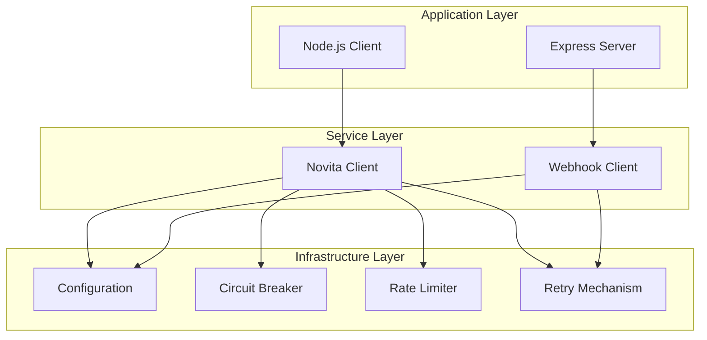
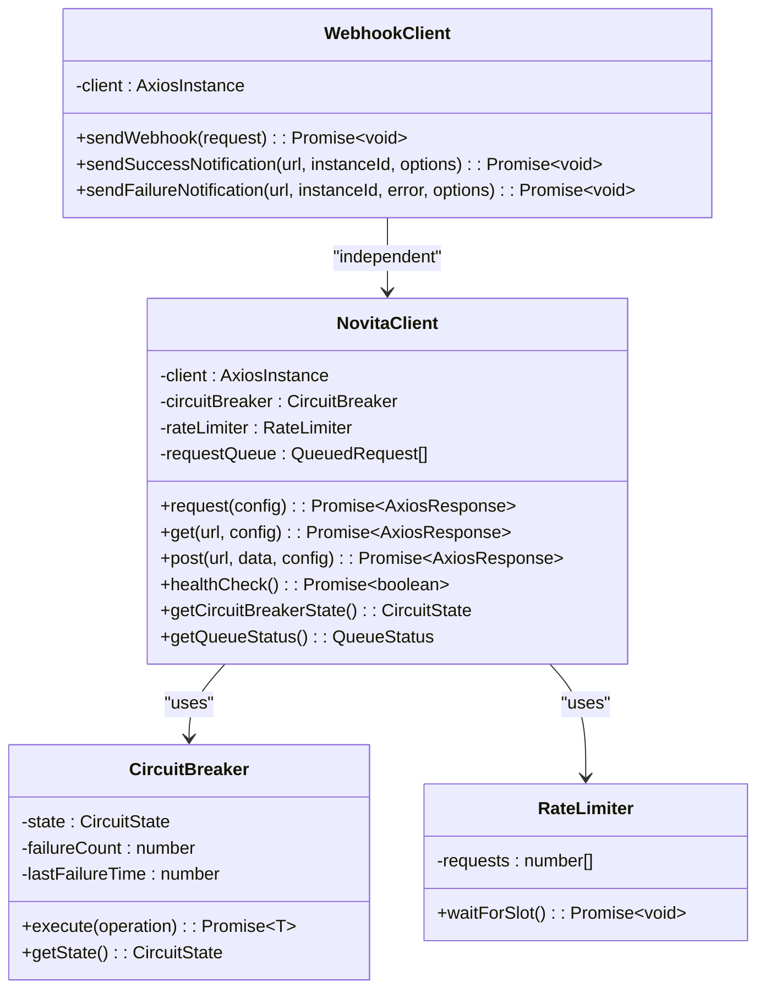
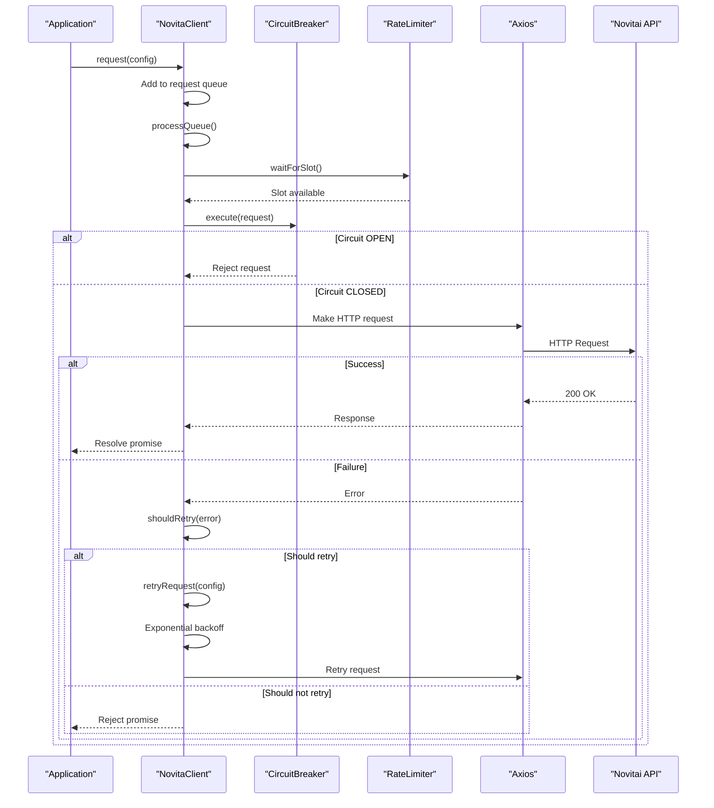
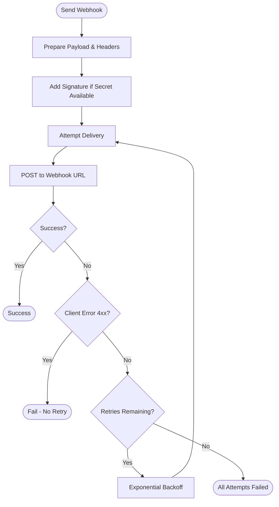
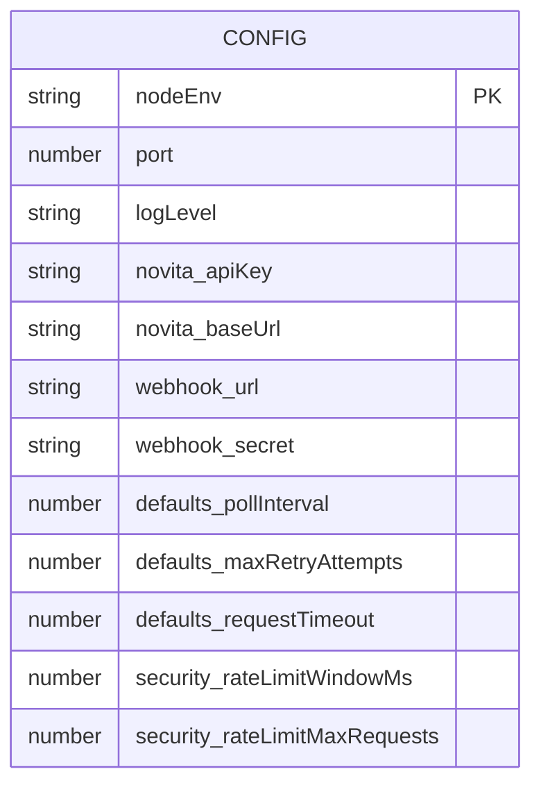
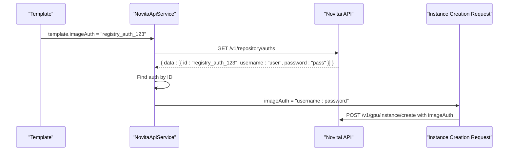
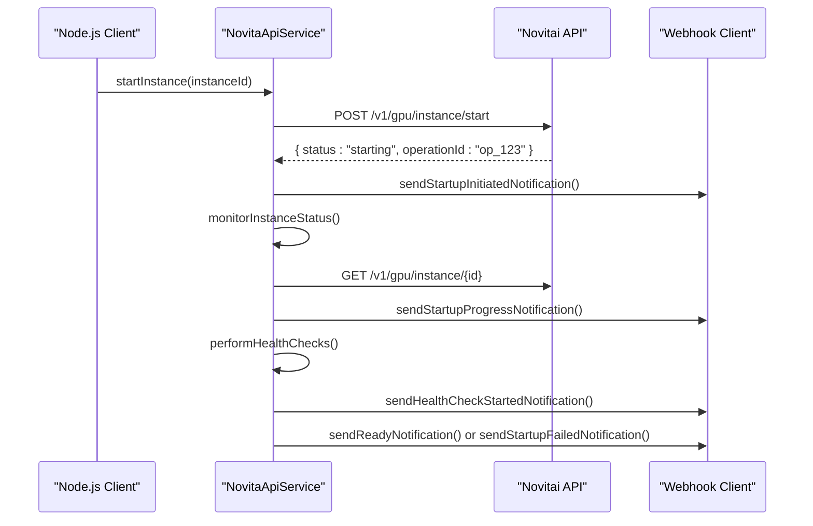
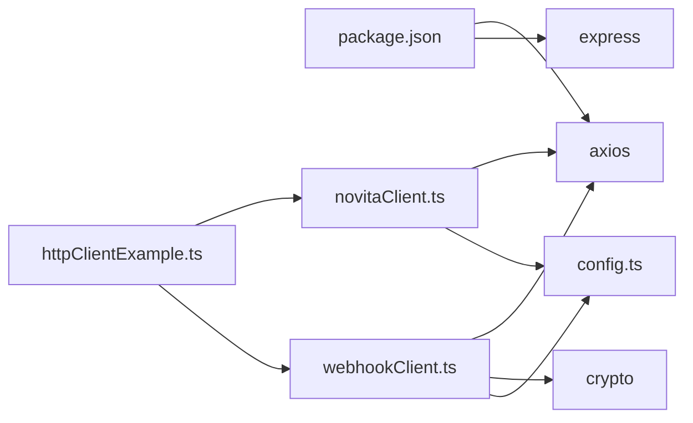

# Node.js Client Integration

<cite>
**Referenced Files in This Document**   
- [package.json](file://client-examples/nodejs/package.json) - *Updated in recent commit 68921546*
- [httpClientExample.ts](file://src/examples/httpClientExample.ts) - *Updated in recent commits 68921546 and 52581c45*
- [novitaClient.ts](file://src/clients/novitaClient.ts)
- [webhookClient.ts](file://src/clients/webhookClient.ts)
- [config.ts](file://src/config/config.ts)
- [registryAuthExample.ts](file://src/examples/registryAuthExample.ts) - *Added in recent commit 90d221d8*
- [templateServiceExample.ts](file://src/examples/templateServiceExample.ts) - *Updated in recent commit eb20e150*
- [novitaApiService.ts](file://src/services/novitaApiService.ts) - *Updated in recent commit eb20e150*
</cite>

## Update Summary
**Changes Made**   
- Added new section on instance control endpoints and startup operations
- Updated API usage examples to reflect new instance start functionality
- Enhanced webhook client documentation with startup lifecycle notifications
- Added code examples for starting instances by ID and name
- Updated configuration references to include new instance startup parameters
- Added new sequence diagram for instance startup workflow
- Updated file references and source tracking annotations

## Table of Contents
1. [Introduction](#introduction)
2. [Project Structure](#project-structure)
3. [Core Components](#core-components)
4. [Architecture Overview](#architecture-overview)
5. [Detailed Component Analysis](#detailed-component-analysis)
6. [Dependency Analysis](#dependency-analysis)
7. [Performance Considerations](#performance-considerations)
8. [Troubleshooting Guide](#troubleshooting-guide)
9. [Conclusion](#conclusion)

## Introduction
This document provides a comprehensive guide for integrating a Node.js client with the Novitai API. It covers environment setup, instance lifecycle management, webhook handling, error resilience, and performance optimization. The guide is designed to be accessible to developers new to the API while offering advanced configuration options suitable for production deployments. All examples are based on real implementation patterns found in the codebase.

## Project Structure
The Novitai repository follows a modular structure with clear separation of concerns. The Node.js client integration examples are located in the `client-examples/nodejs` directory, while core client logic resides in the `src/clients` folder. Configuration is centralized in `src/config`, and reusable examples demonstrating best practices are available in `src/examples`.



**Diagram sources**
- [package.json](file://client-examples/nodejs/package.json)
- [novitaClient.ts](file://src/clients/novitaClient.ts)
- [webhookClient.ts](file://src/clients/webhookClient.ts)
- [config.ts](file://src/config/config.ts)

**Section sources**
- [package.json](file://client-examples/nodejs/package.json)
- [novitaClient.ts](file://src/clients/novitaClient.ts)

## Core Components
The Node.js integration relies on several key components: the Novita client for API communication, the webhook client for outbound notifications, and the configuration system for managing environment-specific settings. These components work together to provide a robust, fault-tolerant interface to the Novitai API.

**Section sources**
- [novitaClient.ts](file://src/clients/novitaClient.ts#L1-L385)
- [webhookClient.ts](file://src/clients/webhookClient.ts#L1-L243)
- [config.ts](file://src/config/config.ts#L1-L391)

## Architecture Overview
The client architecture implements a layered approach with built-in resilience features. At its core is an Axios-based HTTP client wrapped with circuit breaker and rate limiting functionality. Webhook notifications are handled by a separate client with signature verification capabilities. Configuration is managed through environment variables with validation.



**Diagram sources**
- [novitaClient.ts](file://src/clients/novitaClient.ts#L1-L385)
- [webhookClient.ts](file://src/clients/webhookClient.ts#L1-L243)
- [config.ts](file://src/config/config.ts#L1-L391)

## Detailed Component Analysis

### Novita Client Implementation
The Novita client provides a robust interface to the Novitai API with built-in resilience features including circuit breaking, rate limiting, and automatic retry with exponential backoff.

#### HTTP Client Architecture


**Diagram sources**
- [novitaClient.ts](file://src/clients/novitaClient.ts#L1-L385)

#### Request Flow Sequence


**Diagram sources**
- [novitaClient.ts](file://src/clients/novitaClient.ts#L1-L385)

### Webhook Client Implementation
The webhook client handles outbound notifications with security features including HMAC signature verification and retry logic for reliable delivery.

#### Webhook Processing Flow


**Diagram sources**
- [webhookClient.ts](file://src/clients/webhookClient.ts#L1-L243)

### Configuration Management
The configuration system loads settings from environment variables with validation and provides sensible defaults for optional parameters.

#### Configuration Schema


**Diagram sources**
- [config.ts](file://src/config/config.ts#L1-L391)

**Section sources**
- [config.ts](file://src/config/config.ts#L1-L391)
- [novitaClient.ts](file://src/clients/novitaClient.ts#L1-L385)
- [webhookClient.ts](file://src/clients/webhookClient.ts#L1-L243)

### Registry Authentication Implementation
The system now supports registry authentication for private Docker images, allowing secure access to private container repositories during instance creation.

#### Registry Authentication Workflow


**Section sources**
- [registryAuthExample.ts](file://src/examples/registryAuthExample.ts#L1-L97)
- [novitaApiService.ts](file://src/services/novitaApiService.ts#L178-L222)
- [templateService.ts](file://src/services/templateService.ts#L1-L288)

#### Private Image Instance Creation
When creating instances with private Docker images, the system automatically resolves registry credentials through the following process:

1. **Template Configuration**: Templates specify a registry authentication ID instead of storing credentials directly:
```typescript
const template = {
  id: 'private-pytorch',
  imageUrl: 'registry.company.com/ai/pytorch:latest',
  imageAuth: 'registry_auth_123' // Reference to stored credentials
};
```

2. **Credential Resolution**: The `NovitaApiService` fetches and matches credentials by ID:
```typescript
async getRegistryAuth(authId: string): Promise<{ username: string; password: string }> {
  const response = await novitaClient.get<RegistryAuthsResponse>('/v1/repository/auths');
  const authEntry = response.data.data.find(auth => auth.id === authId);
  
  if (!authEntry) {
    throw new NovitaApiClientError(`Registry authentication not found for ID: ${authId}`, 404);
  }
  
  return {
    username: authEntry.username,
    password: authEntry.password
  };
}
```

3. **Instance Creation**: The resolved credentials are formatted and included in the creation request:
```typescript
const createInstanceRequest = {
  name: 'private-instance',
  productId: 'rtx4090-hk',
  imageUrl: 'registry.company.com/ai/pytorch:latest',
  imageAuth: 'username:password', // Formatted from fetched credentials
  // ... other parameters
};
```

This approach provides secure credential management by:
- Storing credentials centrally in the Novitai system
- Referencing them by ID in templates
- Automatically resolving and formatting them during instance creation
- Never exposing raw credentials in template configurations

**Section sources**
- [registryAuthExample.ts](file://src/examples/registryAuthExample.ts#L1-L97)
- [novitaApiService.ts](file://src/services/novitaApiService.ts#L178-L275)
- [templateService.ts](file://src/services/templateService.ts#L1-L288)

### Instance Control Implementation
The system now supports controlling instances that are in exited status, allowing users to start instances by ID or name with comprehensive webhook notifications.

#### Instance Startup Workflow


**Section sources**
- [httpClientExample.ts](file://src/examples/httpClientExample.ts#L1-L131) - *Updated in recent commit 52581c45*
- [novitaApiService.ts](file://src/services/novitaApiService.ts#L276-L350) - *Added in recent commit 52581c45*
- [webhookClient.ts](file://src/clients/webhookClient.ts#L244-L799) - *Added new startup notification methods*

#### Starting Instances by ID or Name
The system supports starting instances using either their unique ID or their name, with configurable lookup behavior:

```typescript
// Start instance by ID
await novitaApiService.startInstance('instance-123');

// Start instance by name (when enabled in configuration)
await novitaApiService.startInstance('my-gpu-instance');

// With custom timeout and webhook URL
await novitaApiService.startInstance('instance-123', {
  timeoutMs: 600000, // 10 minutes
  webhookUrl: 'https://myapp.com/webhooks/instance-start',
  webhookSecret: process.env.WEBHOOK_SECRET
});
```

The instance startup process includes:
- **Operation Initiation**: Sending start command to Novitai API
- **Status Monitoring**: Polling instance status with configurable intervals
- **Health Checking**: Performing application-level health checks on exposed endpoints
- **Webhook Notifications**: Sending lifecycle notifications at key stages

**Section sources**
- [httpClientExample.ts](file://src/examples/httpClientExample.ts#L1-L131) - *Updated in recent commit 52581c45*
- [config.ts](file://src/config/config.ts#L500-L550) - *Added instance startup configuration*
- [novitaApiService.ts](file://src/services/novitaApiService.ts#L276-L350) - *Added in recent commit 52581c45*

#### Startup Lifecycle Webhook Notifications
The webhook client now supports comprehensive notifications for the instance startup lifecycle:

```typescript
// Send startup initiated notification
await webhookClient.sendStartupInitiatedNotification(
  webhookUrl,
  instanceId,
  {
    operationId: 'op_123',
    startedAt: new Date(),
    estimatedReadyTime: new Date(Date.now() + 300000).toISOString()
  }
);

// Send startup progress notification
await webhookClient.sendStartupProgressNotification(
  webhookUrl,
  instanceId,
  'monitoring',
  {
    operationId: 'op_123',
    startedAt: new Date(),
    phases: {
      startRequested: new Date()
    },
    currentStatus: 'instance is starting'
  }
);

// Send startup completed notification
await webhookClient.sendStartupCompletedNotification(
  webhookUrl,
  instanceId,
  {
    operationId: 'op_123',
    startedAt: new Date(Date.now() - 450000),
    completedAt: new Date(),
    phases: {
      startRequested: new Date(Date.now() - 450000),
      instanceRunning: new Date(Date.now() - 300000),
      healthCheckCompleted: new Date()
    },
    healthCheckResult: healthCheckResult
  }
);
```

These notifications include detailed timing information and can be used to track the complete startup process from initiation to readiness.

**Section sources**
- [webhookClient.ts](file://src/clients/webhookClient.ts#L244-L799) - *Added in recent commit 52581c45*
- [httpClientExample.ts](file://src/examples/httpClientExample.ts#L1-L131) - *Updated in recent commit 52581c45*

## Dependency Analysis
The Node.js client has minimal external dependencies, relying primarily on Axios for HTTP communication and standard libraries for cryptographic operations. The internal dependency graph shows a clean separation between components.



**Diagram sources**
- [package.json](file://client-examples/nodejs/package.json)
- [novitaClient.ts](file://src/clients/novitaClient.ts)
- [webhookClient.ts](file://src/clients/webhookClient.ts)
- [config.ts](file://src/config/config.ts)

**Section sources**
- [package.json](file://client-examples/nodejs/package.json)
- [novitaClient.ts](file://src/clients/novitaClient.ts)
- [webhookClient.ts](file://src/clients/webhookClient.ts)

## Performance Considerations
The client implementation includes several performance optimizations to ensure efficient API usage and reliable operation under various network conditions.

### HTTP Client Configuration Best Practices
- **Timeout Settings**: Configure request timeouts between 5-30 seconds to balance responsiveness and reliability
- **Connection Pooling**: Axios maintains a default connection pool; adjust `maxSockets` based on expected concurrency
- **Polling Intervals**: Use configurable polling intervals (10-300 seconds) to avoid excessive API calls
- **Rate Limiting**: Respect API rate limits with client-side throttling
- **Caching**: Implement response caching for frequently accessed but infrequently changing data

### Optimization Recommendations
1. Set appropriate timeout values based on expected response times
2. Use connection pooling to reduce TCP handshake overhead
3. Implement exponential backoff for retries to avoid overwhelming servers
4. Batch requests when possible to reduce round trips
5. Monitor circuit breaker state to detect service degradation early
6. Use correlation IDs for tracing requests across systems

**Section sources**
- [novitaClient.ts](file://src/clients/novitaClient.ts#L1-L385)
- [config.ts](file://src/config/config.ts#L1-L391)
- [httpClientExample.ts](file://src/examples/httpClientExample.ts#L1-L131)

## Troubleshooting Guide
Common issues and their solutions when integrating with the Novitai API.

### Common Error Scenarios
- **ECONNREFUSED**: Check API endpoint URL and network connectivity
- **Timeout Errors**: Increase request timeout or check server performance
- **429 Rate Limit**: Implement client-side rate limiting or request quota increase
- **401 Unauthorized**: Verify API key is correctly configured
- **Circuit Breaker Open**: Wait for recovery period or check upstream service health
- **REGISTRY_AUTH_NOT_FOUND**: Verify registry authentication ID exists in Novitai system
- **INSTANCE_NOT_FOUND**: Verify instance ID or name exists and is accessible

### Debugging Strategies
1. Enable debug logging to trace request/response cycles
2. Use correlation IDs to track requests across systems
3. Monitor circuit breaker and rate limiter states
4. Check queue lengths during high load periods
5. Validate webhook signatures when receiving notifications

### Logging and Monitoring
The client includes comprehensive logging at multiple levels:
- **Info**: Key operations and state changes
- **Debug**: Request/response details and timing
- **Warn**: Recoverable errors and circuit breaker transitions
- **Error**: Unrecoverable failures and delivery issues

**Section sources**
- [novitaClient.ts](file://src/clients/novitaClient.ts#L1-L385)
- [webhookClient.ts](file://src/clients/webhookClient.ts#L1-L243)
- [httpClientExample.ts](file://src/examples/httpClientExample.ts#L1-L131)

## Conclusion
The Novitai Node.js client provides a robust, production-ready integration with comprehensive error handling, resilience features, and security controls. By following the patterns demonstrated in this documentation, developers can build reliable applications that effectively utilize the Novitai API. The combination of circuit breaking, rate limiting, automatic retries, and secure webhook handling ensures stable operation even under adverse conditions. For production deployments, pay special attention to configuration management, monitoring, and performance tuning based on actual usage patterns.