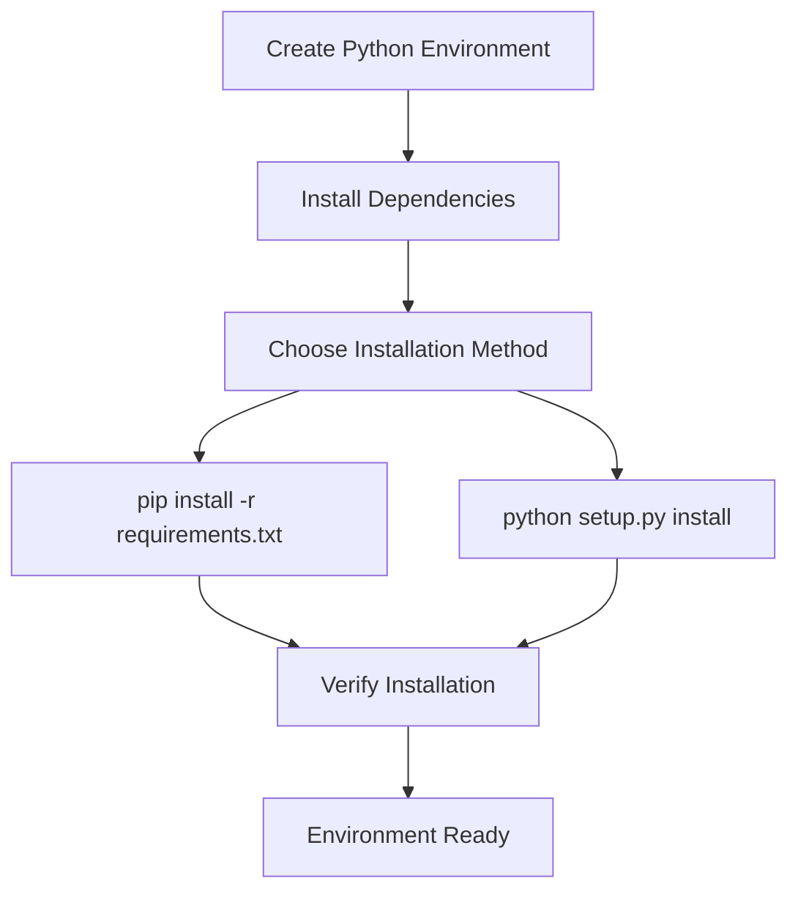
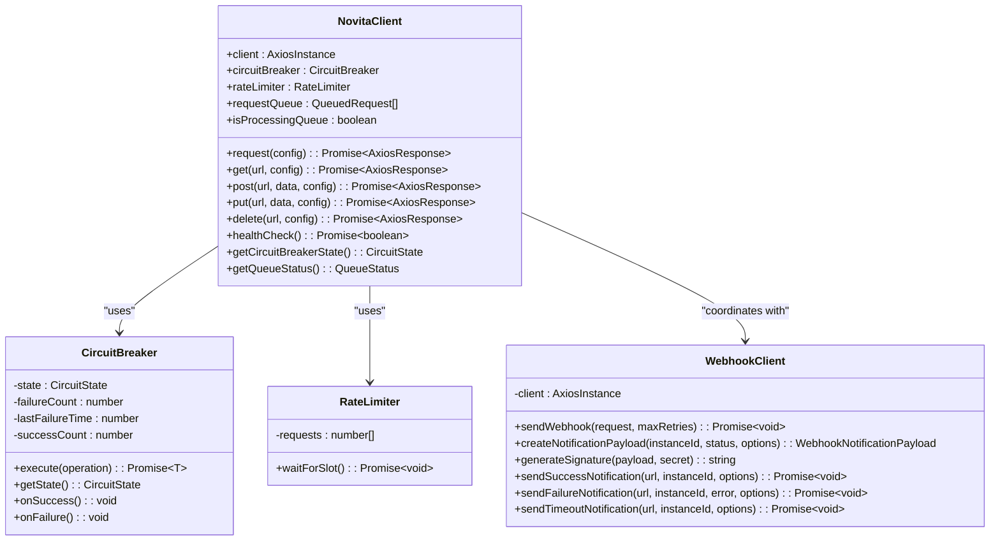
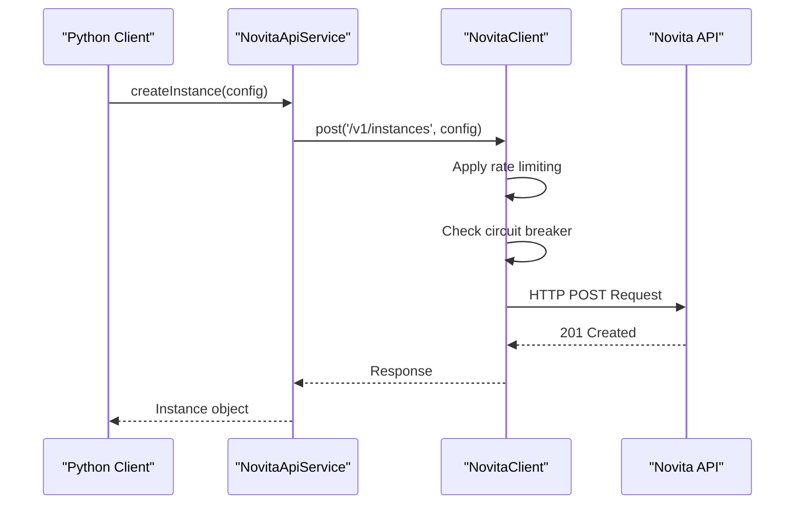
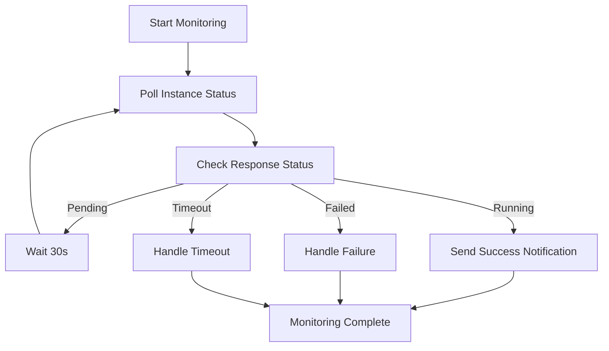
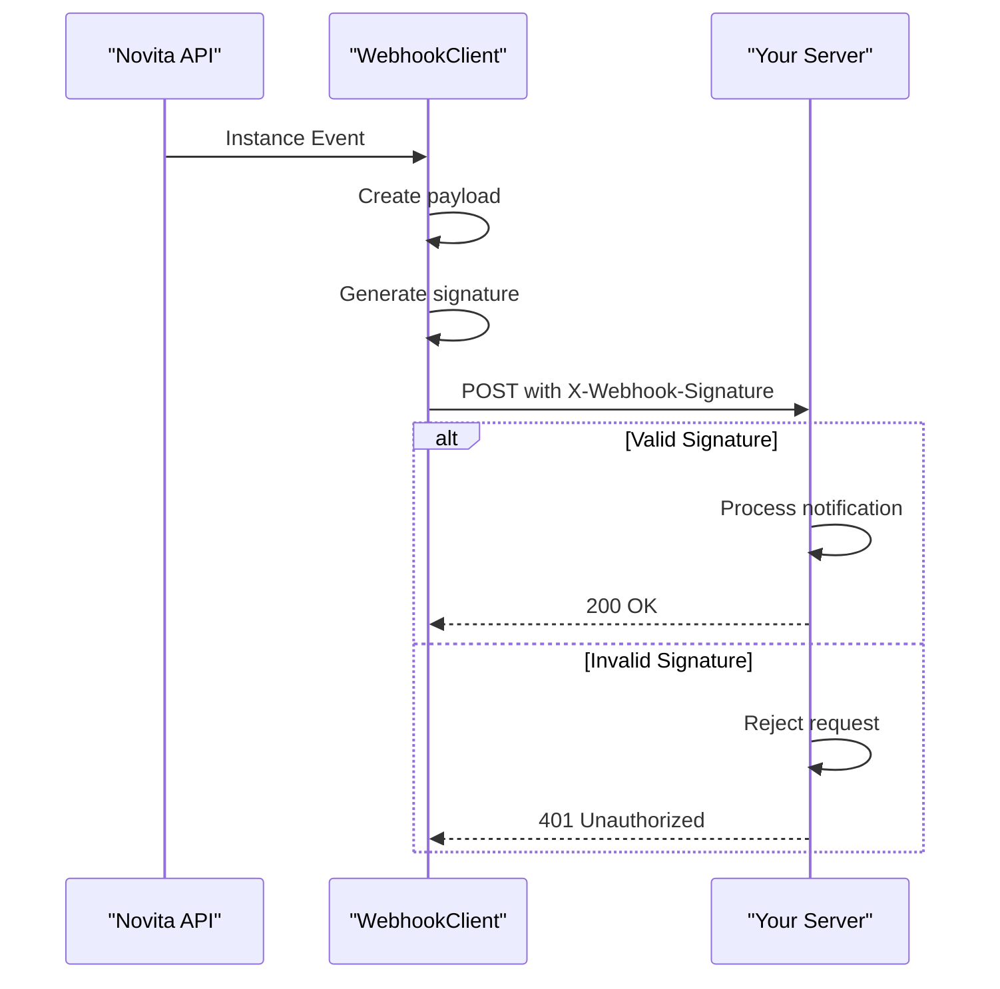
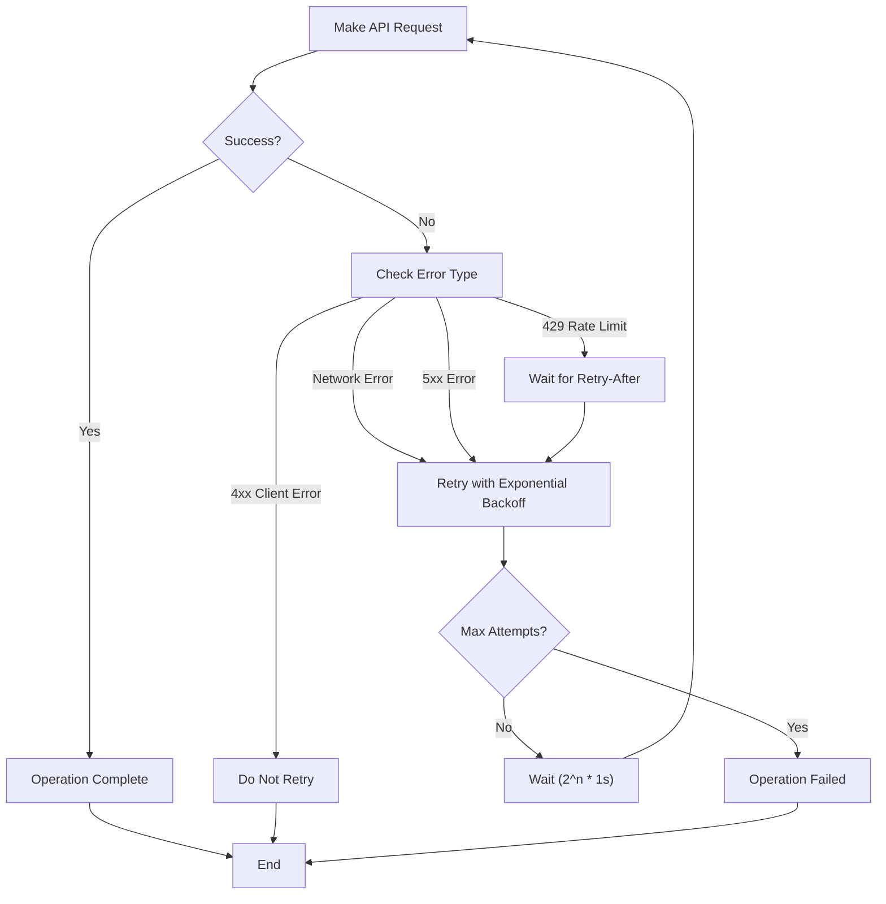
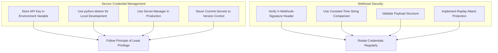
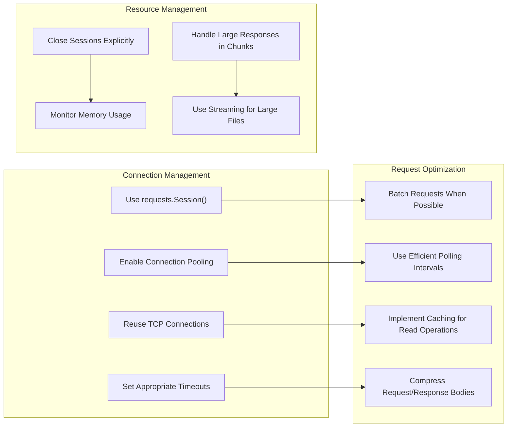

# Python Client Integration

<cite>
**Referenced Files in This Document**   
- [requirements.txt](file://client-examples/python/requirements.txt)
- [setup.py](file://client-examples/python/setup.py)
- [httpClientExample.ts](file://src/examples/httpClientExample.ts)
- [novitaClient.ts](file://src/clients/novitaClient.ts)
- [webhookClient.ts](file://src/clients/webhookClient.ts)
</cite>

## Table of Contents
1. [Introduction](#introduction)
2. [Environment Setup](#environment-setup)
3. [Core HTTP Client Features](#core-http-client-features)
4. [Creating GPU Instances](#creating-gpu-instances)
5. [Monitoring Instance Status](#monitoring-instance-status)
6. [Webhook Callback Handling](#webhook-callback-handling)
7. [Error Handling and Retry Logic](#error-handling-and-retry-logic)
8. [Security Best Practices](#security-best-practices)
9. [Performance Optimization](#performance-optimization)
10. [Common Pitfalls and Solutions](#common-pitfalls-and-solutions)

## Introduction
This guide provides comprehensive instructions for integrating Python applications with the Novita API to manage GPU instances. It covers environment setup, instance lifecycle management, webhook integration, error handling, and performance optimization. The documentation draws from the official TypeScript implementation patterns and adapts them for Python using the requests library and best practices in asynchronous programming.

## Environment Setup

To begin integrating with the Novita API, set up your Python environment using the provided configuration files. The project includes both `requirements.txt` and `setup.py` to support different deployment scenarios.

**Diagram sources**
- [requirements.txt](file://client-examples/python/requirements.txt#L1-L2)
- [setup.py](file://client-examples/python/setup.py#L1-L25)

**Section sources**
- [requirements.txt](file://client-examples/python/requirements.txt#L1-L2)
- [setup.py](file://client-examples/python/setup.py#L1-L25)

## Core HTTP Client Features

The Novita API client implements several reliability patterns that should be replicated in Python integrations. These include circuit breaker, rate limiting, retry logic, and structured logging. The TypeScript implementation demonstrates these patterns using axios with interceptors and custom classes.

**Diagram sources**
- [novitaClient.ts](file://src/clients/novitaClient.ts#L0-L384)
- [webhookClient.ts](file://src/clients/webhookClient.ts#L0-L242)

**Section sources**
- [novitaClient.ts](file://src/clients/novitaClient.ts#L0-L384)
- [webhookClient.ts](file://src/clients/webhookClient.ts#L0-L242)

## Creating GPU Instances

Creating GPU instances through the Novita API requires proper authentication and payload formatting. The process involves making a POST request to the instances endpoint with the required configuration parameters. The TypeScript example demonstrates the use of service methods that abstract the underlying HTTP operations.

**Diagram sources**
- [httpClientExample.ts](file://src/examples/httpClientExample.ts#L0-L130)
- [novitaClient.ts](file://src/clients/novitaClient.ts#L0-L384)

**Section sources**
- [httpClientExample.ts](file://src/examples/httpClientExample.ts#L0-L130)

## Monitoring Instance Status

Monitoring GPU instance status can be achieved through polling or webhook notifications. The recommended approach combines initial polling with webhook callbacks for event-driven updates. The polling interval should be optimized to balance responsiveness with API rate limits.

**Diagram sources**
- [httpClientExample.ts](file://src/examples/httpClientExample.ts#L0-L130)
- [novitaClient.ts](file://src/clients/novitaClient.ts#L0-L384)

**Section sources**
- [httpClientExample.ts](file://src/examples/httpClientExample.ts#L0-L130)

## Webhook Callback Handling

Webhook callbacks provide real-time notifications about instance state changes. The Novita API supports signed webhooks to ensure authenticity. When implementing webhook receivers in Python, it's essential to verify signatures and handle retries properly.

**Diagram sources**
- [webhookClient.ts](file://src/clients/webhookClient.ts#L0-L242)

**Section sources**
- [webhookClient.ts](file://src/clients/webhookClient.ts#L0-L242)

## Error Handling and Retry Logic

Robust error handling is critical for reliable API integration. The Novita client implements a comprehensive error hierarchy and retry strategy. Python implementations should replicate this behavior using libraries like `tenacity` or `backoff` to handle transient failures.

**Diagram sources**
- [novitaClient.ts](file://src/clients/novitaClient.ts#L0-L384)
- [webhookClient.ts](file://src/clients/webhookClient.ts#L0-L242)

**Section sources**
- [novitaClient.ts](file://src/clients/novitaClient.ts#L0-L384)
- [webhookClient.ts](file://src/clients/webhookClient.ts#L0-L242)

## Security Best Practices

Secure handling of credentials and webhook notifications is essential. The Novita API requires API keys for authentication and supports webhook signatures for message integrity. Python applications should use environment variables or secret management tools to store sensitive information.

**Diagram sources**
- [novitaClient.ts](file://src/clients/novitaClient.ts#L0-L384)
- [webhookClient.ts](file://src/clients/webhookClient.ts#L0-L242)

**Section sources**
- [novitaClient.ts](file://src/clients/novitaClient.ts#L0-L384)
- [webhookClient.ts](file://src/clients/webhookClient.ts#L0-L242)

## Performance Optimization

Optimizing API client performance involves several strategies including connection pooling, session reuse, and efficient polling intervals. The requests library in Python supports these optimizations through the Session object and proper configuration.

**Diagram sources**
- [novitaClient.ts](file://src/clients/novitaClient.ts#L0-L384)
- [httpClientExample.ts](file://src/examples/httpClientExample.ts#L0-L130)

**Section sources**
- [novitaClient.ts](file://src/clients/novitaClient.ts#L0-L384)
- [httpClientExample.ts](file://src/examples/httpClientExample.ts#L0-L130)

## Common Pitfalls and Solutions

Integrating with the Novita API may present several challenges. Understanding these common issues and their solutions can help ensure a smooth implementation process.

```mermaid
flowchart TD
subgraph "SSL Verification Issues"
A["Disable SSL Verification Only in Development"]
B["Update CA Certificates Regularly"]
C["Handle Self-Signed Certificates Properly"]
end
subgraph "JSON Parsing Errors"
D["Validate JSON Structure Before Parsing"]
E["Handle Missing Fields Gracefully"]
F["Use Type Hints and Validation"]
end
subgraph "Network Failures"
G["Implement Retry Logic with Backoff"]
H["Use Circuit Breaker Pattern"]
I["Set Reasonable Timeouts"]
end
subgraph "Rate Limiting"
J["Respect Retry-After Headers"]
K["Implement Client-Side Rate Limiting"]
L["Monitor API Usage Patterns"]
end
M["Log Errors with Sufficient Context"]
N["Monitor API Health Regularly"]
O["Test Error Scenarios"]
A --> M
B --> M
C --> M
D --> N
E --> N
F --> N
G --> O
H --> O
I --> O
J --> O
K --> O
L --> O
```

**Diagram sources**
- [novitaClient.ts](file://src/clients/novitaClient.ts#L0-L384)
- [httpClientExample.ts](file://src/examples/httpClientExample.ts#L0-L130)

**Section sources**
- [novitaClient.ts](file://src/clients/novitaClient.ts#L0-L384)
- [httpClientExample.ts](file://src/examples/httpClientExample.ts#L0-L130)