# Using Client Examples

<cite>
**Referenced Files in This Document**   
- [httpClientExample.ts](file://src/examples/httpClientExample.ts)
- [jobQueueExample.ts](file://src/examples/jobQueueExample.ts)
- [productServiceExample.ts](file://src/examples/productServiceExample.ts)
- [templateServiceExample.ts](file://src/examples/templateServiceExample.ts)
- [registryAuthExample.ts](file://src/examples/registryAuthExample.ts) - *Added in recent commit*
- [regionFallbackExample.ts](file://src/examples/regionFallbackExample.ts) - *Added in recent commit*
- [novitaClient.ts](file://src/clients/novitaClient.ts)
- [productService.ts](file://src/services/productService.ts)
- [templateService.ts](file://src/services/templateService.ts)
- [jobQueueService.ts](file://src/services/jobQueueService.ts)
- [README.md](file://client-examples/README.md)
</cite>

## Update Summary
**Changes Made**   
- Added new section for Region Fallback Example to document the multi-region fallback feature
- Added new section for Registry Authentication Example to document private image registry support
- Updated Template Service Example section to reflect the environment variable field name change from 'name' to 'key'
- Updated document sources to include the new regionFallbackExample.ts and registryAuthExample.ts files
- Verified all existing examples remain accurate with current codebase

## Table of Contents
1. [Introduction](#introduction)
2. [Core Example Analysis](#core-example-analysis)
3. [Extending Examples with Advanced Features](#extending-examples-with-advanced-features)
4. [Cross-Language Integration Patterns](#cross-language-integration-patterns)
5. [Troubleshooting Common Issues](#troubleshooting-common-issues)
6. [Testing Client Integrations](#testing-client-integrations)
7. [Conclusion](#conclusion)

## Introduction
This document provides comprehensive guidance on leveraging client and service examples for real-world integrations with the Novita GPU Instance API. The examples in the `src/examples/` directory demonstrate key aspects of the API, including basic request patterns, asynchronous workflow handling, product catalog interactions, and configuration templating. Developers can use these examples as templates to build custom integrations while following best practices for code reusability and separation of concerns.

The examples are designed to showcase both high-level service usage and lower-level client interactions, providing a complete picture of how to interact with the API effectively. By understanding these patterns, developers can create robust, maintainable integrations that handle real-world scenarios such as rate limiting, error recovery, and performance optimization.

## Core Example Analysis

### HTTP Client Example Analysis
The `httpClientExample.ts` demonstrates fundamental API interaction patterns using both high-level services and direct client access. It showcases health checking, client status monitoring, product filtering, optimal product selection, template configuration retrieval, instance listing, and comprehensive error handling. The example also demonstrates rate limiting and circuit breaker functionality through concurrent request testing.

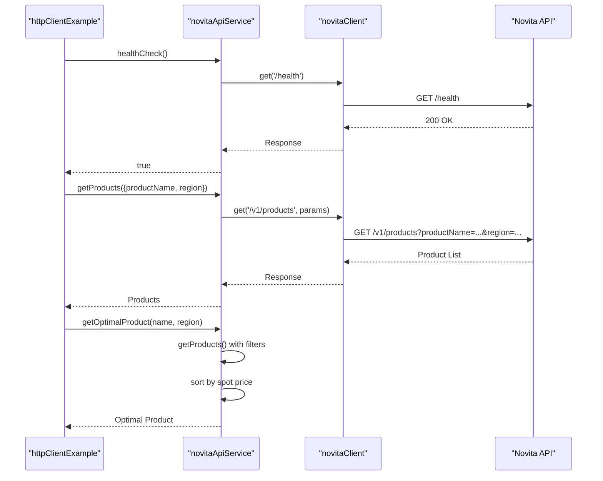

**Section sources**
- [httpClientExample.ts](file://src/examples/httpClientExample.ts#L1-L130)

### Job Queue Example Analysis
The `jobQueueExample.ts` demonstrates asynchronous workflow handling using the JobQueueService and JobWorkerService. It shows how to create different types of jobs (instance creation, webhook sending), manage job priorities, monitor job progress, and handle graceful shutdown. The example illustrates proper error handling and cleanup procedures for long-running processes.

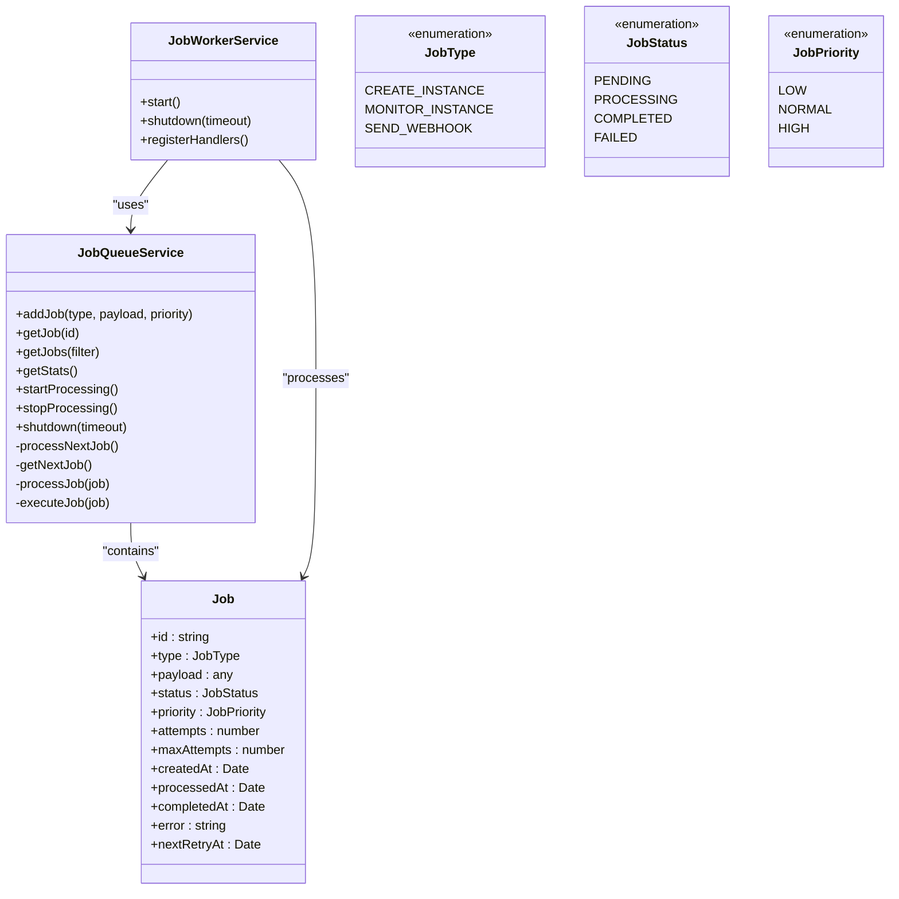

**Section sources**
- [jobQueueExample.ts](file://src/examples/jobQueueExample.ts#L1-L102)

### Product Service Example Analysis
The `productServiceExample.ts` demonstrates product catalog interactions with a focus on optimal pricing selection and caching strategies. It shows how to retrieve products with filters, find the optimal product based on spot price, demonstrate caching behavior, and manage cache statistics. The example emphasizes performance optimization through intelligent caching.

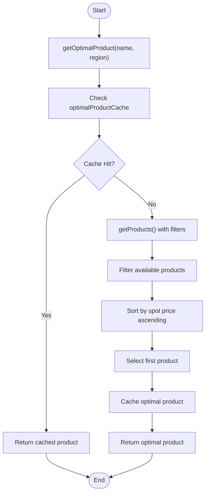

**Section sources**
- [productServiceExample.ts](file://src/examples/productServiceExample.ts#L1-L75)

### Template Service Example Analysis
The `templateServiceExample.ts` demonstrates configuration templating capabilities, showing how to fetch templates, extract configuration, demonstrate caching behavior, preload templates, and handle various error conditions. The example includes comprehensive error handling for invalid template IDs and non-existent templates.

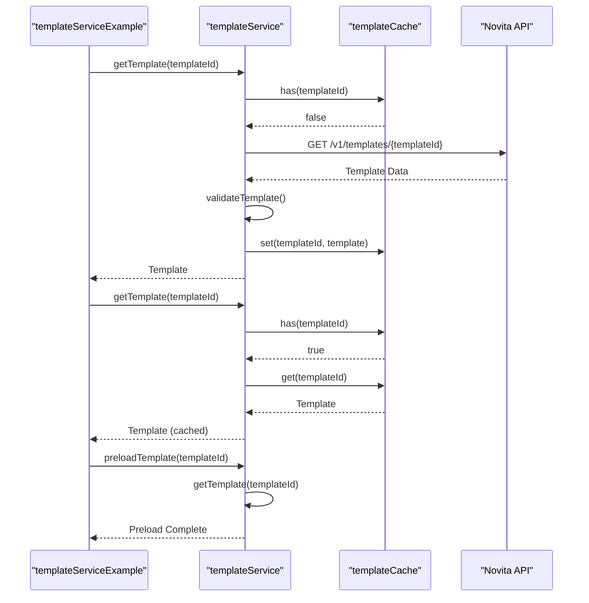

**Updated** The template service now uses 'key' instead of 'name' for environment variable field names in the template configuration.

**Section sources**
- [templateServiceExample.ts](file://src/examples/templateServiceExample.ts#L1-L148)
- [templateService.ts](file://src/services/templateService.ts#L172-L219) - *Updated in recent commit*

### Region Fallback Example Analysis
The `regionFallbackExample.ts` demonstrates the new multi-region fallback functionality for GPU product selection. This example shows how the system can automatically try different regions in priority order when searching for optimal products, with support for default configurations, preferred regions, and custom region priority lists.

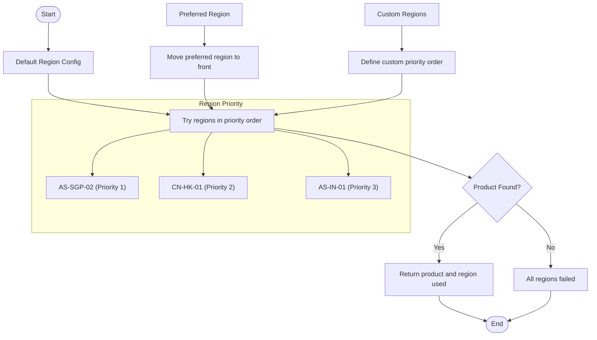

**Section sources**
- [regionFallbackExample.ts](file://src/examples/regionFallbackExample.ts#L1-L91)
- [productService.ts](file://src/services/productService.ts#L150-L250)

### Registry Authentication Example Analysis
The `registryAuthExample.ts` demonstrates the new registry authentication functionality that supports private Docker images. This example shows how the system handles Docker registry authentication when creating instances with private images, including credential management and secure handling.

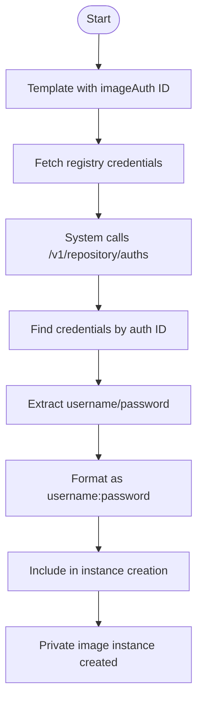

**Section sources**
- [registryAuthExample.ts](file://src/examples/registryAuthExample.ts#L1-L97)
- [novitaApiService.ts](file://src/services/novitaApiService.ts#L150-L200)

## Extending Examples with Advanced Features

### Adding Logging Capabilities
All examples can be enhanced with comprehensive logging by leveraging the existing logger utility. The `novitaClient` already includes request and response interceptors that log correlation IDs, method types, URLs, and parameters. Developers can extend this by adding custom log levels and structured logging for business logic.

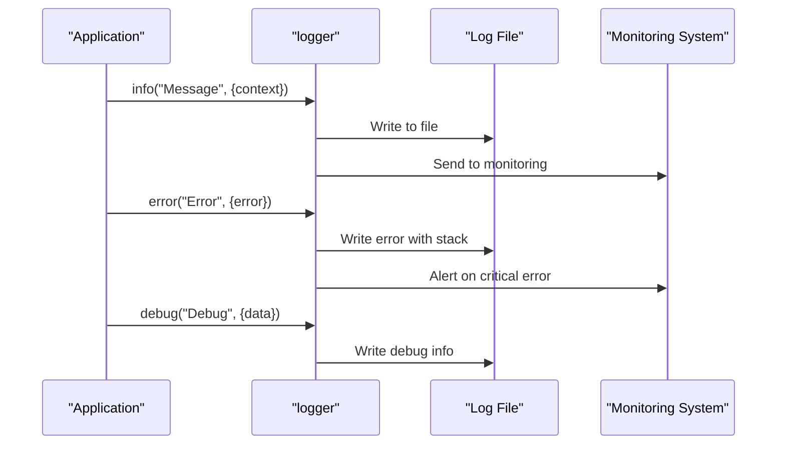

**Section sources**
- [novitaClient.ts](file://src/clients/novitaClient.ts#L116-L180)
- [logger.ts](file://src/utils/logger.ts#L1-L50)

### Implementing Monitoring and Metrics
The examples can be extended with monitoring capabilities using the metrics middleware and job metrics recording. The `recordJobMetrics` function captures job processing time, success/failure status, and queue size, enabling performance analysis and alerting.

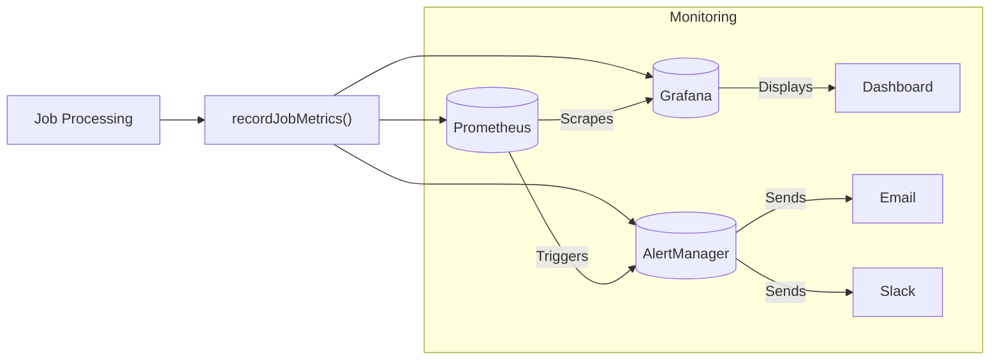

**Section sources**
- [metricsMiddleware.ts](file://src/middleware/metricsMiddleware.ts#L1-L30)
- [jobQueueService.ts](file://src/services/jobQueueService.ts#L250-L270)

### Enhancing Error Reporting
Error handling can be improved by implementing comprehensive error reporting that includes context information, correlation IDs, and structured error formats. The examples already demonstrate basic error handling, but can be extended with centralized error reporting services.

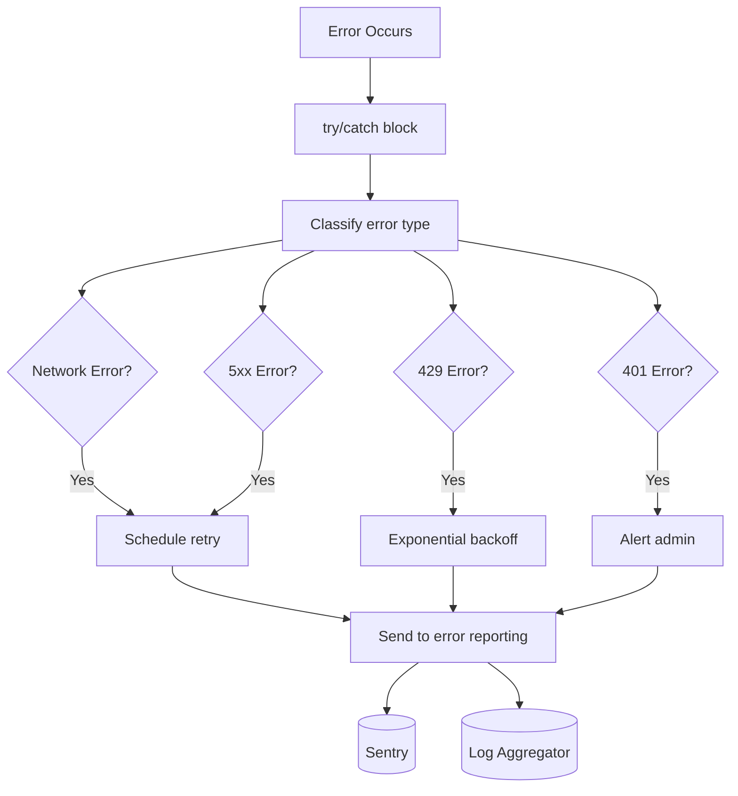

**Section sources**
- [novitaClient.ts](file://src/clients/novitaClient.ts#L200-L250)
- [errorHandler.ts](file://src/utils/errorHandler.ts#L1-L100)

## Cross-Language Integration Patterns

### Node.js Client Enhancement
The Node.js examples in `client-examples/nodejs` can be enhanced by incorporating patterns from the TypeScript examples, such as circuit breaker implementation, rate limiting, and structured logging. The core functionality from `novitaClient.ts` can be adapted to pure JavaScript clients.

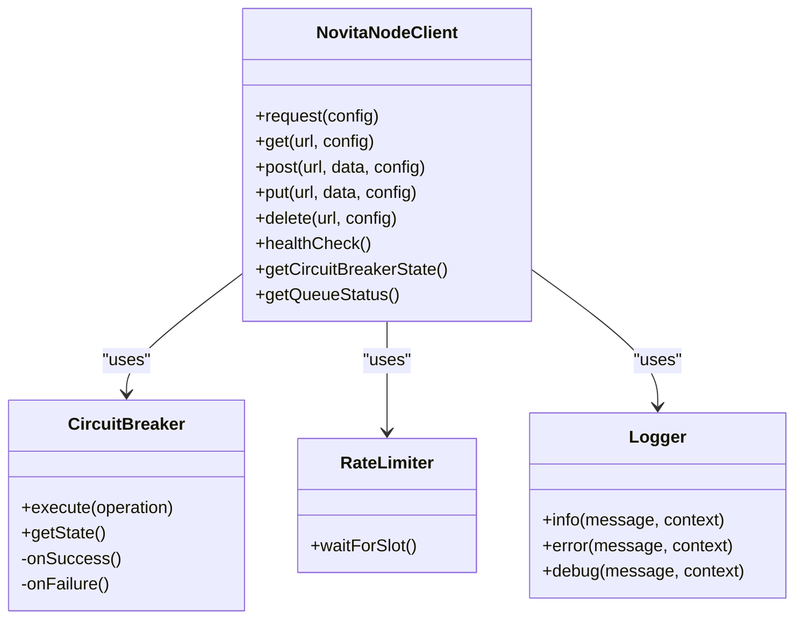

**Section sources**
- [client-examples/README.md](file://client-examples/README.md#L1-L253)
- [novitaClient.ts](file://src/clients/novitaClient.ts#L1-L384)

### Python Client Enhancement
The Python examples can be enhanced with similar patterns, implementing circuit breakers, rate limiters, and structured logging. The Python client can leverage libraries like `tenacity` for retry logic and `logging` for structured output.

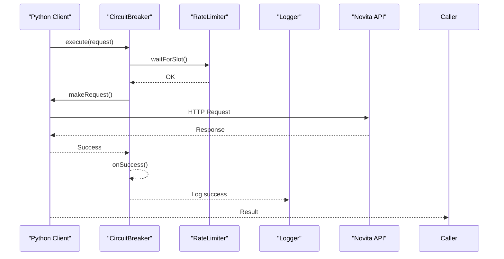

**Section sources**
- [client-examples/README.md](file://client-examples/README.md#L1-L253)
- [novitaClient.ts](file://src/clients/novitaClient.ts#L1-L384)

## Troubleshooting Common Issues

### Incorrect Payload Formats
When dealing with incorrect payload formats, ensure that all required fields are present and properly formatted. The API expects specific data types and structures for different endpoints.

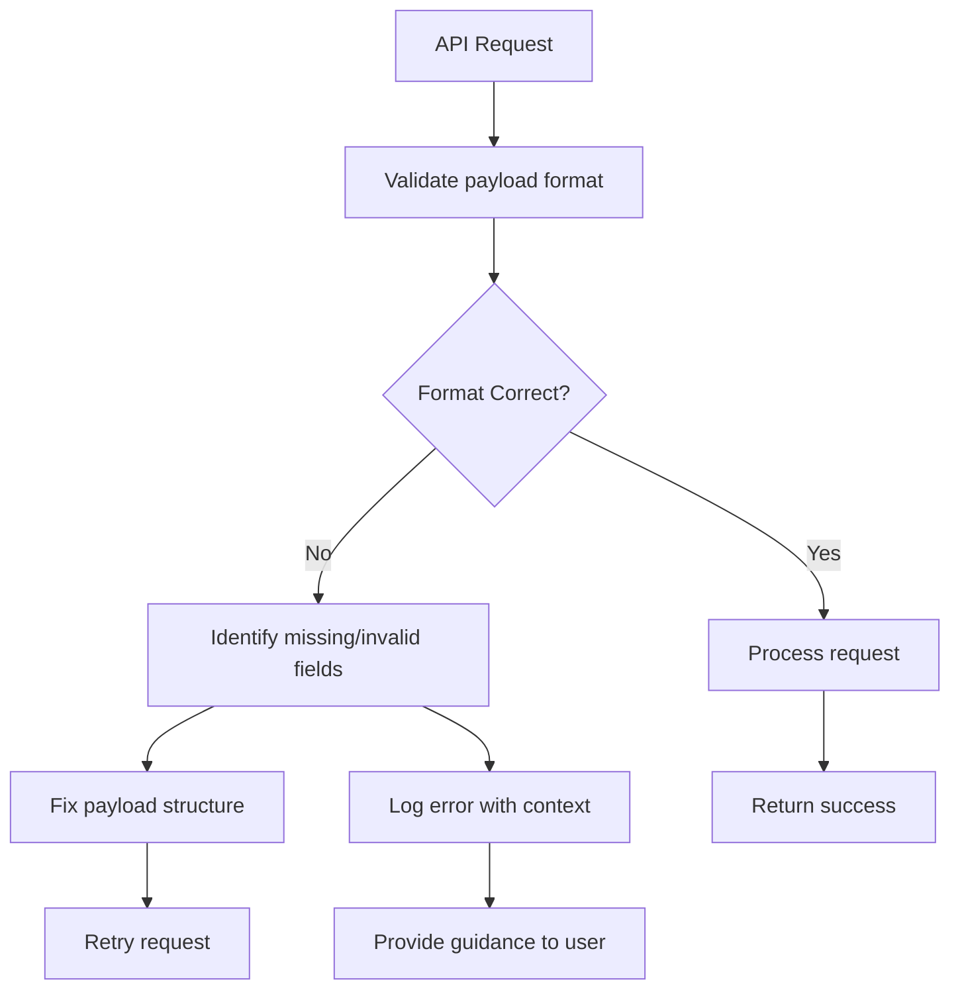

**Section sources**
- [client-examples/README.md](file://client-examples/README.md#L152-L170)
- [novitaClient.ts](file://src/clients/novitaClient.ts#L200-L250)

### Authentication Failures
Authentication failures typically occur due to incorrect API keys or missing authorization headers. Ensure the API key is correctly configured in environment variables without quotes or extra spaces.

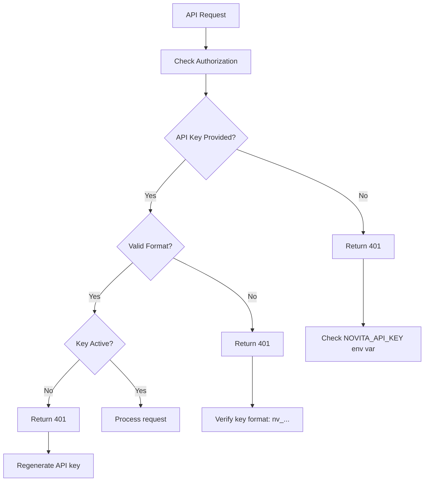

**Section sources**
- [docs/TROUBLESHOOTING.md](file://docs/TROUBLESHOOTING.md#L161-L194)
- [novitaClient.ts](file://src/clients/novitaClient.ts#L116-L130)

### Unexpected Response Handling
When receiving unexpected responses, implement proper error handling with retry logic for transient failures and appropriate fallbacks for permanent errors.

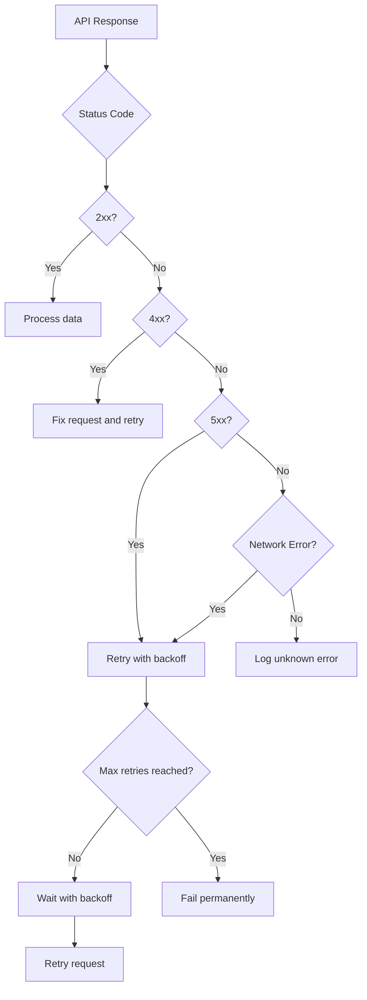

**Section sources**
- [client-examples/README.md](file://client-examples/README.md#L152-L170)
- [novitaClient.ts](file://src/clients/novitaClient.ts#L200-L250)

## Testing Client Integrations

### Mock Server Testing
Testing client integrations with mock servers allows for reliable testing without depending on external services. The examples can be tested using mock implementations of the API services.

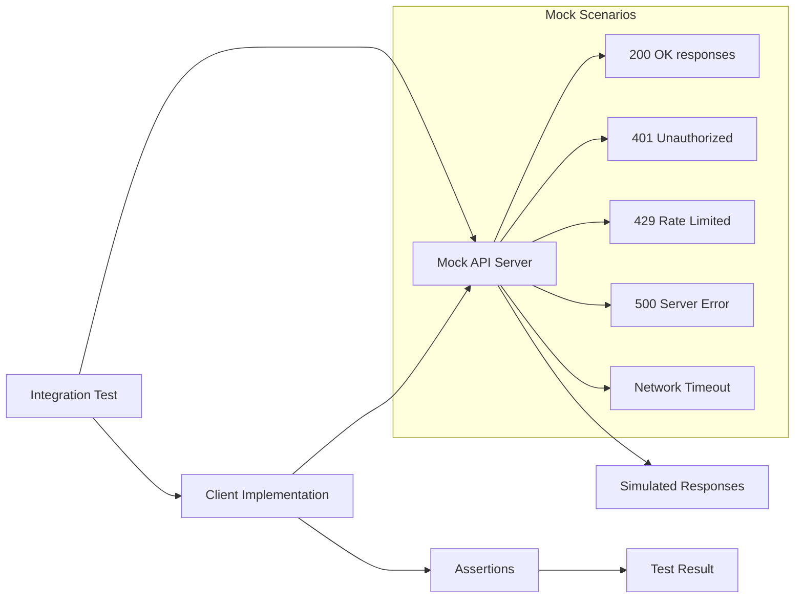

**Section sources**
- [client-examples/README.md](file://client-examples/README.md#L232-L250)
- [novitaClient.ts](file://src/clients/novitaClient.ts#L1-L384)

### Snapshot Testing
Snapshot testing ensures that API responses and client behavior remain consistent over time. This approach captures the output of API calls and compares it against known good snapshots.

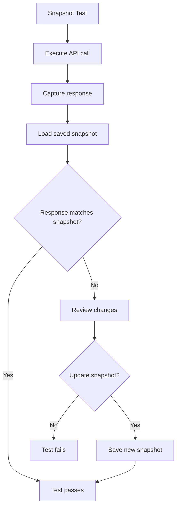

**Section sources**
- [client-examples/README.md](file://client-examples/README.md#L232-L250)
- [__tests__](file://src/__tests__#L1-L50)

## Conclusion
The client examples provided in the repository serve as comprehensive templates for building real-world integrations with the Novita GPU Instance API. By understanding and leveraging these examples, developers can create robust, maintainable integrations that follow best practices for error handling, performance optimization, and code organization.

The examples demonstrate key patterns including basic request handling, asynchronous workflow management, product catalog interactions, and configuration templating. These patterns can be extended with advanced features like comprehensive logging, monitoring, and error reporting to create production-ready integrations.

When adapting these examples, focus on code reusability and separation of concerns by encapsulating common functionality in services and utilities. Follow the documented best practices for configuration management, error handling, resource management, security, and performance to ensure reliable and secure integrations.

For troubleshooting, refer to the specific guidance provided for common issues such as payload format errors, authentication failures, and unexpected responses. Utilize the testing strategies outlined, including mock server testing and snapshot testing, to ensure the reliability and stability of your client integrations.