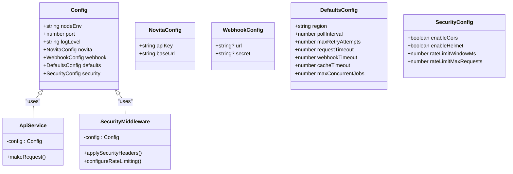

# Configuration Guide

<cite>
**Referenced Files in This Document**   
- [config.ts](file://src/config/config.ts) - *Updated in recent commit*
- [docker-compose.yml](file://docker-compose.yml)
- [docker-compose.override.yml](file://docker-compose.override.yml)
- [docker-compose.prod.yml](file://docker-compose.prod.yml)
- [README.md](file://src/config/README.md)
- [templateService.ts](file://src/services/templateService.ts) - *Updated in commit e324432*
- [registryAuthExample.ts](file://src/examples/registryAuthExample.ts) - *Added in commit 90d221d*
- [templateServiceExample.ts](file://src/examples/templateServiceExample.ts) - *Updated in commit e324432*
</cite>

## Update Summary
**Changes Made**   
- Updated environment variable naming convention from 'name' to 'key' in template service examples and validation
- Added new section on registry authentication configuration and workflow
- Updated code examples to reflect the new 'key' property for environment variables
- Added documentation for new registry authentication feature
- Updated section sources to reflect modified and new files

## Table of Contents
1. [Configuration System Overview](#configuration-system-overview)
2. [Configuration-as-Code with TypeScript and Joi](#configuration-as-code-with-typescript-and-joi)
3. [Environment Variables Reference](#environment-variables-reference)
4. [Configuration Hierarchy and Merging Strategy](#configuration-hierarchy-and-merging-strategy)
5. [Configuration Injection into Services and Middleware](#configuration-injection-into-services-and-middleware)
6. [Environment-Specific Configuration with Docker Compose](#environment-specific-configuration-with-docker-compose)
7. [Startup Validation and Failure Modes](#startup-validation-and-failure-modes)
8. [Extending the Configuration System](#extending-the-configuration-system)
9. [Troubleshooting Common Configuration Issues](#troubleshooting-common-configuration-issues)
10. [Registry Authentication Configuration](#registry-authentication-configuration)

## Configuration System Overview

The Novitai application implements a robust configuration management system designed for reliability, security, and ease of use across different deployment environments. The system follows a configuration-as-code approach using TypeScript with Joi validation to ensure runtime safety and type correctness. Configuration values are loaded from environment variables with support for `.env` files, validated against a strict schema, and made available throughout the application via a singleton pattern.

The configuration system enforces fail-fast behavior, meaning the application will terminate immediately if invalid configuration is detected during startup. This prevents running with potentially dangerous or incorrect settings. Sensitive data such as API keys and secrets are handled securely and excluded from logging outputs to prevent accidental exposure.

**Section sources**
- [config.ts](file://src/config/config.ts#L0-L61)
- [README.md](file://src/config/README.md#L0-L52)

## Configuration-as-Code with TypeScript and Joi

The Novitai configuration system leverages TypeScript's type system combined with Joi validation to provide compile-time type safety and runtime validation. The core configuration is defined by the `Config` interface, which specifies the exact structure and types of all configuration values. This interface ensures that any code accessing configuration properties benefits from TypeScript's IntelliSense and compile-time type checking.

Joi validation is implemented through the `getValidationSchema()` method, which defines a comprehensive schema for all environment variables. Each variable has specific validation rules including required/optional status, data types, value ranges, and default values. For example, the `NOVITA_API_KEY` is required and must be at least 10 characters long, while the `PORT` must be a valid port number between 1 and 65535.

The validation process occurs in the `validateAndTransform()` method, which uses Joi's validation with `abortEarly: false` to collect all validation errors rather than stopping at the first one. This provides comprehensive feedback when configuration issues exist. The `stripUnknown: true` option removes any environment variables not defined in the schema, preventing accidental use of undefined configuration options.


**Diagram sources**
- [config.ts](file://src/config/config.ts#L152-L303)

**Section sources**
- [config.ts](file://src/config/config.ts#L0-L390)
- [README.md](file://src/config/README.md#L0-L349)

## Environment Variables Reference

The following table provides a complete reference of all configurable parameters in the Novitai application, including their default values, allowed formats, and security considerations.

| Parameter | Environment Variable | Default Value | Required | Allowed Values/Format | Security Considerations |
|---------|---------------------|--------------|----------|----------------------|------------------------|
| Application Environment | `NODE_ENV` | `development` | No | `development`, `production`, `test` | Not sensitive, can be logged |
| Server Port | `PORT` | `3000` | No | Integer 1-65535 | Not sensitive, can be logged |
| Logging Level | `LOG_LEVEL` | `info` | No | `error`, `warn`, `info`, `debug` | Not sensitive, can be logged |
| Novita API Key | `NOVITA_API_KEY` | None | Yes | String, minimum 10 characters | **Sensitive** - Never log, mask in outputs |
| API Base URL | `NOVITA_API_BASE_URL` | `https://api.novita.ai` | No | Valid HTTP/HTTPS URL | Not sensitive, can be logged |
| Webhook URL | `WEBHOOK_URL` | None | No | Valid HTTP/HTTPS URL | Not sensitive, can be logged |
| Webhook Secret | `WEBHOOK_SECRET` | None | No | String, minimum 8 characters | **Sensitive** - Never log, mask in outputs |
| Default Region | `DEFAULT_REGION` | `CN-HK-01` | No | Any string | Not sensitive, can be logged |
| Poll Interval | `INSTANCE_POLL_INTERVAL` | `30` | No | Integer 10-300 seconds | Not sensitive, can be logged |
| Max Retry Attempts | `MAX_RETRY_ATTEMPTS` | `3` | No | Integer 1-10 | Not sensitive, can be logged |
| Request Timeout | `REQUEST_TIMEOUT` | `30000` | No | Integer 5000-120000 ms | Not sensitive, can be logged |
| Webhook Timeout | `WEBHOOK_TIMEOUT` | `10000` | No | Integer 1000-30000 ms | Not sensitive, can be logged |
| Cache Timeout | `CACHE_TIMEOUT` | `300` | No | Integer 60-3600 seconds | Not sensitive, can be logged |
| Max Concurrent Jobs | `MAX_CONCURRENT_JOBS` | `10` | No | Integer 1-100 | Not sensitive, can be logged |
| Enable CORS | `ENABLE_CORS` | `true` | No | `true`, `false` | Not sensitive, can be logged |
| Enable Helmet | `ENABLE_HELMET` | `true` | No | `true`, `false` | Not sensitive, can be logged |
| Rate Limit Window | `RATE_LIMIT_WINDOW_MS` | `900000` | No | Integer 60000-3600000 ms | Not sensitive, can be logged |
| Rate Limit Max Requests | `RATE_LIMIT_MAX_REQUESTS` | `100` | No | Integer 10-1000 | Not sensitive, can be logged |

**Section sources**
- [config.ts](file://src/config/config.ts#L152-L303)
- [README.md](file://src/config/README.md#L54-L349)

## Configuration Hierarchy and Merging Strategy

The Novitai configuration system implements a hierarchical approach to configuration loading with a well-defined merging strategy across different environments. The system follows the principle of "specific overrides general," where more specific configuration sources take precedence over more general ones.

Configuration loading follows this priority order:
1. Process environment variables (highest priority)
2. Environment-specific `.env` file (e.g., `.env.production`)
3. Default `.env.local` file
4. Base `.env` file
5. Schema-defined default values (lowest priority)

The `ConfigLoader` class implements this hierarchy in the `loadConfig()` method, which first attempts to load from a specified path, then falls back to default locations (`.env` and `.env.local`). When multiple `.env` files are present, they are not merged automatically—only the first found file is loaded, preventing unexpected configuration interactions.

Environment-specific behavior is controlled primarily through the `NODE_ENV` variable, which influences both the default values applied and the application's runtime behavior. For example, in `production` mode, the application uses stricter resource limits and more conservative logging, while `development` mode enables debug logging and more permissive settings.

The configuration system also supports Docker environment variable substitution, as seen in the `docker-compose.yml` file where variables like `${PORT:-3000}` provide default values if the environment variable is not set. This allows for flexible deployment configurations while maintaining sensible defaults.

**Section sources**
- [config.ts](file://src/config/config.ts#L63-L115)
- [docker-compose.yml](file://docker-compose.yml#L0-L103)
- [docker-compose.override.yml](file://docker-compose.override.yml#L0-L30)

## Configuration Injection into Services and Middleware

Configuration values are injected into services and middleware through the singleton `config` object that is automatically loaded when the module is imported. This approach ensures consistent configuration access throughout the application without requiring dependency injection containers or service locators.

Services access configuration through the `getConfig()` function or the exported `config` constant. For example, the Novita client would use `config.novita.apiKey` to authenticate API requests, while the instance service would use `config.defaults.pollInterval` to determine how frequently to check instance status.

Middleware components leverage configuration to control their behavior. The security middleware uses `config.security.enableCors` and `config.security.enableHelmet` to determine whether to apply CORS and Helmet protections. The rate limiting middleware uses `config.security.rateLimitWindowMs` and `config.security.rateLimitMaxRequests` to configure its throttling parameters.

The configuration system also provides a `getConfigSummary()` function that returns a sanitized version of the configuration for logging purposes. This summary excludes sensitive data like API keys and secrets while including indicators of their presence, allowing operators to verify configuration without risking security.



**Diagram sources**
- [config.ts](file://src/config/config.ts#L0-L61)
- [config.ts](file://src/config/config.ts#L117-L150)

**Section sources**
- [config.ts](file://src/config/config.ts#L302-L354)
- [README.md](file://src/config/README.md#L0-L349)

## Environment-Specific Configuration with Docker Compose

The Novitai application uses Docker Compose with override files to manage environment-specific configurations. This approach allows for consistent deployment patterns while accommodating the different requirements of development, staging, and production environments.

The base `docker-compose.yml` file contains the common configuration shared across all environments, including the required `NOVITA_API_KEY` and default values for optional settings. This file also defines the container's resource limits, health checks, and security settings.

The `docker-compose.override.yml` file provides development-specific overrides, such as:
- Setting `NODE_ENV=development` and `LOG_LEVEL=debug`
- Disabling read-only filesystem and security restrictions for easier debugging
- Using local volume mounts for logs
- More generous resource limits for development workstations
- Faster restart policies for development iteration

The `docker-compose.prod.yml` file contains production-specific configurations:
- Using pre-built images with version tags
- Stricter resource limits to optimize costs
- More aggressive health checks with shorter intervals
- Production-grade logging configuration
- Deployment strategies with rollback capabilities
- Named volumes mounted to system log directories

This three-file pattern (base + override + prod) enables developers to work locally with minimal setup while ensuring production deployments follow strict security and performance standards. The override mechanism ensures that production settings take precedence over development defaults when deploying with the `-f docker-compose.yml -f docker-compose.prod.yml` flags.

**Section sources**
- [docker-compose.yml](file://docker-compose.yml#L0-L103)
- [docker-compose.override.yml](file://docker-compose.override.yml#L0-L30)
- [docker-compose.prod.yml](file://docker-compose.prod.yml#L0-L66)

## Startup Validation and Failure Modes

The Novitai configuration system implements a fail-fast validation strategy that prevents the application from starting with invalid configuration. During startup, the `loadConfig()` function validates all environment variables against the Joi schema and immediately terminates the process if validation fails—except in test environments where errors are thrown for test handling.

When validation fails, the system provides detailed error messages that list all validation issues, making it easy to identify and fix configuration problems. The error output includes:
- A clear "Configuration validation failed" header with a visual indicator (❌)
- Individual error messages for each invalid or missing field
- Helpful guidance on how to resolve the issues
- Process termination with exit code 1 to prevent deployment of misconfigured instances

The validation process checks multiple aspects of configuration:
- **Required fields**: Ensures mandatory variables like `NOVITA_API_KEY` are present
- **Data types**: Validates that values match expected types (numbers, booleans, etc.)
- **Value ranges**: Enforces minimum and maximum values for numeric settings
- **Format requirements**: Validates URL formats, string lengths, and other constraints
- **Enum values**: Ensures variables use only allowed values (e.g., `LOG_LEVEL`)

In test environments, the system allows invalid configurations to facilitate testing of error conditions, but in development and production, the fail-fast approach ensures configuration reliability.


**Diagram sources**
- [config.ts](file://src/config/config.ts#L302-L354)
- [config.ts](file://src/config/config.ts#L117-L150)

**Section sources**
- [config.ts](file://src/config/config.ts#L302-L354)
- [README.md](file://src/config/README.md#L0-L349)

## Extending the Configuration System

To extend the Novitai configuration system with custom parameters, follow the established pattern in `config.ts`. First, add the new parameter to the `Config` interface with appropriate typing:

```typescript
export interface Config {
  // existing properties...
  readonly custom: {
    readonly featureFlag: boolean;
    readonly timeout: number;
  };
}
```

Next, add the corresponding environment variable to the Joi validation schema in `getValidationSchema()`:

```typescript
CUSTOM_FEATURE_FLAG: Joi.boolean()
  .default(false)
  .description('Enable custom feature'),
  
CUSTOM_TIMEOUT: Joi.number()
  .integer()
  .min(1000)
  .max(60000)
  .default(5000)
  .description('Custom operation timeout in milliseconds'),
```

Finally, map the environment variable to the configuration object in `validateAndTransform()`:

```typescript
return {
  // existing mappings...
  custom: {
    featureFlag: envVars.CUSTOM_FEATURE_FLAG,
    timeout: envVars.CUSTOM_TIMEOUT,
  },
};
```

When adding new parameters, consider the following best practices:
- Use consistent naming conventions (UPPER_CASE with underscores)
- Provide sensible default values that are safe for production
- Implement appropriate validation rules based on the parameter type
- Document the parameter in the README and configuration tables
- Consider security implications—mark sensitive data as optional and validate appropriately
- Test the new configuration in all environments (development, test, production)

The system's modular design makes it easy to extend while maintaining the integrity of the validation and type safety features.

**Section sources**
- [config.ts](file://src/config/config.ts#L0-L390)
- [README.md](file://src/config/README.md#L0-L349)

## Troubleshooting Common Configuration Issues

When encountering configuration issues with the Novitai application, follow this systematic troubleshooting approach:

### Missing Required Variables
**Symptom**: Application fails to start with "is required" error
**Solution**: Ensure all required variables (especially `NOVITA_API_KEY`) are set in your environment or `.env` file. Use the required variables table as a checklist.

### Type Mismatches
**Symptom**: Validation errors indicating "must be a number" or similar type issues
**Solution**: Verify that numeric variables are not quoted in your `.env` file. Environment variables are strings by default, but the validation system expects unquoted numbers for numeric fields.

### Environment Conflicts
**Symptom**: Application behaves differently than expected despite correct configuration
**Solution**: Check for environment variable conflicts. Use `console.log(process.env)` temporarily to verify which values are actually being loaded. Remember that process environment variables take precedence over `.env` files.

### Docker-Specific Issues
**Symptom**: Configuration works locally but fails in Docker
**Solution**: Ensure environment variables are properly exposed in your Docker Compose files. Check that variable names match exactly (case-sensitive). Verify that required variables marked with `:?` in Docker Compose are actually provided.

### Debugging Steps
1. Enable debug logging with `LOG_LEVEL=debug`
2. Use `validateEnvironment()` to check configuration before loading
3. Examine the configuration summary output at startup
4. Verify `.env` file loading by checking file paths and permissions
5. Test with minimal configuration to isolate issues

The configuration system's comprehensive error messages and validation feedback make most issues straightforward to diagnose and resolve.

**Section sources**
- [config.ts](file://src/config/config.ts#L302-L354)
- [README.md](file://src/config/README.md#L0-L349)

## Registry Authentication Configuration

The Novitai application now supports registry authentication for private Docker images through a secure credential management system. This feature allows users to create instances from private repositories without exposing credentials in templates or configuration files.

### Configuration Workflow

The registry authentication system follows a four-step workflow:

1. **Template Configuration**: Templates specify a registry authentication ID in the `imageAuth` field instead of storing credentials directly.
2. **Credential Resolution**: The system fetches all available registry credentials from the Novita.ai API endpoint `/v1/repository/auths`.
3. **Authentication Mapping**: The system matches the template's `imageAuth` ID with the corresponding credentials from the API response.
4. **Instance Creation**: The resolved credentials are formatted as `username:password` and included in the instance creation request.

### Environment Variable Configuration

No additional environment variables are required for registry authentication, as credentials are managed through the Novita.ai API. However, the following configuration parameters affect the authentication process:

- `NOVITA_API_KEY`: Required for accessing the registry authentication API
- `REQUEST_TIMEOUT`: Controls the timeout for fetching registry credentials (default: 30000ms)
- `LOG_LEVEL`: Set to `debug` to see detailed authentication workflow logs

### Code Implementation

The `TemplateService` validates that environment variables use the `key` property instead of `name`:

```typescript
if (!env.key || typeof env.key !== 'string' || env.key.trim() === '') {
  throw new NovitaApiClientError(
    `Template env at index ${index} has invalid name`,
    500,
    'INVALID_TEMPLATE_ENV_NAME'
  );
}
```

The `NovitaApiService` handles credential fetching:

```typescript
async getRegistryAuth(authId: string): Promise<{ username: string; password: string }> {
  const response = await novitaClient.get<RegistryAuthsResponse>('/v1/repository/auths');
  
  const authEntry = response.data.data.find(auth => auth.id === authId);
  
  if (!authEntry) {
    throw new NovitaApiClientError(
      `Registry authentication not found for ID: ${authId}`,
      404,
      'REGISTRY_AUTH_NOT_FOUND'
    );
  }
  
  return {
    username: authEntry.username,
    password: authEntry.password
  };
}
```

### Security Considerations

- Credentials are never stored in templates or configuration files
- Authentication IDs are used as references to securely stored credentials
- Passwords are masked in all logs and outputs
- The system uses HTTPS for all credential-related API calls
- Failed authentication attempts are logged without revealing credential details

### Example Usage

```typescript
// Template with registry authentication
const templateWithAuth = {
  id: 'custom-template',
  name: 'Private PyTorch Environment',
  imageUrl: 'registry.company.com/ai/pytorch:latest',
  imageAuth: 'registry_auth_123', // References stored credentials
  envs: [
    { key: 'JUPYTER_TOKEN', value: 'secure_token' } // Using 'key' instead of 'name'
  ]
};
```

**Section sources**
- [templateService.ts](file://src/services/templateService.ts#L183-L188)
- [novitaApiService.ts](file://src/services/novitaApiService.ts#L178-L222)
- [registryAuthExample.ts](file://src/examples/registryAuthExample.ts#L0-L97)
- [templateServiceExample.ts](file://src/examples/templateServiceExample.ts#L34)
- [api.ts](file://src/types/api.ts#L267-L344)