# Data Models & Type Definitions

<cite>
**Referenced Files in This Document**   
- [api.ts](file://src/types/api.ts)
- [validation.ts](file://src/types/validation.ts)
- [job.ts](file://src/types/job.ts)
- [instanceService.ts](file://src/services/instanceService.ts)
- [jobQueueService.ts](file://src/services/jobQueueService.ts)
- [instances.ts](file://src/routes/instances.ts)
</cite>

## Table of Contents
1. [Introduction](#introduction)
2. [Core Data Models](#core-data-models)
3. [Validation Schema](#validation-schema)
4. [Job Queue System](#job-queue-system)
5. [Health Check Response](#health-check-response)
6. [Validation Implementation](#validation-implementation)
7. [Type Relationships](#type-relationships)
8. [Example Data Instances](#example-data-instances)
9. [Runtime Validation & API Contracts](#runtime-validation--api-contracts)
10. [Versioning Strategy](#versioning-strategy)
11. [Conclusion](#conclusion)

## Introduction
This document provides comprehensive documentation for the core data models in the novitai application. It details the primary TypeScript interfaces used throughout the system, including InstanceDetails, CreateInstanceRequest, Job, and HealthCheckResponse. The documentation covers validation rules implemented using Joi, type relationships, example data instances, and how these models are used for both runtime validation and API contract documentation. The document also addresses the versioning strategy and backward compatibility considerations for evolving these schemas.

## Core Data Models

### InstanceDetails Interface
The InstanceDetails interface represents the complete state and configuration of a GPU instance in the novitai system. It contains comprehensive information about an instance's identity, status, configuration, and connection details.

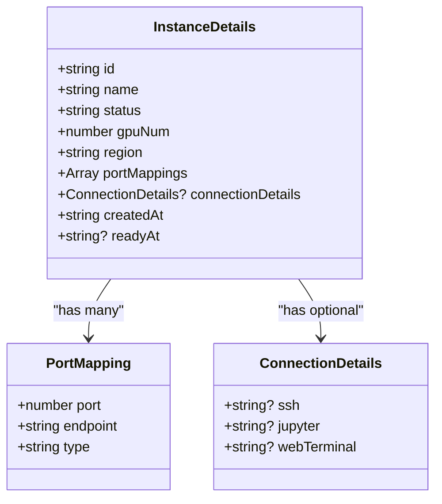

**Diagram sources**
- [api.ts](file://src/types/api.ts#L26-L44)

**Section sources**
- [api.ts](file://src/types/api.ts#L26-L44)
- [instanceService.ts](file://src/services/instanceService.ts#L300-L350)

### CreateInstanceRequest Interface
The CreateInstanceRequest interface defines the structure of the request payload for creating a new GPU instance. It includes both required and optional fields that specify the desired configuration for the new instance.

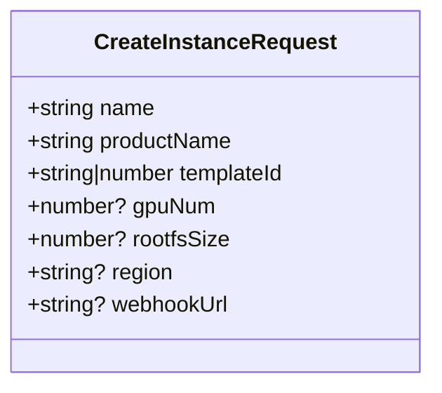

**Diagram sources**
- [api.ts](file://src/types/api.ts#L9-L17)

**Section sources**
- [api.ts](file://src/types/api.ts#L9-L17)
- [instances.ts](file://src/routes/instances.ts#L15-L35)

## Validation Schema

### CreateInstanceRequest Validation Rules
The validation schema for CreateInstanceRequest enforces strict constraints on each field to ensure data integrity and system stability. The schema is implemented using Joi and includes custom error messages for improved user experience.

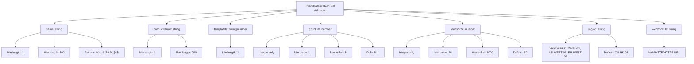

**Diagram sources**
- [validation.ts](file://src/types/validation.ts#L5-L68)

**Section sources**
- [validation.ts](file://src/types/validation.ts#L5-L68)
- [instances.ts](file://src/routes/instances.ts#L20-L30)

## Job Queue System

### Job Interface
The Job interface represents a unit of work in the asynchronous job queue system. Each job contains metadata about its type, status, execution attempts, and timing information.

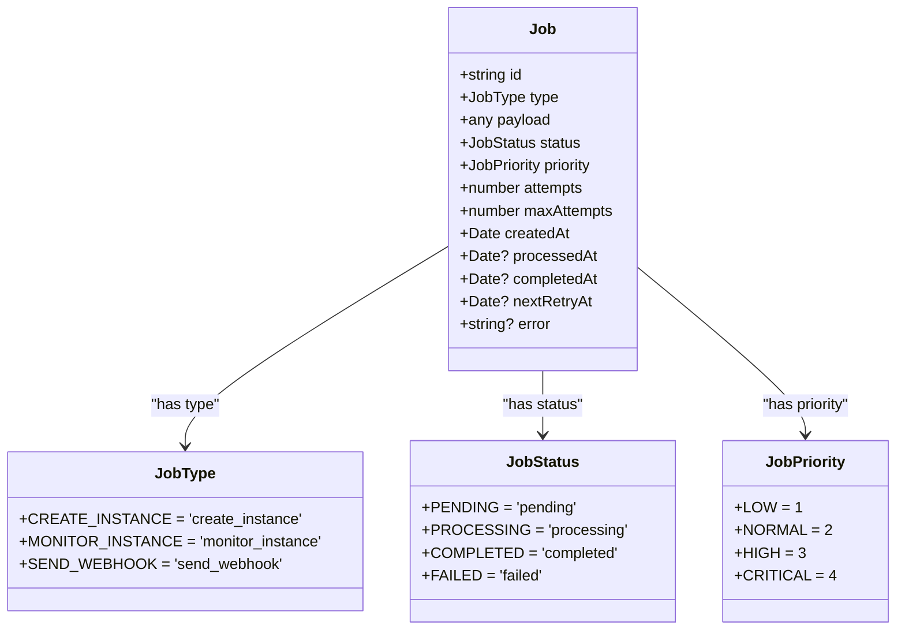

**Diagram sources**
- [job.ts](file://src/types/job.ts#L24-L37)
- [job.ts](file://src/types/job.ts#L2-L22)

**Section sources**
- [job.ts](file://src/types/job.ts#L24-L37)
- [jobQueueService.ts](file://src/services/jobQueueService.ts#L50-L100)

### Job Payload Types
The system defines specific payload interfaces for different job types, ensuring type safety and proper data structure for each job category.

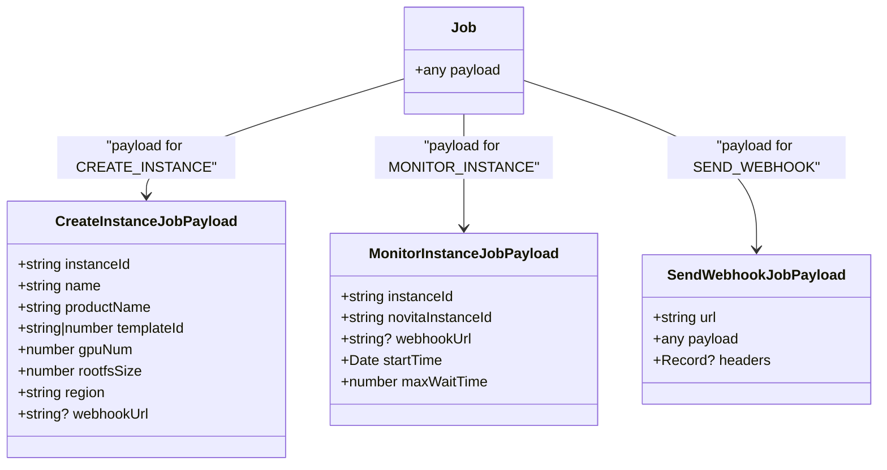

**Diagram sources**
- [job.ts](file://src/types/job.ts#L40-L70)

**Section sources**
- [job.ts](file://src/types/job.ts#L40-L70)
- [jobQueueService.ts](file://src/services/jobQueueService.ts#L200-L250)

## Health Check Response

### HealthCheckResponse Structure
The HealthCheckResponse interface provides a standardized format for system health status, including service availability, timestamp, and uptime information.

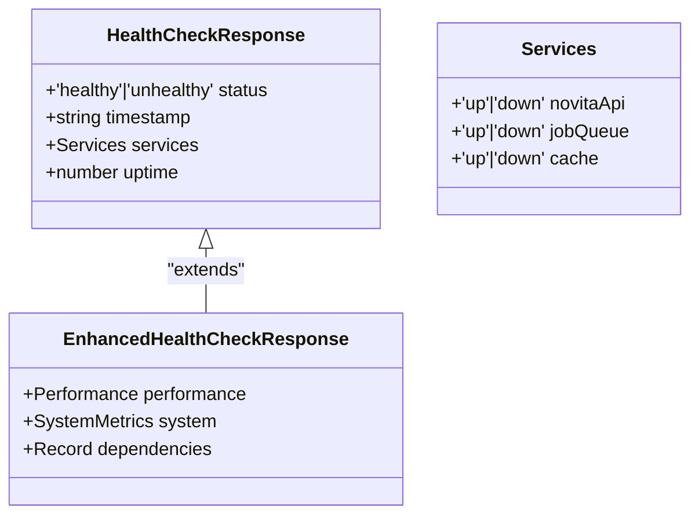

**Diagram sources**
- [api.ts](file://src/types/api.ts#L51-L60)
- [api.ts](file://src/types/api.ts#L63-L80)

**Section sources**
- [api.ts](file://src/types/api.ts#L51-L80)
- [routes/health.ts](file://src/routes/health.ts#L10-L50)

## Validation Implementation

### Validation Functions
The validation system provides utility functions that wrap Joi validation with custom error handling and structured error responses.

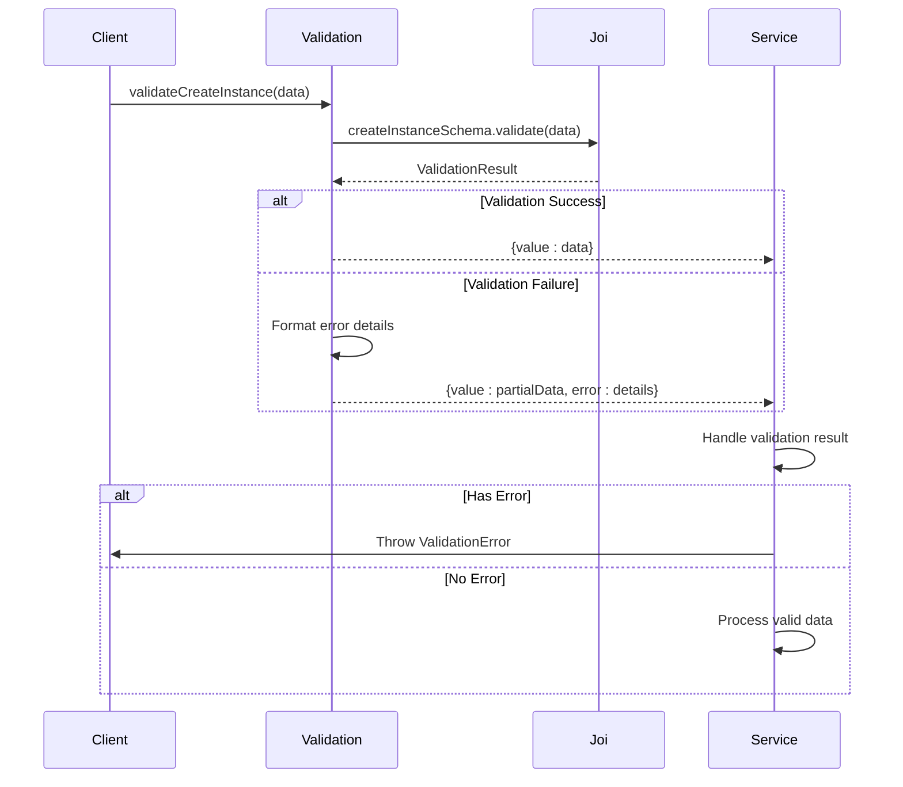

**Diagram sources**
- [validation.ts](file://src/types/validation.ts#L159-L224)
- [instances.ts](file://src/routes/instances.ts#L20-L30)

**Section sources**
- [validation.ts](file://src/types/validation.ts#L159-L224)
- [instances.ts](file://src/routes/instances.ts#L20-L30)

### Custom Validators and Error Messages
The system implements custom validators with user-friendly error messages to improve the developer experience and provide clear feedback on validation failures.

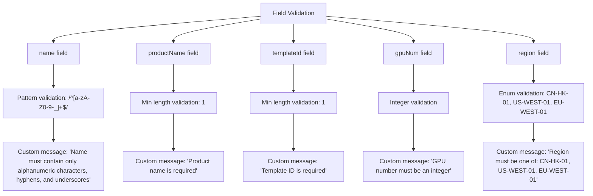

**Diagram sources**
- [validation.ts](file://src/types/validation.ts#L5-L68)

**Section sources**
- [validation.ts](file://src/types/validation.ts#L5-L68)
- [utils/errorHandler.ts](file://src/utils/errorHandler.ts#L48-L103)

## Type Relationships

### Inheritance and Composition
The data model system uses both inheritance and composition to create a flexible and maintainable type structure.

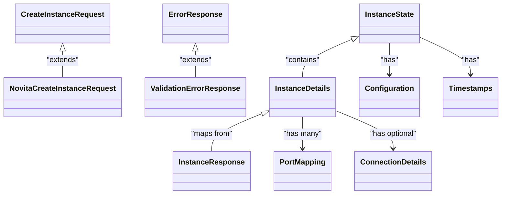

**Diagram sources**
- [api.ts](file://src/types/api.ts#L26-L44)
- [api.ts](file://src/types/api.ts#L200-L220)
- [api.ts](file://src/types/api.ts#L250-L270)

**Section sources**
- [api.ts](file://src/types/api.ts#L26-L270)
- [instanceService.ts](file://src/services/instanceService.ts#L300-L350)

## Example Data Instances

### Valid Instance Creation Request
```json
{
  "name": "my-gpu-instance",
  "productName": "A100-SXM4-40GB",
  "templateId": "tf-training-template-1",
  "gpuNum": 2,
  "rootfsSize": 100,
  "region": "US-WEST-01",
  "webhookUrl": "https://myapp.com/webhook"
}
```

### Invalid Instance Creation Request (Multiple Errors)
```json
{
  "name": "invalid name!",  // Invalid characters
  "productName": "",       // Empty string
  "templateId": "",        // Empty string
  "gpuNum": 10,           // Exceeds maximum
  "rootfsSize": 5,         // Below minimum
  "region": "INVALID-REGION", // Not in enum
  "webhookUrl": "not-a-url" // Invalid URL format
}
```

### Valid Instance Details Response
```json
{
  "id": "inst_12345_abcde",
  "name": "my-gpu-instance",
  "status": "running",
  "gpuNum": 2,
  "region": "US-WEST-01",
  "portMappings": [
    {
      "port": 22,
      "endpoint": "ssh://gpu-instance-123.novitai.com:22",
      "type": "tcp"
    },
    {
      "port": 8888,
      "endpoint": "https://jupyter.gpu-instance-123.novitai.com",
      "type": "https"
    }
  ],
  "connectionDetails": {
    "ssh": "ssh://gpu-instance-123.novitai.com:22",
    "jupyter": "https://jupyter.gpu-instance-123.novitai.com"
  },
  "createdAt": "2023-12-01T10:00:00.000Z",
  "readyAt": "2023-12-01T10:04:30.000Z"
}
```

### Valid Health Check Response
```json
{
  "status": "healthy",
  "timestamp": "2023-12-01T10:30:00.000Z",
  "services": {
    "novitaApi": "up",
    "jobQueue": "up",
    "cache": "up"
  },
  "uptime": 3600
}
```

**Section sources**
- [api.ts](file://src/types/api.ts#L9-L80)
- [validation.ts](file://src/types/validation.ts#L5-L68)

## Runtime Validation & API Contracts

### Validation Flow in Request Processing
The system uses TypeScript interfaces for both compile-time type checking and runtime validation, creating a robust contract between the API and its consumers.

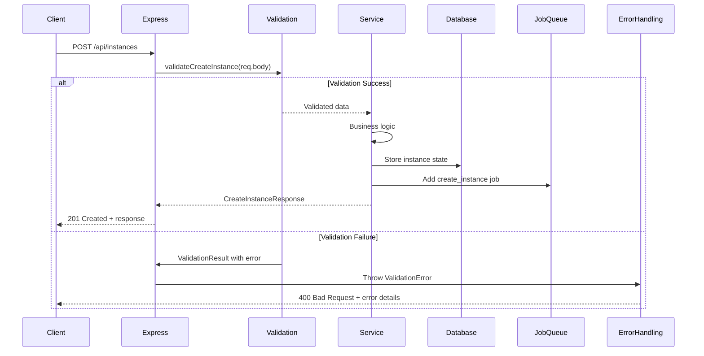

**Diagram sources**
- [instances.ts](file://src/routes/instances.ts#L15-L35)
- [validation.ts](file://src/types/validation.ts#L159-L224)

**Section sources**
- [instances.ts](file://src/routes/instances.ts#L15-L35)
- [validation.ts](file://src/types/validation.ts#L159-L224)

### Error Response Structure
The system provides a consistent error response format that includes detailed validation error information when appropriate.

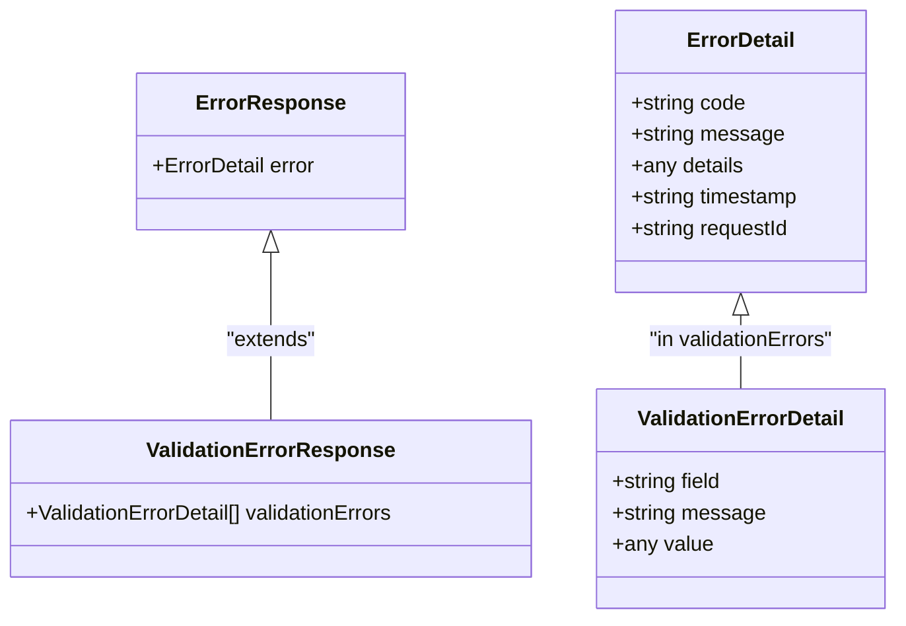

**Diagram sources**
- [api.ts](file://src/types/api.ts#L250-L270)
- [utils/errorHandler.ts](file://src/utils/errorHandler.ts#L48-L103)

**Section sources**
- [api.ts](file://src/types/api.ts#L250-L270)
- [utils/errorHandler.ts](file://src/utils/errorHandler.ts#L48-L103)

## Versioning Strategy

### Schema Evolution and Backward Compatibility
The data model system is designed with backward compatibility in mind, allowing for graceful evolution of schemas over time.

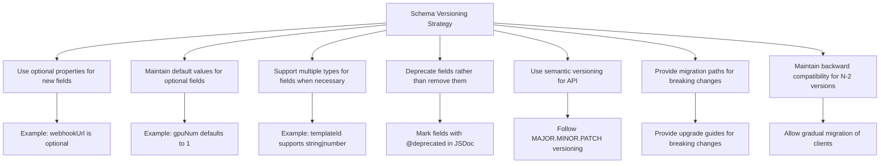

**Diagram sources**
- [api.ts](file://src/types/api.ts#L9-L17)
- [validation.ts](file://src/types/validation.ts#L5-L68)

**Section sources**
- [api.ts](file://src/types/api.ts#L9-L17)
- [validation.ts](file://src/types/validation.ts#L5-L68)
- [config/README.md](file://src/config/README.md#L107-L139)

## Conclusion
The novitai application employs a robust and comprehensive data modeling system that combines TypeScript interfaces with Joi validation to ensure data integrity and provide clear API contracts. The core entities—InstanceDetails, CreateInstanceRequest, Job, and HealthCheckResponse—are carefully designed with appropriate constraints and relationships to support the application's functionality. The validation system provides detailed error messages and handles both required and optional fields with appropriate defaults. The job queue system enables asynchronous processing with retry mechanisms and priority handling. The health check system provides comprehensive monitoring capabilities. The type system uses inheritance and composition to create a maintainable structure, and the versioning strategy ensures backward compatibility during schema evolution. Together, these elements create a solid foundation for a reliable and scalable application.