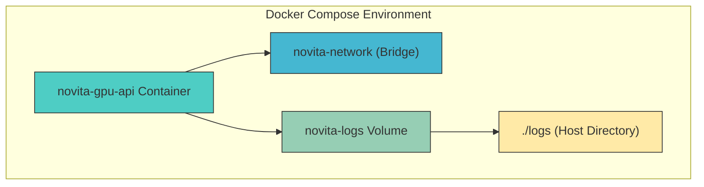
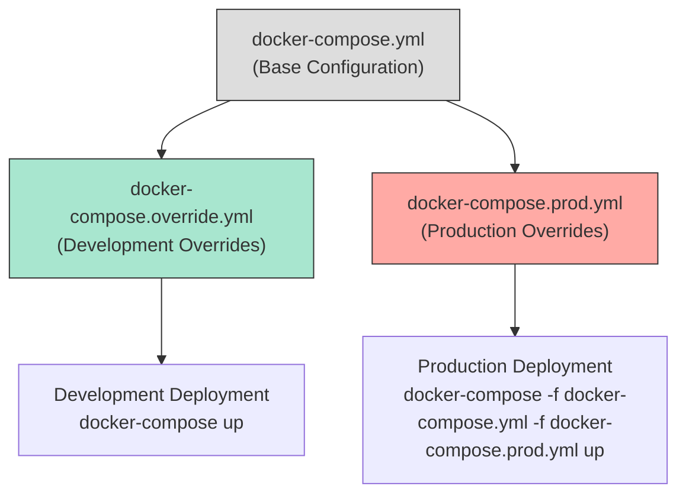

# Docker Deployment

<cite>
**Referenced Files in This Document**   
- [Dockerfile](file://Dockerfile)
- [docker-compose.yml](file://docker-compose.yml)
- [docker-compose.override.yml](file://docker-compose.override.yml)
- [docker-compose.prod.yml](file://docker-compose.prod.yml)
- [scripts/deploy-dev.sh](file://scripts/deploy-dev.sh)
- [scripts/deploy-prod.sh](file://scripts/deploy-prod.sh)
- [scripts/health-check.sh](file://scripts/health-check.sh)
</cite>

## Table of Contents
1. [Multi-Stage Docker Build Strategy](#multi-stage-docker-build-strategy)
2. [Development vs Production Build Targets](#development-vs-production-build-targets)
3. [Docker Compose Service Orchestration](#docker-compose-service-orchestration)
4. [Environment-Specific Configuration Overrides](#environment-specific-configuration-overrides)
5. [Security Hardening and Best Practices](#security-hardening-and-best-practices)
6. [Health Checks and Monitoring](#health-checks-and-monitoring)
7. [Resource Allocation and Performance Tuning](#resource-allocation-and-performance-tuning)
8. [Common Deployment Pitfalls and Troubleshooting](#common-deployment-pitfalls-and-troubleshooting)
9. [Scaling and Production Readiness](#scaling-and-production-readiness)

## Multi-Stage Docker Build Strategy

The novitai application employs a multi-stage Docker build process designed to optimize image size, enhance security, and streamline dependency management. This approach separates concerns across distinct build stages: base setup, dependency installation, application building, and final image assembly.

The base stage (`FROM node:18-alpine AS base`) uses Alpine Linux for its minimal footprint and security advantages. It installs `dumb-init` to ensure proper signal handling within containers, enabling graceful shutdowns and preventing zombie processes. A dedicated non-root user (`nodejs` with UID 1001) is created to run the application, reducing the attack surface in case of compromise.

Dependency management is split into two phases: a development dependencies stage that installs all packages including devDependencies for building, and a production dependencies stage that only installs production dependencies using `npm ci --only=production`. This ensures the final production image does not contain unnecessary build tools or development libraries.

The build stage compiles TypeScript source code into JavaScript using `npm run build`, copying only the compiled output (`dist/`) into the production image. This separation prevents source code from being exposed in the final container, enhancing security and reducing image size.

**Section sources**
- [Dockerfile](file://Dockerfile#L1-L112)

## Development vs Production Build Targets

The Dockerfile defines two primary build targets: `development` and `production`, each tailored to their respective environments with specific configurations for resource usage, dependency inclusion, and operational behavior.

The **development** target (`FROM base AS development`) includes additional debugging tools such as `curl` for health checks and retains development dependencies for hot-reloading and debugging capabilities. It disables restrictive security features like read-only filesystems and temporary filesystem restrictions to facilitate easier development workflows. The restart policy is set to `"no"` to allow developers full control over container lifecycle during debugging sessions.

In contrast, the **production** target (`FROM base AS production`) prioritizes security and efficiency. It runs with a read-only root filesystem (`read_only: true`), uses `tmpfs` mounts for temporary directories with `noexec` and `nosuid` flags to prevent execution of binaries from temporary locations, and enforces `no-new-privileges` security options to restrict privilege escalation.

Health check configurations differ between environments: both use curl-based health checks, but production employs more aggressive parameters (shorter intervals, higher retry counts) to ensure rapid detection of service degradation. The production image excludes development dependencies entirely, resulting in a smaller attack surface and reduced image size.

**Section sources**
- [Dockerfile](file://Dockerfile#L45-L112)
- [docker-compose.yml](file://docker-compose.yml#L1-L103)
- [docker-compose.override.yml](file://docker-compose.override.yml#L1-L30)

## Docker Compose Service Orchestration

The deployment strategy leverages Docker Compose for service orchestration, providing a consistent environment across development and production while enabling complex configuration through modular YAML files.

The core `docker-compose.yml` file defines the `novita-gpu-api` service with comprehensive configuration including environment variables, volume mounts, network isolation, and resource constraints. The service is isolated within a dedicated bridge network named `novita-network`, ensuring secure communication between services while preventing unauthorized access from other containers.

Persistent logging is achieved through named volumes (`novita-logs`) that bind-mount to the local `./logs` directory, ensuring log data survives container restarts. Environment variables are injected from the `.env` file or defaults, with critical variables like `NOVITA_API_KEY` marked as required using shell parameter expansion (`${NOVITA_API_KEY:?NOVITA_API_KEY is required}`), causing deployment to fail if missing.

Resource limits are explicitly defined under the `deploy.resources` section, constraining container memory and CPU usage to prevent resource exhaustion. The configuration includes graceful shutdown settings (`stop_grace_period: 30s`) and structured logging with rotation policies to manage log size.



**Diagram sources**
- [docker-compose.yml](file://docker-compose.yml#L1-L103)

**Section sources**
- [docker-compose.yml](file://docker-compose.yml#L1-L103)

## Environment-Specific Configuration Overrides

The deployment system uses Docker Compose's multiple configuration file capability to apply environment-specific settings through override files, enabling flexible customization without duplicating configuration.

The `docker-compose.override.yml` file automatically applies development-specific overrides when running `docker-compose up` without explicit file specification. It switches the build target to `development`, increases resource limits for better development performance, disables security restrictions like read-only filesystems and `tmpfs` mounts, and configures local directory mounting for logs to simplify access during development.

For production deployments, the `docker-compose.prod.yml` file provides hardened configuration that can be applied using:  
`docker-compose -f docker-compose.yml -f docker-compose.prod.yml up -d`

This override file:
- Uses pre-built images with version tagging via `IMAGE_TAG` environment variable
- Applies stricter resource limits (512MB memory, 0.5 CPUs)
- Configures rolling update and rollback policies for zero-downtime deployments
- Increases health check frequency and reliability
- Routes logs to a system-level directory (`/var/log/novita-gpu-api`)
- Sets appropriate restart policies (`restart: always`)

This layered configuration approach enables teams to maintain a single source of truth while safely applying environment-specific optimizations and security controls.



**Diagram sources**
- [docker-compose.override.yml](file://docker-compose.override.yml#L1-L30)
- [docker-compose.prod.yml](file://docker-compose.prod.yml#L1-L66)

**Section sources**
- [docker-compose.override.yml](file://docker-compose.override.yml#L1-L30)
- [docker-compose.prod.yml](file://docker-compose.prod.yml#L1-L66)

## Security Hardening and Best Practices

The Docker deployment implements multiple security best practices to minimize attack surface and protect sensitive data.

**Non-Root Execution**: The application runs as a dedicated non-root user (`nodejs` with UID 1001), created during the Docker build process. This principle of least privilege prevents potential attackers from gaining root access even if they compromise the application.

**Read-Only Filesystem**: The production container uses `read_only: true` to mount the root filesystem as read-only, preventing malicious code from modifying application files or writing unauthorized data to the filesystem. Writable access is granted only to specific volumes (`/app/logs`) and temporary directories (`tmpfs`).

**Temporary Filesystem Protection**: Critical temporary directories (`/tmp`, `/var/tmp`) are mounted as `tmpfs` with `noexec,nosuid` options, preventing execution of binaries from these locations and blocking setuid bit interpretation, which mitigates various privilege escalation attacks.

**Security Options**: The `security_opt` directive enforces `no-new-privileges:true`, preventing processes from gaining additional privileges through exec calls, further hardening the container against privilege escalation.

**Environment Variable Validation**: Critical configuration variables like `NOVITA_API_KEY` use bash parameter expansion with error checking (`${NOVITA_API_KEY:?NOVITA_API_KEY is required}`), ensuring deployment fails fast if essential secrets are missing rather than running with insecure defaults.

**Minimal Base Image**: The use of `node:18-alpine` provides a minimal Linux distribution with reduced package footprint, decreasing the number of potential vulnerabilities compared to full distributions.

**Section sources**
- [Dockerfile](file://Dockerfile#L1-L112)
- [docker-compose.yml](file://docker-compose.yml#L1-L103)

## Health Checks and Monitoring

The deployment strategy includes comprehensive health checking mechanisms to ensure service reliability and enable automated recovery.

Both development and production configurations define Docker-native health checks using curl to probe the `/health` endpoint:
```yaml
healthcheck:
  test: ["CMD", "curl", "-f", "http://localhost:3000/health"]
  interval: 30s
  timeout: 10s
  retries: 3
  start_period: 40s
```

The health check parameters are tuned to balance responsiveness with stability:
- `start_period: 40s`: Allows application startup time before health checks begin
- `interval: 30s`: Frequency of health checks
- `timeout: 10s`: Maximum time to wait for response
- `retries: 3`: Number of consecutive failures before marking container as unhealthy

The repository includes a dedicated `scripts/health-check.sh` script that performs comprehensive health verification, checking both `/health` and `/metrics` endpoints, measuring response times, and validating Docker container status. This script can be integrated into CI/CD pipelines or monitoring systems.

Production configuration tightens health check parameters (15s interval, 5s timeout, 5 retries) for faster detection of service degradation. The combination of Docker's built-in health checking and external monitoring scripts provides defense in depth for service reliability.

**Section sources**
- [docker-compose.yml](file://docker-compose.yml#L1-L103)
- [docker-compose.prod.yml](file://docker-compose.prod.yml#L1-L66)
- [scripts/health-check.sh](file://scripts/health-check.sh#L1-L96)

## Resource Allocation and Performance Tuning

The deployment configuration includes detailed resource constraints to ensure stable performance and prevent resource exhaustion.

Resource limits are defined in the `deploy.resources` section:
```yaml
deploy:
  resources:
    limits:
      memory: 1G
      cpus: '1.0'
    reservations:
      memory: 512M
      cpus: '0.5'
```

These settings provide:
- **Memory Limits**: Hard cap on memory usage to prevent OOM (Out of Memory) conditions
- **CPU Limits**: Throttling of CPU usage to ensure fair resource distribution
- **Reservations**: Guaranteed minimum resources for consistent performance

Development configuration allocates more generous resources (2G memory, 2.0 CPUs) to accommodate debugging tools and faster iteration, while production configuration uses more conservative limits (512M-1G memory, 0.5-1.0 CPUs) optimized for density and cost-efficiency.

Logging is configured with rotation policies (`max-size: "10m"`, `max-file: "3"`) to prevent log files from consuming excessive disk space. The production configuration increases these limits (`max-size: "50m"`, `max-file: "5"`) for better observability.

The `stop_grace_period: 30s` setting allows time for graceful shutdown, ensuring active connections are properly terminated before container destruction.

**Section sources**
- [docker-compose.yml](file://docker-compose.yml#L1-L103)
- [docker-compose.prod.yml](file://docker-compose.prod.yml#L1-L66)

## Common Deployment Pitfalls and Troubleshooting

Several common issues may arise during deployment, with specific mitigation strategies implemented in the configuration.

**Missing Environment Variables**: The most common issue is missing `NOVITA_API_KEY`. The deployment scripts (`scripts/deploy-dev.sh`, `scripts/deploy-prod.sh`) include validation to check for this variable and provide clear error messages. The `.env` file creation process is automated in development deployment.

**Permission Issues**: Running as non-root user requires proper directory ownership. The Dockerfile includes `chown nodejs:nodejs /app/logs` to ensure the application can write to log directories. The bind-mounted volume must have appropriate permissions (`chmod 755 logs`).

**Port Conflicts**: The configuration uses `${PORT:-3000}` to allow port customization via environment variable, preventing conflicts when multiple services run on the same host.

**Image Build Failures**: The multi-stage build process isolates dependencies, but network issues during `npm ci` can cause failures. The deployment scripts use `set -e` to fail fast on errors and provide diagnostic information.

**Health Check Failures**: Applications may take time to start. The `start_period: 40s` setting prevents premature health check failures. The deployment scripts include waiting loops with timeouts to verify service readiness.

**Volume Mounting Issues**: Named volumes with bind drivers require existing host directories. The deployment scripts ensure `logs/` directory exists before starting containers.

The included `scripts/backup.sh` provides disaster recovery capabilities, backing up configuration, source code, logs, and Docker images for rapid restoration.

**Section sources**
- [scripts/deploy-dev.sh](file://scripts/deploy-dev.sh#L1-L58)
- [scripts/deploy-prod.sh](file://scripts/deploy-prod.sh#L1-L63)
- [scripts/backup.sh](file://scripts/backup.sh#L1-L101)

## Scaling and Production Readiness

The deployment configuration supports scaling and production-grade requirements through several key features.

The `docker-compose.prod.yml` file includes Docker Swarm deployment configuration:
```yaml
deploy:
  replicas: 1
  update_config:
    parallelism: 1
    delay: 10s
    failure_action: rollback
    order: stop-first
  rollback_config:
    parallelism: 1
    delay: 10s
    failure_action: pause
    order: stop-first
```

This enables:
- **Rolling Updates**: Gradual deployment of new versions with controlled parallelism
- **Automatic Rollback**: Reversion to previous version on deployment failure
- **Controlled Scaling**: Support for multiple replicas (though currently set to 1)

The configuration separates development and production concerns through override files, allowing teams to safely test changes before production deployment. The use of versioned image tags (`${IMAGE_TAG:-latest}`) supports immutable infrastructure practices.

For high availability, the configuration could be extended to:
- Increase `replicas` count
- Implement external load balancing
- Use distributed logging solutions
- Integrate with Kubernetes for advanced orchestration

The combination of automated deployment scripts, comprehensive health checking, and backup procedures ensures the deployment is production-ready and maintainable at scale.

**Section sources**
- [docker-compose.prod.yml](file://docker-compose.prod.yml#L1-L66)
- [scripts/deploy-prod.sh](file://scripts/deploy-prod.sh#L1-L63)