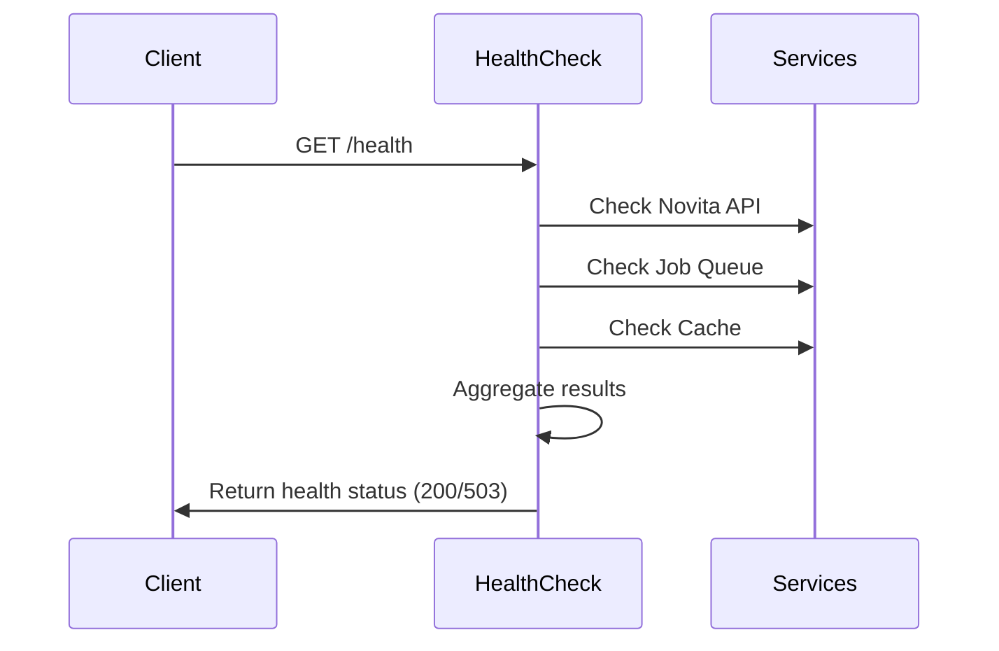
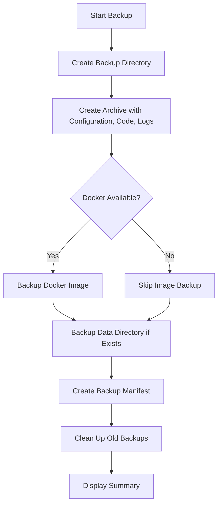
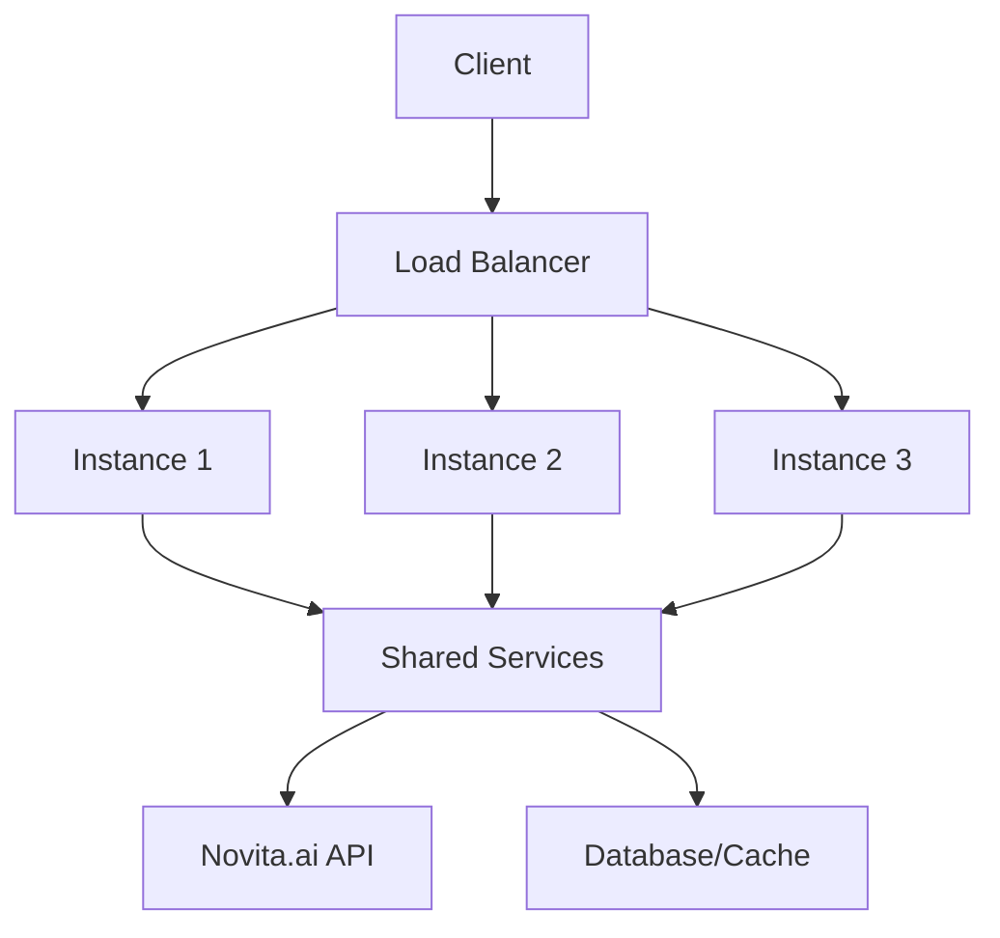

# Production Best Practices

<cite>
**Referenced Files in This Document**   
- [docker-compose.yml](file://docker-compose.yml)
- [docker-compose.prod.yml](file://docker-compose.prod.yml)
- [Dockerfile](file://Dockerfile)
- [scripts/backup.sh](file://scripts/backup.sh)
- [scripts/deploy-prod.sh](file://scripts/deploy-prod.sh)
- [scripts/health-check.sh](file://scripts/health-check.sh)
- [src/routes/health.ts](file://src/routes/health.ts)
- [src/routes/metrics.ts](file://src/routes/metrics.ts)
- [src/config/config.ts](file://src/config/config.ts)
</cite>

## Table of Contents
1. [Introduction](#introduction)
2. [Production Configuration Management](#production-configuration-management)
3. [Docker Security Hardening](#docker-security-hardening)
4. [Resource Tuning and Performance](#resource-tuning-and-performance)
5. [Monitoring and Observability](#monitoring-and-observability)
6. [Operational Runbooks](#operational-runbooks)
7. [Scaling Strategies](#scaling-strategies)
8. [Production Checklist](#production-checklist)
9. [Performance Tuning for High-Load Scenarios](#performance-tuning-for-high-load-scenarios)
10. [CI/CD Integration](#cicd-integration)

## Introduction
This document provides comprehensive guidance for operating the Novitai application in production environments. It covers critical aspects of production deployment including configuration management, security hardening, resource optimization, monitoring, operational procedures, and scaling strategies. The content is designed to ensure stable, secure, and efficient operation of the Novitai GPU Instance API service in production settings.

## Production Configuration Management

The Novitai application implements a robust configuration management system that supports environment-specific settings through multiple configuration files and environment variables. The system uses a hierarchical configuration approach with different Docker Compose files for various deployment scenarios.

Environment variables are validated at startup using Joi schema validation, ensuring that required configuration parameters are present and correctly formatted. The configuration system implements fail-fast behavior, terminating the application if critical configuration is missing or invalid, except in test environments where it throws an error instead.

Sensitive configuration data such as API keys and webhook secrets are managed through environment variables rather than being hardcoded in configuration files. The system supports loading configuration from multiple sources, including `.env`, `.env.local`, and custom environment files specified at runtime.

**Section sources**
- [docker-compose.yml](file://docker-compose.yml#L1-L103)
- [docker-compose.prod.yml](file://docker-compose.prod.yml#L1-L66)
- [src/config/config.ts](file://src/config/config.ts#L1-L390)

## Docker Security Hardening

The Novitai application implements multiple security hardening measures in its Docker configuration to minimize attack surface and prevent privilege escalation.

The container runs as a non-root user (UID 1001) to follow the principle of least privilege. This is achieved through the creation of a dedicated `nodejs` user in the Dockerfile, with appropriate ownership of application directories and files.

The root filesystem is mounted as read-only to prevent unauthorized modifications to the application code and dependencies. Only specific volumes, such as the logs directory, are mounted with write permissions, limiting the potential impact of any security breaches.

Security options include the `no-new-privileges:true` flag, which prevents processes from gaining additional privileges through setuid or setgid binaries, effectively blocking privilege escalation attacks.

Temporary directories are secured through tmpfs mounts with restrictive options:
- `/tmp` is mounted with `noexec,nosuid,size=100m` options
- `/var/tmp` is mounted with `noexec,nosuid,size=50m` options

These tmpfs mounts prevent execution of binaries from temporary directories and block the creation of setuid files, mitigating common attack vectors.

The container uses dumb-init as an entry point to ensure proper signal handling and graceful shutdown, which is critical for maintaining system stability during deployment and scaling operations.

**Section sources**
- [Dockerfile](file://Dockerfile#L1-L112)
- [docker-compose.yml](file://docker-compose.yml#L1-L103)

## Resource Tuning and Performance

Resource management in the Novitai application is configured through Docker Compose deployment specifications, allowing precise control over CPU and memory allocation.

In production environments, resource limits and reservations are configured in `docker-compose.prod.yml`:
- **Memory**: 512MB limit with 256MB reservation
- **CPU**: 0.5 cores limit with 0.25 cores reservation

These conservative limits ensure stable operation while preventing any single container from consuming excessive resources that could impact other services on the host system. The memory reservation guarantees that the container has sufficient memory available, while the limit prevents memory leaks from destabilizing the host.

The deployment configuration also specifies resource limits in the main `docker-compose.yml` file:
- **Memory**: 1GB limit with 512MB reservation
- **CPU**: 1.0 cores limit with 0.5 cores reservation

These parameters directly impact application stability and cost efficiency. Properly tuned resource limits prevent out-of-memory situations and ensure predictable performance, while appropriate reservations guarantee that the application has the resources it needs to operate efficiently.

The stop grace period is set to 30 seconds, allowing sufficient time for the application to complete ongoing requests and perform cleanup operations during container shutdown, which is essential for maintaining data integrity and providing a seamless experience during deployments.

**Section sources**
- [docker-compose.yml](file://docker-compose.yml#L1-L103)
- [docker-compose.prod.yml](file://docker-compose.prod.yml#L1-L66)

## Monitoring and Observability

The Novitai application provides comprehensive monitoring capabilities through dedicated endpoints and structured logging.

### Health Check Endpoint
The `/health` endpoint provides detailed system health information, returning different HTTP status codes based on the service's health:
- **200 OK**: Service is healthy
- **503 Service Unavailable**: Service is unhealthy

The health check evaluates multiple aspects of the system:
- Service responsiveness
- Novita.ai API connectivity
- Internal service health (job queue, cache)
- System resource usage (memory, CPU)

In development mode, additional debug information is included in the response, while production responses are streamlined for security.



**Diagram sources**
- [src/routes/health.ts](file://src/routes/health.ts#L1-L108)

### Metrics Endpoint
The `/metrics` endpoint provides comprehensive application metrics for monitoring and performance analysis. Available endpoints include:
- `GET /api/metrics` - Comprehensive application metrics
- `GET /api/metrics/summary` - Summarized metrics
- `GET /api/metrics/system` - System-level metrics
- `POST /api/metrics/reset` - Reset all metrics (for testing)

The metrics system tracks:
- Request metrics (count, duration, status codes)
- Job processing metrics
- System resource usage
- Error rates
- Performance trends

```mermaid
flowchart TD
A[/metrics] --> B[Request Metrics]
A --> C[Job Processing Metrics]
A --> D[System Metrics]
A --> E[Error Rates]
B --> F[Count, Duration, Status Codes]
C --> G[Processed, Failed, Duration]
D --> H[Memory, CPU, Uptime]
E --> I[Error Rate, Types]
```

**Diagram sources**
- [src/routes/metrics.ts](file://src/routes/metrics.ts#L1-L46)
- [src/routes/metrics.ts](file://src/routes/metrics.ts#L85-L136)

### Log Rotation
Log rotation is configured using Docker's json-file logging driver with the following parameters:
- **max-size**: "10m" (10MB) in development, "50m" (50MB) in production
- **max-file**: "3" files in development, "5" files in production

This configuration ensures that log files are rotated before they become too large, preventing disk space exhaustion while maintaining sufficient historical data for troubleshooting.

The production logging configuration also includes service and environment labels for better log management and filtering.

**Section sources**
- [docker-compose.yml](file://docker-compose.yml#L1-L103)
- [docker-compose.prod.yml](file://docker-compose.prod.yml#L1-L66)
- [src/routes/health.ts](file://src/routes/health.ts#L1-L108)
- [src/routes/metrics.ts](file://src/routes/metrics.ts#L1-L46)

## Operational Runbooks

### Zero-Downtime Updates
The deployment configuration supports zero-downtime updates through Docker Compose's deployment strategies. The production configuration specifies a rolling update strategy with:
- **parallelism**: 1 (update one container at a time)
- **delay**: 10s (wait 10 seconds between updates)
- **order**: stop-first (stop old container before starting new one)

This approach ensures that at least one container is always available to handle requests during the update process.

The update process involves:
1. Pulling the latest image
2. Deploying with `docker-compose up -d --no-deps --build novita-gpu-api`
3. Monitoring health checks during the update
4. Rolling back in case of failure

### Backup Procedures
The `backup.sh` script provides automated backup capabilities for the Novitai application. The script creates comprehensive backups that include:
- Configuration files (.env, docker-compose.yml)
- Source code and scripts
- Application logs
- Docker image (if available)
- Data directory (if exists)

The backup process includes:
1. Creating a timestamped backup archive
2. Backing up the Docker image (if available)
3. Creating a backup manifest with system information
4. Cleaning up old backups (keeping the last 5)

The script handles errors gracefully and provides clear feedback on the backup status.



**Diagram sources**
- [scripts/backup.sh](file://scripts/backup.sh#L1-L101)

### Disaster Recovery
Disaster recovery procedures are designed to restore the application from backups quickly and reliably. The recovery process involves:
1. Extracting the backup archive
2. Loading the Docker image (if backed up)
3. Restoring configuration files
4. Starting the service with `docker-compose`

The backup manifest provides detailed information about the backup contents and system configuration, facilitating accurate restoration.

**Section sources**
- [scripts/backup.sh](file://scripts/backup.sh#L1-L101)
- [scripts/deploy-prod.sh](file://scripts/deploy-prod.sh#L1-L63)

## Scaling Strategies

### Vertical Scaling
Vertical scaling involves adjusting the resource allocation for the service. This can be done by modifying the resource limits in the Docker Compose configuration:

```yaml
deploy:
  resources:
    limits:
      memory: 2G      # Increase memory limit
      cpus: '2.0'     # Increase CPU limit
    reservations:
      memory: 1G      # Increase memory reservation
      cpus: '1.0'     # Increase CPU reservation
```

Vertical scaling is appropriate when the application is constrained by CPU or memory resources. Monitoring metrics should be analyzed to determine if vertical scaling is needed.

### Horizontal Scaling
Horizontal scaling involves running multiple replicas of the service behind a load balancer. The service can be scaled using Docker Compose:

```bash
docker-compose up -d --scale novita-gpu-api=3
```

For production environments, a dedicated load balancer (such as nginx or Traefik) should be used to distribute traffic across multiple instances.

The application is designed to be stateless, making it suitable for horizontal scaling. All instances can share the same configuration and connect to the same external services.



**Diagram sources**
- [docker-compose.yml](file://docker-compose.yml#L1-L103)

**Section sources**
- [docker-compose.yml](file://docker-compose.yml#L1-L103)

## Production Checklist

Before deploying to production, ensure the following items are completed:

- [ ] **Configuration Validation**: Verify all required environment variables are set, particularly `NOVITA_API_KEY`
- [ ] **Health Check Testing**: Test the `/health` endpoint to ensure it returns accurate status information
- [ ] **Firewall Rules**: Configure firewall rules to allow traffic on the application port (default: 3000)
- [ ] **Log Rotation**: Verify log rotation is configured and working properly
- [ ] **Monitoring Setup**: Configure external monitoring for the `/health` and `/metrics` endpoints
- [ ] **Alerting Configuration**: Set up alerting for critical conditions (service down, high error rates)
- [ ] **Reverse Proxy**: Configure a reverse proxy (e.g., nginx) for SSL/TLS termination and additional security
- [ ] **SSL/TLS Termination**: Set up SSL/TLS certificates for secure communication
- [ ] **Backup Procedures**: Test backup and recovery procedures to ensure they work as expected
- [ ] **Scaling Procedures**: Test both vertical and horizontal scaling to ensure the application can handle increased load
- [ ] **Support Procedures**: Document operational procedures and ensure support teams are trained

**Section sources**
- [DEPLOYMENT.md](file://DEPLOYMENT.md#L1-L336)
- [DOCKER_DEPLOYMENT_SUMMARY.md](file://DOCKER_DEPLOYMENT_SUMMARY.md#L1-L185)

## Performance Tuning for High-Load Scenarios

For high-load scenarios, several performance tuning options are available:

### Caching Optimization
The application implements caching for frequently accessed data. Cache parameters can be tuned through environment variables:
- `CACHE_TIMEOUT`: Adjust cache duration based on data freshness requirements
- Monitor cache hit ratios through the health endpoint to assess effectiveness

### Connection Pooling
While not explicitly configured in the current setup, connection pooling to external services could be implemented to reduce connection overhead during high load.

### Rate Limiting
The application includes built-in rate limiting with configurable parameters:
- `RATE_LIMIT_WINDOW_MS`: Duration of the rate limiting window
- `RATE_LIMIT_MAX_REQUESTS`: Maximum requests allowed in the window

These parameters should be tuned based on expected traffic patterns and service capacity.

### Job Processing
The maximum number of concurrent background jobs can be adjusted:
- `MAX_CONCURRENT_JOBS`: Controls the number of jobs processed simultaneously

Increasing this value can improve throughput but may increase resource consumption.

### Horizontal Scaling
For sustained high load, horizontal scaling is the most effective approach. Multiple instances can be deployed behind a load balancer to distribute the load.

Monitoring metrics should be used to guide performance tuning decisions, focusing on:
- Request latency
- Error rates
- Resource utilization
- Cache performance

**Section sources**
- [src/config/config.ts](file://src/config/config.ts#L1-L390)
- [src/routes/health.ts](file://src/routes/health.ts#L1-L108)
- [src/routes/metrics.ts](file://src/routes/metrics.ts#L1-L46)

## CI/CD Integration

The Novitai application is designed to integrate seamlessly with CI/CD pipelines through several mechanisms:

### Deployment Scripts
The `scripts/deploy-prod.sh` script automates the production deployment process, including:
- Validating the presence of required configuration
- Building the production image
- Starting the service
- Waiting for the service to become healthy
- Providing status information

This script can be integrated into CI/CD pipelines to automate deployments.

### Health Checks
The comprehensive health checks enable reliable deployment verification. CI/CD pipelines can use the `/health` endpoint to confirm that deployments are successful before proceeding to the next stage.

### Configuration Management
The configuration system supports environment-specific settings, making it easy to manage different environments (development, staging, production) within a CI/CD pipeline.

### Testing Integration
The application includes a comprehensive test suite that can be executed as part of the CI pipeline:
- Unit tests for individual components
- Integration tests for route availability and consistency
- Performance tests

The test suite can be run with `npm run test` in the CI environment to ensure code quality before deployment.

**Section sources**
- [scripts/deploy-prod.sh](file://scripts/deploy-prod.sh#L1-L63)
- [src/routes/health.ts](file://src/routes/health.ts#L1-L108)
- [package.json](file://package.json#L1-L20)