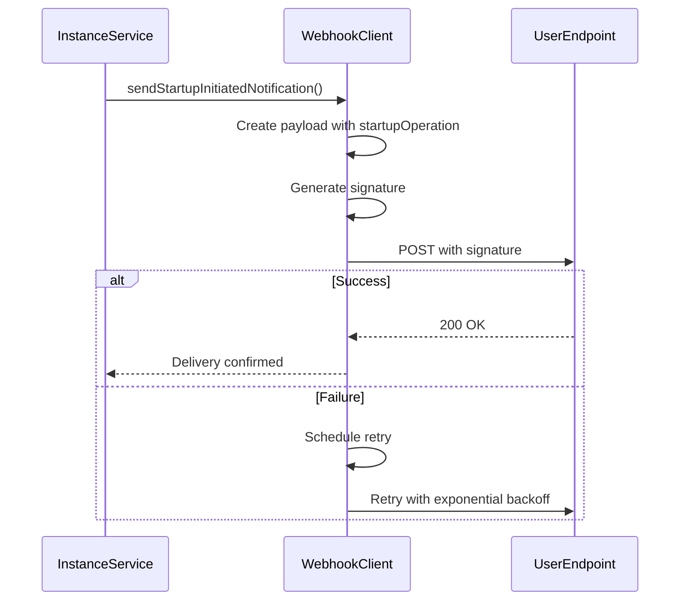

# External Integrations

<cite>
**Referenced Files in This Document**   
- [novitaClient.ts](file://src/clients/novitaClient.ts) - *Updated in recent commit*
- [webhookClient.ts](file://src/clients/webhookClient.ts) - *Enhanced with startup monitoring*
- [novitaApiService.ts](file://src/services/novitaApiService.ts) - *Refactored response handling*
- [instanceService.ts](file://src/services/instanceService.ts) - *Enhanced with startup monitoring*
- [config.ts](file://src/config/config.ts)
</cite>

## Update Summary
**Changes Made**   
- Updated Novita.ai API Integration section to reflect refactored response handling and data transformation
- Enhanced Webhook Notification System section with detailed startup operation tracking and new status types
- Added new startup-related webhook notification types and payload structures
- Updated fault tolerance measures to include startup-specific retry logic
- Added new sequence diagrams for startup operation workflows
- Updated security considerations to include startup operation verification
- Enhanced observability section with startup monitoring metrics

## Table of Contents
1. [Novita.ai API Integration](#novitai-api-integration)
2. [Webhook Notification System](#webhook-notification-system)
3. [Fault Tolerance and Resilience](#fault-tolerance-and-resilience)
4. [Security Considerations](#security-considerations)
5. [Observability and Monitoring](#observability-and-monitoring)
6. [Rate Limiting and Throttling](#rate-limiting-and-throttling)
7. [Testing Integration Scenarios](#testing-integration-scenarios)

## Novita.ai API Integration

The novitai application integrates with the Novita.ai API through the `NovitaClient` HTTP client wrapper, which provides a robust interface for all external API interactions. This integration handles authentication, request management, and response processing with enterprise-grade reliability.

Authentication with the Novita.ai API is implemented using API key-based authorization. The client automatically includes the API key in the Authorization header of every request using the Bearer token scheme. The API key is securely stored in the application configuration and never exposed in client-side code or logs.


**Diagram sources**
- [novitaClient.ts](file://src/clients/novitaClient.ts#L100-L150)
- [novitaApiService.ts](file://src/services/novitaApiService.ts#L100-L200)

The `NovitaClient` class wraps Axios to provide enhanced functionality including automatic request signing, correlation ID injection, and comprehensive logging. Each request is tagged with a unique correlation ID that persists through the entire request lifecycle, enabling end-to-end tracing of API interactions.

Recent changes have refactored the API response handling in `novitaApiService.ts` to remove strict typing and implement data transformation for instance data. The service now transforms raw API responses into standardized formats that match the application's internal interfaces, ensuring consistency across different API endpoints.

**Section sources**
- [novitaClient.ts](file://src/clients/novitaClient.ts#L100-L150)
- [novitaApiService.ts](file://src/services/novitaApiService.ts#L50-L100)
- [config.ts](file://src/config/config.ts#L10-L50)

## Webhook Notification System

The application implements a webhook notification system that asynchronously informs external systems about instance lifecycle events. When instances transition to ready state or encounter errors, the system sends POST requests to user-provided webhook endpoints with detailed payload information.

The application has been enhanced to support comprehensive startup monitoring with detailed operation tracking. The webhook payload structure now includes a `startupOperation` object that tracks the progress of instance startup operations:

```json
{
  "instanceId": "inst_12345",
  "status": "startup_completed",
  "timestamp": "2023-12-01T10:30:00Z",
  "elapsedTime": 245000,
  "data": {
    "connectionDetails": {
      "host": "192.168.1.100",
      "port": 22,
      "username": "gpuuser"
    }
  },
  "startupOperation": {
    "operationId": "op_67890",
    "status": "completed",
    "startedAt": "2023-12-01T10:25:00Z",
    "phases": {
      "startRequested": "2023-12-01T10:25:00Z",
      "instanceStarting": "2023-12-01T10:26:30Z",
      "instanceRunning": "2023-12-01T10:27:45Z",
      "healthCheckStarted": "2023-12-01T10:28:15Z",
      "healthCheckCompleted": "2023-12-01T10:29:30Z",
      "ready": "2023-12-01T10:30:00Z"
    },
    "totalElapsedTime": 300000
  },
  "reason": "Instance startup completed successfully - instance is ready to serve requests"
}
```

To ensure message integrity and authenticity, the application implements signature verification using the WEBHOOK_SECRET. Each webhook request includes a signature in the `X-Webhook-Signature` header, generated using HMAC-SHA256 algorithm with the payload and secret key. The timestamp is also included in the `X-Webhook-Timestamp` header to prevent replay attacks.



**Diagram sources**
- [webhookClient.ts](file://src/clients/webhookClient.ts#L50-L100)
- [instanceService.ts](file://src/services/instanceService.ts#L300-L400)

The system provides delivery guarantees through a robust retry mechanism. Failed webhook deliveries are automatically retried up to three times with exponential backoff (1s, 2s, 4s). The system distinguishes between client errors (4xx) and server errors (5xx), only retrying on the latter to avoid overwhelming endpoints with invalid requests.

The application now supports enhanced startup notifications with the following status types:
- `startup_initiated`: Instance startup operation has been initiated
- `startup_completed`: Instance startup has completed successfully
- `startup_failed`: Instance startup has failed
- `health_checking`: Health checks are being performed on the instance
- `ready`: Instance has passed health checks and is ready for use

**Section sources**
- [webhookClient.ts](file://src/clients/webhookClient.ts#L90-L150)
- [instanceService.ts](file://src/services/instanceService.ts#L200-L300)

## Fault Tolerance and Resilience

The application implements comprehensive fault tolerance measures to maintain reliability during external service failures. These mechanisms ensure graceful degradation and prevent cascading failures throughout the system.

The circuit breaker pattern is implemented in the `NovitaClient` to prevent overwhelming the Novita.ai API during outages. The circuit breaker has three states: CLOSED (normal operation), OPEN (requests immediately fail), and HALF_OPEN (testing recovery). When consecutive failures exceed the threshold of 5, the circuit opens for 60 seconds before transitioning to HALF_OPEN state. Three consecutive successful requests are required to close the circuit completely.


**Diagram sources**
- [novitaClient.ts](file://src/clients/novitaClient.ts#L50-L100)

For webhook deliveries, the application implements fallback behaviors when external endpoints are unreachable. While there is no persistent fallback storage, the retry mechanism with exponential backoff provides temporary resilience against transient failures. The system also provides clear error feedback to clients about webhook delivery status.

The integration includes sophisticated retry mechanisms for both API calls and webhook notifications. API requests are retried on network errors (ECONNABORTED, ENOTFOUND), 5xx server errors, and 429 rate limit responses. Retries use exponential backoff with a maximum delay of 30 seconds to avoid overwhelming external services.

The application has been enhanced with startup-specific retry logic that tracks the progress of instance startup operations. When a startup operation fails, the system captures detailed information about which phase failed and includes this in the error reporting and retry decisions.

**Section sources**
- [novitaClient.ts](file://src/clients/novitaClient.ts#L250-L300)
- [webhookClient.ts](file://src/clients/webhookClient.ts#L90-L150)

## Security Considerations

The application implements robust security measures for handling third-party API credentials and validating incoming communications. API keys for the Novita.ai integration are securely managed through configuration files and environment variables, never hardcoded in source code.

All webhook signatures are validated using HMAC-SHA256 with a secret key configured in the application settings. The signature verification process ensures that incoming webhook requests originate from trusted sources and have not been tampered with during transmission.

The system follows security best practices by redacting sensitive information from logs. The request and response logging middleware automatically sanitizes sensitive fields such as authentication tokens, API keys, and other credentials, replacing them with "[REDACTED]" in log output.


**Diagram sources**
- [webhookClient.ts](file://src/clients/webhookClient.ts#L50-L90)
- [logger.ts](file://src/utils/logger.ts#L100-L150)

The application also implements proper error handling that avoids leaking sensitive system information to clients. Error responses are standardized and do not expose internal implementation details, stack traces, or configuration information.

For startup operations, the system includes additional security validation to ensure that startup operation IDs are properly authenticated and that the operation details match the expected instance configuration.

**Section sources**
- [webhookClient.ts](file://src/clients/webhookClient.ts#L50-L90)
- [logger.ts](file://src/utils/logger.ts#L100-L150)

## Observability and Monitoring

The application provides comprehensive observability features to monitor integration health and troubleshoot issues. All external request/response cycles are logged with detailed information while respecting privacy and security constraints.

The request logging middleware captures essential information about each external interaction, including method, URL, status code, duration, and size. Request and response bodies are logged selectively based on size and content type, with large payloads (>10KB) and binary content omitted to prevent log bloat.


**Diagram sources**
- [requestLogger.ts](file://src/middleware/requestLogger.ts#L30-L80)
- [logger.ts](file://src/utils/logger.ts#L150-L180)

The system tracks delivery success rates for webhook notifications, logging successful deliveries at INFO level and failed attempts at WARN level. This enables monitoring of integration reliability and identification of problematic endpoints.

The `NovitaClient` exposes monitoring endpoints to check integration health, including circuit breaker state and request queue status. These metrics can be integrated with external monitoring systems to provide real-time visibility into integration performance.

For startup operations, the application provides detailed monitoring of the startup lifecycle, including:
- Time spent in each startup phase
- Health check results and response times
- Resource allocation metrics
- Connection establishment times

**Section sources**
- [requestLogger.ts](file://src/middleware/requestLogger.ts#L30-L80)
- [novitaClient.ts](file://src/clients/novitaClient.ts#L350-L400)

## Rate Limiting and Throttling

The application implements sophisticated rate limiting to comply with external service constraints and prevent service disruption. The `NovitaClient` includes a token bucket rate limiter that enforces a maximum of 100 requests per minute to the Novita.ai API.

When the rate limit is approached, requests are queued and processed at a compliant rate. The rate limiter uses a sliding window algorithm to accurately track request frequency and prevent bursts that could trigger API rate limiting.


**Diagram sources**
- [novitaClient.ts](file://src/clients/novitaClient.ts#L150-L200)

For webhook deliveries, the application implements exponential backoff during retry attempts to avoid overwhelming recipient endpoints. The backoff sequence (1s, 2s, 4s) ensures that temporary outages do not result in request storms when services recover.

The system also handles rate limiting responses from external APIs gracefully. When a 429 (Too Many Requests) response is received, the client respects the Retry-After header if provided, or applies exponential backoff based on the number of retry attempts.

**Section sources**
- [novitaClient.ts](file://src/clients/novitaClient.ts#L150-L200)
- [webhookClient.ts](file://src/clients/webhookClient.ts#L90-L150)

## Testing Integration Scenarios

The application provides comprehensive testing capabilities for integration scenarios, including mock servers and example implementations. The test suite includes dedicated test files for both the Novita client and webhook client, ensuring reliable behavior under various conditions.

The testing framework validates critical integration scenarios such as:
- Successful API calls with proper authentication
- Error handling for network failures and API errors
- Webhook signature generation and verification
- Retry logic for failed deliveries
- Circuit breaker state transitions
- Rate limiting enforcement
- Startup operation tracking and notification

Example implementations in the `examples` directory demonstrate proper usage patterns for external integrations, serving as reference implementations for developers extending the system.

The application includes specific test cases for the enhanced startup monitoring functionality:
- [webhookClient.startup.test.ts](file://src/clients/__tests__/webhookClient.startup.test.ts) - Tests startup notification workflows
- [instanceService.startup.test.ts](file://src/services/__tests__/instanceService.startup.test.ts) - Tests startup operation tracking

**Section sources**
- [novitaClient.test.ts](file://src/clients/__tests__/novitaClient.test.ts)
- [webhookClient.test.ts](file://src/clients/__tests__/webhookClient.test.ts)
- [examples](file://src/examples)