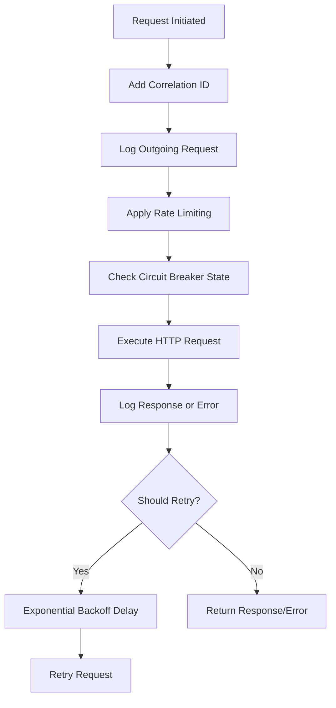
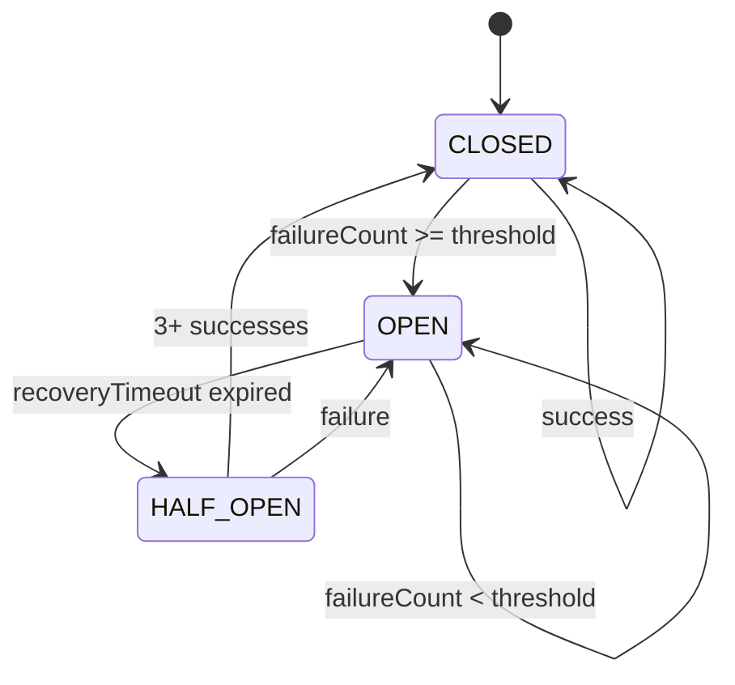
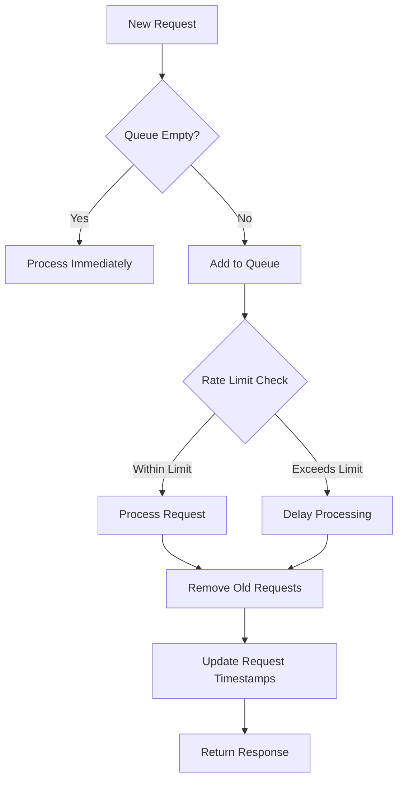
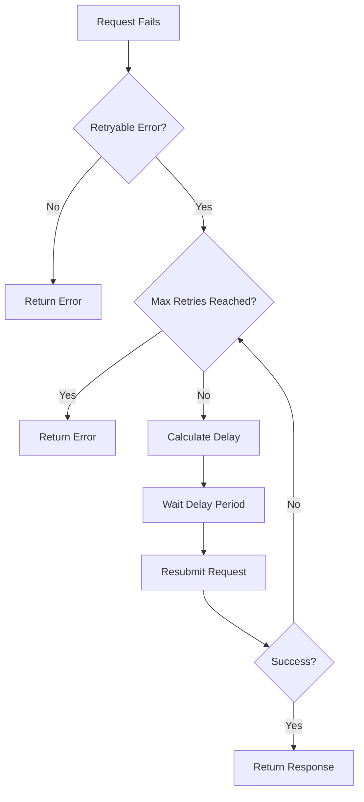
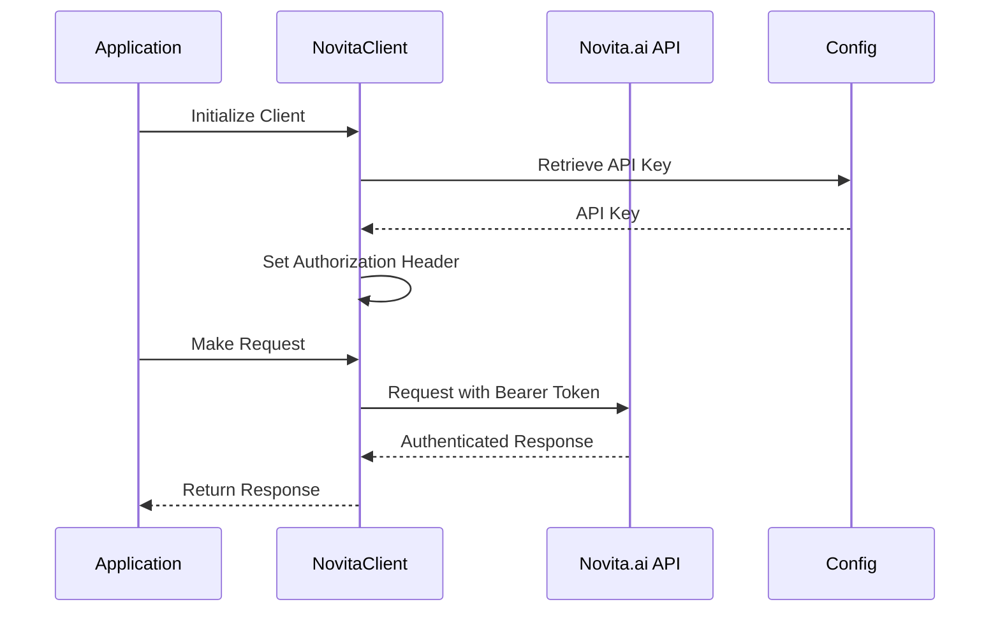
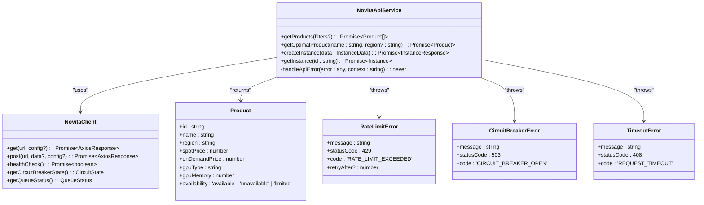
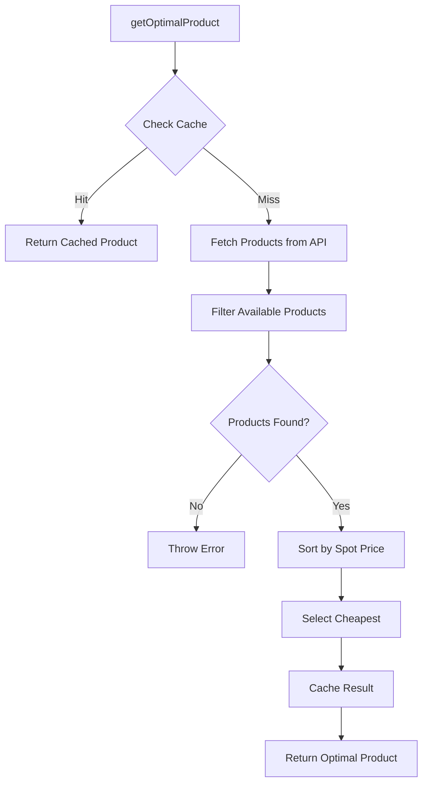
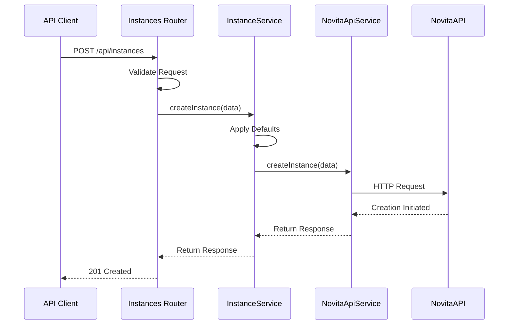
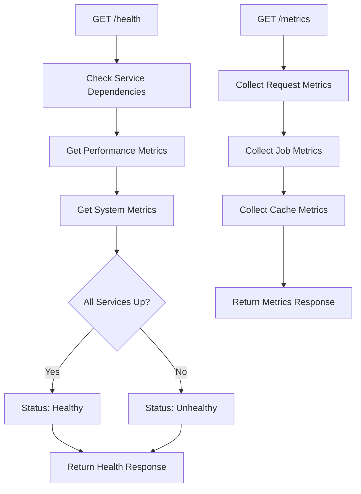

# Novita.ai API Integration

<cite>
**Referenced Files in This Document**   
- [novitaClient.ts](file://src/clients/novitaClient.ts)
- [novitaApiService.ts](file://src/services/novitaApiService.ts)
- [config.ts](file://src/config/config.ts)
- [api.ts](file://src/types/api.ts)
- [productService.ts](file://src/services/productService.ts)
- [instances.ts](file://src/routes/instances.ts)
- [health.ts](file://src/routes/health.ts)
- [metricsService.ts](file://src/services/metricsService.ts)
</cite>

## Table of Contents
1. [Introduction](#introduction)
2. [NovitaClient HTTP Client Implementation](#novitaclient-http-client-implementation)
3. [Circuit Breaker Pattern](#circuit-breaker-pattern)
4. [Rate Limiting Mechanism](#rate-limiting-mechanism)
5. [Retry Logic with Exponential Backoff](#retry-logic-with-exponential-backoff)
6. [Authentication Mechanism](#authentication-mechanism)
7. [Service Layer Abstraction in NovitaApiService](#service-layer-abstraction-in-novitaapiservice)
8. [Product Filtering and Optimal Pricing Selection](#product-filtering-and-optimal-pricing-selection)
9. [Instance Lifecycle Management](#instance-lifecycle-management)
10. [Health Check and Monitoring Endpoints](#health-check-and-monitoring-endpoints)
11. [Common Issues and Troubleshooting](#common-issues-and-troubleshooting)
12. [Conclusion](#conclusion)

## Introduction
This document provides a comprehensive overview of the Novita.ai API integration within the application. It details the implementation of the NovitaClient HTTP client wrapper, which incorporates advanced reliability features such as request/response interceptors for logging, correlation IDs, error handling, circuit breaker pattern, rate limiting, and retry logic. The service layer abstraction in NovitaApiService transforms raw API responses into typed domain models and provides high-level methods for product filtering, optimal pricing selection, and instance lifecycle management. The integration also includes health check endpoints that expose circuit breaker state and request queue metrics for monitoring purposes. This documentation is designed to be accessible to beginners while providing sufficient technical depth for experienced developers regarding fault tolerance and resilience patterns.

## NovitaClient HTTP Client Implementation

The NovitaClient class serves as a robust HTTP client wrapper around Axios, implementing multiple reliability patterns to ensure stable communication with the Novita.ai API. It uses request and response interceptors for comprehensive logging, correlation ID management, and error handling.

The client is initialized with default configuration values from the application's config system, including the base URL and authentication headers. Each request automatically includes a correlation ID generated by the `generateCorrelationId()` method, which helps trace requests across distributed systems for debugging and monitoring purposes.

**Diagram sources**
- [novitaClient.ts](file://src/clients/novitaClient.ts#L116-L380)

**Section sources**
- [novitaClient.ts](file://src/clients/novitaClient.ts#L116-L380)

## Circuit Breaker Pattern

The circuit breaker implementation prevents cascading failures when the Novita.ai API is experiencing issues. It operates in three distinct states: CLOSED (normal operation), OPEN (failing state), and HALF_OPEN (testing recovery).

When the circuit is in the CLOSED state, requests proceed normally. If failures exceed the configured threshold (5 consecutive failures), the circuit transitions to the OPEN state, where all requests are immediately rejected without contacting the API. After a recovery timeout period (60 seconds), the circuit enters the HALF_OPEN state, allowing a limited number of test requests to determine if the API has recovered. If three consecutive requests succeed, the circuit returns to the CLOSED state; otherwise, it reverts to OPEN.

**Diagram sources**
- [novitaClient.ts](file://src/clients/novitaClient.ts#L51-L99)

**Section sources**
- [novitaClient.ts](file://src/clients/novitaClient.ts#L51-L99)

## Rate Limiting Mechanism

The rate limiting mechanism enforces a maximum of 100 requests per minute using a sliding window algorithm. This prevents the application from exceeding the API's rate limits and receiving 429 responses.

The RateLimiter class maintains a list of request timestamps and removes entries that fall outside the 60-second window before each new request. When a request is made, the system checks the current count of requests within the window. If the limit would be exceeded, the request is queued until sufficient time has passed.

The implementation uses a queue-based processing system where all requests are added to a queue and processed sequentially, ensuring that requests are spaced appropriately according to the rate limit configuration.

**Diagram sources**
- [novitaClient.ts](file://src/clients/novitaClient.ts#L116-L380)

**Section sources**
- [novitaClient.ts](file://src/clients/novitaClient.ts#L116-L380)

## Retry Logic with Exponential Backoff

The retry mechanism automatically handles transient failures with an exponential backoff strategy. Requests are retried for network errors (ECONNABORTED, ENOTFOUND, ECONNRESET), 5xx server errors, and 429 rate limit responses.

The retry logic implements exponential backoff with a base delay of 1 second, doubling with each subsequent retry attempt (1s, 2s, 4s, etc.), with a maximum delay of 30 seconds. The maximum number of retry attempts is configurable through the application's defaults configuration.

When a retryable error occurs, the system logs the retry attempt and applies the calculated delay before resubmitting the request. This approach prevents overwhelming the API during periods of instability while maximizing the chances of successful completion.

**Diagram sources**
- [novitaClient.ts](file://src/clients/novitaClient.ts#L254-L296)

**Section sources**
- [novitaClient.ts](file://src/clients/novitaClient.ts#L254-L296)

## Authentication Mechanism

The authentication mechanism uses Bearer tokens with API keys sourced from the application's configuration system. During client initialization, the API key is retrieved from the config and included in the Authorization header of all outgoing requests.

The configuration system validates the presence and format of the API key during application startup, ensuring that the integration cannot operate without proper authentication credentials. This fail-fast approach prevents runtime errors due to misconfiguration.

The API key is stored securely in environment variables and never exposed in client-side code or logs, maintaining the security of the authentication credentials.

**Diagram sources**
- [novitaClient.ts](file://src/clients/novitaClient.ts#L116-L380)
- [config.ts](file://src/config/config.ts#L152-L197)

**Section sources**
- [novitaClient.ts](file://src/clients/novitaClient.ts#L116-L380)
- [config.ts](file://src/config/config.ts#L152-L197)

## Service Layer Abstraction in NovitaApiService

The NovitaApiService provides a high-level abstraction over the NovitaClient, transforming raw API responses into typed domain models and handling error mapping to custom error types. This service layer encapsulates the complexity of the API integration, providing a clean interface for other components.

The service implements comprehensive error handling, mapping HTTP status codes and API responses to specific error classes such as RateLimitError, CircuitBreakerError, and TimeoutError. This allows calling code to handle different error scenarios appropriately through type checking.

Response transformation converts the API's response format into internal domain models, normalizing data types and extracting relevant information while filtering out unnecessary fields.

**Diagram sources**
- [novitaApiService.ts](file://src/services/novitaApiService.ts#L36-L75)
- [api.ts](file://src/types/api.ts#L250-L308)

**Section sources**
- [novitaApiService.ts](file://src/services/novitaApiService.ts#L36-L75)
- [api.ts](file://src/types/api.ts#L250-L308)

## Product Filtering and Optimal Pricing Selection

The product filtering and optimal pricing selection functionality is implemented in the ProductService, which uses the NovitaApiService to retrieve product information and apply business logic to identify the most cost-effective options.

The `getOptimalProduct` method retrieves available products matching specified criteria and selects the one with the lowest spot price. If multiple products have the same spot price, it uses on-demand price as a tiebreaker, followed by product ID for consistent ordering.

Products are filtered to include only those with 'available' status, ensuring that only immediately deployable instances are considered for optimal selection. The service implements caching to improve performance, storing both raw product data and optimal product selections to reduce API calls.

**Diagram sources**
- [productService.ts](file://src/services/productService.ts#L91-L135)
- [novitaApiService.ts](file://src/services/novitaApiService.ts#L36-L75)

**Section sources**
- [productService.ts](file://src/services/productService.ts#L91-L135)
- [novitaApiService.ts](file://src/services/novitaApiService.ts#L36-L75)

## Instance Lifecycle Management

Instance lifecycle management is handled through the instance creation endpoint in the application routes, which validates incoming requests and delegates to the InstanceService for processing.

The creation process begins with validation of required fields such as name, productName, and templateId. Default values are applied for optional fields like gpuNum, rootfsSize, and region if not provided in the request.

Upon successful validation, the service initiates instance creation through the NovitaApiService and returns a response indicating the creation has been initiated. The actual provisioning process continues asynchronously, with status updates available through subsequent status checks.

**Diagram sources**
- [instances.ts](file://src/routes/instances.ts#L41-L84)
- [novitaApiService.ts](file://src/services/novitaApiService.ts#L36-L75)

**Section sources**
- [instances.ts](file://src/routes/instances.ts#L41-L84)
- [novitaApiService.ts](file://src/services/novitaApiService.ts#L36-L75)

## Health Check and Monitoring Endpoints

The health check and monitoring endpoints provide visibility into the system's operational status, including the state of the Novita.ai API integration.

The `/health` endpoint returns comprehensive system information, including service status, uptime, performance metrics, and system resource usage. It evaluates the health of dependent services and overall system metrics to determine if the application is healthy.

Monitoring endpoints expose circuit breaker state and request queue metrics, allowing operators to assess the current state of the API integration. These metrics include queue length, processing status, and circuit breaker state (CLOSED, OPEN, HALF_OPEN).

**Diagram sources**
- [health.ts](file://src/routes/health.ts#L16-L45)
- [metricsService.ts](file://src/services/metricsService.ts#L100-L150)

**Section sources**
- [health.ts](file://src/routes/health.ts#L16-L45)
- [metricsService.ts](file://src/services/metricsService.ts#L100-L150)

## Common Issues and Troubleshooting

### API Key Misconfiguration
When the API key is missing or invalid, authentication fails with a 401 status code. The system validates the API key during startup and will fail to start if the key is not properly configured.

**Solution**: Ensure the NOVITA_API_KEY environment variable is set with a valid API key. Check the application logs for configuration validation errors during startup.

### Rate Limiting Strategies
When the application exceeds the 100 requests per minute limit, the API returns 429 responses. The client handles this through rate limiting and retry logic, but excessive requests can still cause performance issues.

**Solution**: Monitor the request queue length and adjust application behavior accordingly. Implement caching where possible to reduce API calls. Consider increasing the rate limit window if available in your API plan.

### Handling Transient Network Failures
Network errors such as ECONNABORTED, ENOTFOUND, and ECONNRESET are handled through the retry mechanism with exponential backoff.

**Solution**: Ensure the retry configuration is appropriate for your use case. Monitor error logs for patterns of network failures that may indicate underlying infrastructure issues.

### Circuit Breaker Open State
When the circuit breaker is in the OPEN state, requests are immediately rejected without contacting the API. This occurs after 5 consecutive failures within the monitoring period.

**Solution**: Check the Novita.ai API status and network connectivity. The circuit breaker will automatically attempt recovery after 60 seconds. Monitor the circuit breaker state through the monitoring endpoints.

### Debugging Guidance
- Check correlation IDs in logs to trace specific requests
- Monitor the request queue length to identify potential bottlenecks
- Use the health check endpoint to assess overall system status
- Review error logs for specific error codes and messages
- Validate configuration settings, especially API keys and timeouts

**Section sources**
- [novitaClient.ts](file://src/clients/novitaClient.ts#L116-L380)
- [novitaApiService.ts](file://src/services/novitaApiService.ts#L401-L480)
- [config.ts](file://src/config/config.ts#L240-L303)

## Conclusion
The Novita.ai API integration demonstrates a comprehensive approach to building resilient and reliable API clients. By implementing the circuit breaker pattern, rate limiting, retry logic with exponential backoff, and comprehensive error handling, the system is well-equipped to handle the challenges of distributed systems and external API dependencies.

The layered architecture, with the NovitaClient providing low-level reliability features and the NovitaApiService offering high-level business abstractions, creates a maintainable and extensible design. The service layer transforms raw API responses into typed domain models while handling error mapping to custom error types, making it easier for other components to interact with the API.

Monitoring and health check endpoints provide valuable insights into the system's operational status, enabling proactive issue detection and resolution. The combination of these patterns and practices ensures that the application can gracefully handle failures, maintain performance under load, and provide a reliable experience for end users.

For developers, this implementation serves as a reference for building robust API integrations that prioritize fault tolerance and resilience, while still providing a clean and intuitive interface for consuming services.