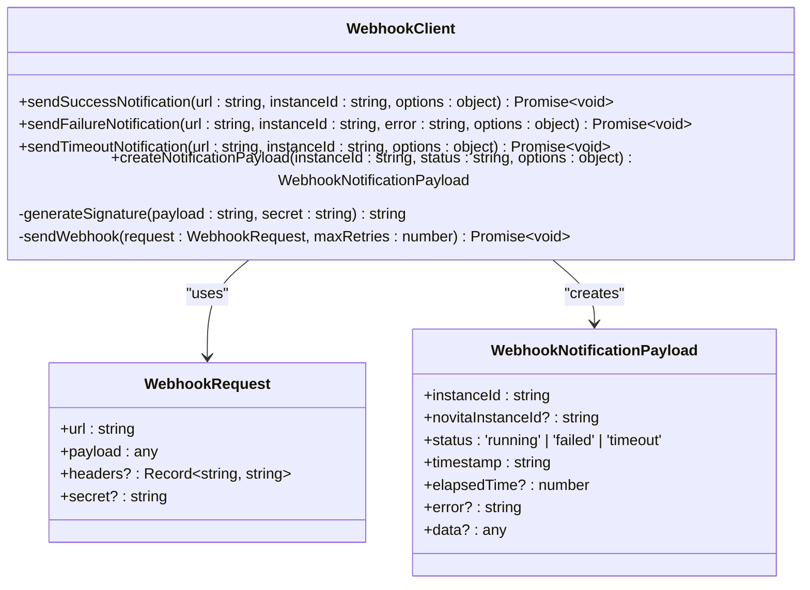
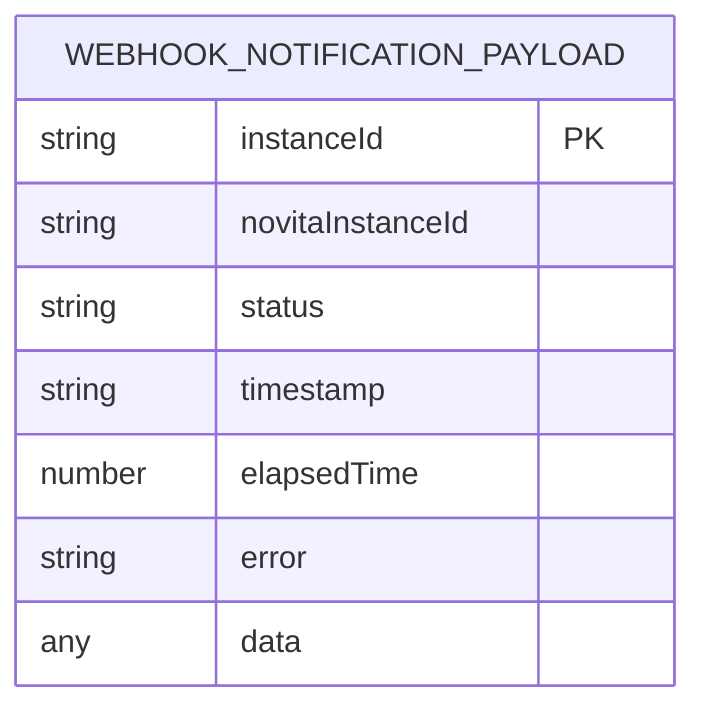
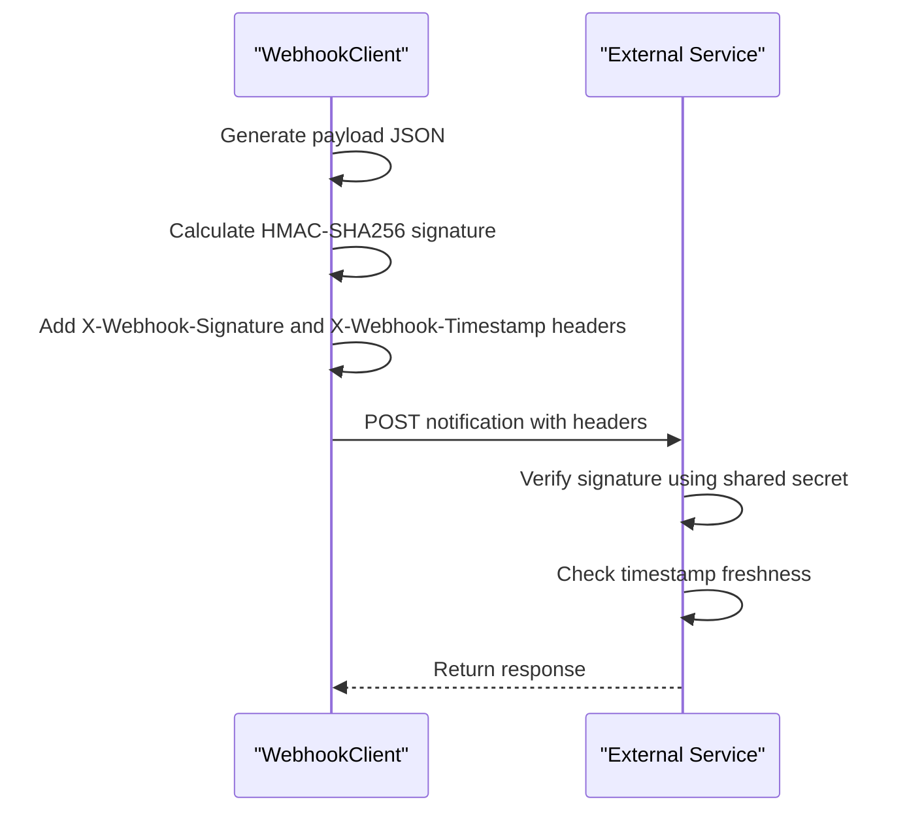
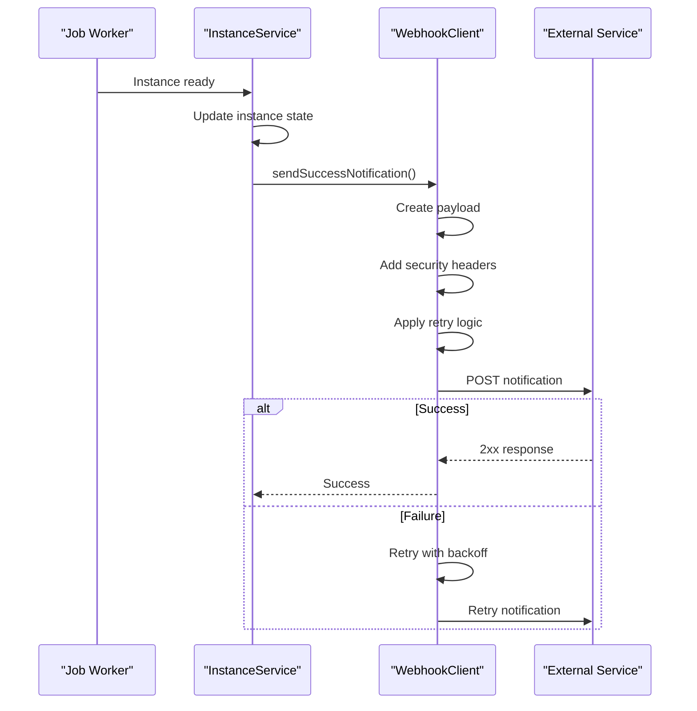
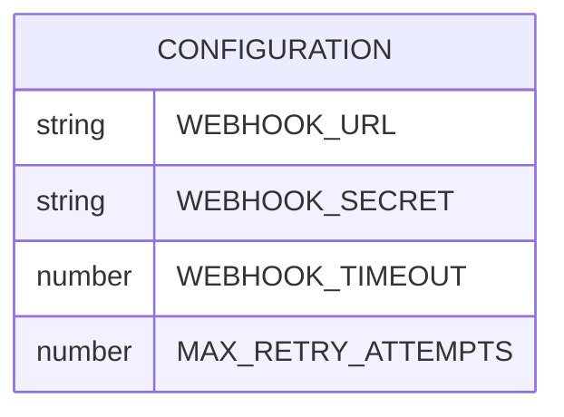

# Webhook Notification System

<cite>
**Referenced Files in This Document**   
- [webhookClient.ts](file://src/clients/webhookClient.ts)
- [config.ts](file://src/config/config.ts)
- [instanceService.ts](file://src/services/instanceService.ts)
- [api.ts](file://src/types/api.ts)
</cite>

## Table of Contents
1. [Introduction](#introduction)
2. [WebhookClient Class Overview](#webhookclient-class-overview)
3. [Payload Structure](#payload-structure)
4. [Security Features](#security-features)
5. [Retry Mechanism](#retry-mechanism)
6. [Notification Methods](#notification-methods)
7. [Error Handling Strategy](#error-handling-strategy)
8. [Integration with InstanceService](#integration-with-instanceservice)
9. [Configuration Options](#configuration-options)
10. [Common Issues and Solutions](#common-issues-and-solutions)
11. [Best Practices](#best-practices)

## Introduction
The webhook notification system provides reliable, secure communication between the GPU instance management platform and external services when instances reach terminal states. This system ensures that users are promptly informed about instance status changes through configurable webhook endpoints. The implementation focuses on delivery reliability, security, and ease of integration, making it suitable for both beginners and experienced developers who need to build robust notification workflows.

## WebhookClient Class Overview

The WebhookClient class serves as the central component for sending notifications to user-provided endpoints. It encapsulates all logic related to payload creation, security signing, retry mechanisms, and error handling.



**Diagram sources**
- [webhookClient.ts](file://src/clients/webhookClient.ts#L47-L239)

**Section sources**
- [webhookClient.ts](file://src/clients/webhookClient.ts#L47-L239)

## Payload Structure

The webhook notification system uses a standardized payload structure to ensure consistency across different event types. The WebhookNotificationPayload interface defines the schema for all notifications.



The payload includes essential information about the instance state change:
- **instanceId**: Unique identifier for the instance within the system
- **status**: Terminal state reached ('running', 'failed', or 'timeout')
- **timestamp**: ISO 8601 formatted timestamp of the event
- **elapsedTime**: Optional duration in milliseconds for operation completion
- **error**: Error message for failed or timeout states
- **data**: Optional additional data specific to the event

**Diagram sources**
- [api.ts](file://src/types/api.ts#L26-L33)

**Section sources**
- [webhookClient.ts](file://src/clients/webhookClient.ts#L16-L24)
- [api.ts](file://src/types/api.ts#L26-L33)

## Security Features

The webhook system implements robust security measures to ensure message integrity and authenticity. HMAC-SHA256 signatures are generated using a shared secret to prevent unauthorized access and tampering.



The signature generation process uses the `generateSignature` method, which creates an HMAC-SHA256 hash of the JSON stringified payload using the WEBHOOK_SECRET. This signature is included in the `X-Webhook-Signature` header with the prefix "sha256=". The `X-Webhook-Timestamp` header contains the Unix timestamp in seconds, allowing receivers to validate the freshness of the request.

**Diagram sources**
- [webhookClient.ts](file://src/clients/webhookClient.ts#L64-L72)
- [webhookClient.ts](file://src/clients/webhookClient.ts#L109-L115)

**Section sources**
- [webhookClient.ts](file://src/clients/webhookClient.ts#L64-L72)

## Retry Mechanism

The system implements an exponential backoff retry strategy to handle transient failures while avoiding unnecessary load on external services.


The retry mechanism follows these rules:
- Maximum of 3 attempts by default
- Exponential backoff delays: 1s, 2s, and 4s between retries
- Only retries on 5xx server errors and network issues
- Does not retry on 4xx client errors, which indicate permanent problems
- Configurable retry count through the `maxRetries` parameter

**Diagram sources**
- [webhookClient.ts](file://src/clients/webhookClient.ts#L117-L188)

**Section sources**
- [webhookClient.ts](file://src/clients/webhookClient.ts#L117-L188)

## Notification Methods

The WebhookClient provides three specialized methods for sending notifications based on the terminal state of GPU instances.

```mermaid
classDiagram
class WebhookClient {
+sendSuccessNotification(url : string, instanceId : string, options : object) Promise~void~
+sendFailureNotification(url : string, instanceId : string, error : string, options : object) Promise~void~
+sendTimeoutNotification(url : string, instanceId : string, options : object) Promise~void~
}
WebhookClient --> "1" WebhookNotificationPayload : creates
WebhookNotificationPayload : +instanceId : string
WebhookNotificationPayload : +status : 'running' | 'failed' | 'timeout'
WebhookNotificationPayload : +timestamp : string
WebhookNotificationPayload : +elapsedTime? : number
WebhookNotificationPayload : +error? : string
```

**sendSuccessNotification** creates a payload with status 'running' when an instance becomes ready. **sendFailureNotification** generates a payload with status 'failed' and includes the error message. **sendTimeoutNotification** creates a payload with status 'timeout' and automatically formats the error message to include the elapsed time.

Each method internally calls `createNotificationPayload` with the appropriate status and options, then invokes `sendWebhook` to handle delivery with retry logic.

**Diagram sources**
- [webhookClient.ts](file://src/clients/webhookClient.ts#L191-L239)

**Section sources**
- [webhookClient.ts](file://src/clients/webhookClient.ts#L191-L239)

## Error Handling Strategy

The webhook system implements comprehensive error handling to ensure reliable delivery attempts and proper error reporting.


The error handling strategy includes:
- Logging delivery attempts at debug level
- Recording successful deliveries at info level
- Warning about failed attempts with error details
- Immediate termination on client errors (4xx status codes)
- Exhaustive retry attempts on server errors (5xx status codes)
- Final error throw after all retries are exhausted

**Diagram sources**
- [webhookClient.ts](file://src/clients/webhookClient.ts#L137-L188)

**Section sources**
- [webhookClient.ts](file://src/clients/webhookClient.ts#L137-L188)

## Integration with InstanceService

The webhook client is integrated into the instance lifecycle management through the InstanceService class, which triggers notifications when instances reach terminal states.



When a GPU instance becomes ready, the job worker updates the instance state in InstanceService, which then calls the appropriate notification method on WebhookClient. The webhook URL is stored in the instance state when the instance is created, allowing the system to notify the correct endpoint.

**Diagram sources**
- [instanceService.ts](file://src/services/instanceService.ts#L110-L125)
- [webhookClient.ts](file://src/clients/webhookClient.ts#L191-L199)

**Section sources**
- [instanceService.ts](file://src/services/instanceService.ts#L110-L125)
- [webhookClient.ts](file://src/clients/webhookClient.ts#L191-L199)

## Configuration Options

The webhook system supports various configuration options through environment variables, allowing customization of behavior without code changes.



Key configuration options include:
- **WEBHOOK_URL**: Default webhook endpoint for notifications
- **WEBHOOK_SECRET**: Secret key for HMAC-SHA256 signature generation
- **WEBHOOK_TIMEOUT**: Timeout in milliseconds for webhook requests (default: 10000)
- **MAX_RETRY_ATTEMPTS**: Maximum number of retry attempts (default: 3)

These values can be set in the .env file or through environment variables, with the system providing sensible defaults when values are not specified.

**Diagram sources**
- [config.ts](file://src/config/config.ts#L23-L38)
- [config.ts](file://src/config/config.ts#L200-L220)

**Section sources**
- [config.ts](file://src/config/config.ts#L23-L38)
- [config.ts](file://src/config/config.ts#L200-L220)

## Common Issues and Solutions

Several common issues may arise when implementing webhook notifications, along with their solutions.

**Signature Verification on Receiver Side**
Issue: Receiver cannot validate the HMAC signature
Solution: Ensure the receiver uses the same secret and hashing algorithm (HMAC-SHA256). The payload must be the raw JSON string without modifications.

**Webhook Delivery Failures**
Issue: Notifications fail to reach the endpoint
Solution: Verify the endpoint URL is accessible and handles POST requests. Check firewall rules and SSL certificates. Implement proper error logging on the receiver.

**Endpoint Availability**
Issue: Transient network issues cause delivery failures
Solution: The built-in retry mechanism with exponential backoff handles temporary outages. Monitor delivery logs to identify persistent issues.

**Timestamp Validation**
Issue: Receiver rejects notifications as stale
Solution: Ensure system clocks are synchronized. The receiver should accept timestamps within a reasonable window (e.g., ±5 minutes).

**Section sources**
- [webhookClient.ts](file://src/clients/webhookClient.ts#L64-L72)
- [webhookClient.ts](file://src/clients/webhookClient.ts#L117-L188)

## Best Practices

To ensure reliable and secure webhook notifications, follow these best practices:

**Delivery Guarantees**
- Implement idempotency in the receiver to handle duplicate notifications
- Use the instanceId as a unique identifier for deduplication
- Monitor delivery logs for patterns of failure

**Security Best Practices**
- Use strong, randomly generated webhook secrets
- Rotate secrets periodically
- Validate the X-Webhook-Timestamp to prevent replay attacks
- Store secrets securely using environment variables or secret management systems

**Performance Considerations**
- Keep webhook endpoints responsive to avoid timeout issues
- Implement proper error handling on the receiver side
- Use the elapsedTime field to monitor instance startup performance
- Consider asynchronous processing on the receiver side for long-running operations

**Debugging Guidance**
- Enable debug logging to trace webhook delivery attempts
- Monitor the X-Webhook-Signature header format
- Verify payload structure matches expected schema
- Test with sample payloads during development

**Section sources**
- [webhookClient.ts](file://src/clients/webhookClient.ts#L64-L72)
- [webhookClient.ts](file://src/clients/webhookClient.ts#L117-L188)
- [config.ts](file://src/config/config.ts#L200-L220)