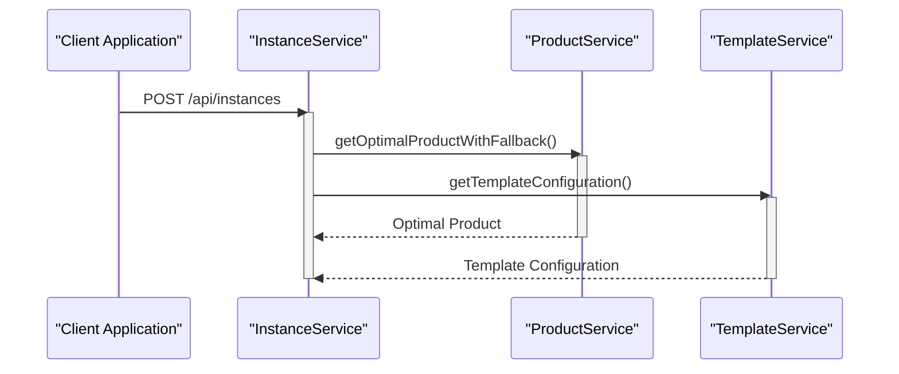

# Instance Creation Workflow

<cite>
**Referenced Files in This Document**   
- [instanceService.ts](file://src/services/instanceService.ts) - *Updated in commit 7b2515db*
- [jobWorkerService.ts](file://src/services/jobWorkerService.ts) - *Added registry authentication support in commit 90d221d8*
- [novitaApiService.ts](file://src/services/novitaApiService.ts) - *Updated API endpoint in commit 7b2515db*
- [api.ts](file://src/types/api.ts) - *Updated request parameters in commit 7b2515db*
- [job.ts](file://src/types/job.ts)
- [instances.ts](file://src/routes/instances.ts)
- [productService.ts](file://src/services/productService.ts) - *Updated in commit 7839892b*
- [templateService.ts](file://src/services/templateService.ts) - *Updated in commit 90d221d8*
</cite>

## Update Summary
**Changes Made**   
- Updated API endpoint from `/api/instances` to `/v1/gpu/instance/create` with new request parameters
- Added documentation for registry authentication support for private image instances
- Updated CreateInstanceJobPayload structure to include image authentication details
- Modified sequence diagram to reflect new authentication workflow
- Updated error handling strategy to include registry authentication errors
- Implemented multi-region fallback for GPU product selection with priority-based region ordering
- Added support for preferred region specification in product selection
- Enhanced error logging with detailed region attempt information

## Table of Contents
1. [Introduction](#introduction)
2. [Instance Creation Workflow Overview](#instance-creation-workflow-overview)
3. [Request Validation and Parameter Processing](#request-validation-and-parameter-processing)
4. [Product and Template Configuration Retrieval](#product-and-template-configuration-retrieval)
5. [Job Queueing and Asynchronous Processing](#job-queueing-and-asynchronous-processing)
6. [CreateInstanceJobPayload Structure](#createinstancejobpayload-structure)
7. [Error Handling Strategy](#error-handling-strategy)
8. [Sequence Diagram: Instance Creation Flow](#sequence-diagram-instance-creation-flow)
9. [Performance Considerations](#performance-considerations)
10. [Conclusion](#conclusion)

## Introduction
This document details the end-to-end workflow for creating GPU instances within the Novitai platform. The process begins with an API request to create an instance and concludes with the queuing of a high-priority job for asynchronous processing. The workflow involves multiple services coordinating to validate input parameters, determine optimal configurations, and initiate background processing. This documentation provides a comprehensive analysis of the instance creation process, including validation mechanisms, service interactions, job queuing, and error handling strategies.

## Instance Creation Workflow Overview
The instance creation workflow is a multi-step process that begins with an API request and concludes with the queuing of a high-priority job for asynchronous processing. The workflow is orchestrated by the InstanceService, which coordinates with ProductService and TemplateService to determine the optimal configuration for the requested instance. Once all necessary information is gathered, the workflow queues a creation job through the JobQueueService for asynchronous processing.

The workflow follows a clear sequence:
1. Receive and validate the CreateInstanceRequest
2. Generate a unique instance ID
3. Retrieve optimal product and template configurations in parallel
4. Create and store instance state
5. Queue a high-priority creation job
6. Return a success response to the client

This design ensures that the API response is returned quickly while the resource-intensive creation process occurs asynchronously in the background.

**Section sources**
- [instanceService.ts](file://src/services/instanceService.ts#L20-L514)

## Request Validation and Parameter Processing
The instance creation workflow begins with rigorous validation of the CreateInstanceRequest parameters. The InstanceService performs comprehensive validation to ensure all required fields are present and meet specified criteria. The validation process checks several key parameters:

- **Instance name**: Must be a non-empty string
- **Product name**: Required non-empty string specifying the GPU product
- **Template ID**: Required string or positive number identifying the template
- **GPU number**: Optional, defaults to 1, must be between 1 and 8
- **Root filesystem size**: Optional, defaults to 60GB, must be between 10 and 1000GB
- **Region**: Optional, defaults to 'CN-HK-01'
- **Webhook URL**: Optional, must be a valid HTTP/HTTPS URL

The validation is performed synchronously before any external service calls are made, ensuring that invalid requests are rejected immediately without consuming additional resources. Upon successful validation, the workflow generates a unique instance ID using a combination of timestamp and random string to ensure global uniqueness.

**Section sources**
- [instanceService.ts](file://src/services/instanceService.ts#L20-L514)
- [api.ts](file://src/types/api.ts#L9-L17)

## Product and Template Configuration Retrieval
After request validation, the workflow retrieves the optimal product and template configurations needed for instance creation. The InstanceService coordinates with ProductService and TemplateService to obtain these configurations through parallel execution, optimizing performance by reducing overall latency.

The ProductService determines the optimal GPU product based on the requested product name and region, selecting the available product with the lowest spot price. This selection process now incorporates multi-region fallback capabilities through the getOptimalProductWithFallback method, which attempts to find an available product across multiple regions in order of priority. If a preferred region is specified, it is tried first before falling back to other regions according to their priority configuration.

The TemplateService retrieves the template configuration, including the container image URL, authentication details, exposed ports, and environment variables. When a template requires registry authentication (indicated by the imageAuth field), the system will later retrieve the necessary credentials during job processing.

Both service calls are executed in parallel using Promise.all(), allowing the workflow to complete these external lookups simultaneously rather than sequentially. This parallel execution significantly reduces the total processing time for the initial phase of instance creation.



**Diagram sources**
- [instanceService.ts](file://src/services/instanceService.ts#L20-L514)
- [productService.ts](file://src/services/productService.ts#L148-L235)
- [templateService.ts](file://src/services/templateService.ts#L20-L288)

**Section sources**
- [instanceService.ts](file://src/services/instanceService.ts#L20-L514)
- [productService.ts](file://src/services/productService.ts#L148-L235)
- [templateService.ts](file://src/services/templateService.ts#L20-L288)

## Job Queueing and Asynchronous Processing
Once the product and template configurations are retrieved, the workflow proceeds to queue a high-priority job for asynchronous processing. The InstanceService creates an instance state object containing all necessary configuration details and stores it in memory. Then, it constructs a CreateInstanceJobPayload and submits it to the JobQueueService with HIGH priority.

The JobQueueService manages a priority-based queue of background jobs, ensuring that instance creation tasks are processed promptly. Jobs are processed in order of priority (HIGH, NORMAL, LOW) and creation time, with high-priority creation jobs taking precedence over other tasks. The job processing occurs at regular intervals (default: 1 second), allowing for timely execution while maintaining system stability.

When a job is processed, the JobWorkerService executes the appropriate handler based on the job type. For creation jobs, the handleCreateInstance method is invoked, which performs the actual instance creation through the Novita.ai API. During this process, the JobWorkerService handles additional steps such as retrieving registry authentication credentials when required by the template configuration.

**Section sources**
- [instanceService.ts](file://src/services/instanceService.ts#L20-L514)
- [jobQueueService.ts](file://src/services/jobQueueService.ts#L21-L374)
- [jobWorkerService.ts](file://src/services/jobWorkerService.ts#L26-L604)

## CreateInstanceJobPayload Structure
The CreateInstanceJobPayload is a structured data object that contains all necessary information for creating a GPU instance. This payload is serialized and stored in the job queue, allowing the job worker to access all required parameters when processing the creation task.

The payload structure includes the following fields:
- **instanceId**: Unique identifier for the instance
- **name**: User-provided name for the instance
- **productName**: Name of the requested GPU product
- **templateId**: Identifier for the selected template
- **gpuNum**: Number of GPUs to allocate
- **rootfsSize**: Size of the root filesystem in GB
- **region**: Target region for instance deployment
- **webhookUrl**: Optional webhook URL for status notifications
- **imageAuth**: Optional authentication ID for private container images

This payload structure ensures that all necessary information is preserved between the initial API request and the asynchronous job execution, maintaining data integrity throughout the creation process.

**Section sources**
- [job.ts](file://src/types/job.ts#L39-L48)
- [instanceService.ts](file://src/services/instanceService.ts#L20-L514)
- [jobWorkerService.ts](file://src/services/jobWorkerService.ts#L26-L604)

## Error Handling Strategy
The instance creation workflow implements a comprehensive error handling strategy to manage various failure scenarios gracefully. The system distinguishes between validation errors, service unavailability, and transient failures, applying appropriate handling mechanisms for each case.

Validation errors are caught synchronously during the initial request processing and result in immediate 400 Bad Request responses with detailed error messages. These errors include invalid instance names, missing product names, invalid template IDs, out-of-range GPU counts, and malformed webhook URLs.

For service unavailability and transient errors, the system employs retry mechanisms with exponential backoff. Jobs that fail due to temporary issues (e.g., network connectivity problems, rate limiting) are automatically retried up to three times with increasing delays between attempts. Permanent failures result in the instance status being updated to "failed" with appropriate error details.

The error handling also includes circuit breaker patterns in the NovitaClient to prevent cascading failures when external services are down, and comprehensive logging to facilitate debugging and monitoring. Additionally, the workflow now handles registry authentication errors when accessing private container images, with specific error handling for missing or invalid authentication credentials. The multi-region product selection includes detailed error tracking for each attempted region, providing comprehensive failure diagnostics when no suitable product is found across all regions.

**Section sources**
- [instanceService.ts](file://src/services/instanceService.ts#L20-L514)
- [novitaApiService.ts](file://src/services/novitaApiService.ts#L20-L480)
- [jobWorkerService.ts](file://src/services/jobWorkerService.ts#L26-L604)
- [api.ts](file://src/types/api.ts#L200-L308)
- [productService.ts](file://src/services/productService.ts#L148-L235)

## Sequence Diagram: Instance Creation Flow
The following sequence diagram illustrates the complete interaction between components during the instance creation workflow, from API request to job queuing:

```mermaid
sequenceDiagram
participant Client as "Client Application"
participant InstancesRouter as "instancesRouter"
participant InstanceService as "InstanceService"
participant ProductService as "ProductService"
participant TemplateService as "TemplateService"
participant JobQueueService as "JobQueueService"
participant JobWorkerService as "JobWorkerService"
Client->>InstancesRouter : POST /api/instances
activate InstancesRouter
InstancesRouter->>InstanceService : createInstance(request)
activate InstanceService
InstanceService->>InstanceService : validateCreateInstanceRequest()
alt Validation Failed
InstanceService-->>InstancesRouter : ValidationError
InstancesRouter-->>Client : 400 Bad Request
deactivate InstancesRouter
deactivate InstanceService
else Valid Request
InstanceService->>InstanceService : generateInstanceId()
Note over InstanceService : Generate unique instance ID
par Parallel Lookups
InstanceService->>ProductService : getOptimalProductWithFallback()
activate ProductService
InstanceService->>TemplateService : getTemplateConfiguration()
activate TemplateService
ProductService-->>InstanceService : Optimal Product
deactivate ProductService
TemplateService-->>InstanceService : Template Config
deactivate TemplateService
end
InstanceService->>InstanceService : Create instance state
Note over InstanceService : Store instance state in memory
InstanceService->>JobQueueService : addJob(HIGH priority)
activate JobQueueService
JobQueueService-->>InstanceService : Job ID
deactivate JobQueueService
InstanceService-->>InstancesRouter : CreateInstanceResponse
deactivate InstanceService
InstancesRouter-->>Client : 201 Created
deactivate InstancesRouter
end
```

**Diagram sources**
- [instances.ts](file://src/routes/instances.ts#L0-L132)
- [instanceService.ts](file://src/services/instanceService.ts#L20-L514)
- [productService.ts](file://src/services/productService.ts#L148-L235)
- [templateService.ts](file://src/services/templateService.ts#L20-L288)
- [jobQueueService.ts](file://src/services/jobQueueService.ts#L21-L374)
- [jobWorkerService.ts](file://src/services/jobWorkerService.ts#L26-L604)

## Performance Considerations
The instance creation workflow incorporates several performance optimizations to ensure responsiveness and scalability:

1. **Parallel Execution**: Product and template lookups are executed in parallel using Promise.all(), reducing the total latency from sequential execution to the duration of the slower operation.

2. **Caching**: Both ProductService and TemplateService implement caching mechanisms to reduce the frequency of external API calls. Product information is cached for 5 minutes, while template configurations are cached for 10 minutes, significantly reducing response times for repeated requests.

3. **Asynchronous Processing**: By queuing creation jobs for background processing, the API can return responses quickly (typically under 100ms) while the resource-intensive creation process occurs asynchronously.

4. **Job Queue Processing Interval**: The JobQueueService processes jobs at configurable intervals (default: 1 second), balancing responsiveness with system resource utilization. This interval can be adjusted based on system load and performance requirements.

5. **Memory Management**: Instance states are stored in memory with appropriate cleanup mechanisms to prevent memory leaks, while detailed instance information is cached with configurable TTLs and cleanup intervals.

These performance considerations ensure that the system can handle high volumes of creation requests efficiently while maintaining responsiveness and stability.

**Section sources**
- [instanceService.ts](file://src/services/instanceService.ts#L20-L514)
- [productService.ts](file://src/services/productService.ts#L20-L280)
- [templateService.ts](file://src/services/templateService.ts#L20-L288)
- [jobQueueService.ts](file://src/services/jobQueueService.ts#L21-L374)

## Conclusion
The instance creation workflow represents a well-designed, scalable system for managing GPU instance provisioning. By separating the API response from the actual creation process through asynchronous job queuing, the system achieves high responsiveness while handling resource-intensive operations in the background. The workflow's modular design, with clear separation of concerns between services, enables maintainability and extensibility.

Key strengths of the workflow include comprehensive validation, parallel execution of external lookups, robust error handling with retry mechanisms, and performance optimizations through caching and asynchronous processing. The use of high-priority job queuing ensures that creation tasks are processed promptly, while the structured payload design maintains data integrity throughout the process.

This architecture effectively balances immediate user feedback with reliable background processing, providing a seamless experience for users while maintaining system stability under varying loads.