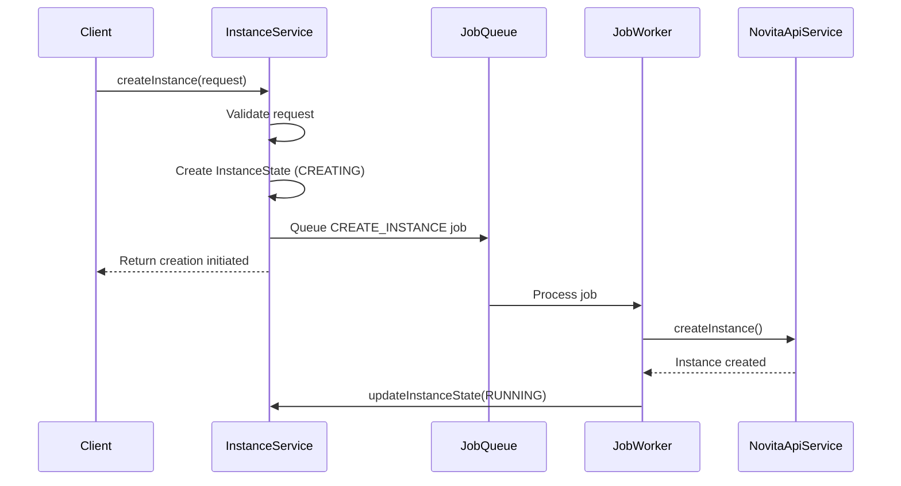
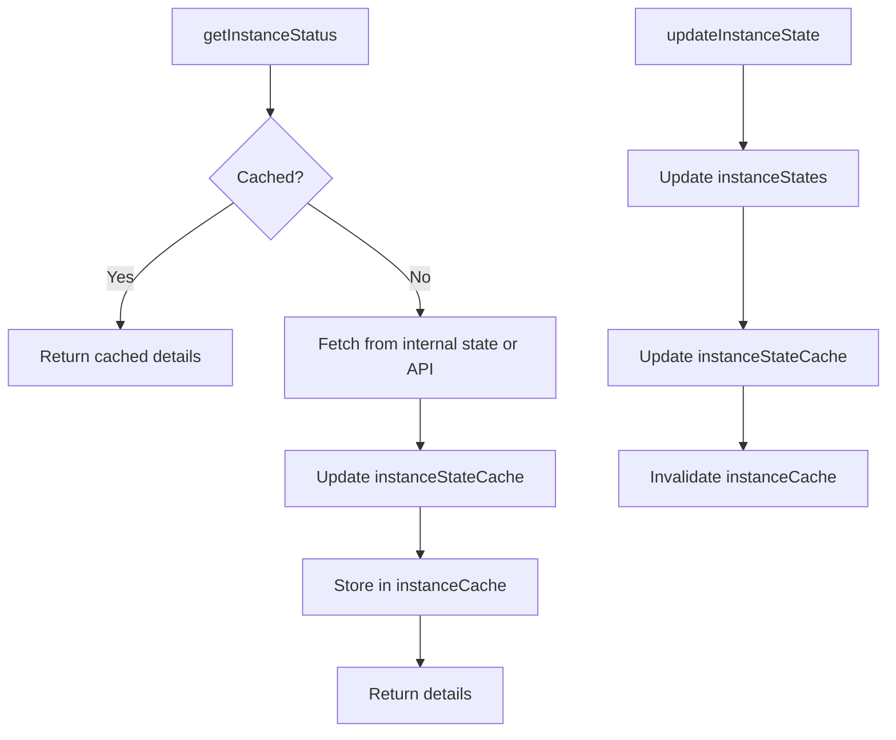
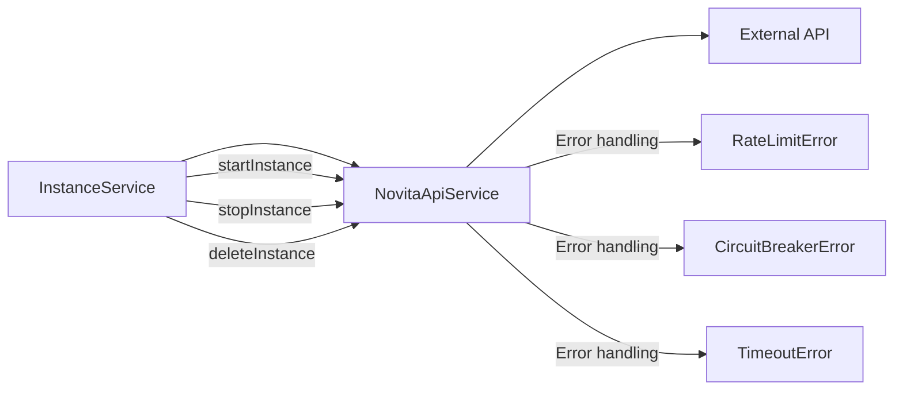

# Instance Lifecycle Management

<cite>
**Referenced Files in This Document**   
- [instanceService.ts](file://src/services/instanceService.ts)
- [novitaApiService.ts](file://src/services/novitaApiService.ts)
- [jobWorkerService.ts](file://src/services/jobWorkerService.ts)
- [api.ts](file://src/types/api.ts)
</cite>

## Table of Contents
1. [Instance Lifecycle Management](#instance-lifecycle-management)
2. [State Machine Implementation](#state-machine-implementation)
3. [Lifecycle Operations](#lifecycle-operations)
4. [Cache Management](#cache-management)
5. [Integration with NovitaApiService](#integration-with-novitaapiservice)
6. [Reliability and Cleanup](#reliability-and-cleanup)

## State Machine Implementation

The InstanceService implements a comprehensive state machine for managing GPU instances through their complete lifecycle. The state management is centered around the `InstanceState` object, which is stored in memory using a Map data structure (`instanceStates: Map<string, InstanceState>`). Each `InstanceState` object contains detailed information about an instance including its current status, configuration, timestamps, and error information.

The state machine transitions are managed through the `updateInstanceState` method, which allows job workers to modify instance state throughout the lifecycle. The `InstanceStatus` enum defines all possible states: CREATING, CREATED, STARTING, RUNNING, STOPPING, STOPPED, FAILED, and TERMINATED. These internal states are synchronized with the Novita.ai API states to ensure consistency between the internal tracking system and the external provider.

**Section sources**
- [instanceService.ts](file://src/services/instanceService.ts#L69-L119)
- [api.ts](file://src/types/api.ts#L188-L212)

## Lifecycle Operations

### Creation Process
The instance creation process begins with the `createInstance` method, which validates the request parameters and generates a unique instance ID. The initial state is set to `CREATING` and stored in the `instanceStates` map. The creation workflow is then delegated to a background job via the job queue system, allowing for asynchronous processing without blocking the API response.

**Diagram sources**
- [instanceService.ts](file://src/services/instanceService.ts#L69-L119)
- [jobWorkerService.ts](file://src/services/jobWorkerService.ts#L40-L80)

### Running and Stopping
Instances transition to the `RUNNING` state after successful creation and startup. The `startInstance` operation is handled by the NovitaApiService, which communicates with the external API to initiate the start process. Similarly, the `stopInstance` operation transitions the instance to the `STOPPING` state, eventually reaching `STOPPED`. These operations are performed through the integration with NovitaApiService, ensuring that internal state changes are reflected in the external system.

### Termination
Termination is the final state in the instance lifecycle, represented by the `TERMINATED` status. This state is reached when an instance is deleted through the `deleteInstance` operation. The termination process involves removing the instance from the external system and cleaning up the internal state tracking.

**Section sources**
- [instanceService.ts](file://src/services/instanceService.ts#L69-L119)
- [novitaApiService.ts](file://src/services/novitaApiService.ts#L201-L250)

## Cache Management

The InstanceService employs a sophisticated caching strategy using TTL-based caching to optimize performance and reduce external API calls. Two separate caches are maintained: `instanceCache` for instance details with a 30-second TTL, and `instanceStateCache` for instance states with a 60-second TTL.

The `updateInstanceState` method automatically triggers cache invalidation by removing the instance from the `instanceCache`, ensuring that subsequent requests will fetch fresh data. This cache invalidation strategy maintains data consistency while still providing performance benefits for frequently accessed instance information.

**Diagram sources**
- [instanceService.ts](file://src/services/instanceService.ts#L248-L268)
- [instanceService.ts](file://src/services/instanceService.ts#L471-L475)

## Integration with NovitaApiService

The InstanceService integrates with the NovitaApiService to perform operations on the external API, including starting, stopping, and deleting instances. This integration follows a consistent pattern where internal state changes are first recorded, then propagated to the external system.

Error propagation is handled comprehensively, with specific error types (NovitaApiClientError, RateLimitError, CircuitBreakerError) being thrown and caught appropriately. The service implements graceful degradation by returning cached state when the external API is unavailable, ensuring system resilience.

The `listInstances` method demonstrates this integration pattern by attempting to fetch current status from the Novita API for each instance, but falling back to the cached internal state if the API call fails. This ensures that the list operation remains available even during external API outages.

**Diagram sources**
- [novitaApiService.ts](file://src/services/novitaApiService.ts#L201-L351)
- [instanceService.ts](file://src/services/instanceService.ts#L159-L192)

## Reliability and Cleanup

### State Consistency
The system ensures state consistency between internal tracking and the external API through periodic synchronization. When retrieving instance status, the service first attempts to fetch the latest state from the Novita API and updates the internal state accordingly. This bidirectional synchronization prevents state drift and ensures that the internal representation accurately reflects the actual instance state.

### Cleanup Mechanism
The `removeInstanceState` method provides a cleanup mechanism for removing instance states from the system. This method removes the instance from both the `instanceStates` map and both caches (`instanceCache` and `instanceStateCache`). The cleanup process is logged for monitoring purposes and returns a boolean indicating whether the instance was successfully removed.

The service also includes periodic cache cleanup through the `clearExpiredCache` method, which removes entries that have exceeded their TTL. This prevents memory leaks and ensures that the cache remains efficient over time.

**Section sources**
- [instanceService.ts](file://src/services/instanceService.ts#L503-L513)
- [instanceService.ts](file://src/services/instanceService.ts#L418-L466)