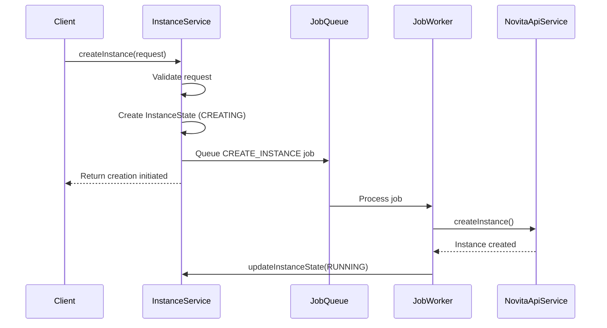
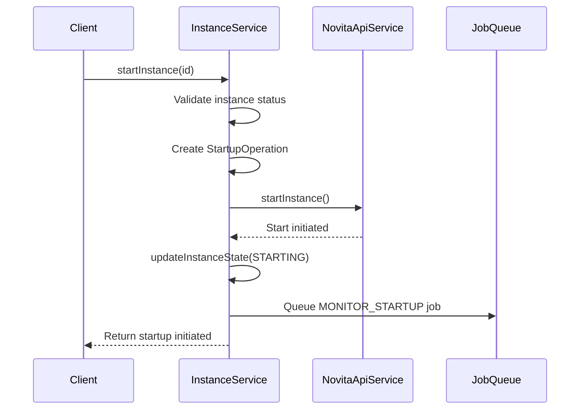
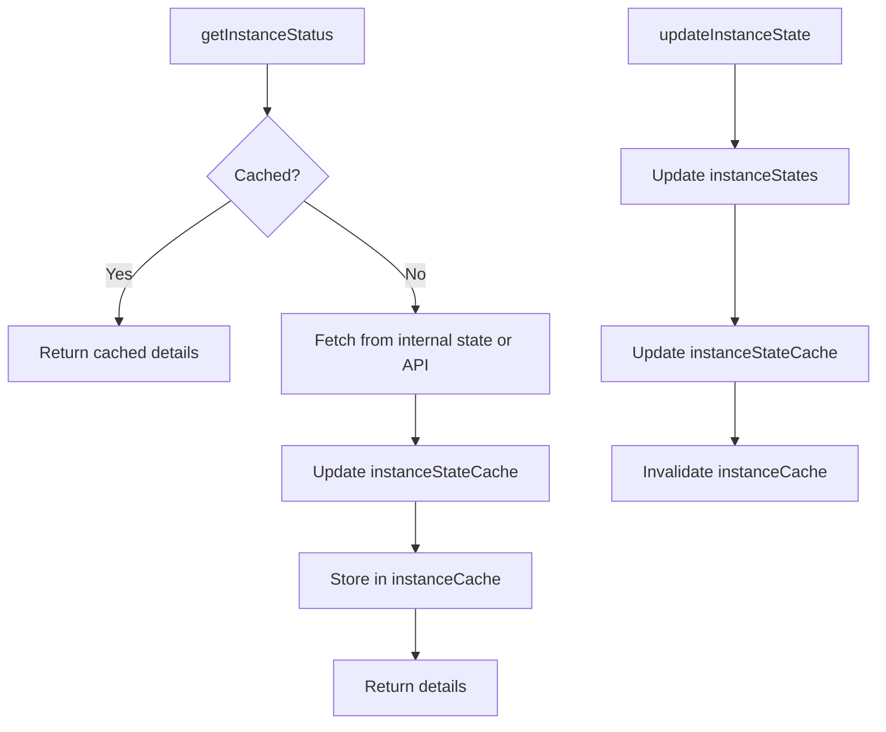
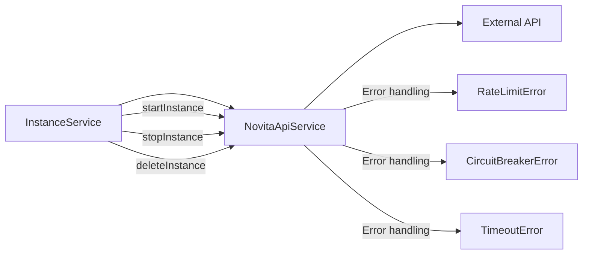

# Instance Lifecycle Management

<cite>
**Referenced Files in This Document**   
- [instanceService.ts](file://src/services/instanceService.ts) - *Updated in commit 52581c45*
- [novitaApiService.ts](file://src/services/novitaApiService.ts) - *Updated in commit 52581c45*
- [HealthCheckerService.ts](file://src/services/HealthCheckerService.ts) - *Added in commit 2fdb376e*
- [api.ts](file://src/types/api.ts) - *Updated in commits 52581c45 and 2fdb376e*
</cite>

## Update Summary
**Changes Made**   
- Added new section on startup tracking and monitoring for instances in exited status
- Added new section on application-level health checks and READY status transition
- Updated state machine implementation to include new states (HEALTH_CHECKING, READY, EXITED)
- Updated lifecycle operations to include startInstance functionality
- Added new sequence diagram for instance startup process
- Updated cache management section to reflect new cache invalidation patterns
- Enhanced integration section with NovitaApiService to include start operations
- Added new reliability section covering startup operation tracking

## Table of Contents
1. [Instance Lifecycle Management](#instance-lifecycle-management)
2. [State Machine Implementation](#state-machine-implementation)
3. [Lifecycle Operations](#lifecycle-operations)
4. [Cache Management](#cache-management)
5. [Integration with NovitaApiService](#integration-with-novitaapiservice)
6. [Reliability and Cleanup](#reliability-and-cleanup)

## State Machine Implementation

The InstanceService implements a comprehensive state machine for managing GPU instances through their complete lifecycle. The state management is centered around the `InstanceState` object, which is stored in memory using a Map data structure (`instanceStates: Map<string, InstanceState>`). Each `InstanceState` object contains detailed information about an instance including its current status, configuration, timestamps, and error information.

The state machine transitions are managed through the `updateInstanceState` method, which allows job workers to modify instance state throughout the lifecycle. The `InstanceStatus` enum defines all possible states: CREATING, CREATED, STARTING, RUNNING, HEALTH_CHECKING, READY, STOPPING, STOPPED, FAILED, TERMINATED, and EXITED. These internal states are synchronized with the Novita.ai API states to ensure consistency between the internal tracking system and the external provider.

The state machine now includes two new states: `HEALTH_CHECKING` and `READY`. When an instance successfully starts, it transitions to `HEALTH_CHECKING` state where application-level health checks are performed. Upon successful completion of health checks, the instance transitions to `READY` state, indicating it is fully operational and ready for use. The `EXITED` state represents instances that have been stopped and can be restarted.

**Section sources**
- [instanceService.ts](file://src/services/instanceService.ts#L69-L119) - *Updated in commit 52581c45*
- [api.ts](file://src/types/api.ts#L338-L350) - *Updated in commits 52581c45 and 2fdb376e*

## Lifecycle Operations

### Creation Process
The instance creation process begins with the `createInstance` method, which validates the request parameters and generates a unique instance ID. The initial state is set to `CREATING` and stored in the `instanceStates` map. The creation workflow is then delegated to a background job via the job queue system, allowing for asynchronous processing without blocking the API response.

**Diagram sources**
- [instanceService.ts](file://src/services/instanceService.ts#L69-L119)
- [jobWorkerService.ts](file://src/services/jobWorkerService.ts#L40-L80)

### Running and Stopping
Instances transition to the `RUNNING` state after successful creation and startup. The `startInstance` operation is handled by the NovitaApiService, which communicates with the external API to initiate the start process. Similarly, the `stopInstance` operation transitions the instance to the `STOPPING` state, eventually reaching `STOPPED`. These operations are performed through the integration with NovitaApiService, ensuring that internal state changes are reflected in the external system.

### Termination
Termination is the final state in the instance lifecycle, represented by the `TERMINATED` status. This state is reached when an instance is deleted through the `deleteInstance` operation. The termination process involves removing the instance from the external system and cleaning up the internal state tracking.

### Startup Tracking for Exited Instances
The system now supports starting instances that are in the `EXITED` state. The `startInstance` method validates that only instances in `EXITED` status can be started, preventing duplicate start operations. To prevent concurrent startup attempts, the system tracks active startup operations using the `activeStartupOperations` map, which stores `StartupOperation` objects containing operation ID, status, timestamps, and phase information.

When a start request is received, the system creates a new `StartupOperation` with status 'initiated' and adds it to the tracking map. This prevents subsequent start requests from proceeding while the initial startup is in progress. The operation tracks progress through phases including 'startRequested', 'monitoring', 'health_checking', and 'completed'.

**Diagram sources**
- [instanceService.ts](file://src/services/instanceService.ts#L1366-L1564) - *Added in commit 52581c45*
- [novitaApiService.ts](file://src/services/novitaApiService.ts#L282-L323) - *Updated in commit 52581c45*

### Application-Level Health Checks
After an instance starts successfully, it undergoes application-level health checks before transitioning to the `READY` status. The `HealthCheckerService` performs comprehensive health checks on all exposed endpoints, with configurable timeout, retry attempts, and target port specifications. The health check process validates that the application is not only running but also responsive and functioning correctly.

The health check workflow includes:
1. Parallel checking of all configured endpoints
2. Retry mechanism with exponential backoff for failed checks
3. Comprehensive error categorization (timeout, connection refused, etc.)
4. Response body analysis to detect error messages even with 2xx status codes
5. Detailed result aggregation with overall status (healthy, partial, unhealthy)

When health checks are initiated, the instance state transitions to `HEALTH_CHECKING` and the `healthCheck` object in `InstanceState` is updated with status 'in_progress'. Upon successful completion, the instance transitions to `READY` status and the `ready` timestamp is recorded.

**Section sources**
- [HealthCheckerService.ts](file://src/services/HealthCheckerService.ts#L0-L1092) - *Added in commit 2fdb376e*
- [instanceService.ts](file://src/services/instanceService.ts#L1089-L1128) - *Updated in commit 2fdb376e*

## Cache Management

The InstanceService employs a sophisticated caching strategy using TTL-based caching to optimize performance and reduce external API calls. Two separate caches are maintained: `instanceCache` for instance details with a 30-second TTL, and `instanceStateCache` for instance states with a 60-second TTL.

The `updateInstanceState` method automatically triggers cache invalidation by removing the instance from the `instanceCache`, ensuring that subsequent requests will fetch fresh data. This cache invalidation strategy maintains data consistency while still providing performance benefits for frequently accessed instance information.

The `invalidateInstanceCache` method provides explicit cache invalidation for both instance details and state caches, which is called during state transitions and startup operations. The system also maintains a `mergedInstancesCache` for comprehensive instance listings with configurable TTL based on configuration settings.

**Diagram sources**
- [instanceService.ts](file://src/services/instanceService.ts#L248-L268)
- [instanceService.ts](file://src/services/instanceService.ts#L471-L475)

## Integration with NovitaApiService

The InstanceService integrates with the NovitaApiService to perform operations on the external API, including starting, stopping, and deleting instances. This integration follows a consistent pattern where internal state changes are first recorded, then propagated to the external system.

Error propagation is handled comprehensively, with specific error types (NovitaApiClientError, RateLimitError, CircuitBreakerError) being thrown and caught appropriately. The service implements graceful degradation by returning cached state when the external API is unavailable, ensuring system resilience.

The `listInstances` method demonstrates this integration pattern by attempting to fetch current status from the Novita API for each instance, but falling back to the cached internal state if the API call fails. This ensures that the list operation remains available even during external API outages.

For startup operations, the `startInstanceWithRetry` method in NovitaApiService provides enhanced reliability with retry logic and circuit breaker protection. The integration includes webhook notifications for startup events, allowing external systems to monitor the startup progress.

**Diagram sources**
- [novitaApiService.ts](file://src/services/novitaApiService.ts#L201-L351)
- [instanceService.ts](file://src/services/instanceService.ts#L159-L192)

## Reliability and Cleanup

### State Consistency
The system ensures state consistency between internal tracking and the external API through periodic synchronization. When retrieving instance status, the service first attempts to fetch the latest state from the Novita API and updates the internal state accordingly. This bidirectional synchronization prevents state drift and ensures that the internal representation accurately reflects the actual instance state.

The `syncLocalStateWithNovita` method periodically synchronizes local state with Novita API data, updating status and other fields when discrepancies are found. This ensures that the internal state remains accurate even if external changes occur outside of the normal workflow.

### Startup Operation Tracking
To ensure reliability during instance startup, the system implements comprehensive startup operation tracking. The `activeStartupOperations` map stores `StartupOperation` objects that track the progress of each startup attempt. Each operation includes:
- Unique operation ID
- Instance ID and Novita instance ID
- Current status (initiated, monitoring, health_checking, completed, failed)
- Start timestamp and phase timestamps
- Error information if startup fails

This tracking prevents duplicate startup attempts and provides detailed audit trails for troubleshooting. The system validates startup eligibility by checking both the instance status and the presence of active startup operations.

### Cleanup Mechanism
The `removeInstanceState` method provides a cleanup mechanism for removing instance states from the system. This method removes the instance from both the `instanceStates` map and both caches (`instanceCache` and `instanceStateCache`). The cleanup process is logged for monitoring purposes and returns a boolean indicating whether the instance was successfully removed.

The service also includes periodic cache cleanup through the `clearExpiredCache` method, which removes entries that have exceeded their TTL. This prevents memory leaks and ensures that the cache remains efficient over time.

**Section sources**
- [instanceService.ts](file://src/services/instanceService.ts#L503-L513)
- [instanceService.ts](file://src/services/instanceService.ts#L418-L466)
- [instanceService.ts](file://src/services/instanceService.ts#L1130-L1150) - *Added in commit 52581c45*