# Instance Management System

<cite>
**Referenced Files in This Document**   
- [instanceService.ts](file://src/services/instanceService.ts)
- [jobQueueService.ts](file://src/services/jobQueueService.ts)
- [novitaApiService.ts](file://src/services/novitaApiService.ts)
- [novitaClient.ts](file://src/clients/novitaClient.ts)
- [templateService.ts](file://src/services/templateService.ts)
- [config.ts](file://src/config/config.ts)
</cite>

## Table of Contents
1. [Introduction](#introduction)
2. [End-to-End Instance Creation Workflow](#end-to-end-instance-creation-workflow)
3. [InstanceService: Core Coordination Layer](#instanceservice-core-coordination-layer)
4. [JobQueueService: Asynchronous Processing](#jobqueueservice-asynchronous-processing)
5. [NovitaApiService and NovitaClient Integration](#novitaapiservice-and-novitaclient-integration)
6. [Instance Status Polling and Readiness Detection](#instance-status-polling-and-readiness-detection)
7. [Template-Based Configuration System](#template-based-configuration-system)
8. [Failure Recovery and Retry Mechanisms](#failure-recovery-and-retry-mechanisms)
9. [Performance Considerations](#performance-considerations)
10. [Client Implementation Best Practices](#client-implementation-best-practices)

## Introduction
The Instance Management System provides a comprehensive solution for GPU instance lifecycle management, from API request to fully provisioned instance. This document details the end-to-end workflow, component interactions, and architectural patterns that enable reliable instance provisioning through the Novita.ai platform. The system is designed with scalability, fault tolerance, and operational observability in mind, implementing asynchronous processing, circuit breaker patterns, and comprehensive retry mechanisms to ensure reliable operation in distributed environments.

## End-to-End Instance Creation Workflow
The GPU instance creation process follows a well-defined workflow that begins with an API request and concludes with a fully provisioned and ready instance. When a client submits a POST request to `/api/instances` with instance configuration parameters, the system initiates a coordinated sequence of operations that manage the entire lifecycle. The workflow begins with request validation and proceeds through product optimization, template configuration retrieval, job queuing, and asynchronous provisioning. Throughout this process, the system maintains state and provides real-time status updates to clients through both polling and optional webhook notifications.

The workflow is designed to be non-blocking, allowing the API to respond immediately with an instance ID and estimated readiness time while background processes handle the actual provisioning. This approach ensures responsive API performance even during periods of high demand or when provisioning operations require extended time to complete. The system tracks instance state throughout the process, transitioning from "creating" to "starting" and finally to "running" status as the instance becomes available.

```mermaid
sequenceDiagram
participant Client as "Client Application"
participant API as "API Endpoint"
participant InstanceService as "InstanceService"
participant JobQueue as "JobQueueService"
participant JobWorker as "Job Worker"
participant NovitaAPI as "Novita.ai API"
Client->>API : POST /api/instances<br/>{name, productName, templateId}
API->>InstanceService : createInstance(request)
activate InstanceService
InstanceService->>InstanceService : Validate request parameters
InstanceService->>productService : getOptimalProduct(productName, region)
InstanceService->>templateService : getTemplateConfiguration(templateId)
parallel
productService-->>InstanceService : Optimal product configuration
templateService-->>InstanceService : Template configuration
end
InstanceService->>InstanceService : Create instance state
InstanceService->>JobQueue : addJob(CREATE_INSTANCE, payload)
JobQueue-->>InstanceService : Job ID
deactivate InstanceService
InstanceService-->>API : CreateInstanceResponse<br/>{instanceId, status : "creating"}
API-->>Client : 201 Created<br/>{instanceId, estimatedReadyTime}
loop Job Processing
JobQueue->>JobWorker : Process CREATE_INSTANCE job
activate JobWorker
JobWorker->>NovitaAPI : createInstance(request)
activate NovitaAPI
NovitaAPI-->>JobWorker : Instance creation response
deactivate NovitaAPI
JobWorker->>InstanceService : updateInstanceState(status : "starting")
JobWorker->>JobQueue : addJob(MONITOR_INSTANCE, payload)
deactivate JobWorker
end
loop Status Monitoring
JobQueue->>JobWorker : Process MONITOR_INSTANCE job
activate JobWorker
JobWorker->>NovitaAPI : getInstance(instanceId)
NovitaAPI-->>JobWorker : Instance status
alt Instance is running
JobWorker->>InstanceService : updateInstanceState(status : "running")
JobWorker->>JobQueue : addJob(SEND_WEBHOOK, payload)
else Instance still starting
JobWorker->>JobQueue : Reschedule MONITOR_INSTANCE job
end
deactivate JobWorker
end
```

**Diagram sources**
- [instanceService.ts](file://src/services/instanceService.ts#L37-L119)
- [jobQueueService.ts](file://src/services/jobQueueService.ts#L21-L374)
- [novitaApiService.ts](file://src/services/novitaApiService.ts#L18-L474)

**Section sources**
- [instanceService.ts](file://src/services/instanceService.ts#L37-L119)
- [novitaApiService.ts](file://src/services/novitaApiService.ts#L18-L474)
- [jobQueueService.ts](file://src/services/jobQueueService.ts#L21-L374)

## InstanceService: Core Coordination Layer
The InstanceService serves as the central coordination component for GPU instance lifecycle management, orchestrating creation, monitoring, and termination operations. This service maintains the authoritative state for all managed instances through an in-memory state store and provides a clean API interface for instance operations. When creating a new instance, InstanceService validates the request, determines optimal product configuration based on pricing and availability, retrieves template settings, and initiates the provisioning workflow through the job queue system.

The service implements a comprehensive state management system that tracks instance status throughout its lifecycle, from creation through running and termination. It maintains two levels of caching: instance details cache with a 30-second TTL for frequently accessed status information, and instance state cache with a 1-minute TTL for internal state management. This caching strategy reduces load on the external Novita.ai API while ensuring clients receive timely status updates. The service also provides methods for updating instance state, which are used by background job workers to reflect changes in instance status as provisioning progresses.

InstanceService integrates with multiple supporting services to fulfill its coordination role. It works with productService to identify the optimal GPU product based on spot pricing and availability, templateService to retrieve configuration templates, and jobQueueService to manage asynchronous provisioning tasks. The service also handles webhook integration, allowing clients to receive notifications when instances reach ready state. This integration enables event-driven architectures where client applications can respond immediately to instance availability without continuous polling.

**Section sources**
- [instanceService.ts](file://src/services/instanceService.ts#L20-L512)

## JobQueueService: Asynchronous Processing
The JobQueueService implements a robust job queue pattern that handles asynchronous instance provisioning and monitoring tasks, decoupling API response time from potentially lengthy provisioning operations. This in-memory queue system processes jobs in priority order, with instance creation jobs assigned high priority to ensure rapid provisioning initiation. The service maintains a collection of pending, processing, and completed jobs, providing comprehensive statistics and monitoring capabilities for operational visibility.

The job processing system operates on a polling interval (configurable via INSTANCE_POLL_INTERVAL) that checks for available jobs to process. When a job is selected for processing, it transitions from PENDING to PROCESSING status, and the appropriate handler executes the job logic. The system supports multiple job types, including CREATE_INSTANCE, MONITOR_INSTANCE, and SEND_WEBHOOK, each with dedicated handlers registered through the service's handler registry. This extensible design allows for easy addition of new job types as requirements evolve.

JobQueueService implements comprehensive error handling and retry logic to ensure reliable processing in the face of transient failures. When a job fails during processing, the system applies exponential backoff with a base delay of 100ms, doubling with each retry attempt up to a maximum delay of 5 minutes. This approach prevents overwhelming downstream systems during periods of instability while ensuring eventual success for transient issues. Failed jobs are retried up to MAX_RETRY_ATTEMPTS times before being marked as permanently failed, with configurable limits that balance reliability with resource utilization.

```mermaid
classDiagram
class JobQueueService {
+jobs : Map<string, Job>
+isProcessing : boolean
+processingIntervalMs : number
+maxRetryDelay : number
+addJob(type, payload, priority, maxAttempts) : Promise<string>
+getJob(jobId) : Job | undefined
+getJobs(filter) : Job[]
+getStats() : JobQueueStats
+startProcessing() : void
+stopProcessing() : void
+cleanup(olderThanMs) : number
+shutdown(timeoutMs) : Promise<void>
+registerHandler(type, handler) : void
}
class Job {
+id : string
+type : JobType
+payload : any
+status : JobStatus
+priority : JobPriority
+attempts : number
+maxAttempts : number
+createdAt : Date
+processedAt? : Date
+completedAt? : Date
+nextRetryAt? : Date
+error? : string
}
class JobType {
<<enumeration>>
CREATE_INSTANCE
MONITOR_INSTANCE
SEND_WEBHOOK
}
class JobStatus {
<<enumeration>>
PENDING
PROCESSING
COMPLETED
FAILED
}
class JobPriority {
<<enumeration>>
LOW
NORMAL
HIGH
}
JobQueueService --> Job : "contains"
JobQueueService --> JobType : "uses"
JobQueueService --> JobStatus : "uses"
JobQueueService --> JobPriority : "uses"
```



**Diagram sources**
- [jobQueueService.ts](file://src/services/jobQueueService.ts#L21-L374)

**Section sources**
- [jobQueueService.ts](file://src/services/jobQueueService.ts#L21-L374)

## NovitaApiService and NovitaClient Integration
The integration with the Novita.ai API is facilitated through a layered client architecture consisting of NovitaClient and NovitaApiService, providing both low-level HTTP reliability features and high-level business logic operations. NovitaClient serves as the foundation, implementing circuit breaker, rate limiting, and retry patterns to ensure resilient communication with the external API. This client wraps Axios with enhanced reliability features, including automatic retry with exponential backoff for network errors and 5xx responses, and respects rate limits through request queuing.

NovitaApiService builds upon NovitaClient to provide domain-specific methods for GPU instance management, abstracting the underlying API details and providing type-safe operations. This service handles request/response transformation, error categorization, and business logic such as optimal product selection based on spot pricing. When retrieving products, the service filters by region and availability, then sorts by spot price to identify the most cost-effective option. The service also handles template retrieval, instance creation, status polling, and lifecycle operations, providing a clean interface for higher-level components.

The circuit breaker implementation in NovitaClient monitors operation success/failure rates and automatically transitions between CLOSED, OPEN, and HALF_OPEN states to prevent cascading failures during API outages. When the failure threshold (configurable via MAX_RETRY_ATTEMPTS) is exceeded, the circuit breaker opens, immediately failing requests without contacting the API. After a recovery timeout period, the circuit transitions to HALF_OPEN state, allowing a limited number of test requests to determine if the API has recovered. This pattern protects both the client application and the Novita.ai API during periods of instability.

```mermaid
sequenceDiagram
participant ClientApp as "Client Application"
participant InstanceService as "InstanceService"
participant NovitaApiService as "NovitaApiService"
participant NovitaClient as "NovitaClient"
participant ExternalAPI as "Novita.ai API"
ClientApp->>InstanceService : createInstance(request)
activate InstanceService
InstanceService->>NovitaApiService : getOptimalProduct(productName, region)
activate NovitaApiService
NovitaApiService->>NovitaClient : get('/v1/products', {params})
activate NovitaClient
NovitaClient->>ExternalAPI : HTTP GET /v1/products
activate ExternalAPI
alt API is healthy
ExternalAPI-->>NovitaClient : 200 OK + product data
deactivate ExternalAPI
NovitaClient-->>NovitaApiService : Response data
deactivate NovitaClient
NovitaApiService->>NovitaApiService : Transform and filter products
NovitaApiService-->>InstanceService : Optimal product
else API is failing
ExternalAPI-->>NovitaClient : 500 Error
deactivate ExternalAPI
NovitaClient->>NovitaClient : Increment failure count
alt Failure threshold exceeded
NovitaClient->>NovitaClient : Open circuit breaker
NovitaClient-->>NovitaApiService : CircuitBreakerError
else Retry with exponential backoff
NovitaClient->>NovitaClient : Wait and retry
NovitaClient->>ExternalAPI : Retry request
end
end
deactivate NovitaApiService
deactivate InstanceService
```

**Diagram sources**
- [novitaClient.ts](file://src/clients/novitaClient.ts#L116-L380)
- [novitaApiService.ts](file://src/services/novitaApiService.ts#L18-L474)

**Section sources**
- [novitaClient.ts](file://src/clients/novitaClient.ts#L116-L380)
- [novitaApiService.ts](file://src/services/novitaApiService.ts#L18-L474)

## Instance Status Polling and Readiness Detection
The system implements a polling mechanism for monitoring instance status updates and determining readiness, balancing timely updates with API efficiency. After initiating instance creation, the system schedules periodic status checks through the job queue, with polling frequency controlled by the INSTANCE_POLL_INTERVAL configuration (default: 30 seconds). This approach avoids continuous polling from client applications while ensuring timely detection of instance state changes.

The readiness criteria for a GPU instance include successful creation in the Novita.ai system, transition to running status, and availability of connection endpoints. When an instance transitions to RUNNING status in the Novita.ai API, the system records the ready timestamp in the instance state and updates the instance status accordingly. The polling mechanism continues until the instance reaches running status or a timeout threshold is exceeded, at which point the instance is marked as failed.

The polling system is implemented as a background job (MONITOR_INSTANCE) that executes at regular intervals, retrieving the latest instance status from the Novita.ai API and updating the internal state through InstanceService. If the API is temporarily unavailable, the system gracefully falls back to the last known state rather than failing the monitoring process. This resilience ensures that transient API issues do not disrupt the overall provisioning workflow. When an instance becomes ready, the system can optionally trigger a webhook notification to inform the client application, enabling event-driven architectures.

**Section sources**
- [instanceService.ts](file://src/services/instanceService.ts#L120-L188)
- [config.ts](file://src/config/config.ts#L195-L243)

## Template-Based Configuration System
The template-based configuration system enables predefined instance configurations through the TemplateService, allowing clients to specify complex setup requirements through simple template identifiers. Templates define the base image, environment variables, port mappings, and authentication requirements for GPU instances, providing a consistent and repeatable provisioning process. When a client specifies a template ID during instance creation, the system retrieves the corresponding configuration and applies it during provisioning.

TemplateService implements caching with a 10-minute TTL to reduce API calls to the Novita.ai backend while ensuring configuration updates are propagated within a reasonable timeframe. The service validates template data upon retrieval, ensuring required fields like image URL and port configurations are present and correctly formatted. This validation prevents provisioning failures due to invalid template data and provides clear error messages for troubleshooting.

The template system supports optional image authentication, allowing private container images to be used for specialized workloads. Environment variables defined in templates are applied to the instance at startup, enabling configuration of frameworks, libraries, and application settings. Port mappings specify which ports should be exposed and how they should be accessible, supporting various protocols including HTTP, HTTPS, TCP, and UDP. This comprehensive configuration system enables complex machine learning environments to be provisioned with minimal client-side configuration.

**Section sources**
- [templateService.ts](file://src/services/templateService.ts#L35-L84)

## Failure Recovery and Retry Mechanisms
The system implements comprehensive failure recovery mechanisms and retry logic to handle transient API errors and ensure reliable instance provisioning. At the HTTP client level, NovitaClient automatically retries requests that fail due to network issues, timeouts, or 5xx server errors, using exponential backoff with a base delay of 1 second that doubles with each attempt up to a maximum of 30 seconds. This approach prevents overwhelming the API during periods of instability while maximizing the likelihood of eventual success.

JobQueueService provides an additional layer of retry capability for background operations, allowing jobs to be retried up to MAX_RETRY_ATTEMPTS times (configurable, default: 3) before being marked as permanently failed. The job system uses exponential backoff with a base delay of 100ms for faster recovery testing, ensuring that transient issues are handled gracefully without excessive delay. Failed jobs are rescheduled with increasing delays between attempts, preventing thundering herd problems when the API recovers.

The circuit breaker pattern implemented in NovitaClient provides protection against cascading failures during extended API outages. When the failure threshold is exceeded, the circuit breaker opens, immediately failing subsequent requests without contacting the API. This fast-fail behavior reduces load on both the client and server during outages and allows client applications to implement appropriate fallback strategies. After a configurable recovery timeout (default: 1 minute), the circuit transitions to HALF_OPEN state, allowing a limited number of test requests to determine if the API has recovered.


**Diagram sources**
- [novitaClient.ts](file://src/clients/novitaClient.ts#L51-L99)
- [config.ts](file://src/config/config.ts#L195-L243)

**Section sources**
- [novitaClient.ts](file://src/clients/novitaClient.ts#L51-L99)
- [jobQueueService.ts](file://src/services/jobQueueService.ts#L21-L374)

## Performance Considerations
The system incorporates several performance optimizations and configurable parameters to balance responsiveness, resource utilization, and API efficiency. Polling intervals, timeout settings, and cache configurations are all controlled through environment variables, allowing operators to tune the system for their specific requirements and constraints. The default polling interval of 30 seconds provides a reasonable balance between timely status updates and API request volume, while the 4-minute estimated ready time accounts for typical provisioning durations.

Resource cleanup is handled automatically through cache expiration and job cleanup mechanisms. Instance details cache entries expire after 30 seconds, while instance state cache entries last for 1 minute, ensuring stale data is removed promptly. The job queue automatically cleans up completed and failed jobs older than 24 hours, preventing unbounded memory growth. These cleanup processes run on configurable intervals, minimizing their impact on system performance during peak loads.

The system's asynchronous architecture allows it to handle high volumes of provisioning requests without blocking API responses. By queuing jobs and processing them in the background, the system can absorb traffic spikes and continue processing even when the Novita.ai API experiences temporary slowdowns. The MAX_CONCURRENT_JOBS configuration (default: 10) limits the number of simultaneous operations, preventing the system from overwhelming downstream services or exhausting local resources.

**Section sources**
- [config.ts](file://src/config/config.ts#L195-L243)
- [instanceService.ts](file://src/services/instanceService.ts#L20-L512)
- [jobQueueService.ts](file://src/services/jobQueueService.ts#L21-L374)

## Client Implementation Best Practices
For reliable instance management in client applications, several best practices should be followed when integrating with the Instance Management System. Clients should implement proper error handling for the various error types exposed by the API, including validation errors, authentication failures, rate limit errors, and circuit breaker errors. Each error type provides specific information that can guide appropriate client responses, such as retry strategies or user notifications.

Client applications should use the instance status polling mechanism rather than assuming immediate availability after creation. The API response includes an estimated ready time, but clients should continue checking status until the instance reaches running state. For applications requiring immediate notification of instance readiness, the webhook URL parameter can be used to receive callbacks when provisioning completes, eliminating the need for continuous polling.

Configuration management is critical for reliable operation. Clients should use environment variables for sensitive data like API keys and validate configuration on startup to catch issues early. Implementing proper timeout handling and resource cleanup ensures that client applications remain responsive and don't accumulate unused resources. Monitoring resource usage and implementing circuit breaker patterns in client applications provides additional resilience against API instability.

**Section sources**
- [client-examples/README.md](file://client-examples/README.md#L190-L204)
- [instanceService.ts](file://src/services/instanceService.ts#L37-L119)
- [novitaClient.ts](file://src/clients/novitaClient.ts#L116-L380)