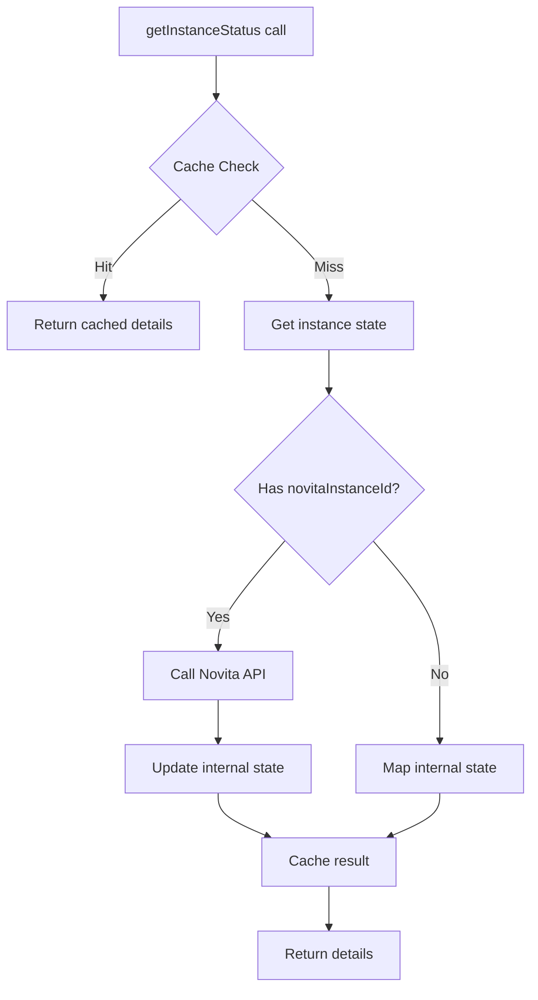
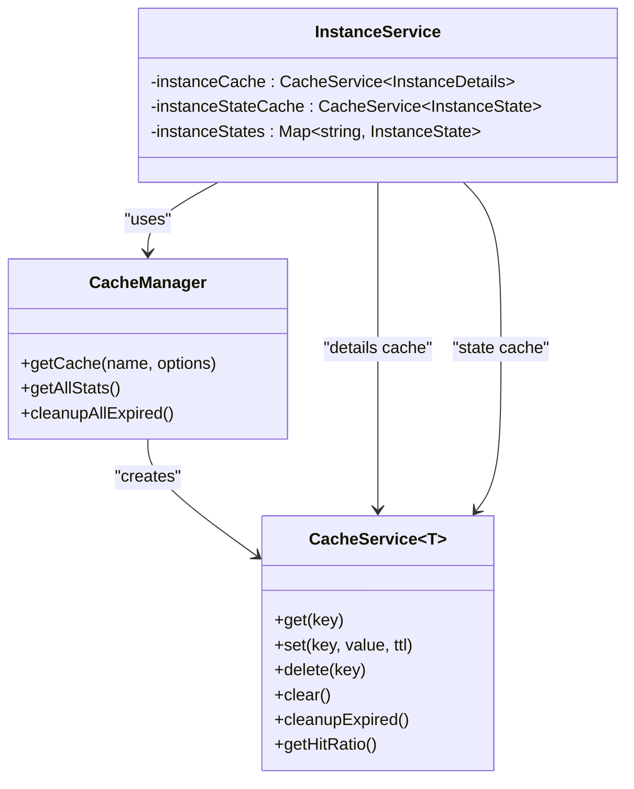
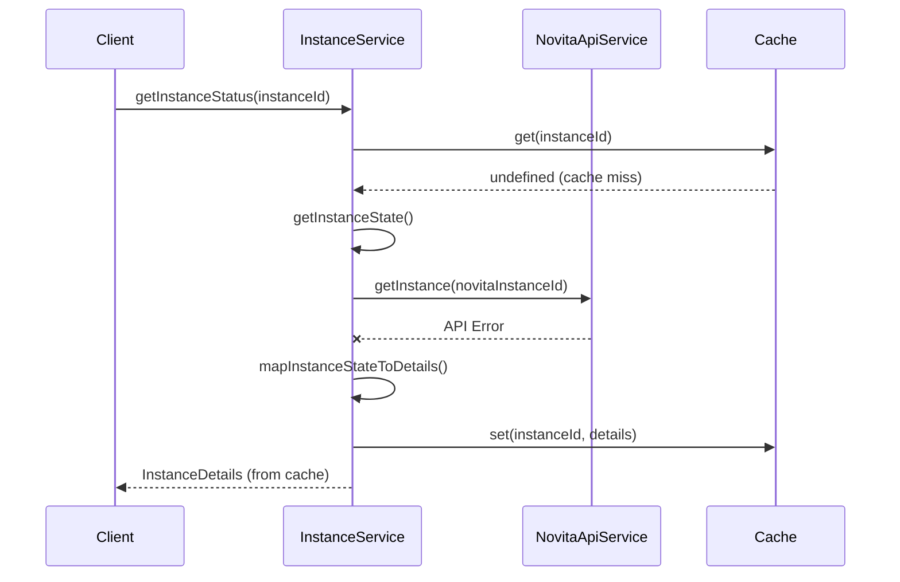
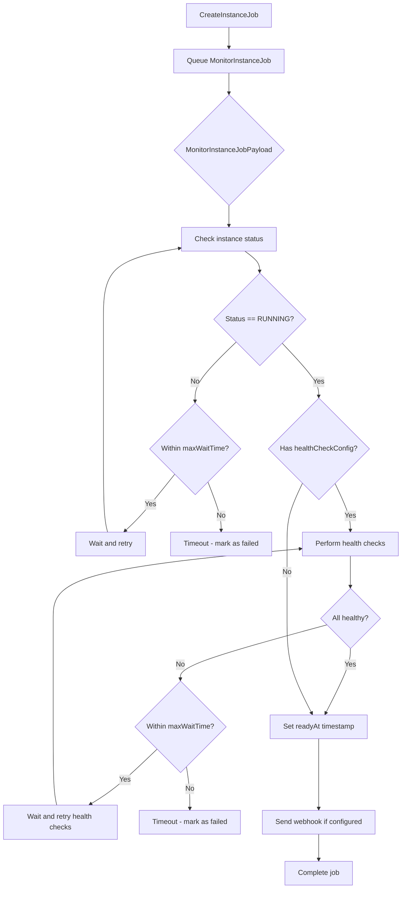
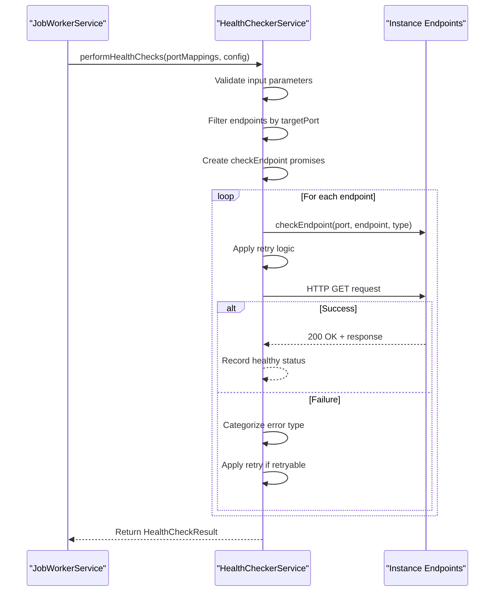
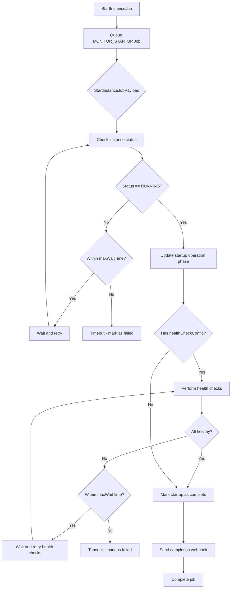
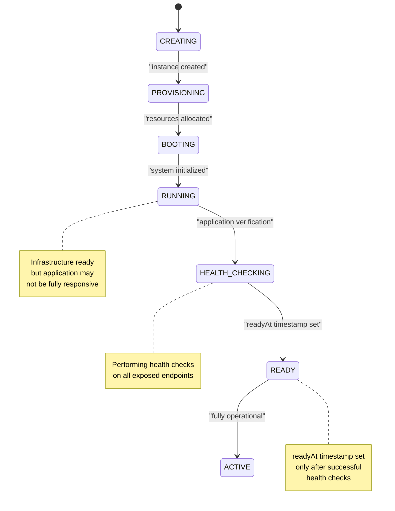
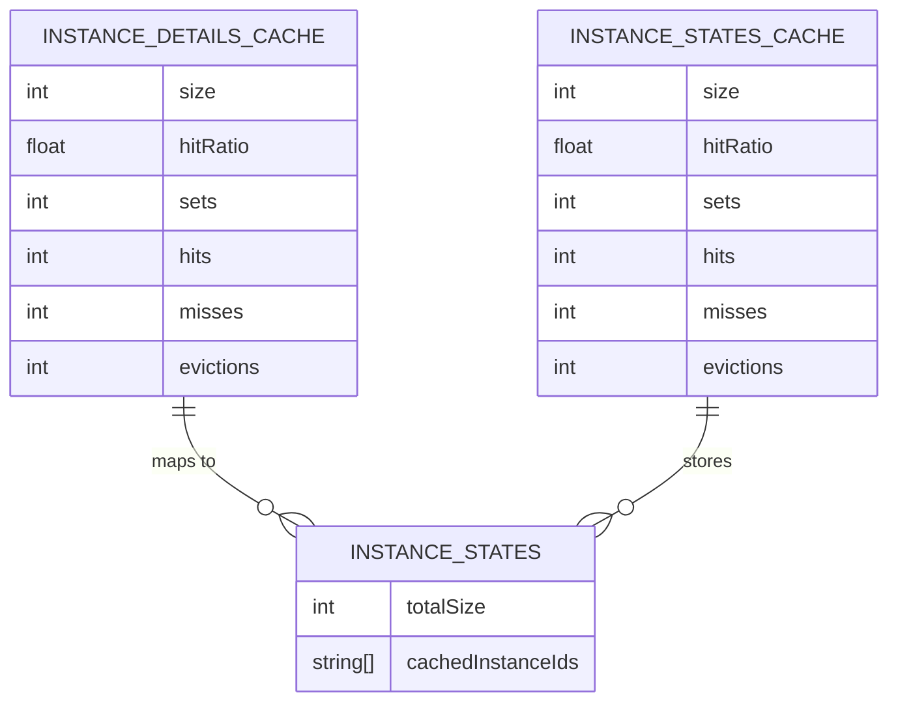

# Monitoring & Status Polling

<cite>
**Referenced Files in This Document**   
- [instanceService.ts](file://src/services/instanceService.ts) - *Updated in recent commit*
- [cacheService.ts](file://src/services/cacheService.ts)
- [novitaApiService.ts](file://src/services/novitaApiService.ts) - *Updated in recent commit*
- [job.ts](file://src/types/job.ts)
- [jobQueueService.ts](file://src/services/jobQueueService.ts) - *Updated with MONITOR_STARTUP job*
- [jobWorkerService.ts](file://src/services/jobWorkerService.ts) - *Updated with HealthChecker integration*
- [healthCheckerService.ts](file://src/services/healthCheckerService.ts) - *Added in recent commit*
</cite>

## Update Summary
**Changes Made**   
- Added new section on **Application-Level Health Checks** to cover HealthCheckerService implementation
- Added new section on **Startup Monitoring with MONITOR_STARTUP Job** to document the new job type
- Updated **Active Polling with MonitorInstanceJobPayload** section to include healthCheckConfig parameter
- Added new subsection on **Health Check Configuration and Result Processing** in Active Polling section
- Updated **Ready Time Estimation and State Transition** to reflect health check completion as readiness criteria
- Added new diagram showing health check workflow integration
- Updated document sources to include new files: healthCheckerService.ts, jobQueueService.ts, jobWorkerService.ts

## Table of Contents
1. [Introduction](#introduction)
2. [Dual-Layer Status Retrieval System](#dual-layer-status-retrieval-system)
3. [Caching Strategy and TTL Management](#caching-strategy-and-ttl-management)
4. [Fallback Behavior and API Resilience](#fallback-behavior-and-api-resilience)
5. [Active Polling with MonitorInstanceJobPayload](#active-polling-with-monitorinstancejobpayload)
6. [Application-Level Health Checks](#application-level-health-checks)
7. [Startup Monitoring with MONITOR_STARTUP Job](#startup-monitoring-with-monitor_startup-job)
8. [Ready Time Estimation and State Transition](#ready-time-estimation-and-state-transition)
9. [Cache Monitoring and Maintenance](#cache-monitoring-and-maintenance)
10. [Performance Considerations](#performance-considerations)

## Introduction
The monitoring and status polling subsystem provides a robust mechanism for tracking GPU instance lifecycle states while maintaining system performance and resilience. This documentation details the implementation of a dual-layer retrieval system that balances real-time accuracy with performance optimization through strategic caching, fallback mechanisms, and active polling workflows. Recent updates have enhanced the system with application-level health checks and dedicated startup monitoring for instances started from exited status.

## Dual-Layer Status Retrieval System

The `getInstanceStatus` method in `InstanceService` implements a dual-layer retrieval system that prioritizes cached data while ensuring data freshness through periodic API calls. The system first checks the `instanceCache` for existing status information, returning cached results when available to minimize latency and reduce API load.

When no cached data exists, the system retrieves the instance state from the internal `instanceStates` map and then attempts to fetch the most current status from the Novita API via `novitaApiService.getInstance`. This layered approach ensures that frequently accessed instance statuses are served quickly from cache while still maintaining up-to-date information through direct API integration.

**Section sources**
- [instanceService.ts](file://src/services/instanceService.ts#L20-L517)
- [novitaApiService.ts](file://src/services/novitaApiService.ts#L300-L320)

## Caching Strategy and TTL Management

The system employs two specialized caches with distinct TTL (Time-To-Live) configurations to optimize performance while maintaining data relevance:

- **Instance Details Cache**: Stores fully formatted instance details with a 30-second TTL and minute-interval cleanup
- **Instance States Cache**: Stores internal state objects with a 1-minute TTL and 2-minute cleanup interval

**Diagram sources**
- [cacheService.ts](file://src/services/cacheService.ts#L0-L490)
- [instanceService.ts](file://src/services/instanceService.ts#L20-L517)

**Section sources**
- [instanceService.ts](file://src/services/instanceService.ts#L20-L517)
- [cacheService.ts](file://src/services/cacheService.ts#L0-L490)

## Fallback Behavior and API Resilience

When the Novita API is unavailable, the system gracefully falls back to cached state information, ensuring continued service availability. The `getInstanceStatus` method implements this resilience pattern by catching API errors and returning instance details mapped from the internal state cache.

This fallback mechanism logs warning messages with error details while preserving system functionality, allowing clients to receive status information even during API outages. The approach prioritizes availability over absolute freshness, maintaining user experience during transient API issues.

**Section sources**
- [instanceService.ts](file://src/services/instanceService.ts#L20-L517)
- [novitaApiService.ts](file://src/services/novitaApiService.ts#L300-L320)

## Active Polling with MonitorInstanceJobPayload

The job queue system utilizes `MonitorInstanceJobPayload` to actively poll for instance readiness during the creation process. This payload contains essential monitoring parameters:

- `instanceId`: Internal instance identifier
- `novitaInstanceId`: External Novita instance identifier
- `webhookUrl`: Optional webhook endpoint for status updates
- `startTime`: Timestamp when monitoring began
- `maxWaitTime`: Maximum duration to wait for readiness (in milliseconds)
- `healthCheckConfig`: Optional health check configuration for application-level verification

The monitoring job periodically checks instance status through the `getInstanceStatus` flow, continuing until the instance reaches RUNNING status or the maximum wait time is exceeded. This active polling mechanism enables real-time tracking of instance provisioning progress.

### Health Check Configuration and Result Processing
When `healthCheckConfig` is provided in the payload, the monitoring workflow extends beyond basic status checks to include application-level health verification. After the instance reaches RUNNING status, the system performs parallel health checks on all exposed endpoints using the HealthCheckerService. The instance is only considered fully ready when both the infrastructure status is RUNNING and all health checks pass successfully.

**Section sources**
- [job.ts](file://src/types/job.ts#L50-L56)
- [instanceService.ts](file://src/services/instanceService.ts#L20-L517)
- [jobWorkerService.ts](file://src/services/jobWorkerService.ts#L300-L450)

## Application-Level Health Checks

The system now implements application-level health checks through the `HealthCheckerService`, which performs parallel endpoint verification with retries and timeout handling. This service is integrated into the instance monitoring workflow to ensure that instances are not only running at the infrastructure level but also healthy at the application level.

The `HealthCheckerService` supports multiple health check types (HTTP, HTTPS, TCP, UDP) and can be configured with custom timeouts, retry attempts, and retry delays. It performs comprehensive error categorization, distinguishing between network-level issues (timeout, connection refused), HTTP-level errors (bad gateway, service unavailable), and application-level problems (invalid response content).

Key features include:
- **Parallel execution**: Multiple endpoints checked simultaneously
- **Retry mechanism**: Configurable retry attempts with exponential backoff
- **Response validation**: Checks for error messages in response bodies even with 2xx status codes
- **Comprehensive error categorization**: 12 distinct error types with severity levels
- **Detailed logging**: Full request/response tracing with unique request IDs

**Diagram sources**
- [healthCheckerService.ts](file://src/services/healthCheckerService.ts#L150-L800)
- [jobWorkerService.ts](file://src/services/jobWorkerService.ts#L400-L450)

**Section sources**
- [healthCheckerService.ts](file://src/services/healthCheckerService.ts#L150-L800)
- [jobWorkerService.ts](file://src/services/jobWorkerService.ts#L400-L450)

## Startup Monitoring with MONITOR_STARTUP Job

The system introduces a new `MONITOR_STARTUP` job type specifically designed to track instance status changes when starting instances from exited status. This job is queued by the `JobWorkerService` when processing a `START_INSTANCE` job and follows a similar polling pattern to the `MONITOR_INSTANCE` job but with additional startup-specific workflows.

The `MONITOR_STARTUP` job uses the `StartInstanceJobPayload` which extends the monitoring parameters with:
- `operationId`: Unique identifier for the startup operation
- `targetPort`: Specific port to monitor for health checks
- `healthCheckConfig`: Custom health check configuration for the startup phase

This specialized monitoring job enables granular tracking of startup progress and provides detailed webhook notifications at each phase of the startup process, including instance running confirmation and health check completion.

**Diagram sources**
- [jobWorkerService.ts](file://src/services/jobWorkerService.ts#L800-L1200)
- [job.ts](file://src/types/job.ts#L20-L30)

**Section sources**
- [jobWorkerService.ts](file://src/services/jobWorkerService.ts#L800-L1200)
- [jobQueueService.ts](file://src/services/jobQueueService.ts#L50-L100)

## Ready Time Estimation and State Transition

The system calculates an estimated ready time using the `calculateEstimatedReadyTime` method, which projects completion 4 minutes from the current time. This estimate provides users with a reasonable expectation of instance availability during the creation process.

When an instance transitions to RUNNING status, the system sets the `readyAt` timestamp in the instance state if it hasn't been previously recorded. This occurs during the `getInstanceStatus` call when the Novita API returns a RUNNING status and no prior ready timestamp exists. However, with the introduction of application-level health checks, the `readyAt` timestamp is now set only after both conditions are met:
1. The instance infrastructure status is RUNNING
2. All configured health checks have passed successfully

This ensures that the ready timestamp reflects true application readiness rather than just infrastructure availability.

**Section sources**
- [instanceService.ts](file://src/services/instanceService.ts#L20-L517)
- [jobWorkerService.ts](file://src/services/jobWorkerService.ts#L400-L450)

## Cache Monitoring and Maintenance

The system provides comprehensive cache monitoring through the `getCacheStats` method, which returns detailed statistics for operational visibility:

- Instance details cache size and hit ratio
- Instance states cache size and hit ratio
- Total number of tracked instance states
- List of currently cached instance IDs

Maintenance functions include:
- `clearCache()`: Removes all entries from both caches
- `clearExpiredCache()`: Cleans up expired entries based on TTL
- Automatic periodic cleanup at configured intervals

These monitoring and maintenance capabilities enable operators to assess cache effectiveness and manage memory usage proactively.

**Section sources**
- [instanceService.ts](file://src/services/instanceService.ts#L20-L517)
- [cacheService.ts](file://src/services/cacheService.ts#L0-L490)

## Performance Considerations

The monitoring subsystem balances responsiveness with API rate limiting through several key strategies:

- **Polling Frequency**: The 30-second TTL for instance details limits API calls to twice per minute per instance
- **Cache Hit Ratios**: High cache hit ratios reduce API load and improve response times
- **TTL Configuration**: Different TTL values for details (30s) and states (60s) optimize freshness vs. performance
- **LRU Eviction**: CacheService implements Least Recently Used eviction to manage memory usage
- **Batch Operations**: Parallel processing of product and template lookups during instance creation
- **Health Check Optimization**: Parallel endpoint checks with configurable timeouts to minimize monitoring duration

The system's design prioritizes cache utilization to minimize external API calls while ensuring data remains sufficiently fresh for user needs. The hit ratio metrics provide insight into cache effectiveness, allowing for tuning based on actual usage patterns. The addition of application-level health checks introduces a new dimension to performance considerations, requiring careful configuration of health check intervals and timeouts to balance thoroughness with monitoring efficiency.

**Section sources**
- [instanceService.ts](file://src/services/instanceService.ts#L20-L517)
- [cacheService.ts](file://src/services/cacheService.ts#L0-L490)
- [novitaApiService.ts](file://src/services/novitaApiService.ts#L300-L320)
- [healthCheckerService.ts](file://src/services/healthCheckerService.ts#L150-L800)