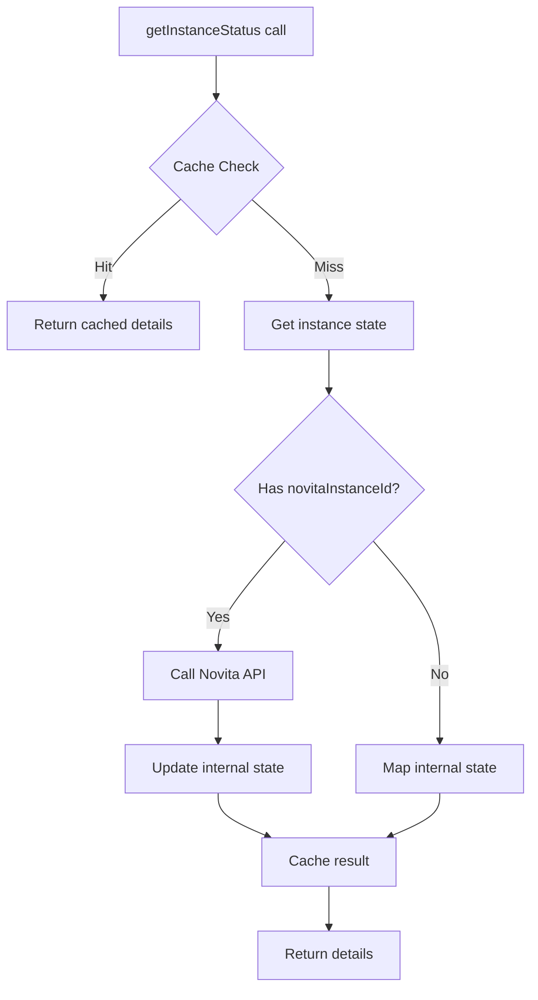
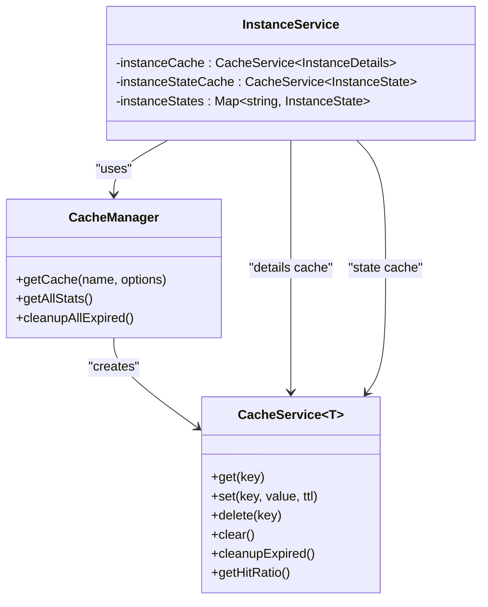
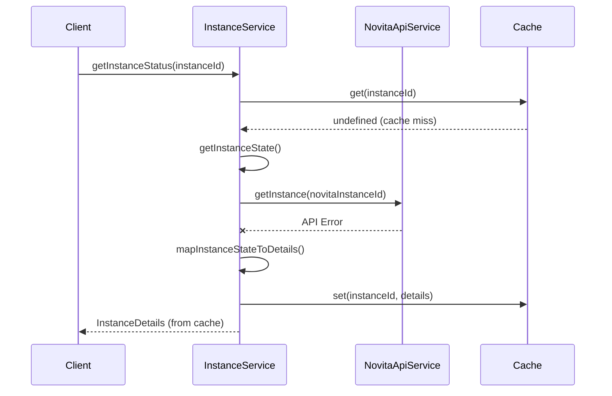
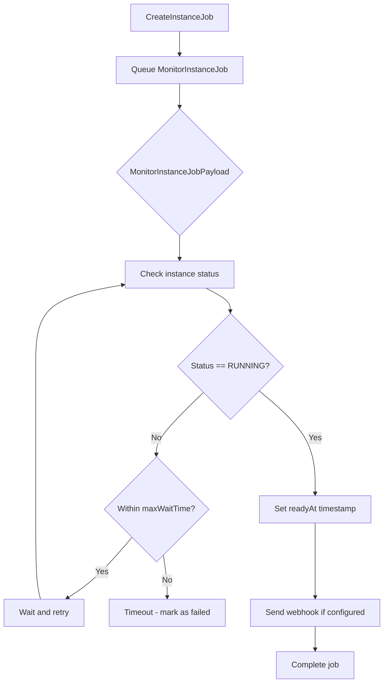
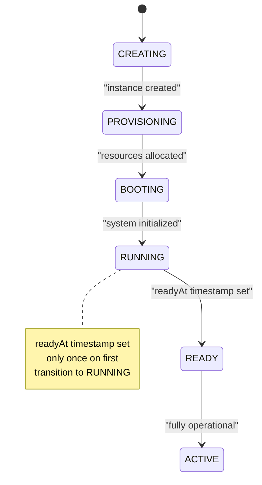
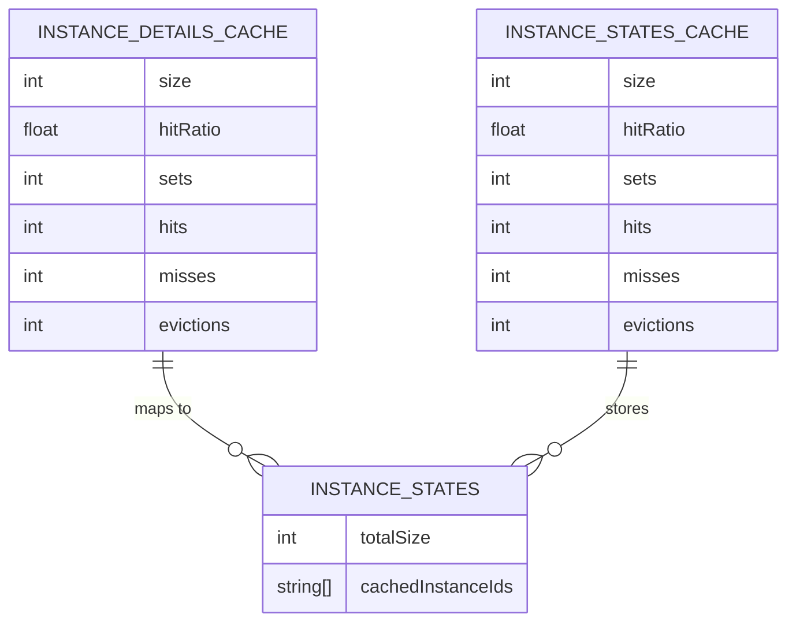

# Monitoring & Status Polling

<cite>
**Referenced Files in This Document**   
- [instanceService.ts](file://src/services/instanceService.ts)
- [cacheService.ts](file://src/services/cacheService.ts)
- [novitaApiService.ts](file://src/services/novitaApiService.ts)
- [job.ts](file://src/types/job.ts)
</cite>

## Table of Contents
1. [Introduction](#introduction)
2. [Dual-Layer Status Retrieval System](#dual-layer-status-retrieval-system)
3. [Caching Strategy and TTL Management](#caching-strategy-and-ttl-management)
4. [Fallback Behavior and API Resilience](#fallback-behavior-and-api-resilience)
5. [Active Polling with MonitorInstanceJobPayload](#active-polling-with-monitorinstancejobpayload)
6. [Ready Time Estimation and State Transition](#ready-time-estimation-and-state-transition)
7. [Cache Monitoring and Maintenance](#cache-monitoring-and-maintenance)
8. [Performance Considerations](#performance-considerations)

## Introduction
The monitoring and status polling subsystem provides a robust mechanism for tracking GPU instance lifecycle states while maintaining system performance and resilience. This documentation details the implementation of a dual-layer retrieval system that balances real-time accuracy with performance optimization through strategic caching, fallback mechanisms, and active polling workflows.

## Dual-Layer Status Retrieval System

The `getInstanceStatus` method in `InstanceService` implements a dual-layer retrieval system that prioritizes cached data while ensuring data freshness through periodic API calls. The system first checks the `instanceCache` for existing status information, returning cached results when available to minimize latency and reduce API load.

When no cached data exists, the system retrieves the instance state from the internal `instanceStates` map and then attempts to fetch the most current status from the Novita API via `novitaApiService.getInstance`. This layered approach ensures that frequently accessed instance statuses are served quickly from cache while still maintaining up-to-date information through direct API integration.

**Diagram sources**
- [instanceService.ts](file://src/services/instanceService.ts#L20-L517)

**Section sources**
- [instanceService.ts](file://src/services/instanceService.ts#L20-L517)

## Caching Strategy and TTL Management

The system employs two specialized caches with distinct TTL (Time-To-Live) configurations to optimize performance while maintaining data relevance:

- **Instance Details Cache**: Stores fully formatted instance details with a 30-second TTL and minute-interval cleanup
- **Instance States Cache**: Stores internal state objects with a 1-minute TTL and 2-minute cleanup interval

**Diagram sources**
- [cacheService.ts](file://src/services/cacheService.ts#L0-L490)
- [instanceService.ts](file://src/services/instanceService.ts#L20-L517)

**Section sources**
- [instanceService.ts](file://src/services/instanceService.ts#L20-L517)
- [cacheService.ts](file://src/services/cacheService.ts#L0-L490)

## Fallback Behavior and API Resilience

When the Novita API is unavailable, the system gracefully falls back to cached state information, ensuring continued service availability. The `getInstanceStatus` method implements this resilience pattern by catching API errors and returning instance details mapped from the internal state cache.

This fallback mechanism logs warning messages with error details while preserving system functionality, allowing clients to receive status information even during API outages. The approach prioritizes availability over absolute freshness, maintaining user experience during transient API issues.

**Diagram sources**
- [instanceService.ts](file://src/services/instanceService.ts#L20-L517)
- [novitaApiService.ts](file://src/services/novitaApiService.ts#L0-L482)

**Section sources**
- [instanceService.ts](file://src/services/instanceService.ts#L20-L517)

## Active Polling with MonitorInstanceJobPayload

The job queue system utilizes `MonitorInstanceJobPayload` to actively poll for instance readiness during the creation process. This payload contains essential monitoring parameters:

- `instanceId`: Internal instance identifier
- `novitaInstanceId`: External Novita instance identifier
- `webhookUrl`: Optional webhook endpoint for status updates
- `startTime`: Timestamp when monitoring began
- `maxWaitTime`: Maximum duration to wait for readiness (in milliseconds)

The monitoring job periodically checks instance status through the `getInstanceStatus` flow, continuing until the instance reaches RUNNING status or the maximum wait time is exceeded. This active polling mechanism enables real-time tracking of instance provisioning progress.

**Diagram sources**
- [job.ts](file://src/types/job.ts#L50-L56)
- [instanceService.ts](file://src/services/instanceService.ts#L20-L517)

**Section sources**
- [job.ts](file://src/types/job.ts#L50-L56)
- [instanceService.ts](file://src/services/instanceService.ts#L20-L517)

## Ready Time Estimation and State Transition

The system calculates an estimated ready time using the `calculateEstimatedReadyTime` method, which projects completion 4 minutes from the current time. This estimate provides users with a reasonable expectation of instance availability during the creation process.

When an instance transitions to RUNNING status, the system sets the `readyAt` timestamp in the instance state if it hasn't been previously recorded. This occurs during the `getInstanceStatus` call when the Novita API returns a RUNNING status and no prior ready timestamp exists.

**Diagram sources**
- [instanceService.ts](file://src/services/instanceService.ts#L20-L517)

**Section sources**
- [instanceService.ts](file://src/services/instanceService.ts#L20-L517)

## Cache Monitoring and Maintenance

The system provides comprehensive cache monitoring through the `getCacheStats` method, which returns detailed statistics for operational visibility:

- Instance details cache size and hit ratio
- Instance states cache size and hit ratio
- Total number of tracked instance states
- List of currently cached instance IDs

Maintenance functions include:
- `clearCache()`: Removes all entries from both caches
- `clearExpiredCache()`: Cleans up expired entries based on TTL
- Automatic periodic cleanup at configured intervals

These monitoring and maintenance capabilities enable operators to assess cache effectiveness and manage memory usage proactively.

**Diagram sources**
- [instanceService.ts](file://src/services/instanceService.ts#L20-L517)
- [cacheService.ts](file://src/services/cacheService.ts#L0-L490)

**Section sources**
- [instanceService.ts](file://src/services/instanceService.ts#L20-L517)

## Performance Considerations

The monitoring subsystem balances responsiveness with API rate limiting through several key strategies:

- **Polling Frequency**: The 30-second TTL for instance details limits API calls to twice per minute per instance
- **Cache Hit Ratios**: High cache hit ratios reduce API load and improve response times
- **TTL Configuration**: Different TTL values for details (30s) and states (60s) optimize freshness vs. performance
- **LRU Eviction**: CacheService implements Least Recently Used eviction to manage memory usage
- **Batch Operations**: Parallel processing of product and template lookups during instance creation

The system's design prioritizes cache utilization to minimize external API calls while ensuring data remains sufficiently fresh for user needs. The hit ratio metrics provide insight into cache effectiveness, allowing for tuning based on actual usage patterns.

**Section sources**
- [instanceService.ts](file://src/services/instanceService.ts#L20-L517)
- [cacheService.ts](file://src/services/cacheService.ts#L0-L490)
- [novitaApiService.ts](file://src/services/novitaApiService.ts#L0-L482)