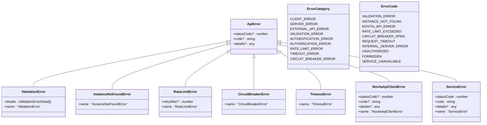
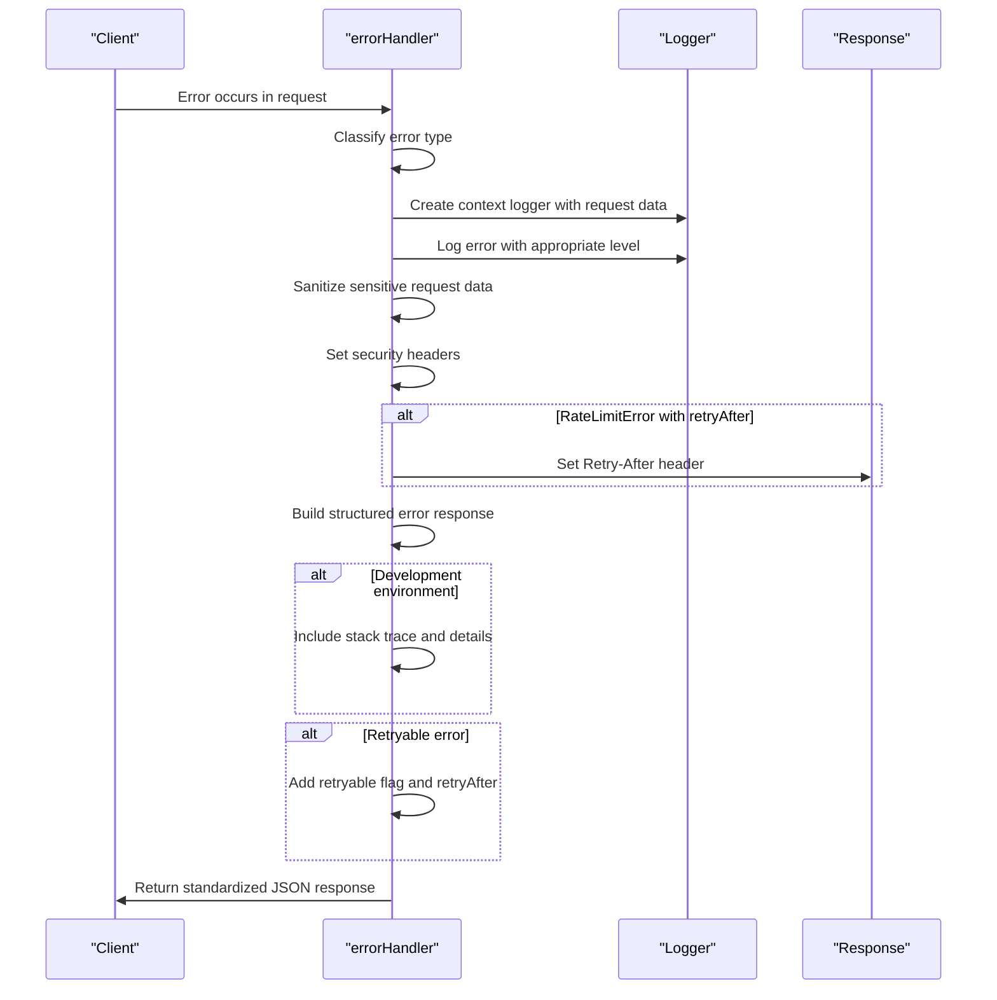
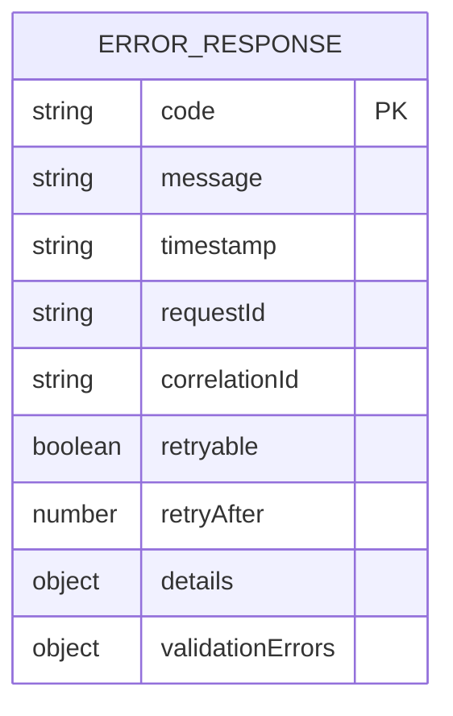
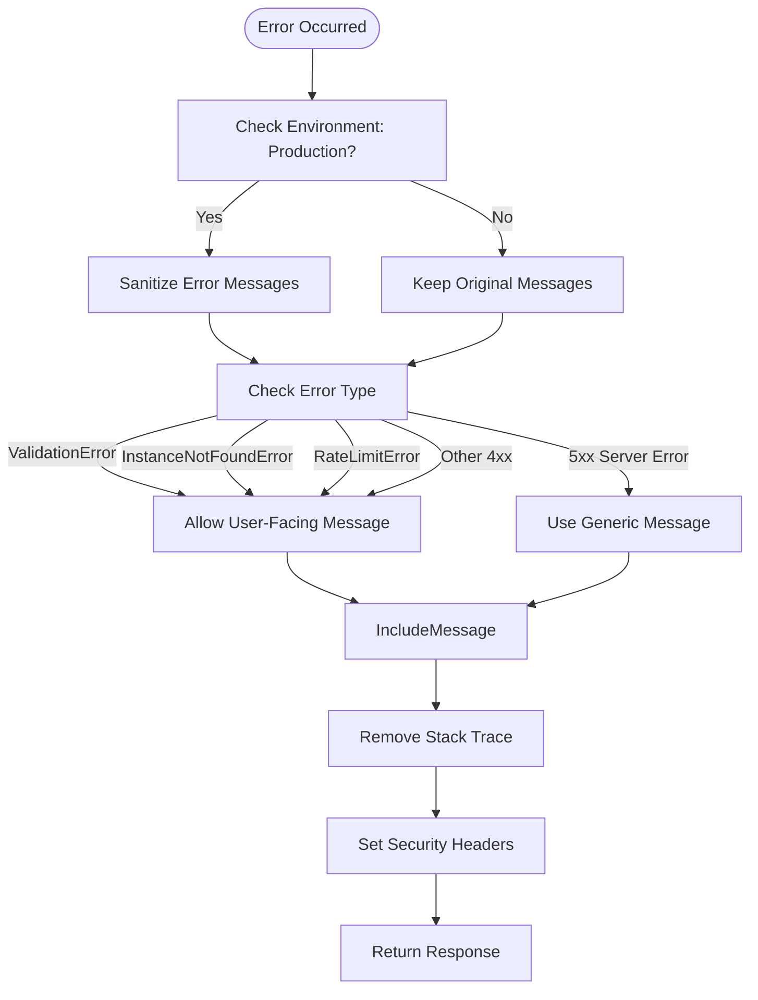
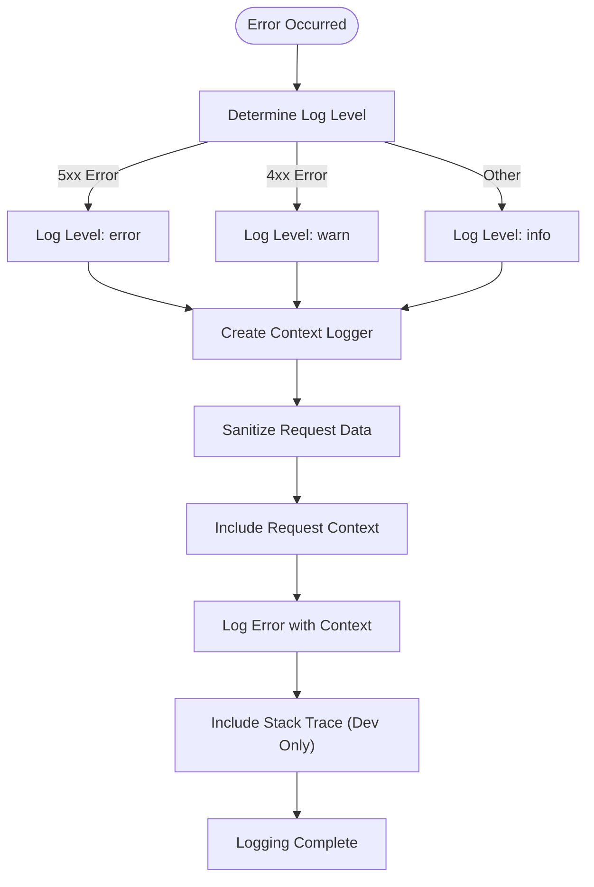
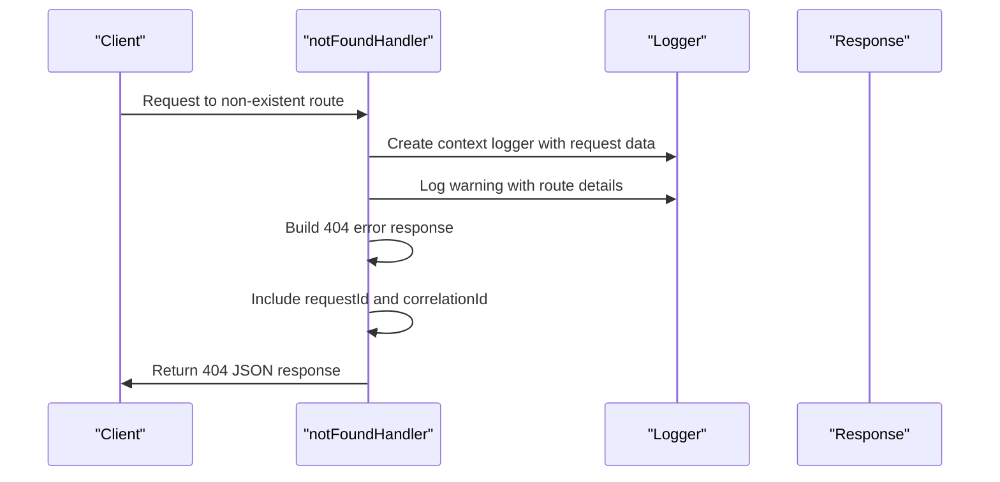
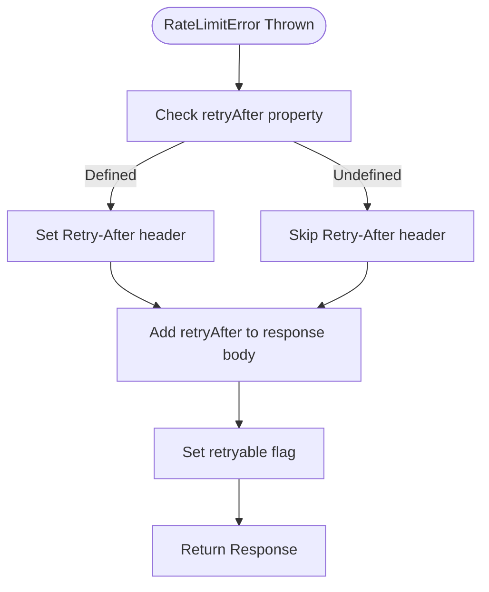
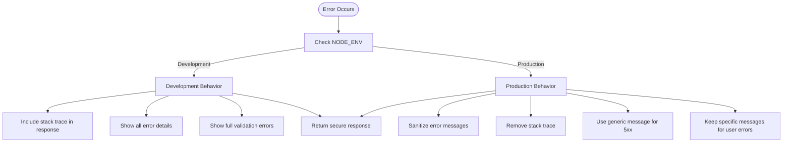

# Error Handling

<cite>
**Referenced Files in This Document**   
- [errorHandler.ts](file://src/middleware/errorHandler.ts)
- [errorHandler.ts](file://src/utils/errorHandler.ts)
- [api.ts](file://src/types/api.ts)
- [logger.ts](file://src/utils/logger.ts)
- [errorHandler.test.ts](file://src/middleware/__tests__/errorHandler.test.ts)
</cite>

## Table of Contents
1. [Introduction](#introduction)
2. [Error Classification System](#error-classification-system)
3. [Error Handler Middleware](#error-handler-middleware)
4. [Structured Error Response Format](#structured-error-response-format)
5. [Security Considerations](#security-considerations)
6. [Logging Strategy](#logging-strategy)
7. [Not Found Handler](#not-found-handler)
8. [Retry-After Header Handling](#retry-after-header-handling)
9. [Environment-Specific Behavior](#environment-specific-behavior)
10. [Error Response Examples](#error-response-examples)

## Introduction

The novitai application implements a comprehensive centralized error handling subsystem that standardizes error responses across the API. This system ensures consistent, secure, and informative error reporting while maintaining proper logging and monitoring capabilities. The core components include the `errorHandler` middleware, a sophisticated error classification system, structured error response formatting, and environment-aware behavior for development and production scenarios.

The error handling architecture is designed to provide meaningful feedback to clients while protecting sensitive information in production environments. It categorizes errors into distinct types such as `ValidationError`, `InstanceNotFoundError`, `RateLimitError`, and `CircuitBreakerError`, each with appropriate HTTP status codes, error codes, and retryability characteristics.

**Section sources**
- [errorHandler.ts](file://src/middleware/errorHandler.ts#L1-L286)
- [errorHandler.ts](file://src/utils/errorHandler.ts#L1-L222)

## Error Classification System

The error classification system categorizes errors into distinct types with appropriate HTTP status codes, error codes, and retryability characteristics. This classification is performed by the `classifyError` function, which determines the appropriate response parameters based on the error type.



**Diagram sources**
- [errorHandler.ts](file://src/middleware/errorHandler.ts#L36-L139)
- [utils/errorHandler.ts](file://src/utils/errorHandler.ts#L31-L81)
- [api.ts](file://src/types/api.ts#L286-L301)

The classification system maps specific error types to appropriate HTTP status codes and error categories:

- **ValidationError**: 400 Bad Request, categorized as `VALIDATION_ERROR`
- **InstanceNotFoundError**: 404 Not Found, categorized as `CLIENT_ERROR`
- **RateLimitError**: 429 Too Many Requests, categorized as `RATE_LIMIT_ERROR`
- **CircuitBreakerError**: 503 Service Unavailable, categorized as `CIRCUIT_BREAKER_ERROR`
- **TimeoutError**: 408 Request Timeout, categorized as `TIMEOUT_ERROR`
- **NovitaApiClientError**: Status code from error or 500, categorized based on status
- **ServiceError**: Status code from error, categorized based on status
- **Authentication errors**: 401 Unauthorized, categorized as `AUTHENTICATION_ERROR`
- **Authorization errors**: 403 Forbidden, categorized as `AUTHORIZATION_ERROR`

The system also determines retryability based on error type, with rate limit, circuit breaker, and timeout errors considered retryable.

**Section sources**
- [errorHandler.ts](file://src/middleware/errorHandler.ts#L36-L139)
- [utils/errorHandler.ts](file://src/utils/errorHandler.ts#L31-L81)

## Error Handler Middleware

The `errorHandler` middleware standardizes error responses across the API by intercepting errors and transforming them into consistent, structured responses. The middleware follows a comprehensive process to handle errors appropriately.



**Diagram sources**
- [errorHandler.ts](file://src/middleware/errorHandler.ts#L142-L286)
- [logger.ts](file://src/utils/logger.ts#L45-L70)

The middleware performs several critical functions:

1. **Error Classification**: Uses the `classifyError` function to determine status code, error code, category, and retryability
2. **Context Creation**: Extracts request context including request ID, correlation ID, operation, user agent, and IP address
3. **Contextual Logging**: Logs errors with appropriate severity levels (error for 5xx, warn for 4xx) and includes sanitized request data
4. **Security Headers**: Sets security headers including `X-Content-Type-Options: nosniff` and `X-Frame-Options: DENY`
5. **Response Building**: Constructs standardized error responses with consistent structure
6. **Retry Information**: Adds retryable flag and retry-after information for appropriate error types

The middleware integrates with the application's logging system through `createContextLogger`, ensuring that all error logs include relevant request context for debugging and monitoring.

**Section sources**
- [errorHandler.ts](file://src/middleware/errorHandler.ts#L142-L286)
- [logger.ts](file://src/utils/logger.ts#L45-L70)

## Structured Error Response Format

The system implements a standardized error response format that provides consistent information across all API endpoints. This structured format ensures clients receive predictable error information regardless of the underlying error type.



**Diagram sources**
- [api.ts](file://src/types/api.ts#L251-L258)
- [errorHandler.ts](file://src/middleware/errorHandler.ts#L199-L256)

The structured error response includes the following components:

- **code**: A standardized error code from the `ErrorCode` enum (e.g., `VALIDATION_ERROR`, `RATE_LIMIT_EXCEEDED`)
- **message**: A human-readable error message that is sanitized in production environments
- **timestamp**: ISO 8601 formatted timestamp of when the error occurred
- **requestId**: Unique identifier for the request, used for correlation and debugging
- **correlationId**: Optional correlation ID for tracing requests across services
- **details**: Additional error-specific details when appropriate
- **validationErrors**: Array of field-specific validation errors for validation failures
- **retryable**: Boolean flag indicating if the error is retryable
- **retryAfter**: Number of seconds to wait before retrying for rate-limited requests

The response structure is defined by the `ErrorResponse` interface and extends to specialized responses like `ValidationErrorResponse` for validation failures.

**Section sources**
- [api.ts](file://src/types/api.ts#L251-L268)
- [errorHandler.ts](file://src/middleware/errorHandler.ts#L199-L256)

## Security Considerations

The error handling system implements several security measures to protect sensitive information and prevent information disclosure in production environments.



**Diagram sources**
- [errorHandler.ts](file://src/middleware/errorHandler.ts#L278-L294)
- [errorHandler.ts](file://src/middleware/errorHandler.ts#L242-L248)

Key security features include:

1. **Stack Trace Sanitization**: In production environments, stack traces are removed from error responses to prevent disclosure of internal implementation details
2. **Generic Error Messages**: Server errors (5xx) return generic messages like "An internal server error occurred" instead of specific error details
3. **Selective Message Disclosure**: Only user-facing errors (validation, not found, rate limit) retain their specific messages in production
4. **Security Headers**: The middleware sets security headers including `X-Content-Type-Options: nosniff` and `X-Frame-Options: DENY` to prevent certain types of attacks
5. **Data Sanitization**: Request data in logs is sanitized to redact sensitive fields like passwords, tokens, and API keys

The `getSafeErrorMessage` function implements the logic for determining appropriate error messages based on environment and error type, ensuring that sensitive information is never exposed to clients.

**Section sources**
- [errorHandler.ts](file://src/middleware/errorHandler.ts#L278-L294)
- [logger.ts](file://src/utils/logger.ts#L120-L150)

## Logging Strategy

The error handling system implements a comprehensive logging strategy that captures error details with appropriate log levels and contextual information for debugging and monitoring.



**Diagram sources**
- [errorHandler.ts](file://src/middleware/errorHandler.ts#L174-L184)
- [logger.ts](file://src/utils/logger.ts#L45-L70)

The logging strategy includes the following components:

1. **Appropriate Log Levels**: Errors are logged at different levels based on severity:
   - 5xx Server Errors: Logged at "error" level
   - 4xx Client Errors: Logged at "warn" level
   - Other issues: Logged at "info" or lower levels

2. **Contextual Information**: Each error log includes relevant context such as:
   - Request ID and correlation ID for tracing
   - Operation (HTTP method and path)
   - User agent and IP address
   - Error name, message, code, and category
   - Retryability information

3. **Request Data Sanitization**: Sensitive data in request bodies, queries, and headers is sanitized before logging using the `sanitizeLogData` function, which redacts fields like passwords, tokens, and API keys.

4. **Development vs Production**: In development environments, stack traces are included in logs to aid debugging, while they are excluded in production for security.

The system uses Winston as the logging library with a structured format in production and a more readable format in development.

**Section sources**
- [errorHandler.ts](file://src/middleware/errorHandler.ts#L174-L184)
- [logger.ts](file://src/utils/logger.ts#L1-L175)

## Not Found Handler

The `notFoundHandler` middleware provides standardized handling of 404 Not Found responses for routes that don't exist in the API.



**Diagram sources**
- [errorHandler.ts](file://src/middleware/errorHandler.ts#L250-L258)
- [errorHandler.test.ts](file://src/middleware/__tests__/errorHandler.test.ts#L350-L370)

The not found handler:

1. **Logs the Event**: Records a warning-level log entry with details about the requested method, URL, path, user agent, and IP address
2. **Creates Standard Response**: Builds a standardized error response with:
   - Code: "NOT_FOUND"
   - Message: "Route {method} {path} not found"
   - Timestamp: Current ISO timestamp
   - Request ID: From the request headers
   - Correlation ID: If present in request headers
3. **Returns 404 Status**: Sets the HTTP status code to 404 and returns the JSON response

This handler ensures that all 404 responses are consistent across the API and provides useful information for debugging while maintaining the same security and formatting standards as other error responses.

**Section sources**
- [errorHandler.ts](file://src/middleware/errorHandler.ts#L250-L258)
- [errorHandler.test.ts](file://src/middleware/__tests__/errorHandler.test.ts#L350-L370)

## Retry-After Header Handling

The system implements proper handling of the Retry-After header for rate-limited requests, providing clients with guidance on when they can retry their requests.



**Diagram sources**
- [errorHandler.ts](file://src/middleware/errorHandler.ts#L236-L238)
- [api.ts](file://src/types/api.ts#L286-L294)

The retry-after handling works as follows:

1. **Header Setting**: When a `RateLimitError` with a defined `retryAfter` property is encountered, the middleware sets the HTTP `Retry-After` header with the value in seconds
2. **Response Body Inclusion**: The retry-after information is also included in the response body under the `retryAfter` field
3. **Retryable Flag**: The `retryable` flag is set to true for rate limit errors, indicating to clients that the request can be retried
4. **Client Guidance**: This information helps clients implement proper retry logic with appropriate backoff strategies

The `RateLimitError` class extends `NovitaApiClientError` and includes an optional `retryAfter` property that specifies the number of seconds clients should wait before retrying the request.

**Section sources**
- [errorHandler.ts](file://src/middleware/errorHandler.ts#L236-L238)
- [api.ts](file://src/types/api.ts#L286-L294)

## Environment-Specific Behavior

The error handling system adapts its behavior based on the environment (development vs production), providing more detailed information in development while maintaining security in production.



**Diagram sources**
- [errorHandler.ts](file://src/middleware/errorHandler.ts#L242-L248)
- [errorHandler.ts](file://src/middleware/errorHandler.ts#L260-L276)

The environment-specific behaviors include:

1. **Development Environment**:
   - Stack traces are included in error responses
   - All error details are exposed
   - Validation errors include full field details
   - No message sanitization is performed

2. **Production Environment**:
   - Stack traces are removed from responses
   - Server errors (5xx) return generic messages
   - Sensitive information is redacted
   - Only user-facing errors retain specific messages
   - Request data in logs is sanitized

This approach balances the need for detailed debugging information during development with the security requirements of production environments.

**Section sources**
- [errorHandler.ts](file://src/middleware/errorHandler.ts#L242-L248)
- [errorHandler.ts](file://src/middleware/errorHandler.ts#L260-L276)

## Error Response Examples

The following examples illustrate the standardized error responses for different error types and environments.

### Validation Error (Development)
```json
{
  "error": {
    "code": "VALIDATION_ERROR",
    "message": "Validation failed",
    "timestamp": "2023-12-07T10:30:00.000Z",
    "requestId": "req-123",
    "validationErrors": [
      {
        "field": "name",
        "message": "Name is required"
      }
    ],
    "stack": "Error: Validation failed\n    at ..."
  }
}
```

### Validation Error (Production)
```json
{
  "error": {
    "code": "VALIDATION_ERROR",
    "message": "Name is required",
    "timestamp": "2023-12-07T10:30:00.000Z",
    "requestId": "req-123",
    "validationErrors": [
      {
        "field": "name",
        "message": "Name is required"
      }
    ]
  }
}
```

### Rate Limit Error
```json
// Headers: Retry-After: 60
{
  "error": {
    "code": "RATE_LIMIT_EXCEEDED",
    "message": "Rate limit exceeded",
    "timestamp": "2023-12-07T10:30:00.000Z",
    "requestId": "req-123",
    "retryable": true,
    "retryAfter": 60
  }
}
```

### Instance Not Found Error
```json
{
  "error": {
    "code": "INSTANCE_NOT_FOUND",
    "message": "Instance with ID 'instance-123' not found",
    "timestamp": "2023-12-07T10:30:00.000Z",
    "requestId": "req-123"
  }
}
```

### Server Error (Production)
```json
{
  "error": {
    "code": "INTERNAL_SERVER_ERROR",
    "message": "An internal server error occurred",
    "timestamp": "2023-12-07T10:30:00.000Z",
    "requestId": "req-123"
  }
}
```

### 404 Not Found
```json
{
  "error": {
    "code": "NOT_FOUND",
    "message": "Route GET /invalid-route not found",
    "timestamp": "2023-12-07T10:30:00.000Z",
    "requestId": "req-123"
  }
}
```

These examples demonstrate the consistent structure and environment-appropriate content of error responses across the novitai application.

**Section sources**
- [errorHandler.test.ts](file://src/middleware/__tests__/errorHandler.test.ts#L50-L350)
- [errorHandler.ts](file://src/middleware/errorHandler.ts#L199-L256)