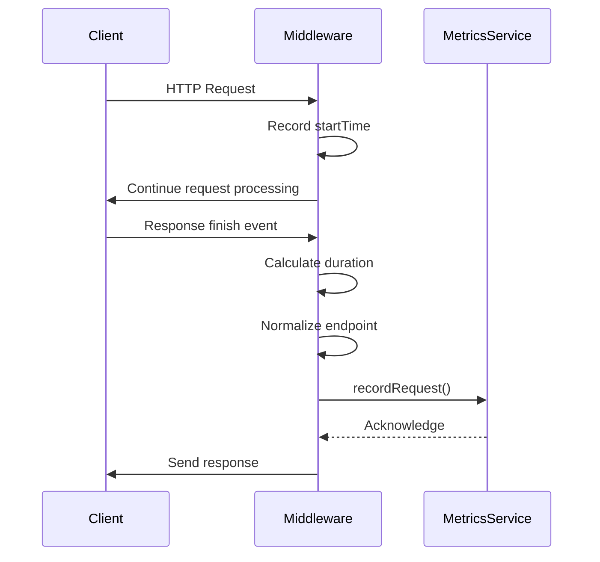
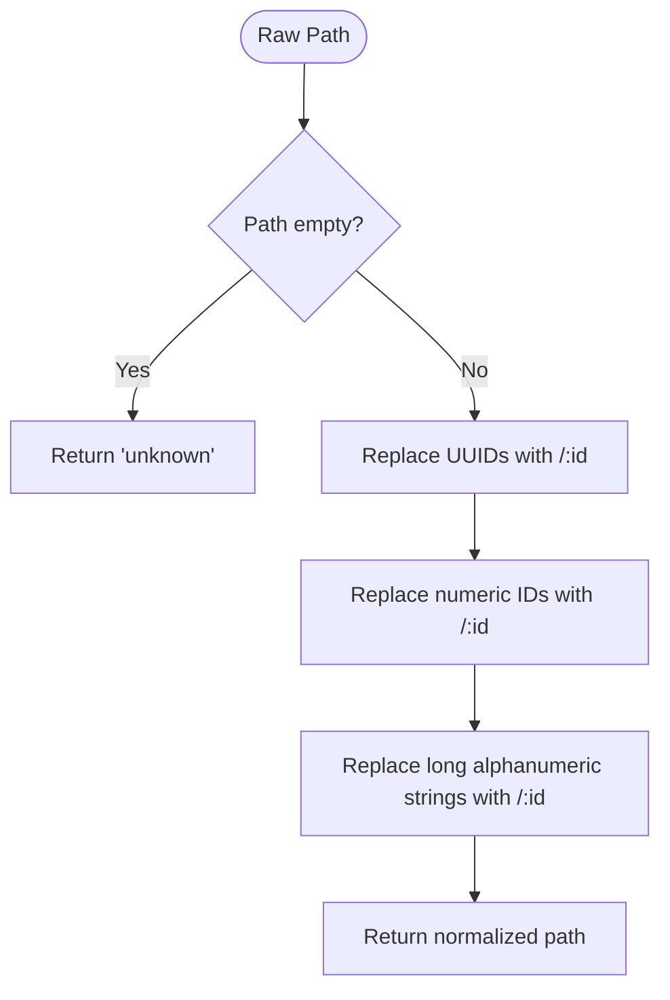
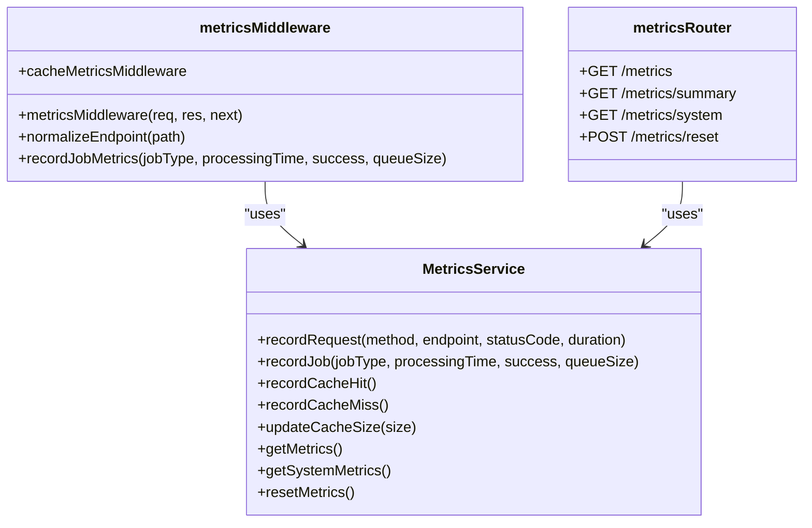
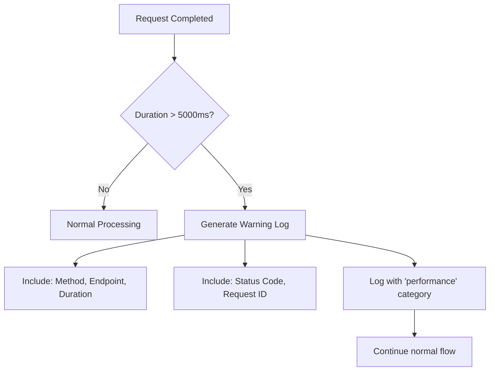

# Metrics Collection

<cite>
**Referenced Files in This Document**   
- [metricsMiddleware.ts](file://src/middleware/metricsMiddleware.ts)
- [metricsService.ts](file://src/services/metricsService.ts)
- [metrics.ts](file://src/routes/metrics.ts)
</cite>

## Table of Contents
1. [Introduction](#introduction)
2. [Metrics Middleware Implementation](#metrics-middleware-implementation)
3. [Endpoint Normalization Process](#endpoint-normalization-process)
4. [Integration with Metrics Service](#integration-with-metrics-service)
5. [Performance Warning System](#performance-warning-system)
6. [Cache Metrics Tracking](#cache-metrics-tracking)
7. [Error Handling in Metrics Collection](#error-handling-in-metrics-collection)
8. [Metric Data Structure and Usage](#metric-data-structure-and-usage)
9. [Monitoring and Optimization Guidance](#monitoring-and-optimization-guidance)

## Introduction
The novitai application implements a comprehensive metrics collection subsystem to enable monitoring, observability, and performance analysis. This system captures HTTP request metrics, cache performance, and job processing data through a middleware-based architecture integrated with a centralized metrics service. The collected data supports system monitoring, capacity planning, and performance optimization efforts by providing detailed insights into application behavior and resource utilization.

## Metrics Middleware Implementation

The `metricsMiddleware` is an Express middleware that captures HTTP request metrics by recording key performance indicators including request duration, HTTP method, normalized endpoint path, and response status code. The middleware initializes a timestamp at the beginning of each request and leverages the response's 'finish' event to calculate the total request duration. It then processes and normalizes the endpoint path before forwarding the metrics to the `metricsService` for aggregation and storage.

**Diagram sources**
- [metricsMiddleware.ts](file://src/middleware/metricsMiddleware.ts#L15-L52)
- [metricsService.ts](file://src/services/metricsService.ts#L63-L107)

**Section sources**
- [metricsMiddleware.ts](file://src/middleware/metricsMiddleware.ts#L15-L52)

## Endpoint Normalization Process

The metrics subsystem implements an endpoint normalization process that groups similar routes to enable meaningful metric aggregation. This process converts dynamic path segments containing identifiers into standardized parameter placeholders, allowing metrics to be aggregated by endpoint pattern rather than individual URL instances.

The normalization function applies three primary transformation rules:
1. Replace UUID patterns with `/:id` placeholder
2. Replace numeric identifiers with `/:id` placeholder  
3. Replace long alphanumeric strings (20+ characters) with `/:id` placeholder

This normalization enables aggregation of metrics for endpoints like `/api/instances/123`, `/api/instances/550e8400-e29b-41d4-a716-446655440000`, and `/api/instances/abc123def456ghi789jkl` under the common pattern `/api/instances/:id`, providing meaningful performance insights across all instance-related requests regardless of the specific identifier used.

**Diagram sources**
- [metricsMiddleware.ts](file://src/middleware/metricsMiddleware.ts#L105-L117)

**Section sources**
- [metricsMiddleware.ts](file://src/middleware/metricsMiddleware.ts#L105-L117)
- [metricsMiddleware.test.ts](file://src/middleware/__tests__/metricsMiddleware.test.ts#L177-L227)

## Integration with Metrics Service

The metrics collection subsystem integrates with the `metricsService` singleton to record various performance metrics. The `metricsMiddleware` forwards request metrics to the `recordRequest` method, which aggregates data at multiple levels: global, endpoint-specific, and method-specific. The service maintains separate counters and statistical calculations for each category, enabling detailed analysis of system performance.

In addition to HTTP request metrics, the system supports job processing metrics through the `recordJob` method and cache performance metrics through dedicated methods (`recordCacheHit`, `recordCacheMiss`, and `updateCacheSize`). This comprehensive approach provides visibility into the entire application lifecycle, from incoming requests to background job processing and caching efficiency.

**Diagram sources**
- [metricsService.ts](file://src/services/metricsService.ts#L63-L391)
- [metricsMiddleware.ts](file://src/middleware/metricsMiddleware.ts#L15-L52)
- [metrics.ts](file://src/routes/metrics.ts#L10-L187)

**Section sources**
- [metricsService.ts](file://src/services/metricsService.ts#L63-L391)
- [metricsMiddleware.ts](file://src/middleware/metricsMiddleware.ts#L15-L52)

## Performance Warning System

The metrics subsystem includes a performance warning system that identifies and logs slow requests exceeding a 5-second threshold. When a request duration surpasses this threshold, the middleware generates a warning log entry containing detailed information about the request, including HTTP method, normalized endpoint, exact duration, status code, and associated request ID if available.

This early warning capability enables proactive identification of performance bottlenecks and potential system issues before they impact user experience. The logged warnings include contextual information that facilitates rapid investigation and troubleshooting, helping developers pinpoint the specific endpoints and request patterns contributing to performance degradation.

**Diagram sources**
- [metricsMiddleware.ts](file://src/middleware/metricsMiddleware.ts#L40-L48)

**Section sources**
- [metricsMiddleware.ts](file://src/middleware/metricsMiddleware.ts#L40-L48)
- [metricsMiddleware.test.ts](file://src/middleware/__tests__/metricsMiddleware.test.ts#L99-L132)

## Cache Metrics Tracking

The metrics subsystem provides dedicated support for tracking cache performance through the `cacheMetricsMiddleware` helper object. This utility exposes three primary functions: `recordHit` to increment the cache hit counter, `recordMiss` to increment the cache miss counter, and `updateSize` to track the current cache size.

These metrics enable calculation of the cache hit ratio, a critical performance indicator that measures the effectiveness of the caching strategy. By monitoring cache hits, misses, and size over time, developers can optimize cache configuration, identify inefficient caching patterns, and make informed decisions about cache sizing and eviction policies.

**Section sources**
- [metricsMiddleware.ts](file://src/middleware/metricsMiddleware.ts#L119-L130)

## Error Handling in Metrics Collection

The metrics collection subsystem implements robust error handling to ensure that failures in metrics recording do not affect the primary request flow. Both the `metricsMiddleware` and `recordJobMetrics` helper function wrap their operations in try-catch blocks, capturing any errors that occur during metrics processing and logging them at the error level without propagating exceptions to the calling code.

This defensive approach ensures application reliability by isolating metrics collection failures from core business logic. Even if the metrics service becomes temporarily unavailable or encounters errors, the primary application functionality continues uninterrupted. The error logs include contextual information such as request ID and error messages, facilitating diagnosis and resolution of metrics collection issues without impacting system availability.

**Section sources**
- [metricsMiddleware.ts](file://src/middleware/metricsMiddleware.ts#L30-L49)
- [metricsMiddleware.ts](file://src/middleware/metricsMiddleware.ts#L132-L142)
- [metricsMiddleware.test.ts](file://src/middleware/__tests__/metricsMiddleware.test.ts#L134-L175)

## Metric Data Structure and Usage

The metrics service exposes a comprehensive data structure through the `getMetrics` method, providing detailed insights across four primary categories: requests, jobs, system, and cache. The request metrics include count, duration statistics (total, average, min, max), status code distribution, and temporal information. Job metrics track processing volume, success/failure rates, timing statistics, and queue size. System metrics capture memory usage, CPU utilization, and process uptime. Cache metrics include hit/miss counts, hit ratio, and current size.

These metrics are accessible through dedicated API endpoints:
- `GET /metrics`: Returns comprehensive application metrics
- `GET /metrics/summary`: Provides condensed metrics for monitoring dashboards
- `GET /metrics/system`: Exposes system-level resource utilization
- `POST /metrics/reset`: Allows metrics reset (primarily for testing)

**Section sources**
- [metricsService.ts](file://src/services/metricsService.ts#L140-L180)
- [metrics.ts](file://src/routes/metrics.ts#L10-L187)

## Monitoring and Optimization Guidance

The collected metrics provide valuable insights for performance optimization and capacity planning. Key indicators to monitor include:

- **Average response time**: Identify endpoints with high latency for optimization
- **Error rate**: Track 4xx and 5xx status codes to detect functional issues
- **Cache hit ratio**: Optimize caching strategies when hit ratio is low
- **Requests per minute**: Understand traffic patterns for capacity planning
- **CPU and memory usage**: Monitor system resource utilization for scaling decisions
- **Job processing rate**: Evaluate background job performance and queue health

For performance optimization, focus on endpoints with high average response times or frequent slow request warnings. Analyze the relationship between cache hit ratio and response times to assess caching effectiveness. Monitor job processing metrics to identify bottlenecks in background processing. Use historical trends to predict future resource requirements and plan capacity accordingly.

**Section sources**
- [metricsService.ts](file://src/services/metricsService.ts#L182-L220)
- [metrics.ts](file://src/routes/metrics.ts#L50-L84)
- [metricsService.test.ts](file://src/services/__tests__/metricsService.test.ts#L0-L72)