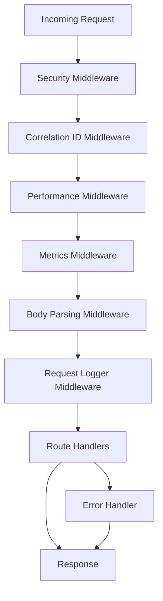
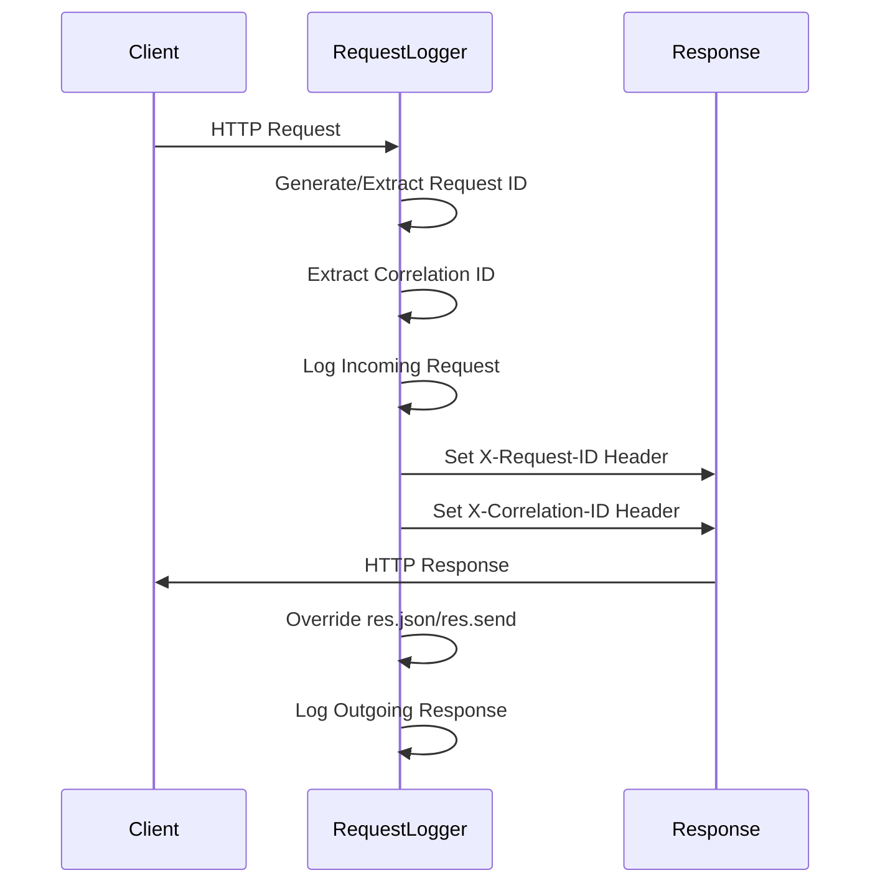
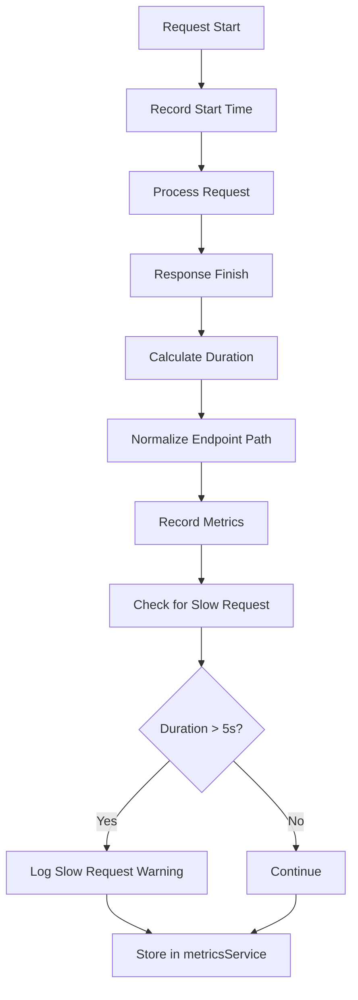
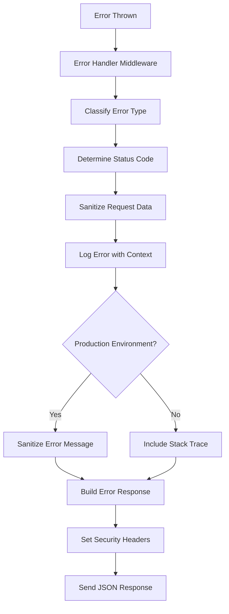
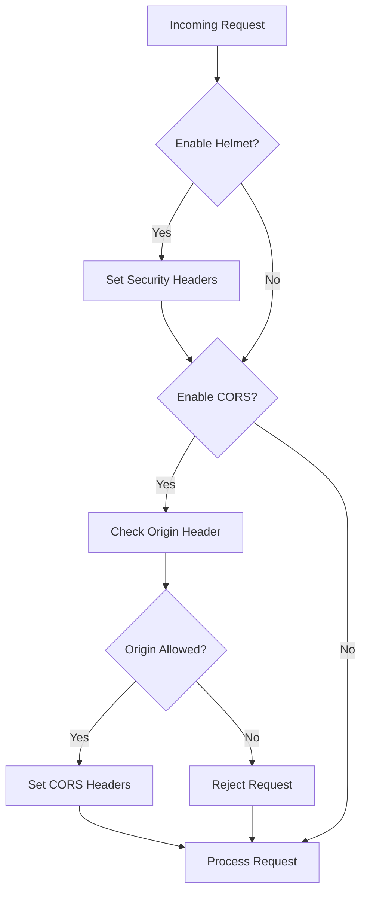
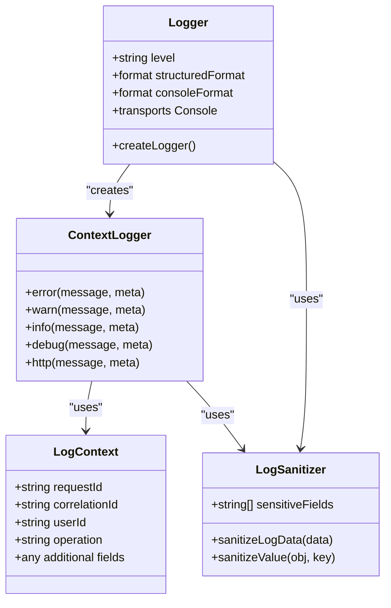
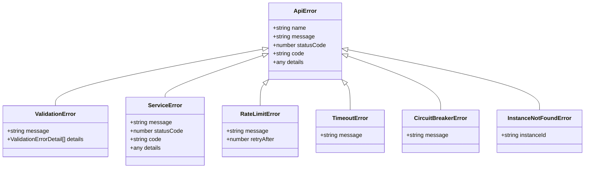

# Middleware & Request Processing

<cite>
**Referenced Files in This Document**   
- [index.ts](file://src/index.ts)
- [requestLogger.ts](file://src/middleware/requestLogger.ts)
- [metricsMiddleware.ts](file://src/middleware/metricsMiddleware.ts)
- [errorHandler.ts](file://src/middleware/errorHandler.ts)
- [logger.ts](file://src/utils/logger.ts)
- [config.ts](file://src/config/config.ts)
</cite>

## Table of Contents
1. [Middleware Pipeline Overview](#middleware-pipeline-overview)
2. [Request Logging & Correlation](#request-logging--correlation)
3. [Metrics Collection](#metrics-collection)
4. [Error Handling](#error-handling)
5. [Security Middleware](#security-middleware)
6. [Logging Implementation](#logging-implementation)
7. [Error Classification](#error-classification)
8. [Middleware Composition](#middleware-composition)
9. [Performance Considerations](#performance-considerations)
10. [Custom Middleware Development](#custom-middleware-development)

## Middleware Pipeline Overview

The Express middleware pipeline in the novitai application processes requests through a carefully ordered sequence of middleware components that handle security, logging, metrics, and error handling. The middleware chain is configured in `src/index.ts` and follows the standard Express pattern of request processing, with each middleware component performing specific functions before passing control to the next component in the chain.

The pipeline begins with security middleware (Helmet and CORS), followed by request correlation and performance tracking, body parsing, enhanced logging, route handling, and concludes with error handling middleware. This ordering ensures that security is enforced early, request context is established before processing, and errors are handled consistently at the end of the chain.



**Diagram sources**
- [index.ts](file://src/index.ts#L48-L114)

**Section sources**
- [index.ts](file://src/index.ts#L48-L114)

## Request Logging & Correlation

The request logging system captures incoming requests with correlation IDs for distributed tracing, providing comprehensive visibility into request processing. The `requestLoggerMiddleware` captures detailed information about each request, including method, URL, headers, query parameters, and body content, while the `correlationIdMiddleware` ensures that requests can be traced across system boundaries.

The request logger generates unique request IDs when not provided in headers and propagates them in response headers, enabling end-to-end request tracking. It also sanitizes sensitive data from logs to prevent exposure of credentials and other confidential information. The middleware overrides Express's `res.json` and `res.send` methods to capture response details, ensuring comprehensive logging of both request and response payloads.



**Diagram sources**
- [requestLogger.ts](file://src/middleware/requestLogger.ts#L15-L140)
- [requestLogger.ts](file://src/middleware/requestLogger.ts#L176-L233)

**Section sources**
- [requestLogger.ts](file://src/middleware/requestLogger.ts#L15-L140)
- [requestLogger.ts](file://src/middleware/requestLogger.ts#L176-L233)

## Metrics Collection

The metrics middleware collects HTTP request metrics for monitoring and performance analysis, recording latency, status codes, and other key performance indicators. The `metricsMiddleware` captures request duration, HTTP method, endpoint, and status code, normalizing endpoint paths to group similar routes (e.g., replacing IDs with parameter placeholders) for meaningful aggregation.

Metrics are recorded using the `metricsService`, which maintains counters for requests by endpoint, method, and status code, along with timing statistics. The middleware also logs warnings for slow requests (exceeding 5 seconds) to facilitate performance monitoring and optimization. This metrics collection enables comprehensive monitoring of API performance and usage patterns.



**Diagram sources**
- [metricsMiddleware.ts](file://src/middleware/metricsMiddleware.ts#L15-L103)

**Section sources**
- [metricsMiddleware.ts](file://src/middleware/metricsMiddleware.ts#L15-L103)

## Error Handling

The centralized error handler standardizes error responses and logs stack traces with appropriate context, ensuring consistent error reporting across the application. The `errorHandler` middleware intercepts errors thrown by route handlers and converts them into standardized JSON responses with error codes, messages, and metadata.

The error handler classifies errors into categories (validation, client, server, external API, etc.) and determines appropriate HTTP status codes and retryability. It includes security headers in error responses and sanitizes error messages in production to prevent information disclosure. The handler also preserves correlation IDs in error responses, enabling traceability of failed requests.



**Diagram sources**
- [errorHandler.ts](file://src/middleware/errorHandler.ts#L141-L286)

**Section sources**
- [errorHandler.ts](file://src/middleware/errorHandler.ts#L141-L286)

## Security Middleware

Security middleware components (Helmet and CORS) are configured for production safety, protecting against common web vulnerabilities. Helmet sets various HTTP headers to mitigate cross-site scripting (XSS), clickjacking, and other attacks, while CORS middleware controls which domains can access the API.

The security configuration is controlled by environment variables, allowing different settings for development and production environments. Helmet is configured with a content security policy that restricts resources to the same origin, and CORS allows configurable origins with credential support. These security measures are conditionally enabled based on configuration, providing flexibility for different deployment scenarios.



**Diagram sources**
- [index.ts](file://src/index.ts#L55-L85)

**Section sources**
- [index.ts](file://src/index.ts#L55-L85)
- [config.ts](file://src/config/config.ts#L240-L303)

## Logging Implementation

The custom logging implementation uses Winston with structured JSON output and log level filtering, providing comprehensive and searchable logs. The logging system supports context-aware logging with request IDs, correlation IDs, and other metadata, enabling effective debugging and monitoring.

Structured logging formats output as JSON with timestamps, log levels, service names, and contextual metadata. The implementation includes data sanitization to prevent sensitive information (passwords, API keys, etc.) from appearing in logs. Different log formats are used for development (colorized console output) and production (structured JSON), optimizing for the respective environments.



**Diagram sources**
- [logger.ts](file://src/utils/logger.ts#L0-L175)

**Section sources**
- [logger.ts](file://src/utils/logger.ts#L0-L175)

## Error Classification

The error classification system defines custom error types for different failure scenarios, enabling precise error handling and appropriate client responses. The system includes specialized error classes such as `ValidationError`, `ServiceError`, `RateLimitError`, and `TimeoutError`, each with specific properties and behaviors.

Error classification determines HTTP status codes, retryability, and error response content. Validation errors result in 400 status codes and include validation details, while service errors can have custom status codes and details. Rate limit errors include retry-after information, and timeout errors result in 408 status codes. This classification enables clients to handle different error types appropriately.



**Diagram sources**
- [errorHandler.ts](file://src/middleware/errorHandler.ts#L30-L58)
- [types/api.ts](file://src/types/api.ts)

**Section sources**
- [errorHandler.ts](file://src/middleware/errorHandler.ts#L30-L58)
- [types/api.ts](file://src/types/api.ts)

## Middleware Composition

Middleware composition in `src/index.ts` follows a specific order that ensures proper request processing and error handling. The composition begins with security middleware, followed by request correlation, performance monitoring, metrics collection, body parsing, request logging, route handling, and concludes with error handling.

This ordering is critical for proper functionality: security headers are set early, request context is established before processing, body parsing occurs before route handlers, and error handling is the final middleware to catch any unhandled exceptions. The conditional application of security middleware based on configuration provides flexibility for different deployment environments.

```mermaid
flowchart TD
A[app.use(helmet)] --> B[app.use(cors)]
B --> C[app.use(correlationIdMiddleware)]
C --> D[app.use(performanceMiddleware)]
D --> E[app.use(metricsMiddleware)]
E --> F[app.use(express.json)]
F --> G[app.use(requestLoggerMiddleware)]
G --> H[app.use(routes)]
H --> I[app.use(notFoundHandler)]
I --> J[app.use(errorHandler)]
```

**Diagram sources**
- [index.ts](file://src/index.ts#L48-L114)

**Section sources**
- [index.ts](file://src/index.ts#L48-L114)

## Performance Considerations

Middleware execution order has significant performance implications, with earlier middleware components affecting all subsequent processing. The current ordering optimizes performance by placing lightweight security checks first, followed by request correlation and metrics collection before more expensive operations like body parsing.

Potential optimization strategies include moving the request logger after route handlers for routes with large request bodies, implementing conditional logging based on request characteristics, and optimizing the metrics middleware's endpoint normalization function. The performance middleware already includes slow request detection, providing visibility into performance bottlenecks.

**Section sources**
- [requestLogger.ts](file://src/middleware/requestLogger.ts#L176-L233)
- [metricsMiddleware.ts](file://src/middleware/metricsMiddleware.ts#L15-L103)

## Custom Middleware Development

Adding custom middleware for features like rate limiting or request validation follows the same patterns as existing middleware components. Custom middleware should be designed as pure functions that accept request, response, and next parameters, perform their specific function, and call next() to continue the chain.

For rate limiting, middleware would track request counts by IP or API key, check against limits, and either allow the request to proceed or return a 429 response. For request validation, middleware would validate request parameters against a schema and return 400 responses for invalid requests. Custom middleware should integrate with the existing logging and error handling systems for consistency.

**Section sources**
- [index.ts](file://src/index.ts#L48-L114)
- [middleware](file://src/middleware/)