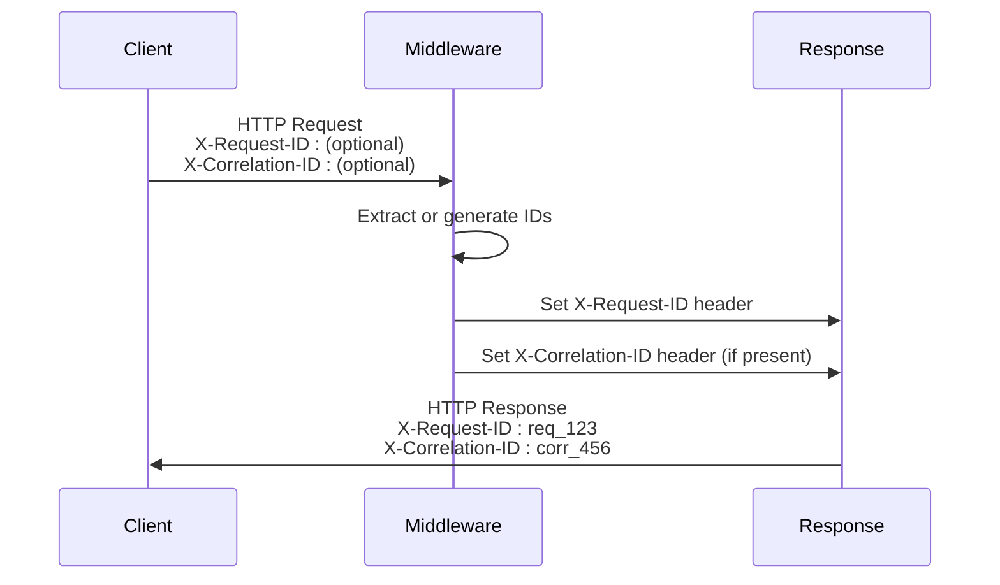
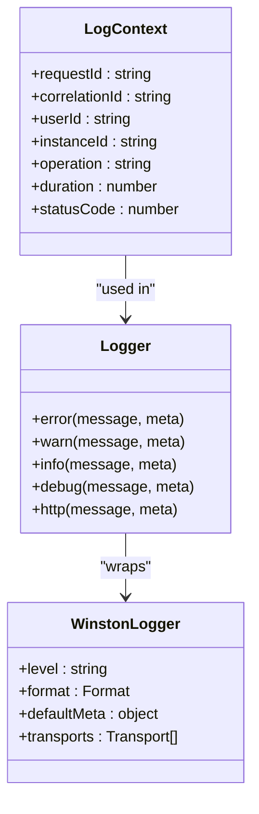
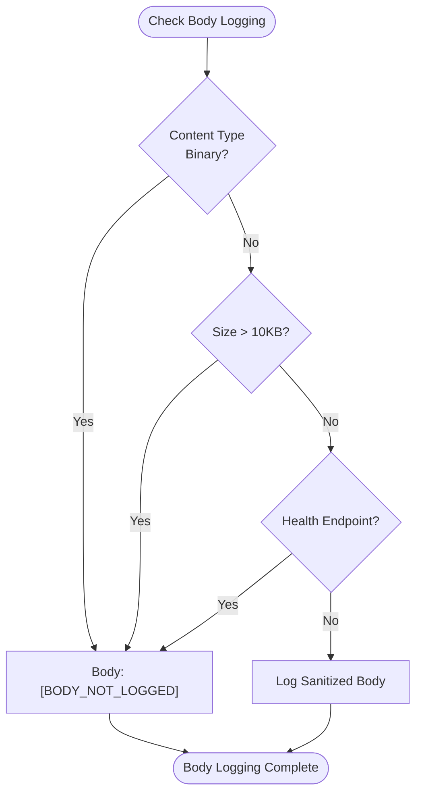
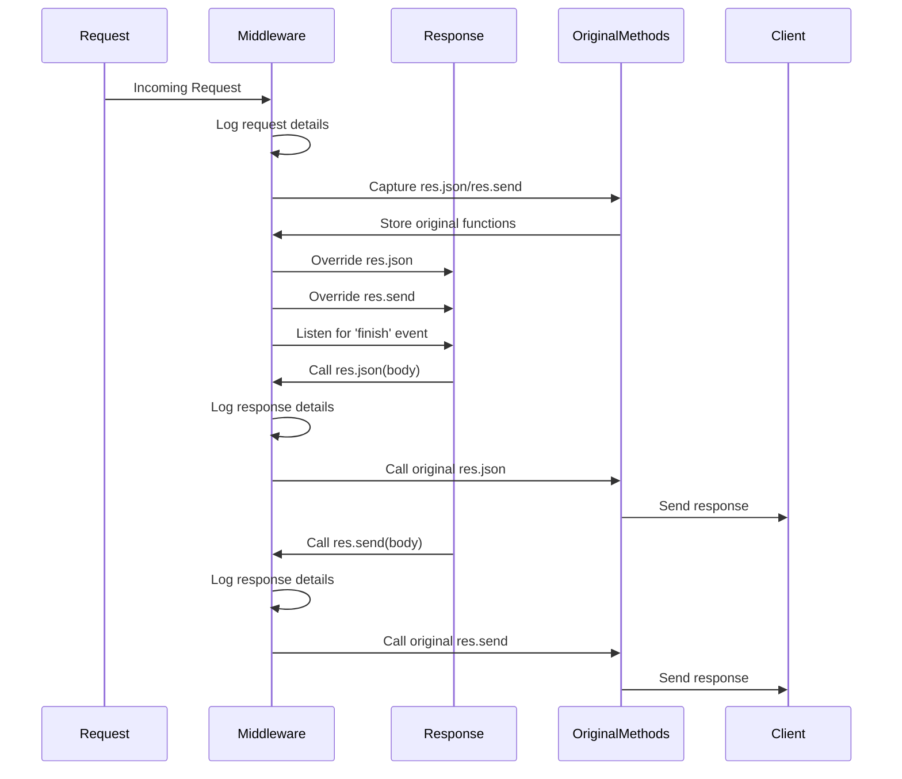
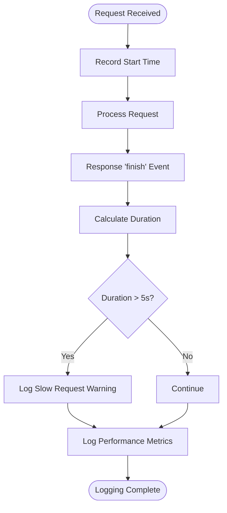
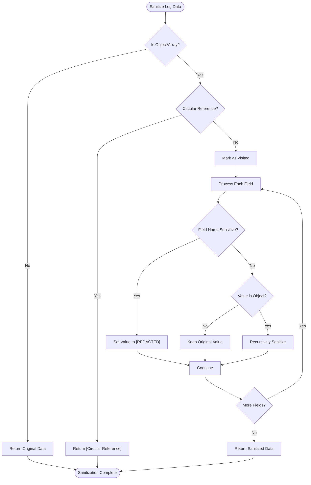

# Request Logging

<cite>
**Referenced Files in This Document**   
- [requestLogger.ts](file://src/middleware/requestLogger.ts)
- [logger.ts](file://src/utils/logger.ts)
</cite>

## Table of Contents
1. [Introduction](#introduction)
2. [Request Identifier Management](#request-identifier-management)
3. [Structured Logging Implementation](#structured-logging-implementation)
4. [Body Logging Conditions](#body-logging-conditions)
5. [Response Logging Mechanism](#response-logging-mechanism)
6. [Performance Monitoring](#performance-monitoring)
7. [Log Output Examples](#log-output-examples)
8. [Configuration and Data Sanitization](#configuration-and-data-sanitization)

## Introduction
The request logging subsystem in the novitai application provides comprehensive monitoring of HTTP requests and responses through the requestLoggerMiddleware. This middleware captures detailed information about incoming requests, including correlation IDs for distributed tracing, and logs both request and response data in a structured format. The system integrates with Winston for JSON-based logging output, ensuring consistent and machine-readable log entries. The implementation includes sophisticated mechanisms for request identification, response interception, performance monitoring, and sensitive data protection.

**Section sources**
- [requestLogger.ts](file://src/middleware/requestLogger.ts#L1-L233)
- [logger.ts](file://src/utils/logger.ts#L1-L175)

## Request Identifier Management
The request logging subsystem manages request and correlation identifiers to enable distributed tracing across service boundaries. The middleware extracts existing identifiers from request headers or generates new ones when they are not present. The X-Request-ID header is used to track individual requests, while the X-Correlation-ID header maintains context across related operations. These identifiers are propagated to response headers, ensuring traceability throughout the request-response cycle.



**Diagram sources**
- [requestLogger.ts](file://src/middleware/requestLogger.ts#L11-L30)
- [requestLogger.ts](file://src/middleware/requestLogger.ts#L182-L191)

**Section sources**
- [requestLogger.ts](file://src/middleware/requestLogger.ts#L11-L30)
- [requestLogger.ts](file://src/middleware/requestLogger.ts#L182-L191)

## Structured Logging Implementation
The logging system implements structured JSON output using Winston with a custom format configuration. Each log entry contains standardized fields including timestamp, log level, service name, and message, along with contextual information such as request ID and correlation ID. The structuredFormat combines timestamping, error stack tracing, and JSON stringification to create consistent log entries. In production environments, the system uses structured format for all console output, while development environments use a more human-readable console format with colorization.



**Diagram sources**
- [logger.ts](file://src/utils/logger.ts#L0-L57)
- [logger.ts](file://src/utils/logger.ts#L59-L85)

**Section sources**
- [logger.ts](file://src/utils/logger.ts#L0-L57)
- [logger.ts](file://src/utils/logger.ts#L59-L85)

## Body Logging Conditions
The system implements conditional logic to determine when request and response bodies should be logged, preventing sensitive or excessively large payloads from being recorded. Request bodies are excluded from logs when they contain binary content types (such as multipart/form-data, application/octet-stream, or media types), exceed 10KB in size, or are associated with health check endpoints. Response bodies follow similar rules but always log error responses (status codes 400+) regardless of size to aid in debugging. This selective logging approach balances debugging needs with performance and security considerations.



**Diagram sources**
- [requestLogger.ts](file://src/middleware/requestLogger.ts#L100-L175)
- [requestLogger.ts](file://src/middleware/requestLogger.ts#L124-L175)

**Section sources**
- [requestLogger.ts](file://src/middleware/requestLogger.ts#L100-L175)
- [requestLogger.ts](file://src/middleware/requestLogger.ts#L124-L175)

## Response Logging Mechanism
The response logging mechanism intercepts Express response methods to capture outgoing response details before they are sent to clients. The middleware overrides res.json and res.send methods to log response data, status codes, and headers. When these methods are called, the system captures the response body, sanitizes sensitive information, and logs the complete response details. For cases where json or send are not called directly, the middleware listens for the 'finish' event on the response object to ensure all responses are logged. This comprehensive approach guarantees that both successful and error responses are captured in the logs.



**Diagram sources**
- [requestLogger.ts](file://src/middleware/requestLogger.ts#L60-L79)
- [requestLogger.ts](file://src/middleware/requestLogger.ts#L81-L100)

**Section sources**
- [requestLogger.ts](file://src/middleware/requestLogger.ts#L60-L100)

## Performance Monitoring
The performance monitoring component detects slow requests that exceed a 5-second threshold and generates warning logs to alert developers and operations teams. The system tracks request duration from the time the middleware is invoked until the response is completed. For all requests, performance metrics are logged at the debug level, including method, URL, duration, and status code. When a request exceeds the 5-second threshold, a warning log is generated with detailed information about the slow request. This dual-level logging approach provides comprehensive performance insights while highlighting potential performance bottlenecks.



**Diagram sources**
- [requestLogger.ts](file://src/middleware/requestLogger.ts#L194-L233)
- [logger.ts](file://src/utils/logger.ts#L149-L175)

**Section sources**
- [requestLogger.ts](file://src/middleware/requestLogger.ts#L194-L233)
- [logger.ts](file://src/utils/logger.ts#L149-L175)

## Log Output Examples
The logging system produces JSON-formatted output that includes comprehensive request and response details. For successful requests, the system logs at the info level, capturing method, URL, headers, query parameters, and sanitized request body when appropriate. Error responses (400+ status codes) are logged at the warn or error level, depending on severity, with response bodies always included for debugging purposes. Each log entry includes the request ID and correlation ID for traceability, along with timestamps and performance metrics.

Example of a successful request log:
```json
{
  "timestamp": "2023-12-07 10:30:45.123",
  "level": "INFO",
  "service": "novita-gpu-instance-api",
  "message": "Incoming request",
  "requestId": "req_1701945045_abc123",
  "correlationId": "corr_1701945045_def456",
  "method": "POST",
  "url": "/api/instances",
  "path": "/api/instances",
  "userAgent": "Mozilla/5.0",
  "contentType": "application/json",
  "ip": "192.168.1.1",
  "query": {},
  "params": {},
  "headers": {
    "host": "api.novitai.com",
    "content-type": "application/json"
  },
  "body": {
    "name": "test-instance",
    "region": "us-west"
  }
}
```

Example of an error response log:
```json
{
  "timestamp": "2023-12-07 10:31:20.456",
  "level": "WARN",
  "service": "novita-gpu-instance-api",
  "message": "Outgoing response",
  "requestId": "req_1701945080_xyz789",
  "correlationId": "corr_1701945080_ghi012",
  "statusCode": 400,
  "duration": 150,
  "responseBody": {
    "error": "Validation failed",
    "details": "Region is required"
  },
  "headers": {
    "content-type": "application/json",
    "content-length": "78"
  }
}
```

**Section sources**
- [requestLogger.ts](file://src/middleware/requestLogger.ts#L38-L79)
- [requestLogger.ts](file://src/middleware/requestLogger.ts#L81-L100)

## Configuration and Data Sanitization
The logging system provides configurable log levels through the application configuration and implements comprehensive data sanitization to protect sensitive information. The sanitizeLogData utility function recursively processes log data, identifying and redacting sensitive fields such as passwords, tokens, API keys, and authorization headers. The function uses case-insensitive matching to detect sensitive field names and replaces their values with '[REDACTED]'. The system also handles circular references gracefully to prevent infinite loops during sanitization. Log levels are configurable via the config.logLevel setting, allowing teams to adjust verbosity based on environment and debugging needs.



**Diagram sources**
- [logger.ts](file://src/utils/logger.ts#L87-L147)
- [logger.ts](file://src/utils/logger.ts#L40-L57)

**Section sources**
- [logger.ts](file://src/utils/logger.ts#L87-L147)
- [logger.ts](file://src/utils/logger.ts#L40-L57)