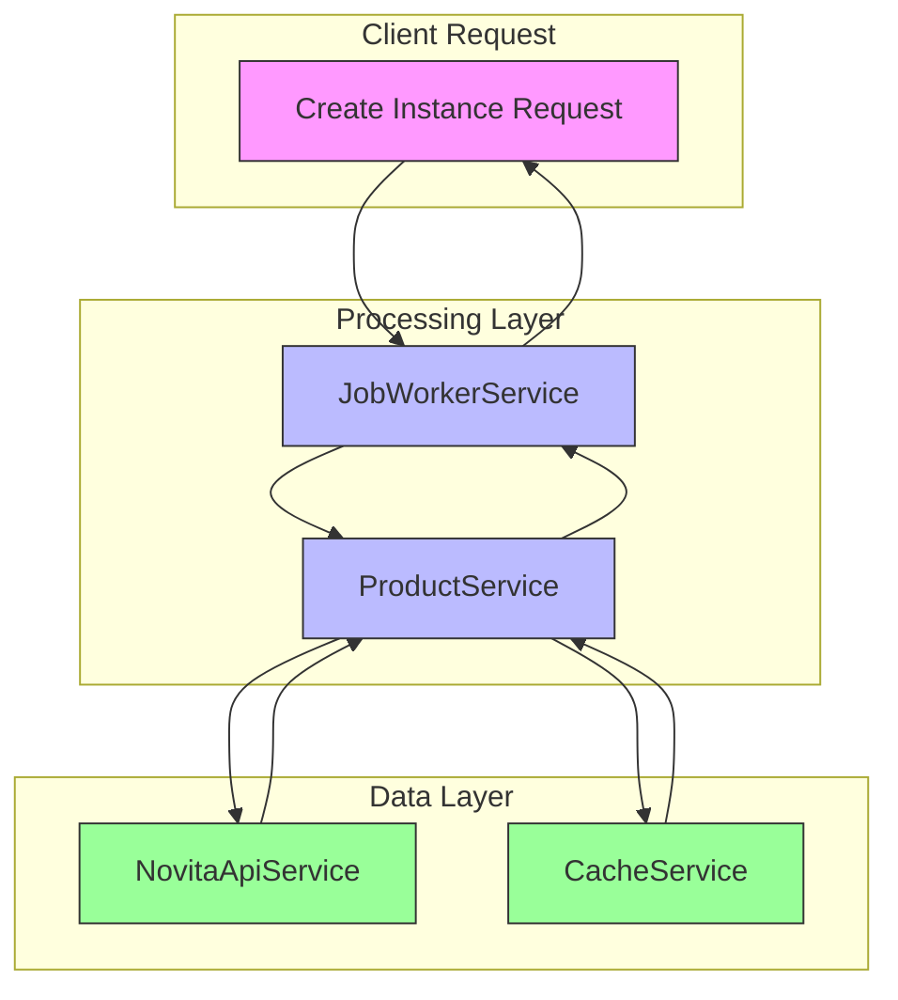
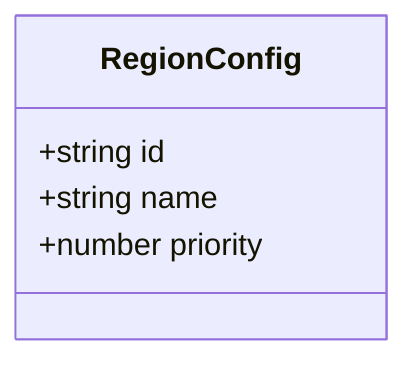
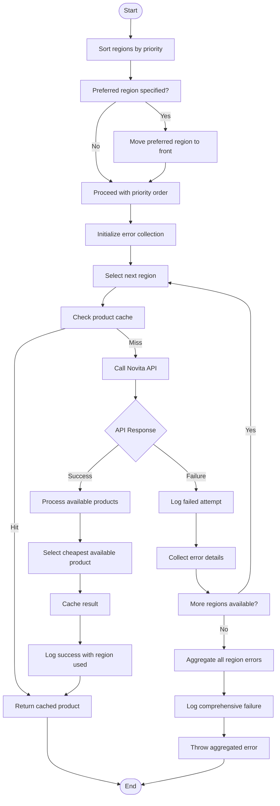
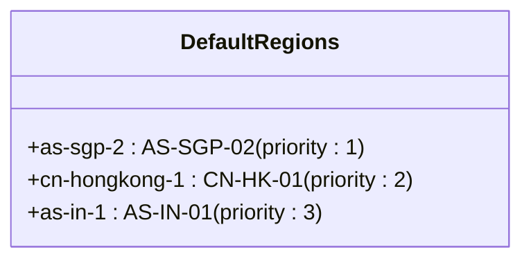
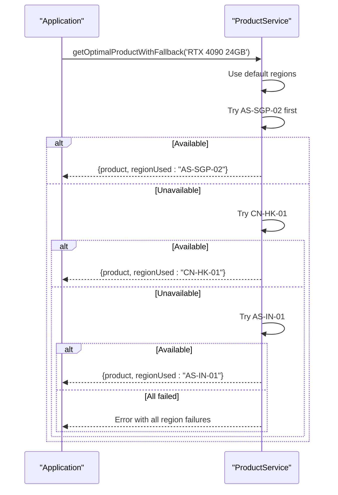
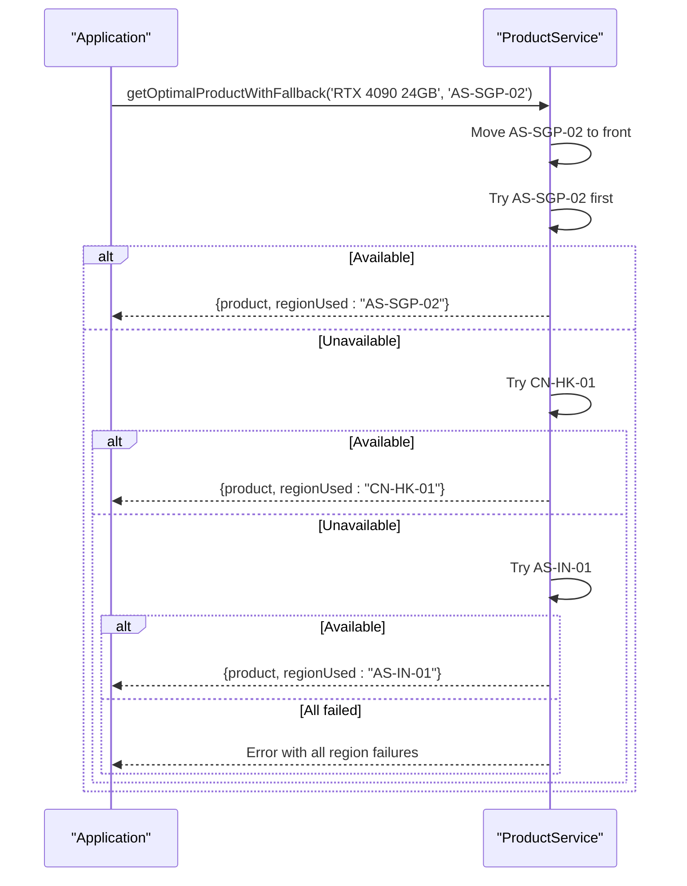
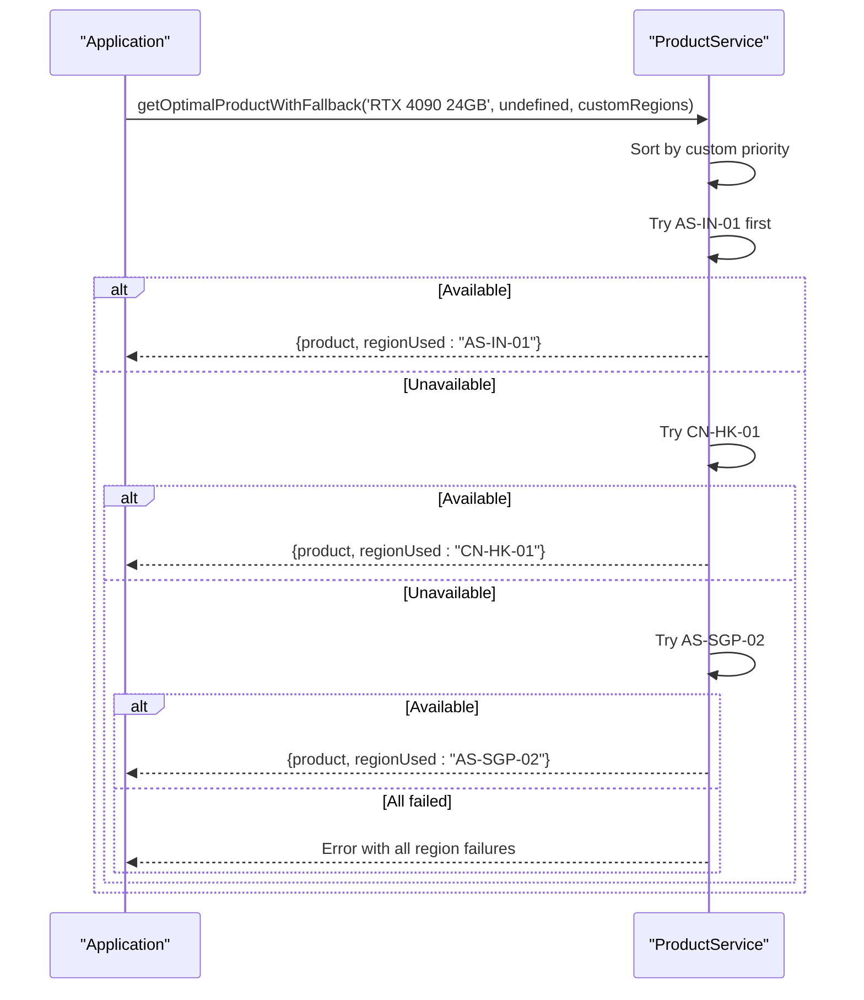
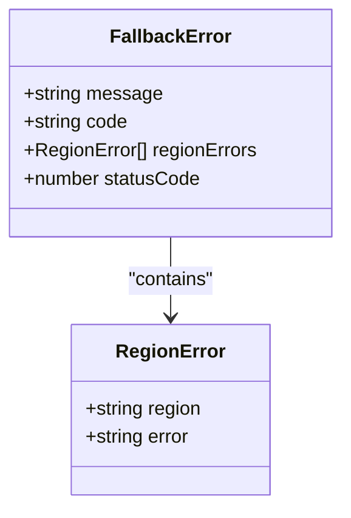

# Multi-Region Fallback System

<cite>
**Referenced Files in This Document**   
- [REGION_FALLBACK_IMPLEMENTATION.md](file://REGION_FALLBACK_IMPLEMENTATION.md)
- [productService.ts](file://src/services/productService.ts)
- [config.ts](file://src/config/config.ts)
- [regionFallbackExample.ts](file://src/examples/regionFallbackExample.ts)
- [api.ts](file://src/types/api.ts)
</cite>

## Table of Contents
1. [Introduction](#introduction)
2. [System Architecture](#system-architecture)
3. [RegionConfig Interface](#regionconfig-interface)
4. [Product Selection Integration](#product-selection-integration)
5. [Fallback Logic Flow](#fallback-logic-flow)
6. [Configuration Options](#configuration-options)
7. [Practical Usage Examples](#practical-usage-examples)
8. [Error Handling and Logging](#error-handling-and-logging)
9. [Testing and Validation](#testing-and-validation)
10. [Troubleshooting Guide](#troubleshooting-guide)

## Introduction

The Multi-Region Fallback System enhances the reliability and availability of GPU instance creation by implementing automatic failover across multiple geographic regions. This system ensures that when a preferred region cannot fulfill a product request, the system automatically attempts alternative regions based on priority configuration, significantly improving success rates for instance provisioning.

The fallback mechanism is seamlessly integrated into the product selection process, allowing users to specify preferred regions while maintaining the ability to fall back to alternatives when necessary. This approach balances user preferences with system reliability, ensuring optimal resource allocation across the global infrastructure.

**Section sources**
- [REGION_FALLBACK_IMPLEMENTATION.md](file://REGION_FALLBACK_IMPLEMENTATION.md#L1-L20)
- [productService.ts](file://src/services/productService.ts#L1-L50)

## System Architecture



**Diagram sources**
- [productService.ts](file://src/services/productService.ts#L1-L50)
- [jobWorkerService.ts](file://src/services/jobWorkerService.ts#L1-L50)

**Section sources**
- [productService.ts](file://src/services/productService.ts#L1-L50)
- [jobWorkerService.ts](file://src/services/jobWorkerService.ts#L1-L50)

## RegionConfig Interface

The `RegionConfig` interface defines the structure for region configuration within the multi-region fallback system. Each region configuration includes an identifier, name, and priority value that determines the order of fallback attempts.



The interface properties serve specific purposes:
- **id**: Internal identifier used for API calls and system operations
- **name**: Human-readable region identifier used in requests and responses
- **priority**: Numerical value determining fallback order (lower number = higher priority)

This interface enables flexible configuration of region preferences, allowing both system defaults and custom user-defined priorities. The type is used throughout the system to maintain consistency in region handling and ensure type safety.

**Diagram sources**
- [api.ts](file://src/types/api.ts#L328-L332)

**Section sources**
- [api.ts](file://src/types/api.ts#L328-L332)
- [productService.ts](file://src/services/productService.ts#L15-L25)

## Product Selection Integration

The multi-region fallback system is integrated into the product selection process through the `getOptimalProductWithFallback` method in the `ProductService` class. This method extends the existing product selection functionality with fallback capabilities while maintaining backward compatibility.

```mermaid
sequenceDiagram
participant Client as "Client App"
participant JobWorker as "JobWorkerService"
participant ProductService as "ProductService"
participant Cache as "CacheService"
participant API as "NovitaApiService"
Client->>JobWorker : Create Instance Request
JobWorker->>ProductService : getOptimalProductWithFallback()
ProductService->>Cache : Check optimal product cache
alt Cache Hit
Cache-->>ProductService : Return cached product
else Cache Miss
ProductService->>ProductService : Sort regions by priority
loop For each region in priority order
ProductService->>API : getProducts() by region
API-->>ProductService : Product list
alt Products available
ProductService->>ProductService : Select optimal (cheapest)
ProductService->>Cache : Cache result
break Return product
else No available products
ProductService->>ProductService : Log warning, try next region
end
end
end
ProductService-->>JobWorker : {product, regionUsed}
JobWorker->>Client : Proceed with instance creation
```

The integration preserves existing caching mechanisms while adding multi-region awareness. The system first checks the cache for previously found optimal products, and only performs API calls when necessary. This approach optimizes performance while ensuring up-to-date availability information.

**Diagram sources**
- [productService.ts](file://src/services/productService.ts#L250-L350)
- [jobWorkerService.ts](file://src/services/jobWorkerService.ts#L100-L150)

**Section sources**
- [productService.ts](file://src/services/productService.ts#L250-L350)
- [jobWorkerService.ts](file://src/services/jobWorkerService.ts#L100-L150)

## Fallback Logic Flow

The fallback system follows a deterministic sequence of operations to ensure reliable product selection across multiple regions. The logic prioritizes user preferences while maintaining system efficiency and transparency.



The flow begins with region prioritization, incorporating any user-specified preferred region. It then iterates through regions in order, attempting to find available products. The system collects error information from failed attempts to provide comprehensive diagnostics when all regions fail.

**Diagram sources**
- [productService.ts](file://src/services/productService.ts#L250-L350)
- [REGION_FALLBACK_IMPLEMENTATION.md](file://REGION_FALLBACK_IMPLEMENTATION.md#L100-L150)

**Section sources**
- [productService.ts](file://src/services/productService.ts#L250-L350)
- [REGION_FALLBACK_IMPLEMENTATION.md](file://REGION_FALLBACK_IMPLEMENTATION.md#L100-L150)

## Configuration Options

The multi-region fallback system supports multiple configuration approaches to accommodate different use cases and deployment scenarios. These options provide flexibility in region selection while maintaining sensible defaults.

### Default Region Configuration

The system includes predefined default regions with established priorities:



These defaults represent a geographically diverse set of regions with Singapore as the primary option, followed by Hong Kong and India. This configuration balances performance, availability, and redundancy.

### Custom Region Configuration

Users can override the default configuration with custom region priorities:

```typescript
const customRegions: RegionConfig[] = [
  { id: 'as-in-1', name: 'AS-IN-01', priority: 1 },
  { id: 'cn-hongkong-1', name: 'CN-HK-01', priority: 2 },
  { id: 'as-sgp-2', name: 'AS-SGP-02', priority: 3 }
];
```

This flexibility allows organizations to optimize for specific requirements such as data sovereignty, latency optimization, or cost efficiency.

**Diagram sources**
- [productService.ts](file://src/services/productService.ts#L20-L35)
- [config.ts](file://src/config/config.ts#L100-L120)

**Section sources**
- [productService.ts](file://src/services/productService.ts#L20-L35)
- [config.ts](file://src/config/config.ts#L100-L120)

## Practical Usage Examples

The multi-region fallback system provides several usage patterns to accommodate different application requirements. These examples demonstrate the API usage and expected behavior in various scenarios.

### Basic Usage

The simplest usage pattern relies on the system defaults:



### Preferred Region Usage

Applications can express region preferences while maintaining fallback capabilities:



### Custom Priority Usage

Applications can define completely custom region priority orders:



**Diagram sources**
- [regionFallbackExample.ts](file://src/examples/regionFallbackExample.ts#L20-L90)
- [productService.ts](file://src/services/productService.ts#L250-L350)

**Section sources**
- [regionFallbackExample.ts](file://src/examples/regionFallbackExample.ts#L20-L90)
- [productService.ts](file://src/services/productService.ts#L250-L350)

## Error Handling and Logging

The system implements comprehensive error handling and logging to ensure operational visibility and facilitate troubleshooting. Errors are collected and aggregated to provide meaningful diagnostics when fallback sequences fail.

### Error Collection Strategy



When all regions fail, the system aggregates individual region errors into a comprehensive failure message that includes details from each attempted region. This approach provides complete context for debugging availability issues.

### Logging Levels

The system uses different logging levels to provide appropriate information for various operational needs:

- **Debug**: Detailed information about each region attempt and fallback progression
- **Info**: Successful product selection, region used vs. requested, and performance metrics
- **Warn**: Individual region failures and fallback progression
- **Error**: Complete failure after all regions have been attempted

This tiered approach ensures that operators can monitor system behavior at the appropriate level of detail without being overwhelmed by log volume.

**Diagram sources**
- [productService.ts](file://src/services/productService.ts#L300-L350)
- [logger.ts](file://src/utils/logger.ts#L1-L20)

**Section sources**
- [productService.ts](file://src/services/productService.ts#L300-L350)
- [logger.ts](file://src/utils/logger.ts#L1-L20)

## Testing and Validation

The multi-region fallback system includes comprehensive test coverage to ensure reliability and correctness across all scenarios. The testing strategy includes both unit tests and integration tests.

### Test Coverage


The test suite verifies that:
- The system correctly handles successful selection in the first region (no fallback needed)
- Fallback works properly when the first region fails but subsequent regions succeed
- Custom region configurations are properly sorted and prioritized
- Preferred region overrides correctly modify the fallback sequence
- Comprehensive error messages are generated when all regions fail
- Cache functionality is preserved across the fallback process

All tests pass successfully, confirming the reliability of the implementation.

**Diagram sources**
- [productService.regionFallback.test.ts](file://src/services/__tests__/productService.regionFallback.test.ts#L1-L10)
- [REGION_FALLBACK_IMPLEMENTATION.md](file://REGION_FALLBACK_IMPLEMENTATION.md#L180-L200)

**Section sources**
- [productService.regionFallback.test.ts](file://src/services/__tests__/productService.regionFallback.test.ts#L1-L10)
- [REGION_FALLBACK_IMPLEMENTATION.md](file://REGION_FALLBACK_IMPLEMENTATION.md#L180-L200)

## Troubleshooting Guide

This section provides guidance for diagnosing and resolving common issues with the multi-region fallback system.

### Common Issues and Solutions

| Issue | Symptoms | Diagnosis | Resolution |
|------|---------|-----------|------------|
| All regions failing | Consistent 404 errors with product not found in all regions | Product name mismatch or product unavailable in all regions | Verify product name spelling and check product availability across regions |
| Unexpected region selection | Region used differs from preferred region | Preferred region has no available products | Check availability in preferred region; system correctly fell back to next available region |
| Performance degradation | Increased latency in instance creation | Cache miss forcing API calls to multiple regions | Monitor cache hit ratio; consider preloading frequently used products |
| Configuration issues | Region configuration not being honored | Incorrect region IDs or names in custom configuration | Validate region IDs and names against system configuration |

### Diagnostic Commands

To diagnose issues with the fallback system, use the following approaches:

1. **Check cache statistics**:
```typescript
const stats = productService.getCacheStats();
console.log(stats);
```

2. **Enable debug logging** to see detailed fallback progression

3. **Verify configuration**:
```typescript
console.log(getConfigSummary());
```

4. **Test region availability**:
```typescript
await productService.getOptimalProductWithFallback('Invalid GPU Product');
```

The system's comprehensive logging provides detailed information about each fallback attempt, making it easier to identify the root cause of issues.

**Section sources**
- [productService.ts](file://src/services/productService.ts#L350-L380)
- [REGION_FALLBACK_IMPLEMENTATION.md](file://REGION_FALLBACK_IMPLEMENTATION.md#L200-L220)