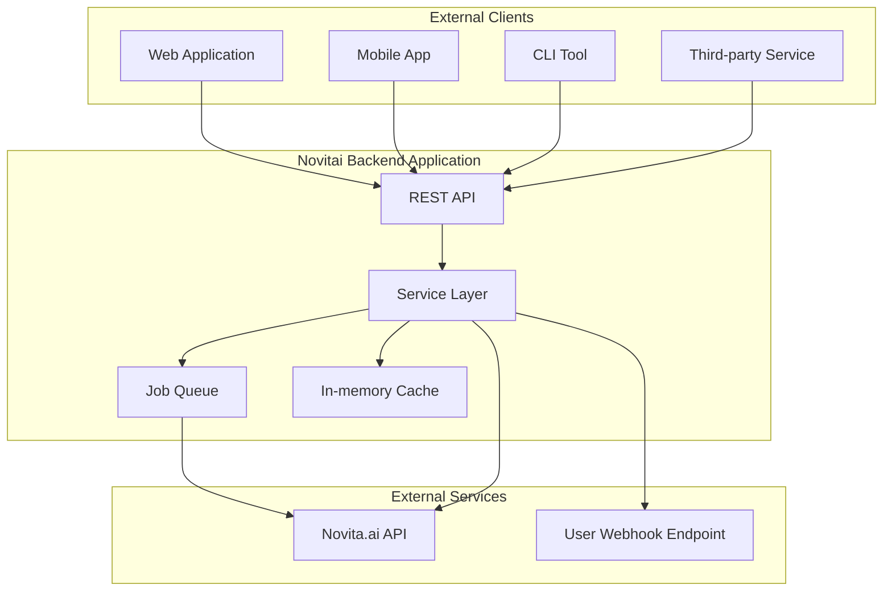
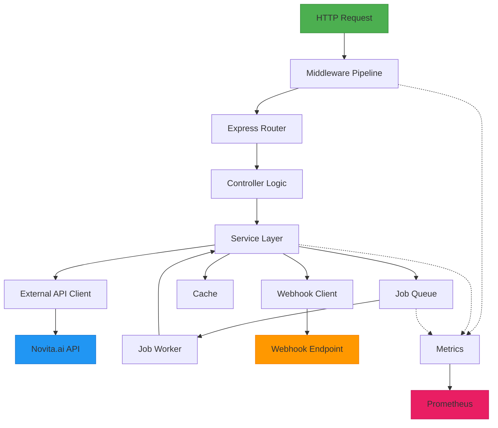
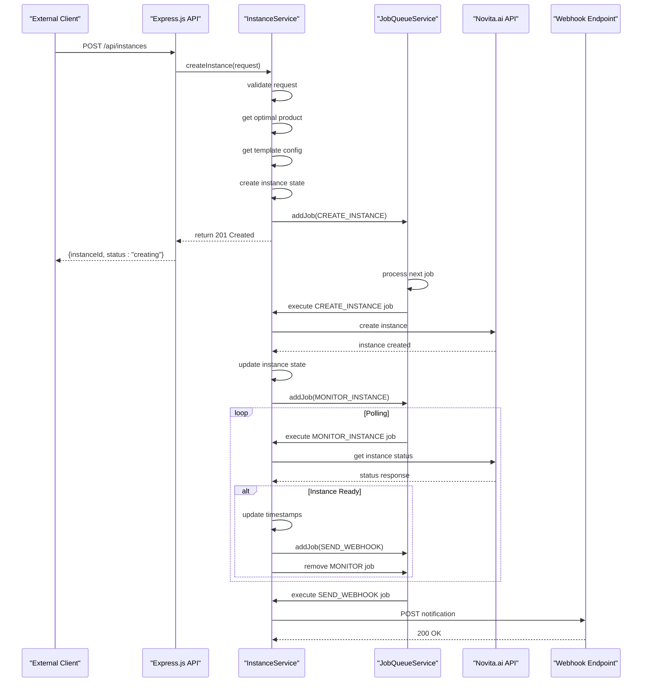
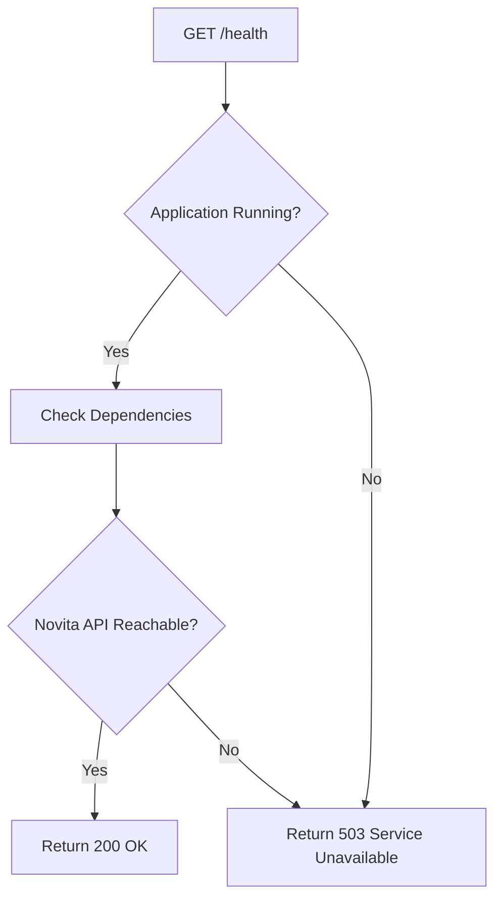
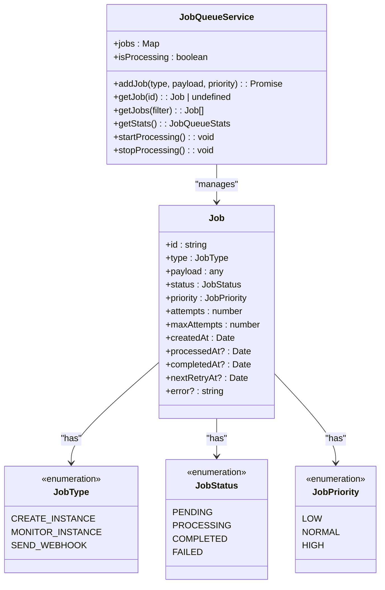

# Project Overview

<cite>
**Referenced Files in This Document**   
- [README.md](file://README.md)
- [src/index.ts](file://src/index.ts)
- [src/routes/instances.ts](file://src/routes/instances.ts)
- [src/services/instanceService.ts](file://src/services/instanceService.ts)
- [src/clients/novitaClient.ts](file://src/clients/novitaClient.ts)
- [src/middleware/metricsMiddleware.ts](file://src/middleware/metricsMiddleware.ts)
- [src/services/jobQueueService.ts](file://src/services/jobQueueService.ts)
- [src/config/config.ts](file://src/config/config.ts)
- [API_ENDPOINTS_SUMMARY.md](file://docs/api/endpoints.md)
- [client-examples/README.md](file://client-examples/README.md)
</cite>

## Table of Contents
1. [Introduction](#introduction)
2. [Core Value Proposition](#core-value-proposition)
3. [System Context](#system-context)
4. [High-Level Architecture](#high-level-architecture)
5. [Main Data Flow](#main-data-flow)
6. [Codebase Structure](#codebase-structure)
7. [Key Features](#key-features)
8. [Entry Points](#entry-points)

## Introduction

The Novitai backend application is a RESTful API service designed to manage GPU instances on the Novita.ai platform through automated lifecycle workflows. It enables users to programmatically create, monitor, and manage GPU instances with optimal pricing and webhook notifications. The service is built using TypeScript and Express.js, following a modular architecture with clear separation of concerns between components.

**Section sources**
- [README.md](file://README.md#L1-L10)
- [src/index.ts](file://src/index.ts#L1-L10)

## Core Value Proposition

The core value proposition of the Novitai backend application lies in its ability to provide programmatic access to GPU instance management with several key benefits:

- **Automated Lifecycle Management**: Users can create GPU instances through a simple API call, with the system automatically handling the provisioning, configuration, and monitoring processes.
- **Optimal Pricing Selection**: The service intelligently selects the most cost-effective product configuration based on user requirements and region.
- **Webhook Notifications**: Users receive real-time notifications via configurable webhook endpoints when instances are ready or when status changes occur.
- **Reliable Operations**: Built-in retry mechanisms, circuit breakers, and rate limiting ensure reliable communication with the Novita.ai API even during transient failures.
- **Performance Monitoring**: Comprehensive metrics collection and exposure enable monitoring of system health and performance.

This combination of features allows developers and organizations to integrate GPU instance management seamlessly into their workflows, enabling automated machine learning pipelines, dynamic resource allocation, and cost-optimized infrastructure.

**Section sources**
- [README.md](file://README.md#L12-L25)
- [src/services/instanceService.ts](file://src/services/instanceService.ts#L1-L50)

## System Context

The Novitai backend application operates as an intermediary layer between external clients and the Novita.ai platform, providing a simplified interface for GPU instance management. The system interacts with several external components to deliver its functionality.

**Diagram sources**
- [src/index.ts](file://src/index.ts#L1-L20)
- [src/clients/novitaClient.ts](file://src/clients/novitaClient.ts#L1-L50)
- [src/services/instanceService.ts](file://src/services/instanceService.ts#L1-L50)

## High-Level Architecture

The Novitai backend application follows a layered architecture pattern with clear separation between presentation, business logic, and data access layers. The architecture consists of several key components that work together to handle API requests and manage GPU instance lifecycles.

The application is built on Express.js, providing a robust foundation for the RESTful API. The middleware pipeline handles cross-cutting concerns such as request logging, error handling, security, and metrics collection. The service layer implements the core business logic, while specialized clients handle communication with external APIs.

**Diagram sources**
- [src/index.ts](file://src/index.ts#L1-L115)
- [src/middleware/requestLogger.ts](file://src/middleware/requestLogger.ts#L1-L10)
- [src/middleware/errorHandler.ts](file://src/middleware/errorHandler.ts#L1-L10)
- [src/routes/instances.ts](file://src/routes/instances.ts#L1-L20)
- [src/services/instanceService.ts](file://src/services/instanceService.ts#L1-L50)

## Main Data Flow

The primary data flow in the Novitai backend application begins with an API request to create a GPU instance and concludes with the delivery of a webhook notification when the instance is ready. This workflow demonstrates the integration of various components in the system.

**Diagram sources**
- [src/routes/instances.ts](file://src/routes/instances.ts#L1-L133)
- [src/services/instanceService.ts](file://src/services/instanceService.ts#L1-L516)
- [src/services/jobQueueService.ts](file://src/services/jobQueueService.ts#L1-L50)
- [src/clients/novitaClient.ts](file://src/clients/novitaClient.ts#L1-L50)

## Codebase Structure

The Novitai backend application follows a well-organized directory structure that promotes maintainability and scalability. Each directory serves a specific purpose in the overall architecture of the application.

- **src/**: Contains the main application source code organized into logical modules
  - **clients/**: Specialized clients for external API communication with Novita.ai and webhook endpoints
  - **config/**: Configuration management with validation and environment variable handling
  - **middleware/**: Express.js middleware for cross-cutting concerns like logging, error handling, and metrics
  - **routes/**: API route definitions and request handlers
  - **services/**: Business logic implementation with service classes for instance management, job processing, and metrics
  - **types/**: TypeScript interfaces and types for API requests, responses, and internal data structures
  - **utils/**: Utility functions for logging, error handling, and other shared functionality
  - **index.ts**: Application entry point that sets up the Express.js server and middleware pipeline

- **client-examples/**: Ready-to-use client code examples in multiple programming languages
  - **nodejs/**: Node.js/JavaScript client examples
  - **python/**: Python client examples
  - **README.md**: Documentation for using the client examples

- **scripts/**: Operational scripts for deployment, backup, and health checking
  - **backup.sh**: Database and configuration backup script
  - **deploy-dev.sh**: Development environment deployment script
  - **deploy-prod.sh**: Production environment deployment script
  - **health-check.sh**: System health verification script

- **Root files**: Configuration and documentation files
  - **package.json**: Node.js package dependencies and scripts
  - **Dockerfile**: Containerization configuration
  - **docker-compose.yml**: Multi-container orchestration configuration
  - **README.md**: Project overview and quick start guide
  - **API_ENDPOINTS_SUMMARY.md**: Comprehensive API endpoint documentation

**Section sources**
- [README.md](file://README.md#L1-L100)
- [client-examples/README.md](file://client-examples/README.md#L1-L10)
- [project_structure](file://#L1-L100)

## Key Features

The Novitai backend application includes several key features that enhance its reliability, observability, and usability for both developers and system integrators.

### Health Checks

The application provides a comprehensive health check endpoint at `GET /health` that verifies the operational status of the service. This endpoint returns a 200 status code when the application is running normally and can be used for container orchestration and monitoring systems.

**Diagram sources**
- [src/routes/health.ts](file://src/routes/health.ts#L1-L10)
- [src/clients/novitaClient.ts](file://src/clients/novitaClient.ts#L350-L385)

### Metrics Exposure

The application exposes detailed metrics through the `GET /api/metrics` endpoint, providing insights into system performance and behavior. These metrics include request rates, response times, cache performance, and job queue statistics, enabling effective monitoring and troubleshooting.

The metrics middleware automatically collects data on all API requests, including method, endpoint, status code, and duration. This information is aggregated by the metrics service and exposed in a format compatible with monitoring systems like Prometheus.

**Section sources**
- [src/middleware/metricsMiddleware.ts](file://src/middleware/metricsMiddleware.ts#L1-L104)
- [src/services/metricsService.ts](file://src/services/metricsService.ts#L1-L50)
- [src/routes/metrics.ts](file://src/routes/metrics.ts#L1-L10)

### Job Queue-Based Workflows

The application implements a robust job queue system that enables asynchronous processing of long-running operations. This architecture decouples request handling from resource-intensive tasks, improving responsiveness and reliability.

The job queue service manages three primary job types:
- **CREATE_INSTANCE**: Handles the initial provisioning of GPU instances
- **MONITOR_INSTANCE**: Periodically checks the status of instances until they are ready
- **SEND_WEBHOOK**: Delivers notifications to user-configured webhook endpoints

Each job type has configurable priority levels and retry policies with exponential backoff, ensuring reliable delivery even during temporary failures of external services.

**Diagram sources**
- [src/services/jobQueueService.ts](file://src/services/jobQueueService.ts#L1-L378)
- [src/types/job.ts](file://src/types/job.ts#L1-L50)

## Entry Points

The Novitai backend application provides several entry points for developers and system integrators to understand and interact with the system.

### API Endpoints

The primary entry point for interacting with the application is through its RESTful API. The key endpoints are documented in [docs/api/endpoints.md](file://docs/api/endpoints.md) and include:

- `GET /health`: Health check endpoint
- `POST /api/instances`: Create new GPU instance
- `GET /api/instances/{id}`: Get instance status
- `GET /api/instances`: List all instances
- `GET /api/metrics`: Service metrics

### Configuration

The application's behavior is controlled through environment variables defined in the configuration system. The main configuration file [src/config/config.ts](file://src/config/config.ts) validates and loads these settings, providing sensible defaults while requiring essential parameters like the Novita.ai API key.

### Client Examples

For developers looking to integrate with the API, the [client-examples/](file://client-examples/) directory contains ready-to-use code samples in multiple programming languages, including Node.js, Python, and shell scripts using cURL. These examples demonstrate common use cases and best practices for interacting with the API.

**Section sources**
- [docs/api/endpoints.md](file://docs/api/endpoints.md#L1-L10)
- [client-examples/README.md](file://client-examples/README.md#L1-L10)
- [src/config/config.ts](file://src/config/config.ts#L1-L50)