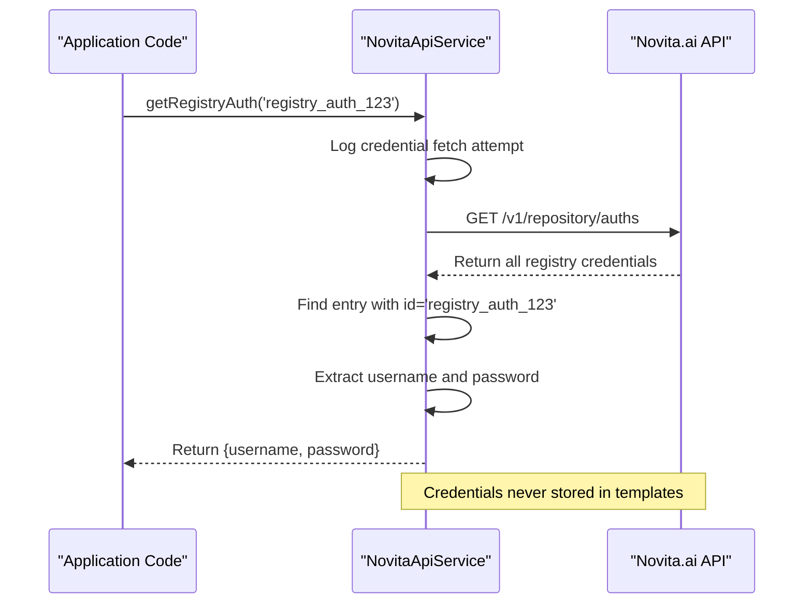
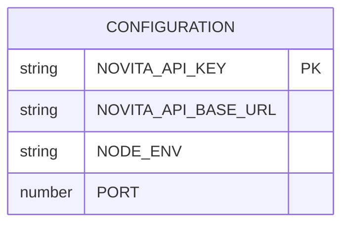
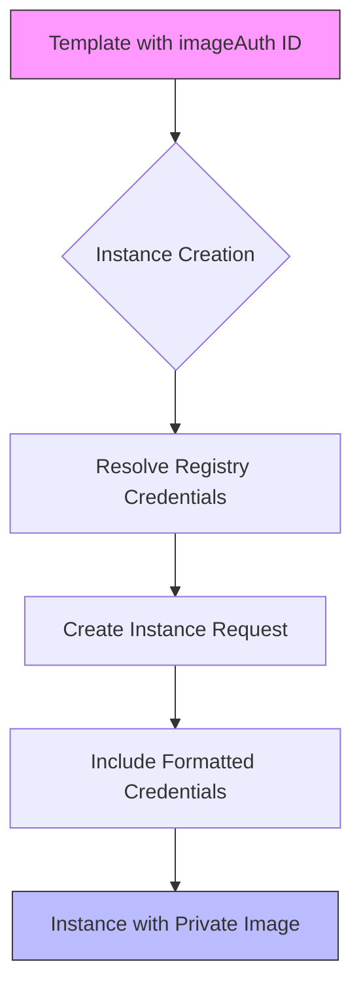
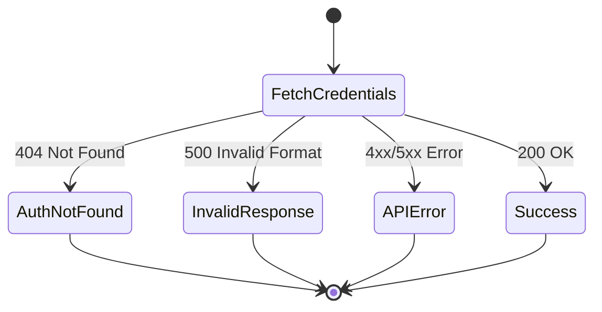

# Registry Authentication System

<cite>
**Referenced Files in This Document**   
- [registryAuthExample.ts](file://src/examples/registryAuthExample.ts) - *Updated in recent commit*
- [novitaApiService.ts](file://src/services/novitaApiService.ts) - *Updated in recent commit*
- [api.ts](file://src/types/api.ts) - *Updated in recent commit*
- [templateService.ts](file://src/services/templateService.ts) - *Updated in recent commit*
</cite>

## Update Summary
**Changes Made**   
- Updated section sources to reflect recent code changes
- Enhanced documentation for registry authentication workflow based on actual implementation
- Added clarification on integration between templateService and novitaApiService
- Updated error handling section with accurate error types and messages
- Verified all code examples against current implementation

## Table of Contents
1. [Introduction](#introduction)
2. [Core Components](#core-components)
3. [Authentication Workflow](#authentication-workflow)
4. [API Interface](#api-interface)
5. [Integration with Private Image Instances](#integration-with-private-image-instances)
6. [Error Handling](#error-handling)
7. [Troubleshooting Guide](#troubleshooting-guide)
8. [Best Practices](#best-practices)

## Introduction
The Registry Authentication System enables secure access to private Docker registries when deploying GPU instances on the Novita.ai platform. It provides a mechanism to authenticate with private container image repositories without exposing credentials in templates or configuration files. This system is essential for organizations that maintain proprietary machine learning models or custom container environments in private registries.

The authentication system operates by resolving registry credentials through a secure API, ensuring that sensitive authentication data is never stored in plaintext within application templates. Instead, templates reference a registry authentication ID, which the system resolves to actual credentials during instance provisioning.

**Section sources**
- [registryAuthExample.ts](file://src/examples/registryAuthExample.ts#L1-L20)

## Core Components

The registry authentication functionality is implemented through several key components that work together to securely manage and resolve registry credentials:

- **RegistryAuth Interface**: Defines the structure of registry authentication data including ID, name, username, and password
- **NovitaApiService**: Contains the `getRegistryAuth` method responsible for fetching credentials by ID
- **Configuration System**: Manages API credentials and base URLs needed to access the registry authentication endpoint
- **Template System**: References registry authentication IDs in template definitions

The system follows a secure credential management pattern where authentication data is stored and retrieved through the Novita.ai API rather than being embedded directly in templates or environment variables.

```mermaid
classDiagram
class RegistryAuth {
+string id
+string name
+string username
+string password
}
class NovitaApiService {
+getRegistryAuth(authId : string) : Promise<{username : string, password : string}>
-handleApiError(error : any, context : string) : never
}
class Template {
+string id
+string name
+string imageUrl
+string imageAuth
+Port[] ports
+EnvVar[] envs
}
RegistryAuth --> NovitaApiService : "retrieved by"
Template --> NovitaApiService : "uses for credential resolution"
NovitaApiService --> RegistryAuth : "returns credentials"
```

**Diagram sources**
- [api.ts](file://src/types/api.ts#L542-L584)
- [novitaApiService.ts](file://src/services/novitaApiService.ts#L178-L243)

**Section sources**
- [api.ts](file://src/types/api.ts#L542-L584)
- [novitaApiService.ts](file://src/services/novitaApiService.ts#L178-L243)

## Authentication Workflow

The registry authentication process follows a six-step workflow that ensures secure credential resolution during instance creation:

```mermaid
flowchart TD
A[Template Specifies imageAuth ID] --> B[System Calls GET /v1/repository/auths]
B --> C[Find Credentials by Matching auth ID]
C --> D[Extract Username and Password]
D --> E[Format as "username:password"]
E --> F[Include in Instance Creation Request]
F --> G[Instance Created with Private Image Access]
style A fill:#f9f,stroke:#333
style G fill:#bbf,stroke:#333
```

**Diagram sources**
- [registryAuthExample.ts](file://src/examples/registryAuthExample.ts#L63-L97)

**Section sources**
- [registryAuthExample.ts](file://src/examples/registryAuthExample.ts#L63-L97)

### Step-by-Step Process

1. **Template Configuration**: A template defines a private image URL and references a registry authentication ID in the `imageAuth` field
2. **Credential Retrieval**: The system calls the `/v1/repository/auths` endpoint to fetch all available registry credentials
3. **ID Matching**: The system searches the returned credentials for an entry matching the specified authentication ID
4. **Credential Extraction**: Upon finding a match, the username and password are extracted from the credential object
5. **Format Conversion**: The credentials are formatted as "username:password" for Docker authentication
6. **Instance Provisioning**: The formatted credentials are included in the instance creation request to enable access to the private registry

This workflow ensures that sensitive authentication data remains secure while enabling seamless deployment of instances using private container images.

## API Interface

The registry authentication system exposes a clean API interface through the `NovitaApiService` class, providing methods for credential retrieval and error handling.



**Diagram sources**
- [novitaApiService.ts](file://src/services/novitaApiService.ts#L178-L243)

**Section sources**
- [novitaApiService.ts](file://src/services/novitaApiService.ts#L178-L243)

### Method Signature

The primary method for retrieving registry authentication credentials is:

`async getRegistryAuth(authId: string): Promise<{ username: string; password: string }>`

This method takes an authentication ID as a parameter and returns a promise that resolves to an object containing username and password properties.

### Configuration Requirements

The API interface requires proper configuration of the Novita.ai API credentials in the environment:



**Diagram sources**
- [config.ts](file://src/config/config.ts#L70-L75)

## Integration with Private Image Instances

The registry authentication system integrates seamlessly with instance creation workflows, enabling the deployment of instances that use private Docker images.

### Template Configuration Example

When defining a template that uses a private image, the `imageAuth` field should contain the registry authentication ID rather than actual credentials:

```typescript
const templateWithAuth = {
  id: 'custom-template',
  name: 'Private PyTorch Environment',
  imageUrl: 'registry.company.com/ai/pytorch:latest',
  imageAuth: 'registry_auth_123', // References stored credentials
  ports: [
    { port: 8888, type: 'http', name: 'jupyter' },
    { port: 22, type: 'tcp', name: 'ssh' }
  ],
  envs: [
    { name: 'JUPYTER_TOKEN', value: 'secure_token' }
  ]
};
```

**Section sources**
- [registryAuthExample.ts](file://src/examples/registryAuthExample.ts#L10-L30)

### Instance Creation Process

During instance creation, the system automatically resolves the registry authentication ID to actual credentials and includes them in the creation request:



**Diagram sources**
- [novitaApiService.ts](file://src/services/novitaApiService.ts#L178-L243)

## Error Handling

The registry authentication system implements comprehensive error handling to manage various failure scenarios gracefully.



**Diagram sources**
- [novitaApiService.ts](file://src/services/novitaApiService.ts#L197-L243)

**Section sources**
- [novitaApiService.ts](file://src/services/novitaApiService.ts#L197-L243)

### Error Types

The system handles several specific error conditions:

- **Registry Authentication Not Found**: Thrown when the specified authentication ID does not exist in the registry
- **Invalid Response Format**: Thrown when the API response structure is unexpected or malformed
- **API Client Errors**: Thrown for general API communication issues including network errors and authentication failures

Each error includes descriptive messages and appropriate error codes to facilitate troubleshooting and error recovery.

## Troubleshooting Guide

This section provides guidance for diagnosing and resolving common issues with the registry authentication system.

### Common Issues and Solutions

| Issue | Symptoms | Resolution |
|------|---------|------------|
| **Authentication ID Not Found** | "Registry authentication not found for ID" error | Verify the authentication ID exists in your Novita.ai account |
| **Invalid API Response** | "Invalid response format from registry auths API" error | Check API status and contact support if issue persists |
| **Unauthorized Access** | "Unauthorized access to registry auths" error | Verify NOVITA_API_KEY is correctly configured |
| **Network Connectivity** | "Network error - unable to connect" error | Check internet connectivity and API endpoint URL |

**Section sources**
- [novitaApiService.ts](file://src/services/novitaApiService.ts#L480-L523)

### Diagnostic Steps

1. **Verify Configuration**: Ensure the `NOVITA_API_KEY` environment variable is properly set
2. **Check Authentication ID**: Confirm the registry authentication ID exists in your Novita.ai dashboard
3. **Test API Connectivity**: Use the health check endpoint to verify API accessibility
4. **Review Logs**: Examine application logs for detailed error messages and timestamps

### Debugging Example

```typescript
// Enable debug logging to trace authentication flow
logger.info('Fetching registry authentication credentials', { authId: 'registry_auth_123' });
logger.debug('Registry auths API response', { authCount: response.data.data?.length || 0 });
logger.info('Registry authentication credentials found', { 
  authId: authEntry.id, 
  name: authEntry.name, 
  username: authEntry.username 
});
```

**Section sources**
- [novitaApiService.ts](file://src/services/novitaApiService.ts#L197-L243)

## Best Practices

Follow these best practices to ensure secure and reliable use of the registry authentication system:

- **Use Descriptive Authentication IDs**: Choose meaningful IDs that indicate the registry and purpose
- **Rotate Credentials Regularly**: Update registry credentials periodically through the Novita.ai dashboard
- **Limit Template Exposure**: Avoid hardcoding authentication IDs in version-controlled templates when possible
- **Monitor API Usage**: Track authentication requests to detect unusual patterns
- **Implement Error Monitoring**: Set up alerts for authentication failures to quickly identify issues

The registry authentication system provides a secure, scalable solution for managing access to private container registries, enabling organizations to deploy proprietary machine learning environments with confidence.