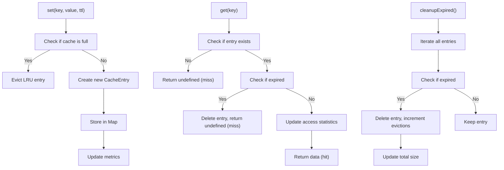
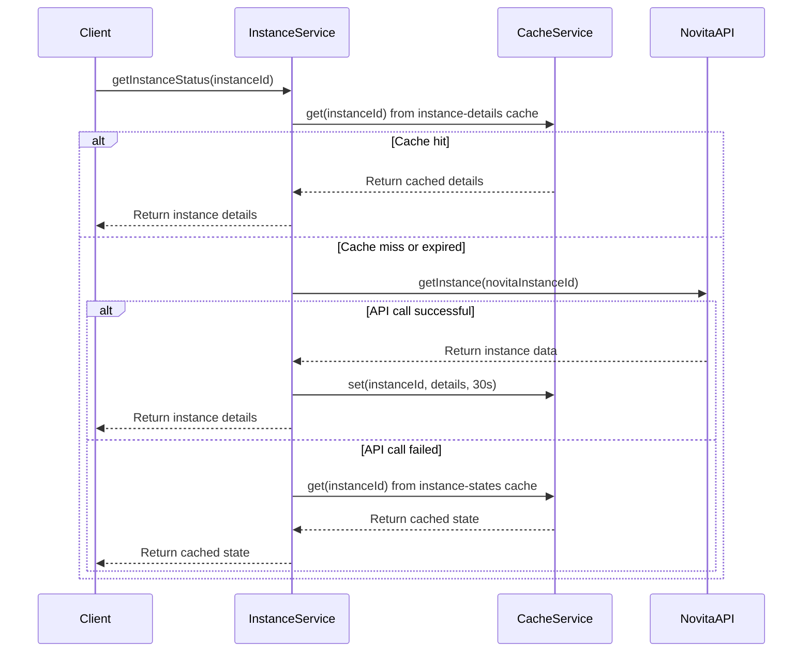
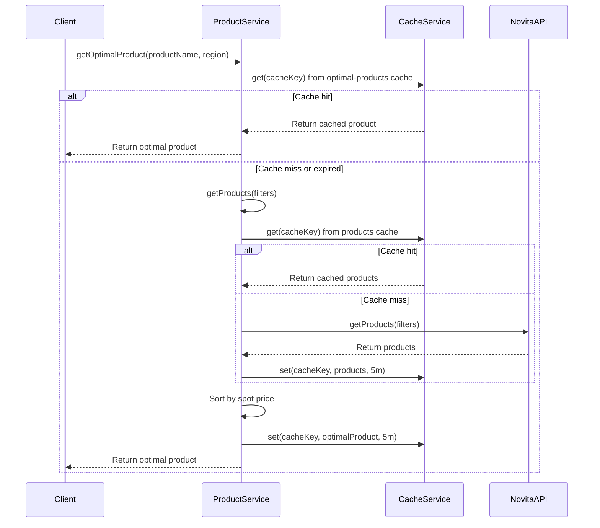
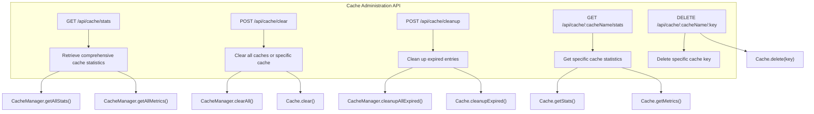
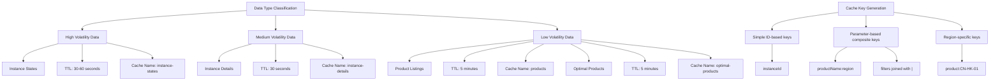
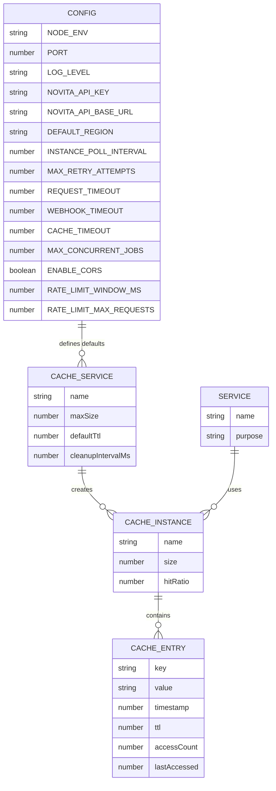

# Cache Service

<cite>
**Referenced Files in This Document**   
- [cacheService.ts](file://src/services/cacheService.ts)
- [cache.ts](file://src/routes/cache.ts)
- [instanceService.ts](file://src/services/instanceService.ts)
- [productService.ts](file://src/services/productService.ts)
- [config.ts](file://src/config/config.ts)
</cite>

## Table of Contents
1. [Introduction](#introduction)
2. [Core Architecture](#core-architecture)
3. [Cache Implementation Details](#cache-implementation-details)
4. [Integration with InstanceService](#integration-with-instanceservice)
5. [Integration with ProductService](#integration-with-productservice)
6. [Administrative Endpoints](#administrative-endpoints)
7. [Cache Key Strategies and TTL Management](#cache-key-strategies-and-ttl-management)
8. [Cache Consistency and Eviction Policies](#cache-consistency-and-eviction-policies)
9. [Configuration and Scalability](#configuration-and-scalability)
10. [Performance Monitoring](#performance-monitoring)

## Introduction

The CacheService provides a comprehensive in-memory caching solution designed to optimize system performance by reducing redundant API calls and database queries. It serves as a central component for storing frequently accessed data such as instance states, product information, and template configurations. The service implements a sophisticated caching mechanism with support for TTL (Time-To-Live) management, LRU (Least Recently Used) eviction, and detailed metrics collection. Through integration with the CacheManager singleton, it enables multiple cache instances across different services while maintaining efficient memory utilization and performance monitoring.

**Section sources**
- [cacheService.ts](file://src/services/cacheService.ts#L1-L490)

## Core Architecture

The CacheService architecture is built around two primary components: the CacheService class and the CacheManager class. The CacheService class provides the core caching functionality with methods for get, set, delete, and various administrative operations. The CacheManager acts as a factory and registry for multiple named cache instances, allowing different services to create and access their own isolated caches.

```mermaid
classDiagram
class CacheService {
+string name
+Map<string, CacheEntry<T>> cache
+CacheMetrics metrics
+number maxSize
+number defaultTtl
+get(key : string) : T | undefined
+set(key : string, value : T, ttl? : number) : void
+delete(key : string) : boolean
+has(key : string) : boolean
+clear() : void
+getStats() : CacheStats
+getHitRatio() : number
+cleanupExpired() : number
+setTtl(key : string, ttl : number) : boolean
+getTtl(key : string) : number | undefined
}
class CacheManager {
+Map<string, CacheService> caches
+getCache<T>(name : string, options? : CacheOptions) : CacheService<T>
+getCacheNames() : string[]
+getAllStats() : { [cacheName : string] : CacheStats }
+getAllMetrics() : { [cacheName : string] : CacheMetrics }
+clearAll() : void
+cleanupAllExpired() : number
+destroyAll() : void
}
class CacheEntry {
+T data
+number timestamp
+number ttl
+number accessCount
+number lastAccessed
}
class CacheMetrics {
+number hits
+number misses
+number sets
+number deletes
+number evictions
+number totalSize
}
class CacheStats {
+CacheMetrics metrics
+{ [key : string] : EntryStats } entries
}
CacheManager --> CacheService : "creates and manages"
CacheService --> CacheEntry : "contains"
CacheService --> CacheMetrics : "tracks"
CacheService --> CacheStats : "provides"
```

**Diagram sources**
- [cacheService.ts](file://src/services/cacheService.ts#L1-L490)

**Section sources**
- [cacheService.ts](file://src/services/cacheService.ts#L1-L490)

## Cache Implementation Details

The CacheService implementation provides a robust set of methods for managing cached data. The core operations include get, set, delete, and has, which handle the basic CRUD operations for cache entries. Each cache entry is stored with metadata including timestamp, TTL, access count, and last accessed time, enabling sophisticated cache management and analytics.

The service implements automatic cleanup of expired entries through a configurable periodic cleanup interval. When the cache reaches its maximum size, it automatically evicts the least recently used entry to make room for new entries. The service also provides comprehensive metrics collection, tracking hits, misses, sets, deletes, and evictions, which are essential for monitoring cache performance and effectiveness.



**Diagram sources**
- [cacheService.ts](file://src/services/cacheService.ts#L1-L490)

**Section sources**
- [cacheService.ts](file://src/services/cacheService.ts#L1-L490)

## Integration with InstanceService

The InstanceService integrates with the CacheService to optimize performance when retrieving instance status and details. It creates two dedicated cache instances: one for instance details with a 30-second TTL, and another for instance states with a 1-minute TTL. This strategic caching reduces the number of API calls to the external Novita API, improving response times and reducing system load.

When retrieving instance status, the service first checks the cache. If the data is available and not expired, it returns the cached result. Otherwise, it fetches the latest data from the API, updates the internal state, and stores the result in the cache for future requests. The service also implements cache invalidation when instance state changes, ensuring data consistency.



**Diagram sources**
- [instanceService.ts](file://src/services/instanceService.ts#L1-L517)
- [cacheService.ts](file://src/services/cacheService.ts#L1-L490)

**Section sources**
- [instanceService.ts](file://src/services/instanceService.ts#L1-L517)

## Integration with ProductService

The ProductService leverages the CacheService to optimize product data retrieval and optimal product selection. It maintains two cache instances: one for product listings with a 5-minute TTL, and another for optimal products with a 5-minute TTL. This caching strategy significantly reduces the number of API calls when users request product information or create new instances.

When retrieving products, the service generates a cache key based on the filter parameters (product name, region, GPU type). This key-based approach enables efficient caching of filtered results, avoiding redundant API calls for identical queries. For optimal product selection, the service caches the result of finding the cheapest available product, which is particularly valuable given the computational cost of sorting and filtering.



**Diagram sources**
- [productService.ts](file://src/services/productService.ts#L1-L280)
- [cacheService.ts](file://src/services/cacheService.ts#L1-L490)

**Section sources**
- [productService.ts](file://src/services/productService.ts#L1-L280)

## Administrative Endpoints

The CacheService provides a set of administrative endpoints through the /api/cache route, enabling monitoring and management of the caching system. These endpoints allow administrators to retrieve cache statistics, clear caches, and perform cleanup operations. The endpoints are integrated with the CacheManager, providing access to all cache instances across the application.

The administrative interface supports both global operations (affecting all caches) and specific operations (targeting individual caches or keys). This flexibility enables precise cache management, from complete cache resets during maintenance to targeted invalidation of specific entries during debugging or troubleshooting.



**Diagram sources**
- [cache.ts](file://src/routes/cache.ts#L1-L265)
- [cacheService.ts](file://src/services/cacheService.ts#L1-L490)

**Section sources**
- [cache.ts](file://src/routes/cache.ts#L1-L265)

## Cache Key Strategies and TTL Management

The system employs strategic cache key design and TTL management based on data volatility and access patterns. For frequently changing data like instance states, shorter TTLs (30 seconds to 1 minute) ensure freshness while still providing performance benefits. For relatively stable data like product listings, longer TTLs (5 minutes) maximize cache efficiency.

Cache keys are designed to be descriptive and unique, often incorporating relevant parameters to enable efficient caching of filtered results. The ProductService, for example, generates cache keys by combining filter parameters with delimiters, allowing different query combinations to have their own cached results. This approach prevents cache pollution and ensures that each unique query is handled appropriately.



**Section sources**
- [cacheService.ts](file://src/services/cacheService.ts#L1-L490)
- [instanceService.ts](file://src/services/instanceService.ts#L1-L517)
- [productService.ts](file://src/services/productService.ts#L1-L280)

## Cache Consistency and Eviction Policies

The CacheService implements a multi-layered approach to cache consistency and eviction. The primary consistency mechanism is time-based expiration (TTL), which ensures that cached data is automatically invalidated after a specified period. This approach balances performance with data freshness, particularly important for rapidly changing data like instance states.

For memory management, the service implements an LRU (Least Recently Used) eviction policy when the cache reaches its maximum size. This policy automatically removes the least recently accessed entries to make room for new data, optimizing cache utilization. The service also provides explicit invalidation methods, allowing services to proactively remove stale data when state changes occur.

The system addresses cache consistency challenges through a combination of automatic expiration, explicit invalidation, and fallback mechanisms. When an API call fails, services can return cached data as a fallback, maintaining system availability while ensuring data is eventually refreshed. This approach provides resilience against temporary API outages while maintaining reasonable data freshness.

**Section sources**
- [cacheService.ts](file://src/services/cacheService.ts#L1-L490)
- [instanceService.ts](file://src/services/instanceService.ts#L1-L517)
- [productService.ts](file://src/services/productService.ts#L1-L280)

## Configuration and Scalability

Cache configuration is managed through the system's configuration system, with default values defined in the Config interface. The CACHE_TIMEOUT environment variable controls the default cache timeout in seconds, with a configurable range of 60-3600 seconds. Services can override these defaults when creating cache instances, allowing fine-grained control over caching behavior based on specific requirements.

The CacheService is designed for scalability, supporting multiple named cache instances through the CacheManager singleton. Each service can create its own cache with appropriate size and TTL settings, preventing resource contention and enabling targeted performance optimization. The in-memory implementation provides low-latency access, while the modular design allows for potential future integration with external caching backends like Redis for distributed environments.



**Diagram sources**
- [config.ts](file://src/config/config.ts#L1-L390)
- [cacheService.ts](file://src/services/cacheService.ts#L1-L490)

**Section sources**
- [config.ts](file://src/config/config.ts#L1-L390)
- [cacheService.ts](file://src/services/cacheService.ts#L1-L490)

## Performance Monitoring

The CacheService provides comprehensive performance monitoring through detailed metrics and statistics. The system tracks key performance indicators including hit ratio, miss rate, eviction rate, and cache size, enabling administrators to assess cache effectiveness and identify optimization opportunities.

The hit ratio, calculated as hits divided by total accesses (hits + misses), is a critical metric for evaluating cache performance. A high hit ratio indicates effective caching, while a low ratio may suggest the need for TTL adjustments or cache size increases. The service also provides detailed statistics for individual cache entries, including access frequency and age, which can inform cache tuning decisions.

Administrative endpoints expose these metrics through the /api/cache/stats route, providing both global and per-cache statistics. This monitoring capability enables proactive cache management, helping to maintain optimal performance as system usage patterns evolve over time.

**Section sources**
- [cacheService.ts](file://src/services/cacheService.ts#L1-L490)
- [cache.ts](file://src/routes/cache.ts#L1-L265)