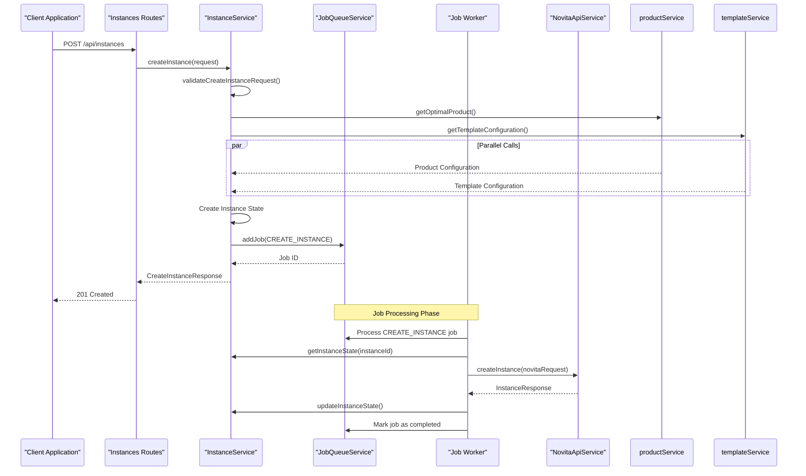
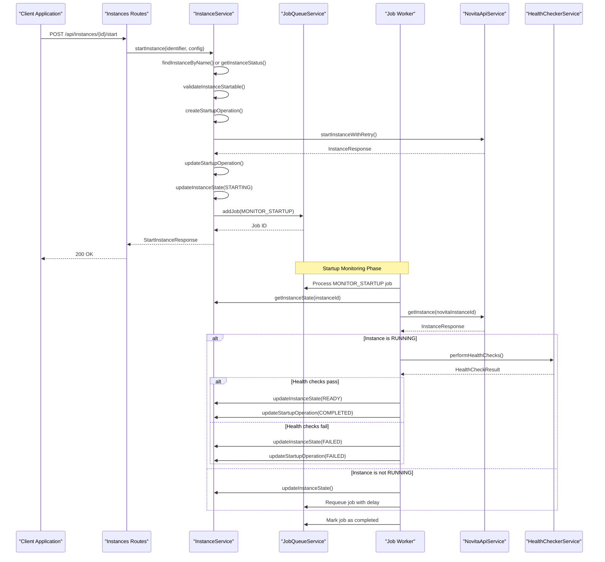
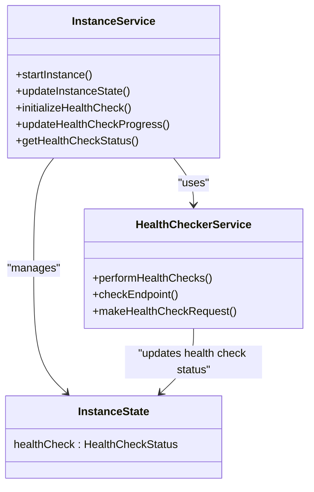
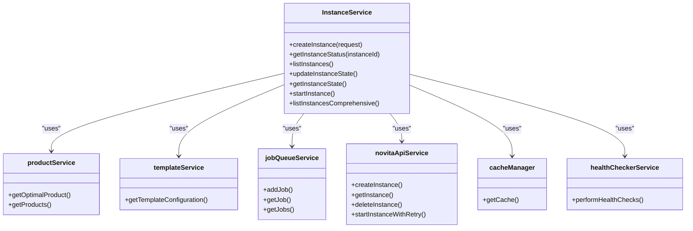

# Instance Service

<cite>
**Referenced Files in This Document**   
- [instanceService.ts](file://src/services/instanceService.ts) - *Updated in recent commit*
- [novitaApiService.ts](file://src/services/novitaApiService.ts) - *Updated in recent commit*
- [healthCheckerService.ts](file://src/services/healthCheckerService.ts) - *Added in recent commit*
- [api.ts](file://src/types/api.ts) - *Updated in recent commit*
- [instances.ts](file://src/routes/instances.ts)
- [cacheService.ts](file://src/services/cacheService.ts)
</cite>

## Update Summary
- Added documentation for new `startInstance` method and startup workflow
- Added comprehensive instance listing functionality with merged data sources
- Integrated health check workflow after instance startup
- Updated key methods section with new parameters and return types
- Added new diagrams for startup workflow and health check integration
- Updated error handling patterns to include new startup-specific errors
- Added section on comprehensive instance listing with performance metrics

## Table of Contents
1. [Introduction](#introduction)
2. [Core Responsibilities](#core-responsibilities)
3. [Key Methods](#key-methods)
4. [Instance Creation Workflow](#instance-creation-workflow)
5. [Instance Startup Workflow](#instance-startup-workflow)
6. [Health Check Integration](#health-check-integration)
7. [Comprehensive Instance Listing](#comprehensive-instance-listing)
8. [Service Composition and Error Handling](#service-composition-and-error-handling)
9. [Integration with Routes Layer](#integration-with-routes-layer)
10. [Common Issues and Mitigation Strategies](#common-issues-and-mitigation-strategies)
11. [Conclusion](#conclusion)

## Introduction
The InstanceService component serves as the central orchestrator for GPU instance lifecycle management within the NovitaAI platform. It coordinates the creation, monitoring, startup, and termination of GPU instances by integrating with multiple backend services including NovitaApiService, JobQueueService, and CacheService. This document provides a comprehensive analysis of the InstanceService, detailing its architecture, key methods, workflow implementation, and integration patterns.

## Core Responsibilities
The InstanceService is responsible for managing the complete lifecycle of GPU instances through coordination with external APIs and internal services. Its primary responsibilities include:

- **Instance Orchestration**: Coordinating the creation, status monitoring, startup, and termination of GPU instances
- **Service Integration**: Integrating with NovitaApiService for external API calls, JobQueueService for asynchronous processing, and CacheService for performance optimization
- **State Management**: Maintaining internal state of instances in memory and synchronizing with external systems
- **Request Validation**: Validating input parameters for instance operations
- **Caching Strategy**: Implementing multi-layer caching for instance status and state information
- **Error Handling**: Managing errors from dependent services and providing meaningful error responses

The service acts as an abstraction layer between the API routes and the underlying infrastructure, transforming business logic into API-consumable responses while handling the complexity of asynchronous operations and external service integrations.

**Section sources**
- [instanceService.ts](file://src/services/instanceService.ts#L1-L50)

## Key Methods

### createInstance
The `createInstance` method initiates the creation of a new GPU instance with automated lifecycle management.

**Parameters**:
- `request`: [CreateInstanceRequest](file://src/types/api.ts#L9-L17) - Object containing instance configuration parameters

**Return Type**:
- Promise<[CreateInstanceResponse](file://src/types/api.ts#L19-L24)>

**Error Conditions**:
- Invalid instance name (empty or non-string)
- Invalid product name (empty or non-string)
- Invalid template ID (empty, invalid type, or non-positive number)
- Invalid GPU number (not between 1-8)
- Invalid root filesystem size (not between 10-1000 GB)
- Invalid webhook URL (invalid HTTP/HTTPS format)
- Internal service errors during product/template lookup or job queuing

**Section sources**
- [instanceService.ts](file://src/services/instanceService.ts#L53-L154)

### getInstanceStatus
The `getInstanceStatus` method retrieves the current status and details of a specific instance with caching support.

**Parameters**:
- `instanceId`: string - Unique identifier of the instance

**Return Type**:
- Promise<[InstanceDetails](file://src/types/api.ts#L26-L40)>

**Error Conditions**:
- Instance not found in internal state
- Errors when communicating with Novita API (network issues, timeouts, authentication failures)
- Invalid instance ID format

**Section sources**
- [instanceService.ts](file://src/services/instanceService.ts#L156-L234)

### startInstance
The `startInstance` method initiates the startup of a GPU instance that is in exited status, with operation tracking and monitoring.

**Parameters**:
- `identifier`: string - Instance ID or name to start
- `startConfig`: [StartInstanceRequest](file://src/types/api.ts#L30-L38) - Optional configuration for startup process
- `searchBy`: 'id' | 'name' - Method to search for instance (default: 'id')

**Return Type**:
- Promise<[StartInstanceResponse](file://src/types/api.ts#L40-L48)>

**Error Conditions**:
- Instance not found in internal state or Novita API
- Instance not in startable state (must be in 'exited' status)
- Startup operation already in progress for the instance
- Resource constraints preventing instance startup
- Network errors during API communication
- Invalid parameters in start configuration

**Section sources**
- [instanceService.ts](file://src/services/instanceService.ts#L1150-L1350)

### listInstancesComprehensive
The `listInstancesComprehensive` method retrieves a merged list of instances from both local state and Novita.ai API with comprehensive data.

**Parameters**:
- `options`: Object with optional parameters:
  - `includeNovitaOnly`: boolean - Include instances only present in Novita.ai API
  - `syncLocalState`: boolean - Synchronize local state with Novita data

**Return Type**:
- Promise<[EnhancedListInstancesResponse](file://src/types/api.ts#L108-L116)>

**Error Conditions**:
- Errors when communicating with Novita API
- Invalid options parameters
- Internal service errors during data merging

**Section sources**
- [instanceService.ts](file://src/services/instanceService.ts#L300-L500)

## Instance Creation Workflow
The instance creation workflow is implemented as an asynchronous process that delegates work to job queues and employs polling mechanisms for status updates.



**Diagram sources**
- [instanceService.ts](file://src/services/instanceService.ts#L53-L154)
- [jobQueueService.ts](file://src/services/jobQueueService.ts#L45-L105)
- [novitaApiService.ts](file://src/services/novitaApiService.ts#L150-L180)

The workflow follows these steps:
1. The client sends a POST request to create an instance
2. The InstanceService validates the request parameters
3. It retrieves optimal product configuration and template details in parallel
4. An internal instance state is created and stored in memory
5. A CREATE_INSTANCE job is queued with JobQueueService
6. The service immediately returns a response with instance ID and estimated ready time
7. A background job worker processes the creation job asynchronously
8. The worker calls NovitaApiService to create the actual instance
9. Instance state is updated upon successful creation

This asynchronous pattern ensures that the API response is fast and not blocked by potentially long-running instance provisioning operations.

## Instance Startup Workflow
The instance startup workflow enables starting GPU instances that are in exited status, with comprehensive operation tracking and monitoring.



**Diagram sources**
- [instanceService.ts](file://src/services/instanceService.ts#L1150-L1350)
- [novitaApiService.ts](file://src/services/novitaApiService.ts#L282-L323)
- [healthCheckerService.ts](file://src/services/healthCheckerService.ts#L125-L1089)

The startup workflow follows these steps:
1. Client sends a POST request to start an instance by ID or name
2. InstanceService validates that the instance exists and is in a startable state (exited status)
3. It creates a startup operation to track the operation progress
4. Calls NovitaApiService to initiate instance startup with retry logic
5. Updates instance status to STARTING and creates a monitoring job
6. Returns a response with operation ID and estimated ready time
7. A background job monitors the instance status and performs health checks when RUNNING
8. Updates instance status to READY upon successful health checks or FAILED if checks fail

This workflow ensures reliable instance startup with comprehensive monitoring and error handling.

## Health Check Integration
The InstanceService integrates health checks after an instance reaches RUNNING status to ensure application readiness.



**Diagram sources**
- [instanceService.ts](file://src/services/instanceService.ts#L1000-L1100)
- [healthCheckerService.ts](file://src/services/healthCheckerService.ts#L125-L1089)

Key integration aspects:
- **Health Check Initialization**: When an instance transitions to HEALTH_CHECKING status, health check configuration is initialized
- **Parallel Endpoint Checking**: Multiple endpoints are checked in parallel with comprehensive error handling
- **Retry Mechanism**: Failed health checks are retried with exponential backoff and jitter
- **Response Validation**: Response bodies are validated for error indicators even with successful HTTP status codes
- **Status Tracking**: Health check results are stored in instance state with timestamps and response times
- **Error Categorization**: Errors are categorized by type (timeout, connection refused, SSL, etc.) with appropriate retry logic

The health check integration ensures that instances are not marked as READY until all configured endpoints are responding correctly, providing a higher level of service reliability.

## Comprehensive Instance Listing
The InstanceService provides comprehensive instance listing by merging data from both local state and Novita.ai API.

```mermaid
flowchart TD
A[Client Request] --> B[listInstancesComprehensive()]
B --> C{Check Cache}
C --> |Cache Hit| D[Return Cached Result]
C --> |Cache Miss| E[Fetch Local Instances]
C --> |Cache Miss| F[Fetch Novita Instances]
E --> G[Merge Data]
F --> G
G --> H[Calculate Source Counts]
H --> I[Cache Result]
I --> J[Return Enhanced Response]
style C fill:#f9f,stroke:#333
style G fill:#bbf,stroke:#333
style I fill:#bbf,stroke:#333
classDef validation fill:#f9f,stroke:#333;
classDef processing fill:#bbf,stroke:#333;
class C validation
class G,I processing
```

**Diagram sources**
- [instanceService.ts](file://src/services/instanceService.ts#L300-L500)
- [api.ts](file://src/types/api.ts#L108-L116)

The comprehensive listing workflow:
1. Check cache first using a key based on options
2. If cache miss, fetch instances from both local state and Novita.ai API in parallel
3. Merge data with conflict resolution, prioritizing Novita.ai data as authoritative
4. Calculate source distribution counts (local, novita, merged)
5. Include performance metrics in response
6. Cache the result for subsequent requests
7. Return enhanced response with comprehensive instance details

This approach provides a complete view of all instances across systems with performance optimization through caching.

## Service Composition and Error Handling

### Service Composition
The InstanceService demonstrates a clean service composition pattern by importing and coordinating multiple specialized services:



**Diagram sources**
- [instanceService.ts](file://src/services/instanceService.ts#L1-L50)
- [productService.ts](file://src/services/productService.ts)
- [templateService.ts](file://src/services/templateService.ts)
- [jobQueueService.ts](file://src/services/jobQueueService.ts)
- [novitaApiService.ts](file://src/services/novitaApiService.ts)
- [cacheService.ts](file://src/services/cacheService.ts)
- [healthCheckerService.ts](file://src/services/healthCheckerService.ts)

### Error Handling Patterns
The InstanceService implements comprehensive error handling with the following patterns:

1. **Structured Error Types**: Uses [NovitaApiClientError](file://src/types/api.ts#L280-L288) and derived classes (RateLimitError, CircuitBreakerError, TimeoutError) for consistent error representation
2. **Graceful Degradation**: When the Novita API is unavailable, it returns cached state information rather than failing completely
3. **Comprehensive Logging**: All operations and errors are logged with contextual information for debugging
4. **Input Validation**: Validates all request parameters before processing, providing specific error codes for different validation failures
5. **Exception Propagation**: Errors are logged and re-thrown to allow upstream components to handle them appropriately
6. **Startup-Specific Errors**: Implements specialized errors for startup operations (StartupFailedError, ResourceConstraintsError, StartupOperationInProgressError)
7. **Retryable Error Detection**: Determines if errors are retryable based on error type and context

The service also implements caching with fallback mechanisms, where it first checks the cache for instance status, and if unavailable, retrieves from the internal state or external API as appropriate.

**Section sources**
- [instanceService.ts](file://src/services/instanceService.ts#L53-L234)
- [novitaApiService.ts](file://src/services/novitaApiService.ts#L400-L480)
- [api.ts](file://src/types/api.ts#L280-L308)

## Integration with Routes Layer
The InstanceService integrates with the routes layer through a clean separation of concerns, where the routes handle HTTP-specific concerns while delegating business logic to the service.

```mermaid
flowchart TD
A[Client Request] --> B[instances.ts Routes]
B --> C{Request Method}
C --> |POST /api/instances| D[Validate Request Body]
D --> E[Call instanceService.createInstance()]
E --> F[Return 201 Created]
C --> |GET /api/instances/:id| G[Validate Instance ID]
G --> H[Call instanceService.getInstanceStatus()]
H --> I[Return Instance Details]
C --> |GET /api/instances| J[Call instanceService.listInstances()]
J --> K[Return Instance List]
C --> |POST /api/instances/:id/start| L[Validate Instance ID]
L --> M[Call instanceService.startInstance()]
M --> N[Return Start Response]
C --> |GET /api/instances/comprehensive| O[Call instanceService.listInstancesComprehensive()]
O --> P[Return Enhanced List]
style D,L,O fill:#f9f,stroke:#333
style E,H,J,M,P fill:#bbf,stroke:#333
classDef validation fill:#f9f,stroke:#333;
classDef service fill:#bbf,stroke:#333;
class D,L,O validation
class E,H,J,M,P service
```

**Diagram sources**
- [instances.ts](file://src/routes/instances.ts#L10-L132)
- [instanceService.ts](file://src/services/instanceService.ts#L53-L260)

Key integration aspects include:
- **Request Validation**: Routes validate input using [validateCreateInstance](file://src/types/validation.ts) before calling the service
- **Context Logging**: Each request creates a context logger with request ID, correlation ID, and operation type
- **Error Handling**: Uses asyncHandler middleware to catch and process errors consistently
- **Performance Monitoring**: Measures and logs the duration of service calls
- **Response Transformation**: Transforms service responses into appropriate HTTP responses with correct status codes

The routes layer acts as an adapter between the HTTP interface and the domain service, handling protocol-specific concerns while keeping business logic encapsulated within the InstanceService.

**Section sources**
- [instances.ts](file://src/routes/instances.ts#L10-L132)
- [instanceService.ts](file://src/services/instanceService.ts#L53-L260)

## Common Issues and Mitigation Strategies

### Instance Provisioning Failures
**Issue**: Instance creation may fail due to resource unavailability, invalid configurations, or external API errors.

**Mitigation Strategies**:
- **Input Validation**: Comprehensive validation of all request parameters before processing
- **Product Fallback**: The [getOptimalProduct](file://src/services/novitaApiService.ts#L80-L140) method finds the cheapest available product with valid spot pricing
- **Retry Mechanism**: JobQueueService implements exponential backoff retries for failed jobs
- **Detailed Error Codes**: Specific error codes (INVALID_INSTANCE_NAME, PRODUCT_NOT_FOUND, etc.) help clients understand failure reasons

### Timeouts
**Issue**: External API calls or long-running operations may exceed timeout thresholds.

**Mitigation Strategies**:
- **Asynchronous Processing**: Creation and startup operations are delegated to job queues, preventing HTTP request timeouts
- **Circuit Breaker Pattern**: NovitaApiService likely implements circuit breakers (evident from CircuitBreakerError class) to prevent cascading failures
- **Request Timeout Handling**: TimeoutError class specifically handles request timeout scenarios
- **Rate Limit Awareness**: RateLimitError class includes retryAfter information to guide retry strategies

### State Synchronization Issues
**Issue**: Discrepancies between internal service state and external API state.

**Mitigation Strategies**:
- **Dual State Management**: Maintains both in-memory state (instanceStates Map) and cached state (CacheService)
- **Cache Invalidation**: Automatically invalidates instance cache when state is updated via [updateInstanceState](file://src/services/instanceService.ts#L262-L282)
- **Fallback Mechanism**: When Novita API is unavailable, returns cached state rather than failing
- **Periodic Cleanup**: Regular cleanup of expired cache entries to prevent stale data accumulation
- **State Synchronization**: Option to sync local state with Novita data via listInstancesComprehensive(syncLocalState=true)

### Performance Bottlenecks
**Issue**: High request volumes may impact service performance.

**Mitigation Strategies**:
- **Multi-layer Caching**: Implements two-level caching with different TTLs for instance details (30 seconds) and states (1 minute)
- **Parallel Processing**: Retrieves product and template configurations in parallel using Promise.all
- **Memory-efficient Storage**: Uses Maps for O(1) lookups of instance states
- **Cache Statistics**: Provides [getCacheStats](file://src/services/instanceService.ts#L450-L480) method for monitoring cache performance
- **Comprehensive Caching**: Implements merged instances cache with configurable TTL for comprehensive listings

**Section sources**
- [instanceService.ts](file://src/services/instanceService.ts#L284-L480)
- [novitaApiService.ts](file://src/services/novitaApiService.ts#L400-L480)
- [jobQueueService.ts](file://src/services/jobQueueService.ts#L200-L300)
- [cacheService.ts](file://src/services/cacheService.ts#L200-L400)

## Conclusion
The InstanceService component effectively serves as the core orchestrator for GPU instance lifecycle management, demonstrating well-architected design principles including separation of concerns, asynchronous processing, comprehensive error handling, and performance optimization through caching. By coordinating with NovitaApiService, JobQueueService, and CacheService, it provides a robust and scalable interface for managing GPU instances. The service's implementation of asynchronous workflows through job queues ensures responsive API performance while handling potentially long-running operations. Its comprehensive error handling and mitigation strategies address common issues in distributed systems, making it resilient to failures in external dependencies. The clear separation between the routes layer and business logic enables maintainable and testable code structure. Recent enhancements including instance startup functionality, health check integration, and comprehensive instance listing have expanded the service's capabilities while maintaining its core architectural principles.