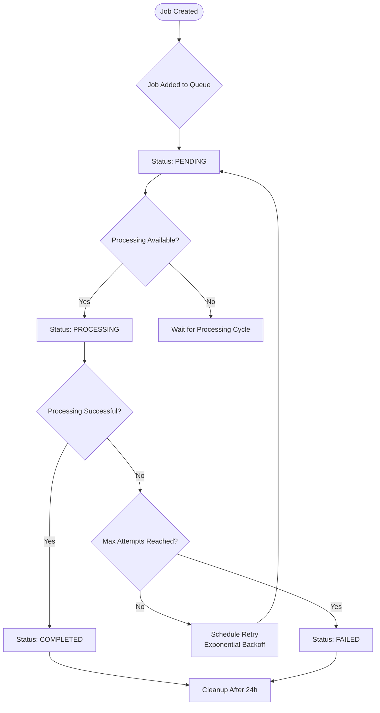
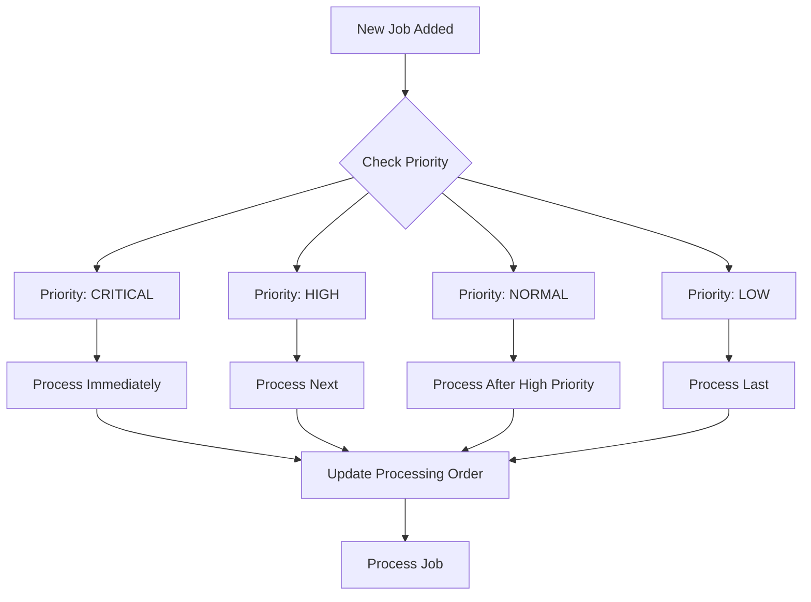
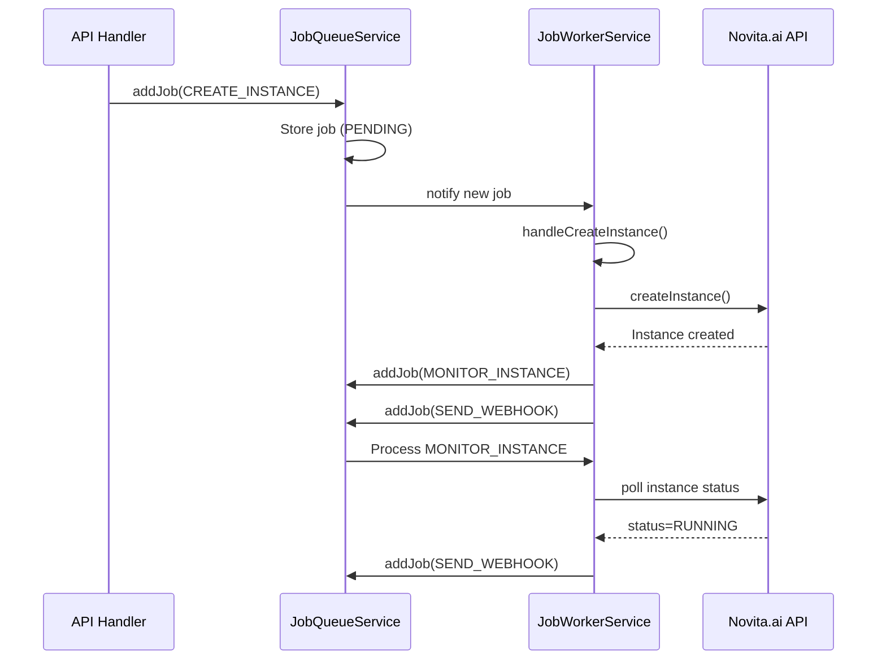
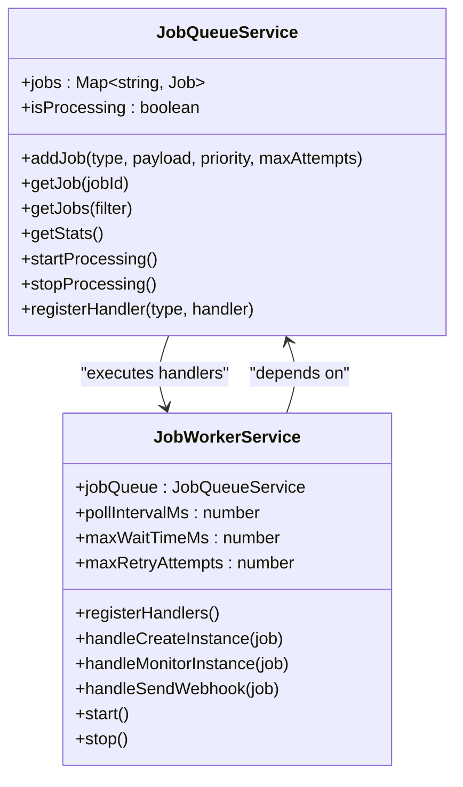
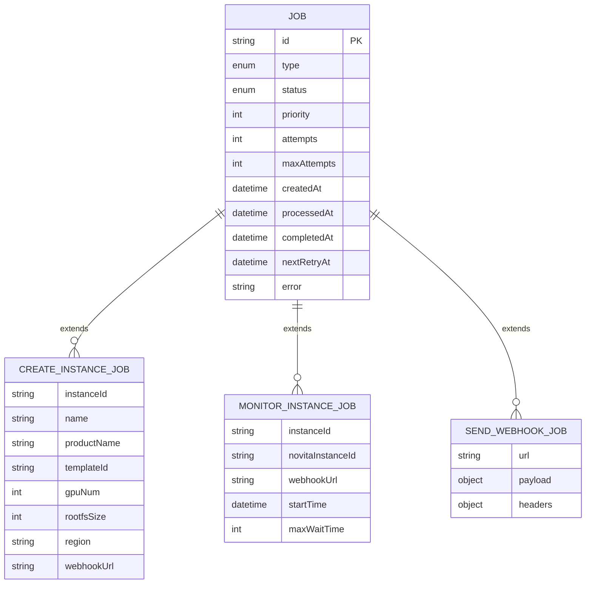
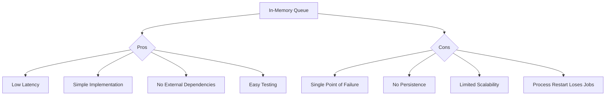
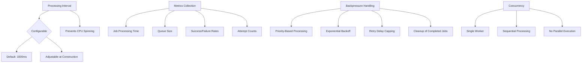

# Job Queue Service

<cite>
**Referenced Files in This Document**   
- [jobQueueService.ts](file://src/services/jobQueueService.ts)
- [jobWorkerService.ts](file://src/services/jobWorkerService.ts)
- [job.ts](file://src/types/job.ts)
- [jobQueueExample.ts](file://src/examples/jobQueueExample.ts)
</cite>

## Table of Contents
1. [Introduction](#introduction)
2. [Core Components](#core-components)
3. [Job Processing Lifecycle](#job-processing-lifecycle)
4. [Priority Handling and Job Ordering](#priority-handling-and-job-ordering)
5. [Failure Recovery and Retry Mechanisms](#failure-recovery-and-retry-mechanisms)
6. [Integration with Instance Creation Workflow](#integration-with-instance-creation-workflow)
7. [Job Worker Service Integration](#job-worker-service-integration)
8. [Job Payload Structure](#job-payload-structure)
9. [Technology Assumptions and Scalability](#technology-assumptions-and-scalability)
10. [Performance Considerations](#performance-considerations)
11. [Monitoring and Statistics](#monitoring-and-statistics)
12. [Graceful Shutdown and Cleanup](#graceful-shutdown-and-cleanup)

## Introduction
The JobQueueService provides asynchronous job processing capabilities for long-running operations such as instance creation and monitoring. It enables non-blocking API responses by decoupling request handling from time-consuming tasks. The service manages a queue of jobs with different priorities, processes them sequentially, and provides robust error handling and retry mechanisms. This documentation details the architecture, functionality, and integration points of the JobQueueService within the application ecosystem.

## Core Components

The JobQueueService is implemented as an in-memory queue that manages job lifecycle from creation to completion or failure. It works in conjunction with the JobWorkerService to process different types of jobs including instance creation, instance monitoring, and webhook sending. The service maintains job state, handles retries with exponential backoff, and provides comprehensive monitoring capabilities.

**Section sources**
- [jobQueueService.ts](file://src/services/jobQueueService.ts#L21-L374)
- [jobWorkerService.ts](file://src/services/jobWorkerService.ts#L20-L562)

## Job Processing Lifecycle

The job processing lifecycle begins when a job is enqueued via the `addJob` method and continues through various states until completion or permanent failure. Jobs transition through PENDING, PROCESSING, COMPLETED, and FAILED states as they progress through the system.



**Diagram sources**
- [jobQueueService.ts](file://src/services/jobQueueService.ts#L56-L111)
- [jobQueueService.ts](file://src/services/jobQueueService.ts#L234-L279)

**Section sources**
- [jobQueueService.ts](file://src/services/jobQueueService.ts#L56-L111)
- [jobQueueService.ts](file://src/services/jobQueueService.ts#L234-L279)

## Priority Handling and Job Ordering

The JobQueueService implements a priority-based job ordering system that ensures high-priority jobs are processed before lower-priority ones. Jobs are sorted by priority (highest first) and then by creation time, ensuring fair processing of jobs within the same priority level.



**Diagram sources**
- [jobQueueService.ts](file://src/services/jobQueueService.ts#L113-L150)
- [jobQueueService.ts](file://src/services/jobQueueService.ts#L281-L326)

**Section sources**
- [jobQueueService.ts](file://src/services/jobQueueService.ts#L113-L150)
- [jobQueueService.ts](file://src/services/jobQueueService.ts#L281-L326)

## Failure Recovery and Retry Mechanisms

The JobQueueService implements robust failure recovery with exponential backoff retry logic. When a job fails, it is automatically rescheduled with increasing delays between attempts, preventing overwhelming external services during outages.

```mermaid
flowchart TD
A[Job Processing Failed] --> B{Attempts < Max Attempts?}
B --> |Yes| C[Calculate Retry Delay]
C --> D[Exponential Backoff:<br>baseDelay * 2^(attempts-1)]
D --> E[Cap at maxRetryDelay]
E --> F[Set nextRetryAt]
F --> G[Status: PENDING]
G --> H[Wait for Retry Time]
H --> I[Process Job Again]
B --> |No| J[Status: FAILED]
J --> K[Record Failure Metrics]
```

**Diagram sources**
- [jobQueueService.ts](file://src/services/jobQueueService.ts#L234-L279)
- [jobQueueService.ts](file://src/services/jobQueueService.ts#L281-L326)

**Section sources**
- [jobQueueService.ts](file://src/services/jobQueueService.ts#L234-L279)
- [jobQueueService.ts](file://src/services/jobQueueService.ts#L281-L326)

## Integration with Instance Creation Workflow

The JobQueueService is tightly integrated with the instance creation workflow, enabling asynchronous processing of instance provisioning and monitoring tasks. When a new instance is requested, a CREATE_INSTANCE job is enqueued, which then triggers a chain of related jobs.



**Diagram sources**
- [jobWorkerService.ts](file://src/services/jobWorkerService.ts#L80-L250)
- [jobQueueService.ts](file://src/services/jobQueueService.ts#L56-L111)

**Section sources**
- [jobWorkerService.ts](file://src/services/jobWorkerService.ts#L80-L250)
- [jobQueueService.ts](file://src/services/jobQueueService.ts#L56-L111)

## Job Worker Service Integration

The JobWorkerService acts as the processing engine for the JobQueueService, registering handlers for different job types and executing the business logic associated with each job. The integration enables extensible job processing with type-specific handlers.



**Diagram sources**
- [jobQueueService.ts](file://src/services/jobQueueService.ts#L21-L374)
- [jobWorkerService.ts](file://src/services/jobWorkerService.ts#L20-L562)

**Section sources**
- [jobQueueService.ts](file://src/services/jobQueueService.ts#L21-L374)
- [jobWorkerService.ts](file://src/services/jobWorkerService.ts#L20-L562)

## Job Payload Structure

The JobQueueService supports different job types with specific payload structures. Each job type has a defined interface that ensures type safety and proper data validation.



**Diagram sources**
- [job.ts](file://src/types/job.ts#L1-L71)
- [jobQueueService.ts](file://src/services/jobQueueService.ts#L56-L111)

**Section sources**
- [job.ts](file://src/types/job.ts#L1-L71)
- [jobQueueService.ts](file://src/services/jobQueueService.ts#L56-L111)

## Technology Assumptions and Scalability

The JobQueueService is implemented as an in-memory queue with no external message broker dependencies. This design choice provides simplicity and low latency but has implications for scalability and fault tolerance in distributed environments.



**Diagram sources**
- [jobQueueService.ts](file://src/services/jobQueueService.ts#L21-L374)
- [jobWorkerService.ts](file://src/services/jobWorkerService.ts#L20-L562)

**Section sources**
- [jobQueueService.ts](file://src/services/jobQueueService.ts#L21-L374)
- [jobWorkerService.ts](file://src/services/jobWorkerService.ts#L20-L562)

## Performance Considerations

The JobQueueService includes several performance considerations to ensure efficient processing and prevent system overload. These include configurable processing intervals, metrics collection, and backpressure handling through job prioritization.



**Diagram sources**
- [jobQueueService.ts](file://src/services/jobQueueService.ts#L172-L235)
- [jobQueueService.ts](file://src/services/jobQueueService.ts#L325-L377)

**Section sources**
- [jobQueueService.ts](file://src/services/jobQueueService.ts#L172-L235)
- [jobQueueService.ts](file://src/services/jobQueueService.ts#L325-L377)

## Monitoring and Statistics

The JobQueueService provides comprehensive monitoring capabilities through the `getStats` method, which returns detailed information about the current state of the queue, including job counts by status and type.

```mermaid
graph TB
A[getStats()] --> B[Total Jobs]
A --> C[Pending Jobs]
A --> D[Processing Jobs]
A --> E[Completed Jobs]
A --> F[Failed Jobs]
A --> G[Jobs by Type]
G --> H[CREATE_INSTANCE]
G --> I[MONITOR_INSTANCE]
G --> J[SEND_WEBHOOK]
K[Monitoring Use Cases] --> L[Health Checks]
K --> M[Performance Analysis]
K --> N[Capacity Planning]
K --> O[Error Rate Tracking]
K --> P[Processing Time Trends]
```

**Diagram sources**
- [jobQueueService.ts](file://src/services/jobQueueService.ts#L152-L170)
- [jobQueueExample.ts](file://src/examples/jobQueueExample.ts#L0-L102)

**Section sources**
- [jobQueueService.ts](file://src/services/jobQueueService.ts#L152-L170)
- [jobQueueExample.ts](file://src/examples/jobQueueExample.ts#L0-L102)

## Graceful Shutdown and Cleanup

The JobQueueService implements graceful shutdown procedures to ensure that processing jobs are completed before the service stops. It also includes automatic cleanup of completed and failed jobs to prevent memory leaks.

```mermaid
flowchart TD
A[shutdown(timeoutMs)] --> B[stopProcessing()]
B --> C{Processing Jobs?}
C --> |Yes| D[Wait for Completion]
D --> E{Timeout Reached?}
E --> |No| F[All Jobs Completed]
E --> |Yes| G[Log Remaining Jobs]
C --> |No| H[Shutdown Complete]
F --> H
H --> I[Cleanup Old Jobs]
I --> J[Remove Jobs > 24h Old]
J --> K[Service Stopped]
```

**Diagram sources**
- [jobQueueService.ts](file://src/services/jobQueueService.ts#L325-L377)
- [jobWorkerService.ts](file://src/services/jobWorkerService.ts#L500-L562)

**Section sources**
- [jobQueueService.ts](file://src/services/jobQueueService.ts#L325-L377)
- [jobWorkerService.ts](file://src/services/jobWorkerService.ts#L500-L562)