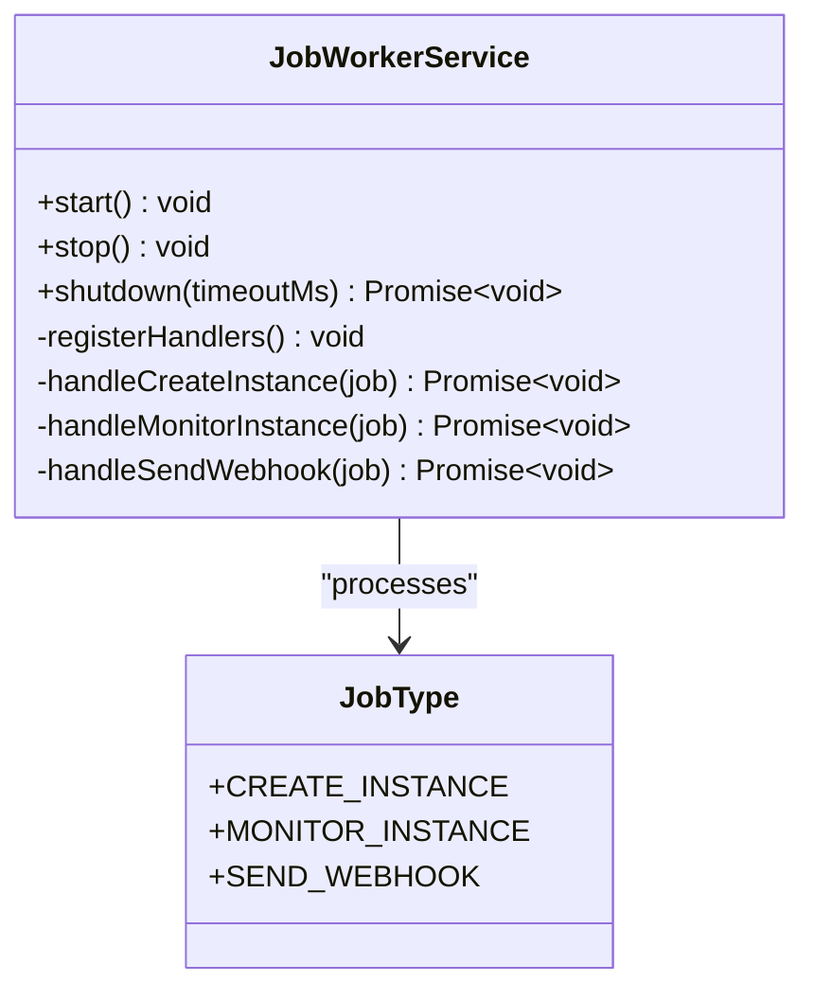
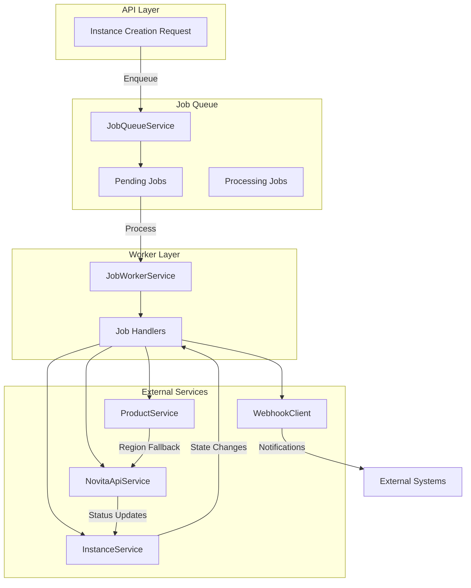

# Job Worker Service

<cite>
**Referenced Files in This Document**   
- [jobWorkerService.ts](file://src/services/jobWorkerService.ts) - *Updated with region fallback and registry authentication support*
- [jobQueueService.ts](file://src/services/jobQueueService.ts)
- [instanceService.ts](file://src/services/instanceService.ts)
- [novitaApiService.ts](file://src/services/novitaApiService.ts)
- [productService.ts](file://src/services/productService.ts) - *Added in commit 7839892bad3d5bf00dcba06ce76c91441270d92e*
- [index.ts](file://src/index.ts) - *Updated with worker lifecycle management*
</cite>

## Update Summary
**Changes Made**   
- Updated **Core Job Types** section to reflect multi-region product selection with fallback
- Added **Registry Authentication Support** section for private image instances
- Enhanced **Integration with InstanceService and NovitaApiService** with new workflow details
- Updated **Configuration and Tuning** with new region fallback parameters
- Added **Service Lifecycle Management** section for startup/shutdown integration
- Modified **Architecture Overview** to include service initialization flow

## Table of Contents
1. [Introduction](#introduction)
2. [Job Execution Lifecycle](#job-execution-lifecycle)
3. [Core Job Types](#core-job-types)
4. [Registry Authentication Support](#registry-authentication-support)
5. [Integration with InstanceService and NovitaApiService](#integration-with-instanceservice-and-novitaapiservice)
6. [Concurrency and Worker Management](#concurrency-and-worker-management)
7. [Failure Recovery Mechanisms](#failure-recovery-mechanisms)
8. [Monitoring and Logging](#monitoring-and-logging)
9. [Configuration and Tuning](#configuration-and-tuning)
10. [Service Lifecycle Management](#service-lifecycle-management)
11. [Graceful Shutdown Process](#graceful-shutdown-process)
12. [Architecture Overview](#architecture-overview)

## Introduction

The JobWorkerService is a background processing system responsible for executing asynchronous tasks enqueued by the JobQueueService. It handles long-running operations such as instance startup monitoring and health verification without blocking the main request-response cycle. The service processes jobs in a non-blocking manner, allowing the application to maintain responsiveness while performing resource-intensive background operations.

The worker service follows a modular design pattern, registering specific handlers for different job types and processing them through a centralized queue system. This architecture enables efficient handling of various background tasks while maintaining clear separation of concerns and facilitating error handling and monitoring.

**Section sources**
- [jobWorkerService.ts](file://src/services/jobWorkerService.ts#L1-L50)

## Job Execution Lifecycle

The JobWorkerService manages the complete lifecycle of background jobs from initialization to completion or failure. When a job is added to the queue, it transitions through several states: PENDING → PROCESSING → COMPLETED (or FAILED). The service polls the queue at regular intervals to identify pending jobs and executes them using type-specific handlers.

Each job execution follows a structured pattern: the worker retrieves the job from the queue, updates its status to PROCESSING, executes the appropriate handler function, and then marks the job as COMPLETED upon successful execution. If an error occurs during processing, the job is either retried according to its retry policy or marked as FAILED after exhausting all retry attempts.

**Diagram sources**
- [jobQueueService.ts](file://src/services/jobQueueService.ts#L234-L326)
- [jobWorkerService.ts](file://src/services/jobWorkerService.ts#L26-L562)

**Section sources**
- [jobWorkerService.ts](file://src/services/jobWorkerService.ts#L26-L562)

## Core Job Types

The JobWorkerService handles three primary job types, each serving a distinct purpose in the application's asynchronous processing workflow. These job types are registered with the JobQueueService during initialization and processed by dedicated handler functions.

The CREATE_INSTANCE job type orchestrates the complete instance creation workflow, including product selection with multi-region fallback, template configuration, and initial instance provisioning. The MONITOR_INSTANCE job type performs periodic health checks on newly created instances, tracking their startup progress until they reach a ready state or fail. The SEND_WEBHOOK job type handles external notifications, delivering status updates to configured webhook endpoints.

**Diagram sources**
- [jobWorkerService.ts](file://src/services/jobWorkerService.ts#L26-L562)
- [jobQueueService.ts](file://src/services/jobQueueService.ts#L281-L326)

**Section sources**
- [jobWorkerService.ts](file://src/services/jobWorkerService.ts#L26-L562)

## Registry Authentication Support

The JobWorkerService now supports registry authentication for private Docker images through the imageAuth field in template configurations. When creating an instance with a template that requires authentication, the worker service automatically resolves the authentication credentials from the Novita.ai API and formats them for the instance creation request.

During the instance creation workflow, if the template configuration contains an imageAuth identifier, the JobWorkerService calls the getRegistryAuth method of NovitaApiService to retrieve the username and password. These credentials are then formatted as "username:password" and included in the createInstance request. This enables secure deployment of instances using private container images from authenticated registries.

**Diagram sources**
- [jobWorkerService.ts](file://src/services/jobWorkerService.ts#L150-L180)
- [novitaApiService.ts](file://src/services/novitaApiService.ts#L380-L410)
- [api.ts](file://src/types/api.ts#L120-L128)

**Section sources**
- [jobWorkerService.ts](file://src/services/jobWorkerService.ts#L150-L180)
- [novitaApiService.ts](file://src/services/novitaApiService.ts#L380-L410)

## Integration with InstanceService and NovitaApiService

The JobWorkerService integrates closely with both the InstanceService and NovitaApiService to monitor and manage remote instance states. During instance creation and monitoring workflows, the worker service coordinates between these services to ensure consistent state management and proper error handling.

When creating a new instance, the JobWorkerService uses the InstanceService to maintain internal state tracking while leveraging the NovitaApiService to interact with the external API for actual instance provisioning. The monitoring workflow periodically queries the NovitaApiService for current instance status and updates the local state in InstanceService accordingly, enabling real-time status reporting through the application's API endpoints.

The integration now includes multi-region product selection with fallback capabilities. When processing a CREATE_INSTANCE job, the worker service calls getOptimalProductWithFallback from ProductService, which attempts to find available products in the preferred region first, then falls back to alternative regions based on priority configuration.

**Diagram sources**
- [jobWorkerService.ts](file://src/services/jobWorkerService.ts#L26-L562)
- [instanceService.ts](file://src/services/instanceService.ts#L1-L517)
- [novitaApiService.ts](file://src/services/novitaApiService.ts#L1-L482)
- [productService.ts](file://src/services/productService.ts#L148-L235)

**Section sources**
- [jobWorkerService.ts](file://src/services/jobWorkerService.ts#L26-L562)
- [instanceService.ts](file://src/services/instanceService.ts#L1-L517)
- [novitaApiService.ts](file://src/services/novitaApiService.ts#L1-L482)
- [productService.ts](file://src/services/productService.ts#L148-L235)

## Concurrency and Worker Management

The JobWorkerService manages concurrency through the underlying JobQueueService, which processes jobs sequentially by default. The queue system ensures that jobs are processed in order of priority, with higher-priority jobs taking precedence over lower-priority ones. This design prevents resource contention and ensures critical operations are handled promptly.

Worker management is handled through start, stop, and shutdown methods that control the processing loop. The service can be started to begin processing jobs from the queue, stopped to pause processing without waiting for current jobs to complete, or shut down gracefully to allow in-progress jobs to finish before terminating.

**Diagram sources**
- [jobWorkerService.ts](file://src/services/jobWorkerService.ts#L500-L562)
- [jobQueueService.ts](file://src/services/jobQueueService.ts#L150-L190)

**Section sources**
- [jobWorkerService.ts](file://src/services/jobWorkerService.ts#L500-L562)
- [jobQueueService.ts](file://src/services/jobQueueService.ts#L150-L190)

## Failure Recovery Mechanisms

The JobWorkerService implements comprehensive failure recovery mechanisms to ensure reliability and data consistency. When a job fails during processing, the system applies an exponential backoff retry strategy, temporarily marking the job as PENDING with a calculated next retry time. This approach prevents overwhelming external services with rapid retry attempts while ensuring eventual processing.

For instance monitoring operations, the service implements timeout detection to prevent infinite polling loops. If an instance fails to start within the configured maximum wait time (10 minutes by default), the monitoring job is terminated, and the instance state is marked as FAILED. Additionally, the system handles job re-queuing on worker crashes through the persistent nature of the job queue, ensuring no tasks are lost during unexpected shutdowns.

**Diagram sources**
- [jobQueueService.ts](file://src/services/jobQueueService.ts#L234-L279)
- [jobWorkerService.ts](file://src/services/jobWorkerService.ts#L350-L450)

**Section sources**
- [jobQueueService.ts](file://src/services/jobQueueService.ts#L234-L279)
- [jobWorkerService.ts](file://src/services/jobWorkerService.ts#L350-L450)

## Monitoring and Logging

The JobWorkerService implements comprehensive logging practices to facilitate debugging and monitoring of background tasks. Each job execution is logged with detailed context including job ID, type, instance ID, and relevant parameters. The logging system captures both successful operations and failures, providing complete visibility into the processing workflow.

Log entries include structured metadata that enables effective filtering and analysis. For example, instance creation jobs log each step of the workflow, from product selection to template configuration and API calls. Monitoring jobs include elapsed time and remaining timeout information, helping diagnose performance issues or startup delays.

**Diagram sources**
- [jobWorkerService.ts](file://src/services/jobWorkerService.ts#L26-L562)
- [jobQueueService.ts](file://src/services/jobQueueService.ts#L234-L326)

**Section sources**
- [jobWorkerService.ts](file://src/services/jobWorkerService.ts#L26-L562)
- [jobQueueService.ts](file://src/services/jobQueueService.ts#L234-L326)

## Configuration and Tuning

The JobWorkerService utilizes configurable parameters for polling intervals, timeout thresholds, and retry policies. These settings are initialized from the application configuration system, allowing operators to tune performance characteristics without code changes. The default configuration includes a 1-second polling interval, 10-minute maximum wait time for instance startup, and up to 3 retry attempts for failed operations.

Configuration values are accessible through the getMonitoringConfig method, which returns the current settings for pollIntervalMs, maxWaitTimeMs, and maxRetryAttempts. This enables runtime inspection of configuration and supports dynamic adjustment based on operational requirements or environmental constraints.

The service now supports region-based cluster mapping for multi-region deployments. When a product is selected in a specific region, the worker service maps the region to the appropriate clusterId for the Novita.ai API request (e.g., 'CN-HK-01' maps to 'cn-hongkong-1').

**Section sources**
- [jobWorkerService.ts](file://src/services/jobWorkerService.ts#L480-L498)
- [jobWorkerService.ts](file://src/services/jobWorkerService.ts#L10-L24)

## Service Lifecycle Management

The JobWorkerService is now integrated into the server initialization and shutdown lifecycle through the main application entry point. During server startup, the job worker service is automatically started to begin processing background jobs. This integration ensures that background processing is available as soon as the API server is ready to accept requests.

The service lifecycle is managed through the index.ts file, which calls jobWorkerService.start() during server initialization when not in test environment. This ensures that background workers are only activated in production and development environments, not during testing.

**Diagram sources**
- [index.ts](file://src/index.ts#L100-L120)
- [jobWorkerService.ts](file://src/services/jobWorkerService.ts#L540-L562)

**Section sources**
- [index.ts](file://src/index.ts#L100-L120)
- [jobWorkerService.ts](file://src/services/jobWorkerService.ts#L540-L562)

## Graceful Shutdown Process

The JobWorkerService implements a graceful shutdown process that ensures all in-progress jobs have an opportunity to complete before the service terminates. When shutdown is initiated, the worker first stops the processing loop to prevent new jobs from being picked up, then waits for currently processing jobs to finish within a specified timeout period (30 seconds by default).

This approach prevents job interruption and data inconsistency during deployment or maintenance operations. If the timeout is reached before all jobs complete, the system logs a warning but proceeds with shutdown, relying on the persistence of the job queue to ensure incomplete tasks can be reprocessed when the service restarts.

**Diagram sources**
- [jobWorkerService.ts](file://src/services/jobWorkerService.ts#L540-L562)
- [jobQueueService.ts](file://src/services/jobQueueService.ts#L340-L377)

**Section sources**
- [jobWorkerService.ts](file://src/services/jobWorkerService.ts#L540-L562)
- [jobQueueService.ts](file://src/services/jobQueueService.ts#L340-L377)

## Architecture Overview

The JobWorkerService forms a critical component of the application's asynchronous processing architecture, working in conjunction with the JobQueueService to provide reliable background task execution. The architecture follows a producer-consumer pattern, where various application components enqueue jobs that are then processed by worker instances.

The service maintains loose coupling between job producers and consumers through well-defined job types and payload structures. This design enables extensibility and makes it easy to add new job types without modifying existing code. The integration with monitoring, logging, and error handling systems provides comprehensive observability and resilience.

The updated architecture includes automatic service startup during server initialization and enhanced region-aware product selection with fallback capabilities.

**Diagram sources**
- [jobWorkerService.ts](file://src/services/jobWorkerService.ts#L26-L562)
- [jobQueueService.ts](file://src/services/jobQueueService.ts#L1-L377)
- [instanceService.ts](file://src/services/instanceService.ts#L1-L517)
- [productService.ts](file://src/services/productService.ts#L148-L235)
- [index.ts](file://src/index.ts#L100-L120)

**Section sources**
- [jobWorkerService.ts](file://src/services/jobWorkerService.ts#L26-L562)
- [jobQueueService.ts](file://src/services/jobQueueService.ts#L1-L377)
- [instanceService.ts](file://src/services/instanceService.ts#L1-L517)
- [productService.ts](file://src/services/productService.ts#L148-L235)
- [index.ts](file://src/index.ts#L100-L120)