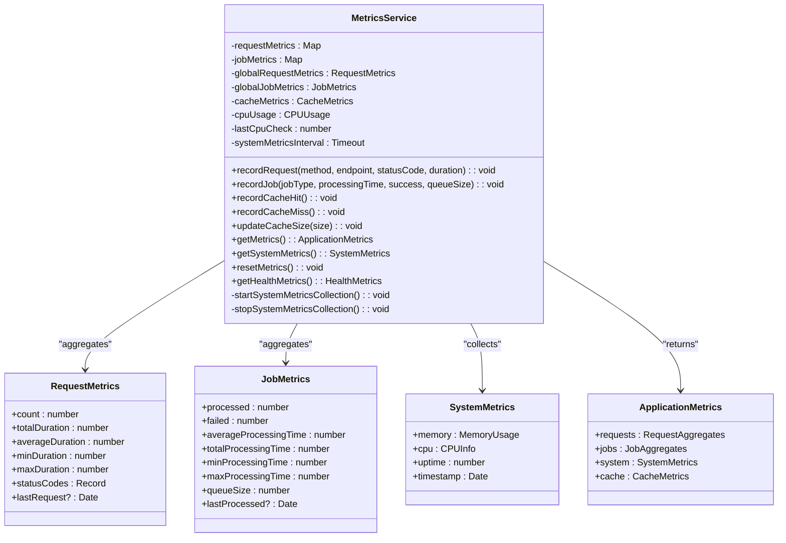
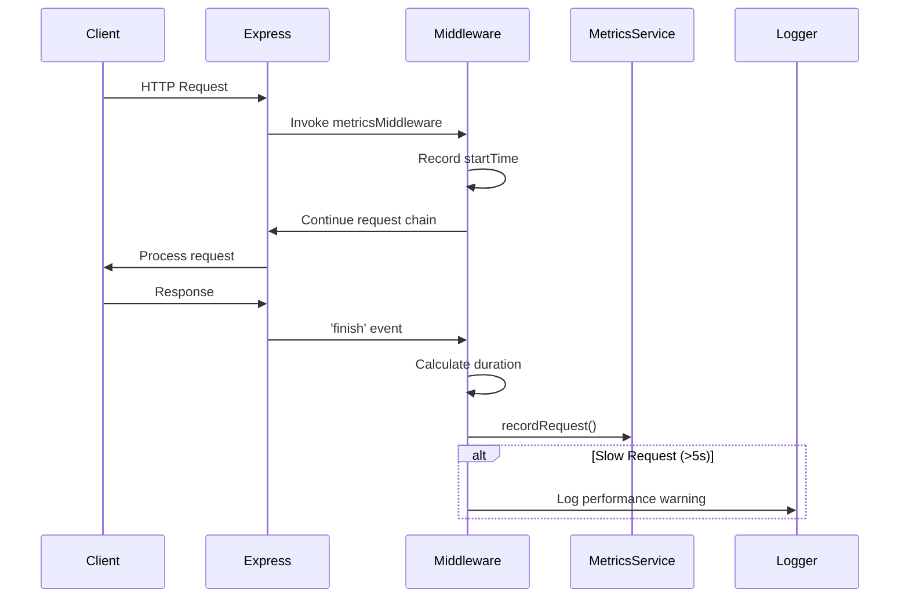
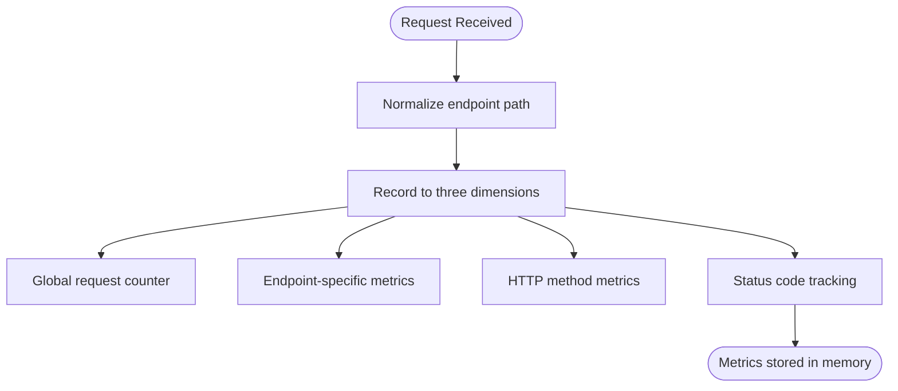

# Metrics Service

<cite>
**Referenced Files in This Document**   
- [metricsService.ts](file://src/services/metricsService.ts)
- [metricsMiddleware.ts](file://src/middleware/metricsMiddleware.ts)
- [metrics.ts](file://src/routes/metrics.ts)
</cite>

## Table of Contents
1. [Introduction](#introduction)
2. [Core Components](#core-components)
3. [Architecture Overview](#architecture-overview)
4. [Detailed Component Analysis](#detailed-component-analysis)
5. [Integration with Express Middleware](#integration-with-express-middleware)
6. [Metrics Exposure via API](#metrics-exposure-via-api)
7. [Metric Registration and Reporting Patterns](#metric-registration-and-reporting-patterns)
8. [Scalability and Performance Considerations](#scalability-and-performance-considerations)
9. [Integration with External Monitoring Systems](#integration-with-external-monitoring-systems)
10. [Troubleshooting Guide](#troubleshooting-guide)

## Introduction
The MetricsService is a central observability component responsible for collecting, aggregating, and exposing system performance data across the application. It enables real-time monitoring of key operational metrics such as request latency, error rates, job processing performance, cache efficiency, and system health. The service is designed to support both internal diagnostics and integration with external monitoring tools like Prometheus and Grafana. By instrumenting critical operations throughout the codebase, it provides comprehensive visibility into service behavior under various load conditions.

## Core Components
The MetricsService consists of three primary components: the core metrics collection engine (`metricsService`), the Express middleware integration layer (`metricsMiddleware`), and the API exposure endpoints (`metricsRouter`). These components work together to automatically capture telemetry data from HTTP requests, background jobs, and system resources, making them available through standardized endpoints.

**Section sources**
- [metricsService.ts](file://src/services/metricsService.ts#L1-L391)
- [metricsMiddleware.ts](file://src/middleware/metricsMiddleware.ts#L1-L103)
- [metrics.ts](file://src/routes/metrics.ts#L1-L187)

## Architecture Overview
```mermaid
graph TB
subgraph "Application Layer"
A[HTTP Requests] --> B(metricsMiddleware)
C[Background Jobs] --> D(metricsService)
E[Cache Operations] --> D
end
subgraph "Metrics Core"
B --> D
D --> F[In-Memory Storage]
end
subgraph "Data Exposure"
G[API Clients] --> H[/api/metrics]
H --> D
I[Monitoring Tools] --> H
end
D --> |Periodic Collection| J[System Metrics]
J --> |CPU, Memory, Uptime| D
```

**Diagram sources**
- [metricsService.ts](file://src/services/metricsService.ts#L52-L388)
- [metricsMiddleware.ts](file://src/middleware/metricsMiddleware.ts#L12-L52)
- [metrics.ts](file://src/routes/metrics.ts#L1-L187)

## Detailed Component Analysis

### MetricsService Class Analysis
The `MetricsService` class serves as the central repository for all application telemetry data. It maintains separate metric stores for HTTP requests, background jobs, cache operations, and system-level performance indicators.

#### Class Diagram


**Diagram sources**
- [metricsService.ts](file://src/services/metricsService.ts#L52-L388)

**Section sources**
- [metricsService.ts](file://src/services/metricsService.ts#L1-L391)

## Integration with Express Middleware
The `metricsMiddleware` automatically instruments all incoming HTTP requests, capturing method, endpoint, response status, and processing duration. It uses route normalization to group similar dynamic routes (e.g., `/api/instances/123` → `/api/instances/:id`) for meaningful aggregation.

#### Request Flow Sequence


**Diagram sources**
- [metricsMiddleware.ts](file://src/middleware/metricsMiddleware.ts#L12-L52)

**Section sources**
- [metricsMiddleware.ts](file://src/middleware/metricsMiddleware.ts#L1-L103)

## Metrics Exposure via API
The metrics service exposes collected data through a RESTful API mounted at `/api/metrics`, providing multiple endpoints for different use cases.

### API Endpoints Table
| Endpoint | Method | Purpose | Response Data |
|--------|--------|---------|---------------|
| `/api/metrics` | GET | Comprehensive metrics dump | Full ApplicationMetrics object |
| `/api/metrics/summary` | GET | Health check summary | Performance, system, and job KPIs |
| `/api/metrics/system` | GET | System-level metrics only | CPU, memory, uptime |
| `/api/metrics/reset` | POST | Reset all counters (debug) | Confirmation message |

**Section sources**
- [metrics.ts](file://src/routes/metrics.ts#L1-L187)

## Metric Registration and Reporting Patterns
The service implements several patterns for metric registration and reporting across different operational domains.

### Request Metrics Pattern


### Job Metrics Pattern
External components use the `recordJobMetrics` helper to report background job performance, capturing processing time, success/failure status, and queue size at execution time.

**Section sources**
- [metricsService.ts](file://src/services/metricsService.ts#L100-L200)
- [metricsMiddleware.ts](file://src/middleware/metricsMiddleware.ts#L75-L103)

## Scalability and Performance Considerations
The MetricsService is designed for high-performance operation under load:
- All metrics are stored in memory using JavaScript Maps for O(1) access
- System metrics are collected periodically (every 30 seconds) rather than on-demand
- The service avoids blocking operations during metric recording
- CPU usage calculation uses process.cpuUsage() deltas for accuracy
- Memory footprint is minimized by storing only aggregated values, not raw events

Under high load, the service maintains performance by:
- Using non-blocking asynchronous operations
- Limiting expensive calculations to retrieval time
- Employing efficient data structures
- Avoiding locks or synchronization primitives

**Section sources**
- [metricsService.ts](file://src/services/metricsService.ts#L300-L350)

## Integration with External Monitoring Systems
The `/api/metrics` endpoint can be easily integrated with external monitoring systems:

### Prometheus Integration
Configure Prometheus to scrape the `/api/metrics/summary` endpoint at regular intervals. The JSON response format includes standardized metric names and units compatible with most monitoring backends.

### Grafana Configuration
Use the summary endpoint as a data source for dashboards showing:
- Real-time request rates and error percentages
- Average response time trends
- System resource utilization (CPU, memory)
- Job processing throughput
- Cache hit ratio over time

For production deployments, consider:
- Securing the metrics endpoint with authentication
- Rate-limiting access to prevent abuse
- Using reverse proxy caching for high-frequency scrapes
- Implementing log sampling for high-volume environments

**Section sources**
- [metrics.ts](file://src/routes/metrics.ts#L85-L136)

## Troubleshooting Guide
Common issues and their resolutions:

### Missing Metrics
- **Cause**: Middleware not properly applied
- **Solution**: Verify `metricsMiddleware` is included in Express middleware chain

### High Memory Usage
- **Cause**: Long-running process accumulating metrics
- **Solution**: Use `/api/metrics/reset` endpoint during maintenance windows

### Inaccurate CPU Metrics
- **Cause**: Rapid successive calls to getSystemMetrics()
- **Solution**: Allow sufficient time between calls for accurate delta calculation

### Slow Response from /metrics
- **Cause**: On-demand system metric calculation
- **Solution**: Rely on cached values from periodic collection; avoid frequent direct calls to getSystemMetrics()

**Section sources**
- [metricsService.ts](file://src/services/metricsService.ts#L350-L388)
- [metrics.ts](file://src/routes/metrics.ts#L132-L187)