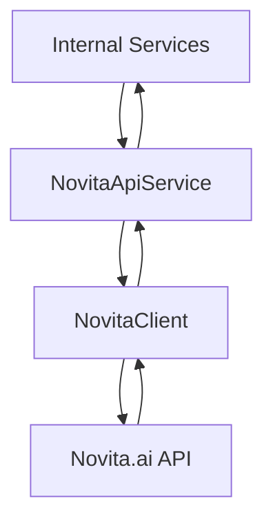
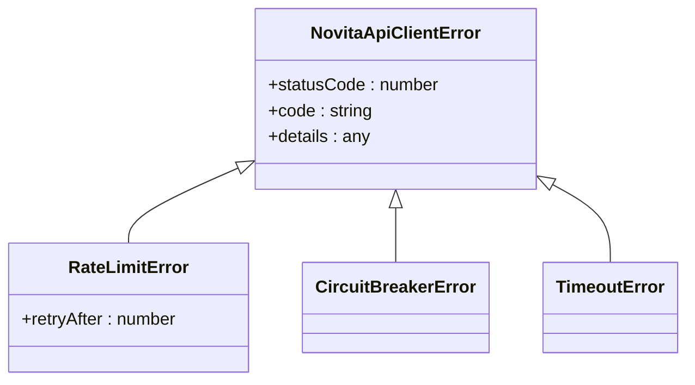
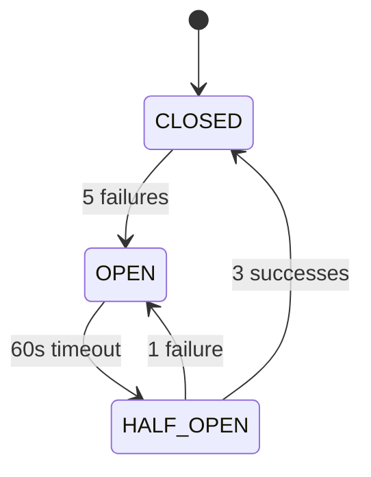
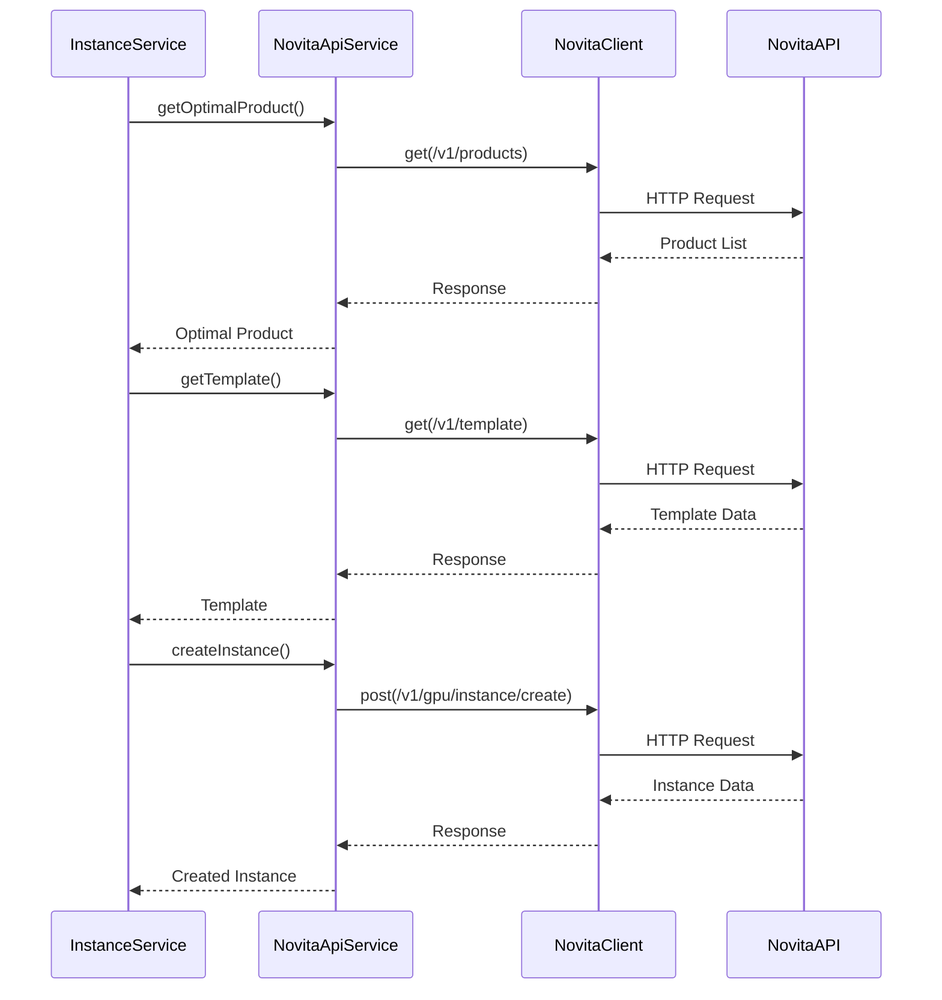
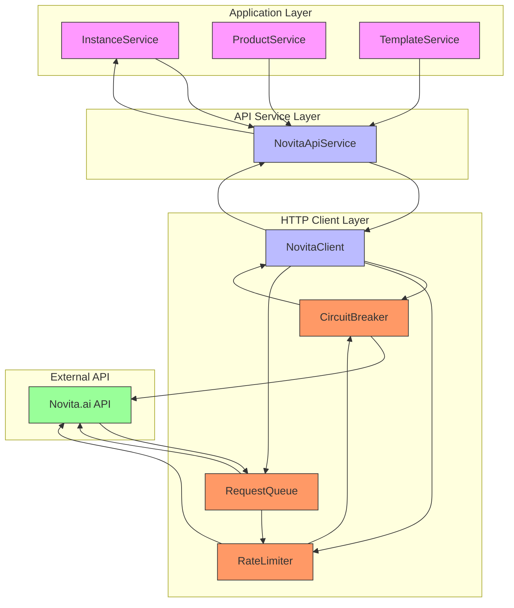

# Novita API Service

<cite>
**Referenced Files in This Document**   
- [novitaApiService.ts](file://src/services/novitaApiService.ts) - *Updated in recent commits*
- [novitaClient.ts](file://src/clients/novitaClient.ts) - *Updated in recent commits*
- [config.ts](file://src/config/config.ts) - *Configuration system*
- [instanceService.ts](file://src/services/instanceService.ts) - *Integration with instance management*
- [api.ts](file://src/types/api.ts) - *Type definitions and error classes*
</cite>

## Update Summary
**Changes Made**   
- Updated key methods section to reflect POST-based API calls and new request parameters
- Added new section for getRegistryAuth method introduced in recent commit
- Updated error handling strategy to reflect current implementation
- Revised architecture diagrams to match updated API call patterns
- Enhanced security and configuration section with registry authentication details

## Table of Contents
1. [Introduction](#introduction)
2. [Core Responsibilities](#core-responsibilities)
3. [Key Methods](#key-methods)
4. [Error Handling Strategy](#error-handling-strategy)
5. [Retry Logic and Circuit Breaker](#retry-logic-and-circuit-breaker)
6. [Integration with InstanceService](#integration-with-instanceservice)
7. [Security and Configuration](#security-and-configuration)
8. [Performance Optimizations](#performance-optimizations)
9. [Architecture Diagram](#architecture-diagram)

## Introduction
The NovitaApiService is a core component responsible for managing all interactions with the external Novita.ai API for GPU instance operations. It serves as an abstraction layer between the internal application logic and the external API, handling request formatting, authentication, error handling, and response parsing. The service encapsulates the complexity of external API communication, providing a clean interface for other services to interact with GPU instances.

**Section sources**
- [novitaApiService.ts](file://src/services/novitaApiService.ts#L1-L50)

## Core Responsibilities
The NovitaApiService has several key responsibilities in the application architecture:

1. **API Abstraction**: Translates internal service calls into properly formatted HTTP requests to the Novita.ai API
2. **Authentication Management**: Handles API key authentication through the configuration system
3. **Request Formatting**: Ensures all requests follow the expected format for the Novita.ai API
4. **Response Parsing**: Transforms API responses into consistent internal data structures
5. **Error Standardization**: Converts various API error types into a consistent error hierarchy
6. **Monitoring Integration**: Provides status information for system monitoring

The service works in conjunction with the NovitaClient, which handles lower-level concerns like HTTP communication, while NovitaApiService focuses on business logic and API-specific operations.

**Diagram sources**
- [novitaApiService.ts](file://src/services/novitaApiService.ts#L1-L50)
- [novitaClient.ts](file://src/clients/novitaClient.ts#L1-L50)

**Section sources**
- [novitaApiService.ts](file://src/services/novitaApiService.ts#L1-L100)

## Key Methods
The NovitaApiService provides several key methods for GPU instance management:

### createInstance
Creates a new GPU instance with the specified configuration parameters using POST request with payload.

**Request Parameters:**
- `name`: Instance name
- `productId`: Product identifier
- `gpuNum`: Number of GPUs (1-8)
- `rootfsSize`: Root filesystem size in GB (10-1000)
- `kind`: Instance type ('gpu' or 'cpu')
- `billingMode`: Pricing model (spot, on-demand, or monthly)
- `imageUrl`: Container image URL
- `imageAuthId`: Registry authentication ID (optional)
- `ports`: Port configuration
- `envs`: Environment variables
- `tools`: Pre-installed tools
- `networkStorages`: Attached network storage

**Updated** Method updated to use POST request with payload instead of GET with URL parameters

**Section sources**
- [novitaApiService.ts](file://src/services/novitaApiService.ts#L250-L280)

### getInstance
Retrieves detailed information about a specific instance by its ID using GET request with instanceId parameter.

**Response Includes:**
- Instance status and configuration
- Connection information
- Timestamps for creation and state changes
- Port mappings and network configuration

**Updated** Method updated to use GET request with instanceId parameter in query string

**Section sources**
- [novitaApiService.ts](file://src/services/novitaApiService.ts#L330-L360)

### stopInstance
Stops a running instance gracefully using POST request with payload.

**Process Flow:**
1. Sends stop request to Novita.ai API via POST with instanceId in payload
2. Validates API response success
3. Returns updated instance status
4. Logs operation for monitoring

**Updated** Method updated to use POST request with payload instead of DELETE with URL parameters

**Section sources**
- [novitaApiService.ts](file://src/services/novitaApiService.ts#L390-L420)

### getRegistryAuth
Retrieves registry authentication credentials by authentication ID.

**Process Flow:**
1. Fetches all registry authentication entries from /v1/repository/auths endpoint
2. Searches for the entry matching the provided authId
3. Returns username and password if found
4. Throws error if authentication entry not found

**Request Parameters:**
- `authId`: Authentication identifier for registry credentials

**Response:**
- `username`: Registry username
- `password`: Registry password

**Section sources**
- [novitaApiService.ts](file://src/services/novitaApiService.ts#L150-L180)

## Error Handling Strategy
The NovitaApiService implements a comprehensive error handling strategy to manage various failure scenarios:

### Error Types
The service defines a hierarchy of error types for different failure modes:

**Diagram sources**
- [api.ts](file://src/types/api.ts#L250-L308)
- [novitaApiService.ts](file://src/services/novitaApiService.ts#L400-L480)

### HTTP Status Handling
The service handles specific HTTP status codes with appropriate error types:

- **429 (Rate Limit)**: Transformed into RateLimitError with retry-after information
- **401 (Unauthorized)**: Converted to authentication failure error
- **403 (Forbidden)**: Transformed to access forbidden error
- **404 (Not Found)**: Converted to resource not found error
- **5xx (Server Errors)**: Transformed to server error with appropriate status code

**Updated** Error handling updated to reflect current implementation in code

**Section sources**
- [novitaApiService.ts](file://src/services/novitaApiService.ts#L403-L449)

## Retry Logic and Circuit Breaker
The NovitaApiService implements robust reliability patterns to handle transient failures:

### Retry Mechanism
The service automatically retries failed requests based on the following criteria:

- **Network Errors**: Retries on connection issues (ECONNABORTED, ENOTFOUND, ECONNRESET)
- **Server Errors**: Retries on 5xx status codes
- **Rate Limiting**: Retries on 429 status with exponential backoff

Retry attempts are limited by the configuration setting `maxRetryAttempts` (default: 3).

### Circuit Breaker Pattern
The service uses a circuit breaker pattern to prevent cascading failures:

- **States**: CLOSED, OPEN, HALF_OPEN
- **Failure Threshold**: 5 consecutive failures
- **Recovery Timeout**: 60 seconds
- **Success Threshold**: 3 successful requests to close circuit

When the circuit is OPEN, requests are rejected immediately without contacting the external API.

**Diagram sources**
- [novitaClient.ts](file://src/clients/novitaClient.ts#L10-L100)
- [novitaApiService.ts](file://src/services/novitaApiService.ts#L451-L480)

**Section sources**
- [novitaClient.ts](file://src/clients/novitaClient.ts#L1-L200)
- [novitaApiService.ts](file://src/services/novitaApiService.ts#L400-L480)

## Integration with InstanceService
The NovitaApiService integrates closely with the InstanceService to provide a complete instance management solution:

### Workflow Integration
The InstanceService uses NovitaApiService methods as part of its instance creation workflow:

1. Validate instance creation request
2. Get optimal product via NovitaApiService.getOptimalProduct
3. Get template configuration via NovitaApiService.getTemplate
4. Get registry authentication via NovitaApiService.getRegistryAuth (if needed)
5. Create instance via NovitaApiService.createInstance
6. Monitor instance status via NovitaApiService.getInstance

### State Management
The InstanceService maintains internal state while using NovitaApiService for external API communication:

**Updated** Sequence diagram updated to reflect POST-based instance creation

**Diagram sources**
- [instanceService.ts](file://src/services/instanceService.ts#L50-L150)
- [novitaApiService.ts](file://src/services/novitaApiService.ts#L250-L360)

**Section sources**
- [instanceService.ts](file://src/services/instanceService.ts#L1-L200)
- [novitaApiService.ts](file://src/services/novitaApiService.ts#L1-L500)

## Security and Configuration
The NovitaApiService handles sensitive credentials and security concerns through the configuration system:

### Credential Management
API credentials are managed through environment variables and the configuration system:

- **NOVITA_API_KEY**: API key for authentication
- **NOVITA_API_BASE_URL**: Base URL for the Novita.ai API
- **Configuration Validation**: Ensures required credentials are present

The service retrieves credentials from the config module, which validates and loads them from environment variables.

### Security Features
The service implements several security measures:

- **Authentication**: Bearer token authentication with API key
- **Request Logging**: Correlation IDs for tracking requests
- **Input Validation**: Validates request parameters before sending
- **Error Sanitization**: Prevents sensitive information leakage in error messages
- **Registry Authentication**: Secure handling of private image registry credentials

**Updated** Added registry authentication security details

**Section sources**
- [config.ts](file://src/config/config.ts#L100-L200)
- [novitaClient.ts](file://src/clients/novitaClient.ts#L150-L200)

## Performance Optimizations
The NovitaApiService implements several performance optimizations:

### Request Queuing
All requests are processed through a queue to manage rate limiting and prevent overwhelming the external API:

- **Rate Limiting**: Configurable limits (default: 100 requests per minute)
- **Request Spacing**: Ensures requests are properly spaced
- **Queue Monitoring**: Provides visibility into pending requests

### Connection Management
The service uses Axios with connection pooling and keep-alive to minimize connection overhead:

- **Timeout Configuration**: Configurable request timeout (default: 30 seconds)
- **Connection Reuse**: Reuses HTTP connections when possible
- **Keep-Alive**: Maintains persistent connections

### Monitoring Integration
The service provides methods for monitoring system health:

- **healthCheck()**: Checks API connectivity
- **getClientStatus()**: Returns circuit breaker and queue status
- **Comprehensive Logging**: Detailed logs for debugging and monitoring

**Section sources**
- [novitaClient.ts](file://src/clients/novitaClient.ts#L200-L300)
- [novitaApiService.ts](file://src/services/novitaApiService.ts#L470-L480)

## Architecture Diagram
The following diagram illustrates the complete architecture of the Novita API integration:

**Updated** Architecture diagram updated to reflect current implementation

**Diagram sources**
- [novitaApiService.ts](file://src/services/novitaApiService.ts#L1-L50)
- [novitaClient.ts](file://src/clients/novitaClient.ts#L1-L50)
- [instanceService.ts](file://src/services/instanceService.ts#L1-L50)

**Section sources**
- [novitaApiService.ts](file://src/services/novitaApiService.ts#L1-L500)
- [novitaClient.ts](file://src/clients/novitaClient.ts#L1-L385)
- [instanceService.ts](file://src/services/instanceService.ts#L1-L518)