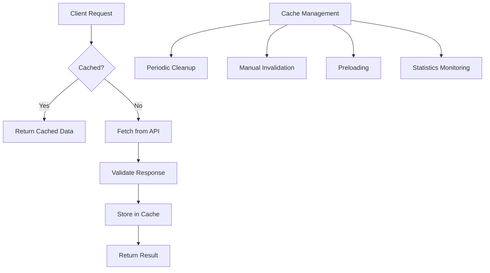
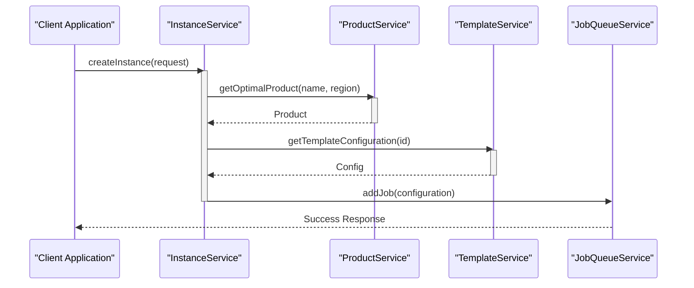
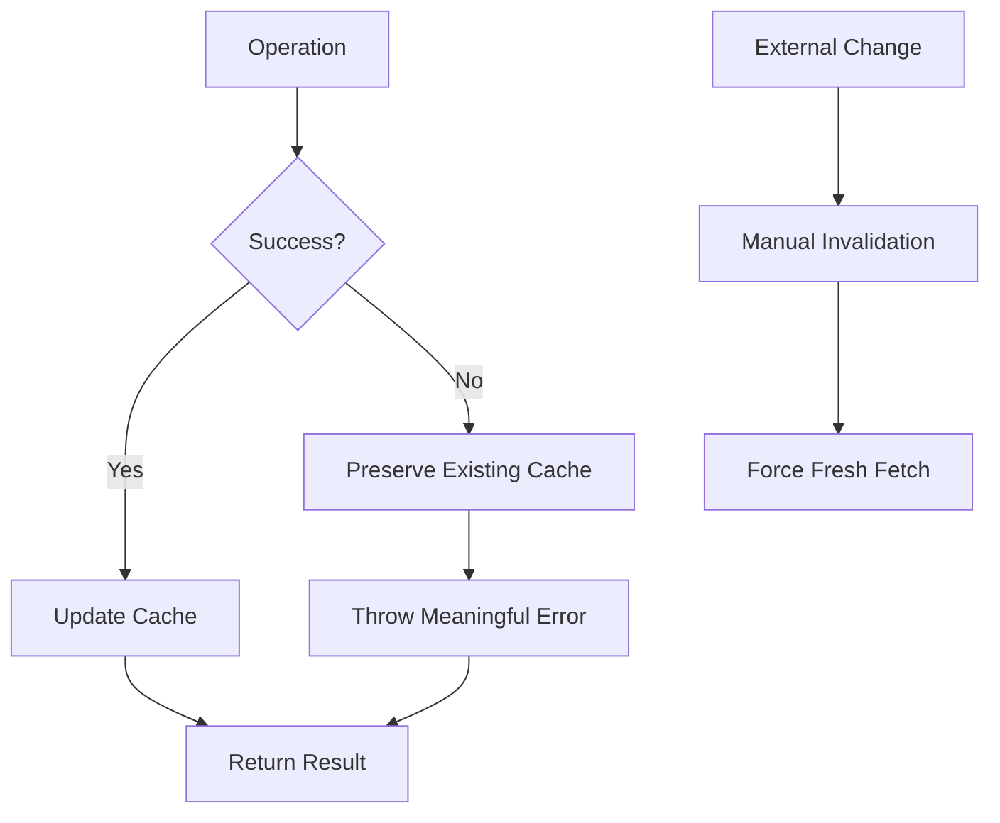

# Product & Template Services

<cite>
**Referenced Files in This Document**   
- [productService.ts](file://src/services/productService.ts) - *Updated with region fallback feature*
- [templateService.ts](file://src/services/templateService.ts)
- [instanceService.ts](file://src/services/instanceService.ts)
- [novitaClient.ts](file://src/clients/novitaClient.ts)
- [productServiceExample.ts](file://src/examples/productServiceExample.ts)
- [templateServiceExample.ts](file://src/examples/templateServiceExample.ts)
- [regionFallbackExample.ts](file://src/examples/regionFallbackExample.ts) - *Added in recent commit*
</cite>

## Update Summary
**Changes Made**   
- Added new section on multi-region fallback functionality in ProductService
- Updated ProductService overview to include region fallback capabilities
- Added usage example for region fallback feature
- Updated diagram sources to reflect code changes
- Enhanced section sources with annotations for updated files

## Table of Contents
1. [Introduction](#introduction)
2. [ProductService Overview](#productservice-overview)
3. [TemplateService Overview](#templateservice-overview)
4. [Caching Strategies](#caching-strategies)
5. [Integration with InstanceService](#integration-with-instanceservice)
6. [Usage Examples](#usage-examples)
7. [Data Consistency and Error Handling](#data-consistency-and-error-handling)
8. [Conclusion](#conclusion)

## Introduction
This document provides a comprehensive analysis of the ProductService and TemplateService components within the Novita.ai platform, which are responsible for managing GPU instance configurations. These services enable efficient retrieval and validation of available GPU instance types, pricing options, and pre-configured deployment templates. The document details their implementation, caching mechanisms, integration with instance creation workflows, and error handling strategies to ensure reliable and performant operations.

## ProductService Overview

The ProductService manages domain-specific data related to GPU instance types and pricing options available on the Novita.ai platform. It provides methods for listing, retrieving, and validating products based on various filters such as product name, region, and GPU type.

Key functionalities include:
- Retrieval of available GPU instance types with filtering capabilities
- Selection of optimal (lowest spot price) products based on name and region
- Multi-region fallback support for product selection
- Validation of product availability and pricing
- Integration with external APIs via NovitaApiClient

The service implements robust error handling for scenarios such as missing products or unavailable configurations, ensuring that consumers receive meaningful feedback during instance provisioning processes. The recent addition of multi-region fallback functionality enhances availability by automatically trying alternative regions when the preferred region lacks available products.

**Section sources**
- [productService.ts](file://src/services/productService.ts#L1-L380) - *Updated with region fallback feature*

## TemplateService Overview

The TemplateService manages pre-configured instance templates that streamline the deployment process for GPU instances. These templates contain standardized configurations including container image details, port mappings, and environment variables.

Core capabilities include:
- Retrieval of template configurations by ID
- Extraction of essential deployment parameters (image URL, ports, environment variables)
- Comprehensive validation of template structure and data integrity
- Support for both string and numeric template identifiers

Templates serve as blueprints for rapid instance provisioning, reducing configuration errors and ensuring consistency across deployments. The service validates all template components including port specifications (ensuring valid port numbers and protocol types) and environment variables (validating names and values).

**Section sources**
- [templateService.ts](file://src/services/templateService.ts#L1-L288)

## Caching Strategies

Both ProductService and TemplateService implement sophisticated caching strategies to minimize external API calls and improve response times.

### ProductService Caching
The ProductService utilizes two separate caches:
- **Product Cache**: Stores lists of products with a 5-minute TTL (Time To Live), maxSize of 100 entries
- **Optimal Product Cache**: Stores individual optimal product selections with a 5-minute TTL, maxSize of 50 entries

Cache keys are generated based on filter parameters (productName, region, gpuType), enabling efficient retrieval of previously fetched results. The service also provides methods for cache invalidation, preloading, and statistics monitoring.

### TemplateService Caching
The TemplateService employs a single cache with:
- 10-minute TTL (templates change less frequently than pricing)
- maxSize of 200 entries
- Cleanup every 2 minutes

Template caching supports individual TTL management, allowing specific templates to have customized expiration times. The service also provides methods to check cache status, invalidate specific entries, and monitor cache performance metrics.



**Diagram sources**
- [productService.ts](file://src/services/productService.ts#L15-L280)
- [templateService.ts](file://src/services/templateService.ts#L12-L288)

**Section sources**
- [productService.ts](file://src/services/productService.ts#L15-L280)
- [templateService.ts](file://src/services/templateService.ts#L12-L288)

## Integration with InstanceService

The ProductService and TemplateService are tightly integrated with the InstanceService during instance creation workflows, ensuring valid configurations are used.

### Creation Workflow
When creating a new GPU instance:
1. **Validation**: InstanceService validates input parameters including product name and template ID
2. **Parallel Retrieval**: Optimal product and template configuration are fetched in parallel
3. **Configuration Assembly**: Product specifications (pricing, availability) and template settings (image, ports, envs) are combined
4. **Job Queuing**: Configuration is passed to job queue for asynchronous processing

### Data Flow


**Diagram sources**
- [instanceService.ts](file://src/services/instanceService.ts#L25-L150)
- [productService.ts](file://src/services/productService.ts#L50-L100)
- [templateService.ts](file://src/services/templateService.ts#L50-L80)

**Section sources**
- [instanceService.ts](file://src/services/instanceService.ts#L25-L150)

## Usage Examples

### ProductService Usage
The ProductServiceExample demonstrates practical usage patterns:

```typescript
// Get optimal RTX 4090 product in default region
const optimalProduct = await productService.getOptimalProduct('RTX 4090 24GB');

// Get optimal product in specific region
const usProduct = await productService.getOptimalProduct('RTX 4090 24GB', 'US-WEST-01');

// Get all products with filters
const allProducts = await productService.getProducts({ productName: 'RTX 4090 24GB' });

// Cache management
const stats = productService.getCacheStats();
productService.clearCache();
```

### Multi-Region Fallback Usage
The regionFallbackExample demonstrates the new multi-region fallback functionality:

```typescript
// Example 1: Using default region configuration
const result = await productService.getOptimalProductWithFallback('RTX 4090 24GB');
console.log(`Found in region: ${result.regionUsed}`);

// Example 2: With preferred region
const result = await productService.getOptimalProductWithFallback(
  'RTX 4090 24GB', 
  'AS-SGP-02'
);

// Example 3: With custom region priority
const customRegions: RegionConfig[] = [
  { id: 'as-in-1', name: 'AS-IN-01', priority: 1 },
  { id: 'cn-hongkong-1', name: 'CN-HK-01', priority: 2 },
  { id: 'as-sgp-2', name: 'AS-SGP-02', priority: 3 }
];
const result = await productService.getOptimalProductWithFallback(
  'RTX 4090 24GB',
  undefined,
  customRegions
);
```

### TemplateService Usage
The TemplateServiceExample illustrates template operations:

```typescript
// Fetch template by ID
const template = await templateService.getTemplate(107672);

// Extract configuration for deployment
const config = await templateService.getTemplateConfiguration(templateId);

// Cache management
const isCached = templateService.isCached(templateId);
await templateService.preloadTemplate(templateId);
templateService.clearCache();
```

These examples demonstrate how templates streamline provisioning by encapsulating complex configuration details into reusable components.

**Section sources**
- [productServiceExample.ts](file://src/examples/productServiceExample.ts#L1-L75)
- [templateServiceExample.ts](file://src/examples/templateServiceExample.ts#L1-L148)
- [regionFallbackExample.ts](file://src/examples/regionFallbackExample.ts#L1-L91) - *Added in recent commit*

## Data Consistency and Error Handling

Both services implement comprehensive error handling and data validation strategies to maintain consistency.

### ProductService Error Handling
- **PRODUCT_NOT_FOUND**: When no products match the specified name
- **NO_AVAILABLE_PRODUCTS**: When matching products exist but none are available
- **NO_OPTIMAL_PRODUCT**: When no optimal product can be determined
- **NO_OPTIMAL_PRODUCT_ANY_REGION**: When no optimal product can be found in any region (multi-region fallback)

The service validates product availability and sorts by spot price to ensure cost-effective selections. The multi-region fallback feature enhances reliability by attempting to find available products across multiple regions in priority order.

### TemplateService Validation
The TemplateService performs rigorous validation:
- Template ID must be non-empty string or positive integer
- Required fields (id, imageUrl) must be present and valid
- Ports array is validated for structure, port numbers (1-65535), and protocol types
- Environment variables are checked for valid names and values

Error types include INVALID_TEMPLATE_ID, INVALID_TEMPLATE_IMAGE_URL, and various port/env validation errors.

### Cache Consistency
Both services provide methods to maintain cache consistency:
- **Invalidation**: Specific entries can be removed when configurations change
- **Preloading**: Critical templates/products can be warmed in cache
- **Monitoring**: Cache hit ratios and statistics are exposed for observability



**Diagram sources**
- [productService.ts](file://src/services/productService.ts#L100-L250)
- [templateService.ts](file://src/services/templateService.ts#L100-L250)

**Section sources**
- [productService.ts](file://src/services/productService.ts#L100-L250)
- [templateService.ts](file://src/services/templateService.ts#L100-L250)

## Conclusion
The ProductService and TemplateService form a critical foundation for GPU instance management within the Novita.ai platform. By providing efficient access to pricing information and standardized deployment templates, these services enable rapid, consistent, and cost-effective instance provisioning. Their sophisticated caching strategies significantly reduce API load while maintaining fresh data, and their tight integration with the InstanceService ensures configuration validity throughout the deployment lifecycle. The comprehensive error handling and validation mechanisms guarantee reliable operations even in edge cases, making these services robust components of the overall architecture. The recent addition of multi-region fallback functionality in ProductService further enhances system reliability by automatically attempting alternative regions when the preferred region lacks available products.