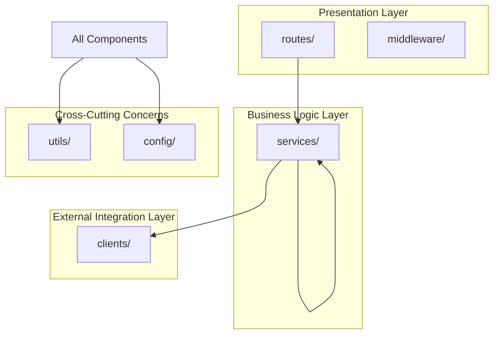
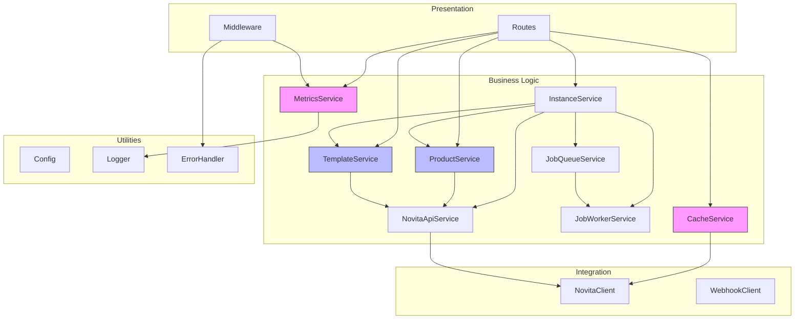
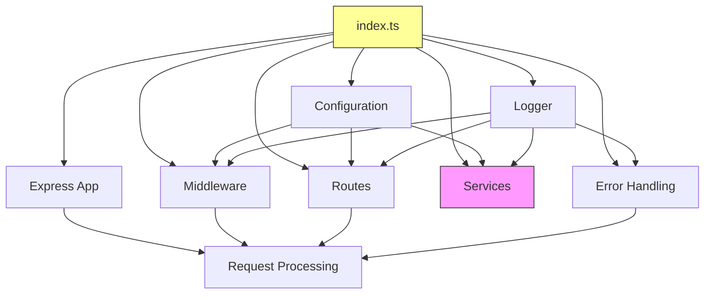
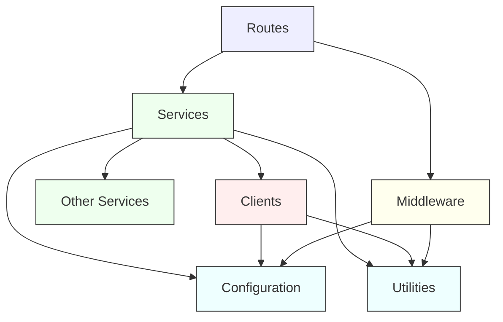
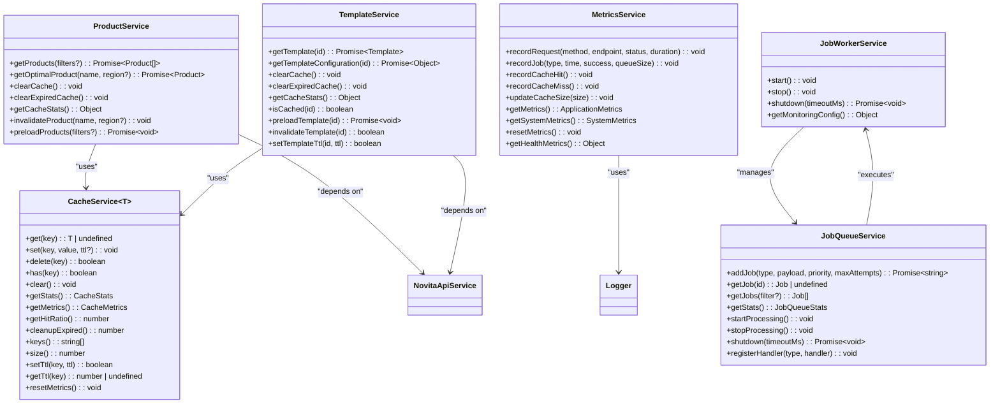
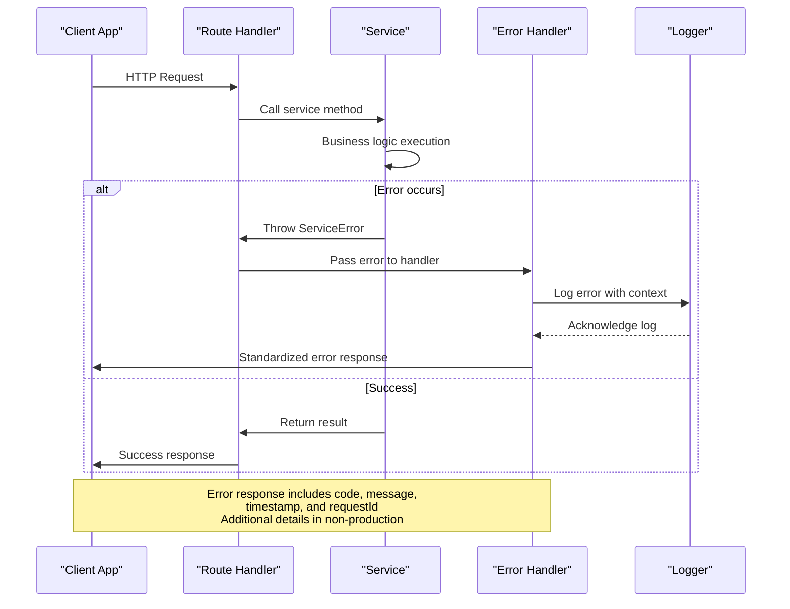
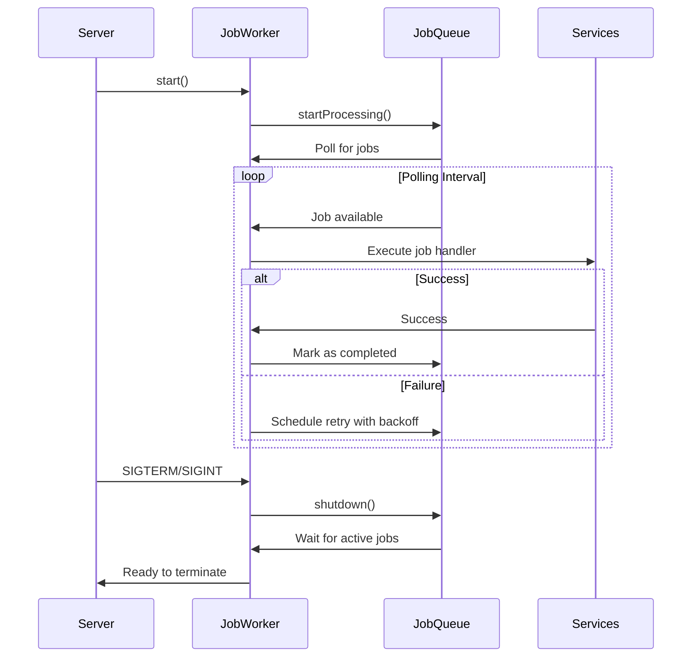
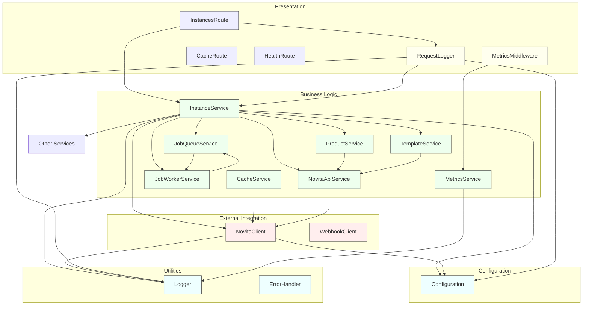

# Service Architecture

<cite>
**Referenced Files in This Document**   
- [index.ts](file://src/index.ts)
- [config.ts](file://src/config/config.ts)
- [errorHandler.ts](file://src/middleware/errorHandler.ts)
- [cacheService.ts](file://src/services/cacheService.ts)
- [metricsService.ts](file://src/services/metricsService.ts)
- [productService.ts](file://src/services/productService.ts)
- [templateService.ts](file://src/services/templateService.ts)
- [novitaClient.ts](file://src/clients/novitaClient.ts)
- [novitaApiService.ts](file://src/services/novitaApiService.ts)
- [instances.ts](file://src/routes/instances.ts)
- [cache.ts](file://src/routes/cache.ts)
- [health.ts](file://src/routes/health.ts)
- [jobWorkerService.ts](file://src/services/jobWorkerService.ts) - *Updated in recent commit*
- [jobQueueService.ts](file://src/services/jobQueueService.ts)
</cite>

## Update Summary
**Changes Made**   
- Updated documentation to reflect integration of job worker service startup and shutdown in server lifecycle
- Added details about JobWorkerService's role in background processing and graceful shutdown
- Enhanced dependency analysis to include job worker service relationships
- Added new section on job processing workflow and lifecycle management
- Updated architecture overview diagram to include job processing components

## Table of Contents
1. [Introduction](#introduction)
2. [Project Structure](#project-structure)
3. [Core Components](#core-components)
4. [Architecture Overview](#architecture-overview)
5. [Detailed Component Analysis](#detailed-component-analysis)
6. [Dependency Analysis](#dependency-analysis)
7. [Performance Considerations](#performance-considerations)
8. [Troubleshooting Guide](#troubleshooting-guide)
9. [Conclusion](#conclusion)

## Introduction
The novitai application implements a clean architecture pattern with clear separation of concerns between presentation, business logic, external integrations, and cross-cutting concerns. This document details the service layer design, focusing on the composition and interaction of services that power the application's core functionality. The architecture follows established patterns for scalability, maintainability, and observability, with services organized around domain concepts and technical concerns. Recent updates have enhanced the job processing system with improved startup and shutdown handling.

## Project Structure

**Diagram sources**
- [index.ts](file://src/index.ts#L1-L114)
- [config.ts](file://src/config/config.ts#L1-L390)

**Section sources**
- [index.ts](file://src/index.ts#L1-L114)
- [config.ts](file://src/config/config.ts#L1-L390)

## Core Components

The application's core components are organized into a clean architecture with distinct layers. The service layer contains the business logic and acts as the central orchestrator between the presentation layer (routes) and external integration layer (clients). Services are designed to be stateless and horizontally scalable, with dependencies managed through configuration and dependency injection patterns. The architecture emphasizes separation of concerns, with each service having a well-defined responsibility and interface contract. The JobWorkerService has been enhanced to ensure proper initialization and graceful shutdown during server lifecycle events.

**Section sources**
- [index.ts](file://src/index.ts#L1-L114)
- [services](file://src/services)
- [clients](file://src/clients)

## Architecture Overview

**Diagram sources**
- [index.ts](file://src/index.ts#L1-L114)
- [services](file://src/services)
- [clients](file://src/clients)
- [middleware](file://src/middleware)
- [config](file://src/config)
- [utils](file://src/utils)

## Detailed Component Analysis

### Service Composition Pattern

The service composition pattern in the novitai application is centered around the `index.ts` file, which serves as the composition root for the entire application. This file imports and wires together all components, establishing the dependency graph and configuring the Express application. Services are instantiated as singletons and made available globally through named exports, allowing for easy dependency management and testing. The JobWorkerService is now properly integrated into the server lifecycle, starting during initialization and shutting down gracefully when termination signals are received.

**Diagram sources**
- [index.ts](file://src/index.ts#L1-L114)

**Section sources**
- [index.ts](file://src/index.ts#L1-L114)

### Clean Architecture Layers

The application follows a clean architecture pattern with four distinct layers:

1. **Routes (Presentation)**: Handle HTTP requests and responses, validating input and formatting output
2. **Services (Business Logic)**: Contain the core business rules and orchestrate operations
3. **Clients (External Integration)**: Manage communication with external systems and APIs
4. **Utilities (Cross-Cutting Concerns)**: Provide shared functionality like logging, error handling, and configuration

**Diagram sources**
- [index.ts](file://src/index.ts#L1-L114)
- [routes](file://src/routes)
- [services](file://src/services)
- [clients](file://src/clients)
- [middleware](file://src/middleware)
- [config](file://src/config)
- [utils](file://src/utils)

**Section sources**
- [index.ts](file://src/index.ts#L1-L114)
- [routes](file://src/routes)
- [services](file://src/services)

### Service Interface Contracts

Service interfaces define clear contracts for method signatures and expected behavior. Each service exposes methods that represent business capabilities, with consistent error handling and return types. The interface contracts ensure loose coupling between components and facilitate testing and maintenance.

**Diagram sources**
- [productService.ts](file://src/services/productService.ts#L1-L280)
- [templateService.ts](file://src/services/templateService.ts#L1-L287)
- [cacheService.ts](file://src/services/cacheService.ts#L1-L490)
- [metricsService.ts](file://src/services/metricsService.ts#L1-L391)
- [jobWorkerService.ts](file://src/services/jobWorkerService.ts#L1-L610)
- [jobQueueService.ts](file://src/services/jobQueueService.ts#L1-L377)

**Section sources**
- [productService.ts](file://src/services/productService.ts#L1-L280)
- [templateService.ts](file://src/services/templateService.ts#L1-L287)
- [cacheService.ts](file://src/services/cacheService.ts#L1-L490)
- [metricsService.ts](file://src/services/metricsService.ts#L1-L391)
- [jobWorkerService.ts](file://src/services/jobWorkerService.ts#L1-L610)
- [jobQueueService.ts](file://src/services/jobQueueService.ts#L1-L377)

### Error Propagation Mechanism

The error propagation mechanism follows a standardized pattern from services through middleware to API responses. Services throw structured errors that contain status codes, error codes, and details. The global error handler middleware intercepts these errors, logs them with appropriate context, and transforms them into standardized API responses with security considerations.

**Diagram sources**
- [errorHandler.ts](file://src/middleware/errorHandler.ts#L1-L286)
- [utils/errorHandler.ts](file://src/utils/errorHandler.ts#L1-L185)
- [instances.ts](file://src/routes/instances.ts#L1-L84)

**Section sources**
- [errorHandler.ts](file://src/middleware/errorHandler.ts#L1-L286)
- [utils/errorHandler.ts](file://src/utils/errorHandler.ts#L1-L185)

### Service Roles and Responsibilities

Each service in the application has a well-defined role and set of responsibilities. The CacheService provides performance optimization through caching of frequently accessed data. The MetricsService enables observability by collecting and exposing performance and system metrics. The ProductService and TemplateService handle domain-specific business logic related to products and templates respectively. The JobWorkerService manages background job processing with proper lifecycle management.

```mermaid
graph TD
A[CacheService] --> B["Performance Optimization"]
A --> C["Reduce API calls"]
A --> D["Improve response times"]
A --> E["Manage cache lifecycle"]
F[MetricsService] --> G["Request monitoring"]
F --> H["Job processing metrics"]
F --> I["System resource tracking"]
F --> J["Health check data"]
K[ProductService] --> L["Product availability"]
K --> M["Optimal product selection"]
K --> N["Price comparison"]
K --> O["Cache product data"]
P[TemplateService] --> Q["Template configuration"]
P --> R["Template validation"]
P --> S["Cache template data"]
P --> T["Extract instance config"]
U[JobWorkerService] --> V["Background job processing"]
U --> W["Instance creation workflow"]
U --> X["Startup monitoring"]
U --> Y["Webhook delivery"]
style A fill:#f9f,stroke:#333
style F fill:#f9f,stroke:#333
style K fill:#bbf,stroke:#333
style P fill:#bbf,stroke:#333
style U fill:#f9f,stroke:#333
```

**Section sources**
- [cacheService.ts](file://src/services/cacheService.ts#L1-L490)
- [metricsService.ts](file://src/services/metricsService.ts#L1-L391)
- [productService.ts](file://src/services/productService.ts#L1-L280)
- [templateService.ts](file://src/services/templateService.ts#L1-L287)
- [jobWorkerService.ts](file://src/services/jobWorkerService.ts#L1-L610)

### Job Processing Workflow

The JobWorkerService orchestrates background processing for instance creation, monitoring, and webhook delivery. During server startup, the job worker service is initialized and begins processing jobs from the queue. The service handles three primary job types: instance creation, instance monitoring, and webhook delivery. Each job type follows a specific workflow with error handling and retry mechanisms.

**Diagram sources**
- [index.ts](file://src/index.ts#L101-L129)
- [jobWorkerService.ts](file://src/services/jobWorkerService.ts#L555-L610)
- [jobQueueService.ts](file://src/services/jobQueueService.ts#L345-L377)

**Section sources**
- [index.ts](file://src/index.ts#L101-L129)
- [jobWorkerService.ts](file://src/services/jobWorkerService.ts#L555-L610)
- [jobQueueService.ts](file://src/services/jobQueueService.ts#L345-L377)

## Dependency Analysis

**Diagram sources**
- [index.ts](file://src/index.ts#L1-L114)
- [services](file://src/services)
- [clients](file://src/clients)
- [middleware](file://src/middleware)
- [config](file://src/config)
- [utils](file://src/utils)
- [routes](file://src/routes)

**Section sources**
- [index.ts](file://src/index.ts#L1-L114)
- [services](file://src/services)
- [clients](file://src/clients)

## Performance Considerations

The application is designed with performance and scalability in mind. Services are stateless, allowing for horizontal scaling across multiple instances. The CacheService reduces the load on external APIs by caching frequently accessed data with configurable TTLs and cleanup intervals. The MetricsService collects performance data with minimal overhead, enabling monitoring and optimization. Database connection management is handled through connection pooling and efficient query patterns, though specific implementation details are abstracted within the client services. The JobWorkerService ensures background processing does not block the main request thread, improving overall responsiveness.

**Section sources**
- [cacheService.ts](file://src/services/cacheService.ts#L1-L490)
- [metricsService.ts](file://src/services/metricsService.ts#L1-L391)
- [novitaClient.ts](file://src/clients/novitaClient.ts#L1-L384)
- [jobWorkerService.ts](file://src/services/jobWorkerService.ts#L1-L610)

## Troubleshooting Guide

The application includes comprehensive error handling and logging to facilitate troubleshooting. The global error handler middleware captures and standardizes all errors, providing consistent error responses with unique request IDs for correlation. The health check endpoint exposes detailed system and service metrics, including memory usage, CPU utilization, and service dependencies. Cache and metrics endpoints allow for inspection of internal state and performance characteristics. The structured logging approach includes contextual information such as request IDs, correlation IDs, and operation details to aid in debugging. The JobWorkerService logs detailed information about job processing, including retries and failures, which can be used to diagnose background processing issues.

**Section sources**
- [errorHandler.ts](file://src/middleware/errorHandler.ts#L1-L286)
- [utils/errorHandler.ts](file://src/utils/errorHandler.ts#L1-L185)
- [health.ts](file://src/routes/health.ts#L1-L288)
- [cache.ts](file://src/routes/cache.ts#L1-L152)
- [jobWorkerService.ts](file://src/services/jobWorkerService.ts#L1-L610)

## Conclusion

The novitai application demonstrates a well-structured service layer design following clean architecture principles. The clear separation between routes, services, clients, and utilities enables maintainability and testability. The service composition pattern in `index.ts` establishes a consistent dependency graph, while the error propagation mechanism ensures standardized API responses. The architecture supports scalability through stateless services and horizontal scaling, with performance optimization provided by caching and efficient resource management. The recent integration of job worker service startup and shutdown handling ensures proper lifecycle management of background processing. The design patterns established in the codebase provide a solid foundation for adding new services and features while maintaining consistency and quality.