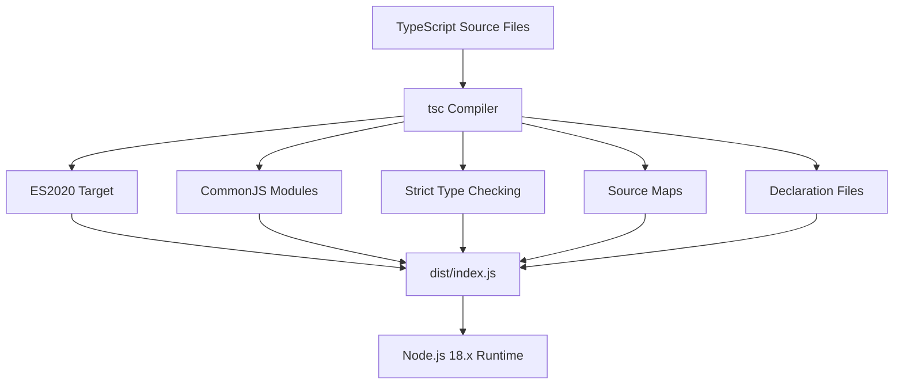
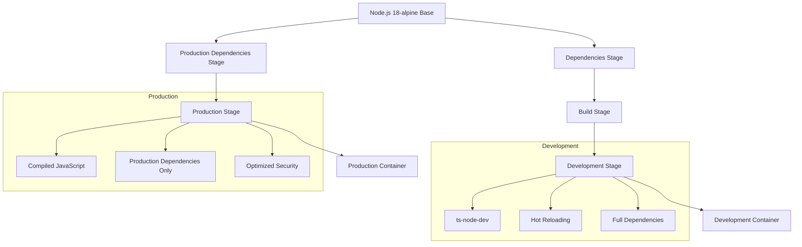

# Technology Stack & Dependencies

<cite>
**Referenced Files in This Document**   
- [package.json](file://package.json)
- [tsconfig.json](file://tsconfig.json)
- [Dockerfile](file://Dockerfile)
- [docker-compose.yml](file://docker-compose.yml)
- [src/index.ts](file://src/index.ts)
- [src/config/config.ts](file://src/config/config.ts)
- [src/middleware/requestLogger.ts](file://src/middleware/requestLogger.ts)
- [src/utils/logger.ts](file://src/utils/logger.ts)
- [src/middleware/errorHandler.ts](file://src/middleware/errorHandler.ts)
</cite>

## Table of Contents
1. [Technology Stack](#technology-stack)
2. [Production Dependencies](#production-dependencies)
3. [Development Dependencies](#development-dependencies)
4. [TypeScript Configuration](#typescript-configuration)
5. [Docker Multi-Stage Build Process](#docker-multi-stage-build-process)
6. [Version Compatibility and Upgrade Considerations](#version-compatibility-and-upgrade-considerations)
7. [Dependency Management Policy](#dependency-management-policy)

## Technology Stack

The novitai application is built on a modern, robust technology stack designed for scalability, security, and maintainability. The foundation consists of TypeScript 4.x running on Node.js 18.x runtime, providing strong typing and modern JavaScript features. Express.js 4.x serves as the web framework, offering a minimal and flexible foundation for building RESTful APIs. Docker 20.x enables containerization, ensuring consistent deployment across environments and isolation of application dependencies.

This combination provides a powerful ecosystem for developing and deploying cloud-native applications with automated GPU instance management capabilities. The stack supports hot reloading during development, structured logging, comprehensive error handling, and production-ready deployment configurations.

**Section sources**
- [package.json](file://package.json#L1-L52)
- [README.md](file://README.md#L0-L99)

## Production Dependencies

The application relies on several key production dependencies that provide essential functionality:

- **Express**: HTTP server framework that handles routing, middleware, and request/response processing. It serves as the core web framework for the API service.
- **Axios**: HTTP client for making external API calls to the Novita.ai platform, enabling integration with GPU instance management services.
- **Winston**: Structured logging library that provides flexible and configurable logging capabilities, supporting different log levels and transport mechanisms.
- **Joi**: Configuration validation library used to validate environment variables and ensure proper application configuration before startup.
- **Helmet**: Security middleware that sets various HTTP headers to protect against common web vulnerabilities such as XSS, CSRF, and clickjacking.
- **CORS**: Middleware that enables Cross-Origin Resource Sharing, allowing controlled access to the API from different domains as configured.
- **UUID**: Library for generating unique identifiers used for request tracking, correlation IDs, and other identifier generation needs.

These dependencies work together to create a secure, reliable, and observable API service that can manage GPU instances effectively.

**Section sources**
- [package.json](file://package.json#L28-L38)
- [src/index.ts](file://src/index.ts#L1-L114)
- [src/config/config.ts](file://src/config/config.ts#L0-L390)

## Development Dependencies

The development environment is enhanced with several tools that improve code quality, testing, and developer experience:

- **Jest**: Testing framework that provides a comprehensive solution for unit and integration testing with built-in mocking and assertion capabilities.
- **Supertest**: HTTP assertion library used for API testing, allowing easy testing of Express routes and endpoints.
- **ESLint**: Code quality tool that enforces coding standards and identifies potential errors through static analysis of TypeScript code.
- **ts-node-dev**: Development tool that provides hot reloading capabilities, automatically restarting the server when code changes are detected.

These development dependencies enable a robust development workflow with automated testing, code quality checks, and rapid feedback loops, ensuring high code quality and developer productivity.

**Section sources**
- [package.json](file://package.json#L39-L52)
- [package.json](file://package.json#L7-L11)
- [jest.config.js](file://jest.config.js)

## TypeScript Configuration

The TypeScript configuration in tsconfig.json is optimized for modern Node.js development with strict type checking and production-ready compilation settings. The configuration targets ES2020 for maximum compatibility with Node.js 18.x while leveraging modern JavaScript features. Modules are compiled to CommonJS format, which is the standard module system for Node.js applications.

Key configuration features include:
- Strict type checking with `strict: true` enabling `noImplicitAny`, `noImplicitReturns`, and other strictness flags
- ES module interop support through `esModuleInterop: true`
- Source maps and declaration files generation for debugging and type checking
- JSON module resolution support
- Exclusion of test files from compilation output

The configuration ensures type safety throughout the codebase while maintaining optimal performance and compatibility with the Node.js runtime.

**Diagram sources**
- [tsconfig.json](file://tsconfig.json#L0-L31)
- [package.json](file://package.json#L7-L11)

**Section sources**
- [tsconfig.json](file://tsconfig.json#L0-L31)
- [package.json](file://package.json#L7-L11)

## Docker Multi-Stage Build Process

The Docker build process employs a multi-stage strategy to optimize both development and production environments. The Dockerfile defines several stages that separate concerns and minimize the final image size:

1. **Base Stage**: Establishes the foundation with Node.js 18-alpine and installs dumb-init for proper signal handling.
2. **Dependencies Stage**: Installs all npm dependencies including development packages for building.
3. **Build Stage**: Compiles TypeScript code to JavaScript using the production configuration.
4. **Production Dependencies Stage**: Installs only production dependencies to create a lean runtime environment.
5. **Development Stage**: Configures the container for development with hot reloading and enhanced debugging capabilities.
6. **Production Stage**: Creates the final production image with minimal dependencies and optimized security settings.

This approach ensures that development environments have all necessary tools for rapid iteration, while production images are minimal, secure, and efficient. The development stage uses ts-node-dev for hot reloading, while the production stage runs compiled JavaScript for optimal performance.

**Diagram sources**
- [Dockerfile](file://Dockerfile#L0-L112)
- [package.json](file://package.json#L7-L11)

**Section sources**
- [Dockerfile](file://Dockerfile#L0-L112)
- [package.json](file://package.json#L7-L11)

## Version Compatibility and Upgrade Considerations

The application maintains careful version compatibility across its technology stack. TypeScript 5.2.2 is compatible with Node.js 18.x, providing access to modern language features while ensuring runtime stability. The Express.js 4.x framework is well-established and compatible with the Node.js 18.x runtime, offering a stable API surface for web development.

When considering upgrades, several factors must be evaluated:
- TypeScript version upgrades should maintain compatibility with existing codebase and dependencies
- Node.js version upgrades require testing for API compatibility and performance characteristics
- Major version updates to Express.js or other core dependencies may introduce breaking changes
- Security patches should be applied promptly while verifying compatibility

The multi-stage Docker build process facilitates testing of version upgrades by allowing isolated testing of dependency changes without affecting the production environment. The use of npm ci ensures reproducible builds by installing dependencies exactly as specified in package-lock.json.

**Section sources**
- [package.json](file://package.json#L1-L52)
- [Dockerfile](file://Dockerfile#L0-L112)
- [tsconfig.json](file://tsconfig.json#L0-L31)

## Dependency Management Policy

The project follows a structured approach to dependency management that prioritizes security, stability, and maintainability. All dependencies are explicitly declared in package.json with version ranges that balance stability and security updates. Production dependencies are strictly separated from development dependencies to minimize the attack surface in production environments.

When adding new dependencies:
1. Evaluate the package's maintenance status, download frequency, and open issues
2. Verify compatibility with existing dependencies and TypeScript configuration
3. Assess security vulnerabilities using npm audit
4. Document the dependency's purpose and usage patterns
5. Add appropriate type definitions if not included with the package

The Docker multi-stage build process enforces this policy by installing only production dependencies in the final image, preventing development tools from being included in production containers. Regular dependency updates are performed using automated tools, with thorough testing to ensure compatibility and stability.

**Section sources**
- [package.json](file://package.json#L1-L52)
- [Dockerfile](file://Dockerfile#L0-L112)
- [README.md](file://README.md#L0-L99)