# Testing Strategy

<cite>
**Referenced Files in This Document**   
- [jest.config.js](file://jest.config.js)
- [Makefile](file://Makefile)
- [setup.ts](file://src/__tests__/setup.ts)
- [fixtures/index.ts](file://src/__tests__/fixtures/index.ts)
- [app.test.ts](file://src/__tests__/app.test.ts)
- [e2e.test.ts](file://src/__tests__/e2e.test.ts)
- [performance.test.ts](file://src/__tests__/performance.test.ts)
- [config.test.ts](file://src/config/__tests__/config.test.ts)
- [errorHandler.test.ts](file://src/middleware/__tests__/errorHandler.test.ts)
- [requestLogger.test.ts](file://src/middleware/__tests__/requestLogger.test.ts)
- [health.test.ts](file://src/routes/__tests__/health.test.ts)
- [instances.test.ts](file://src/routes/__tests__/instances.test.ts)
- [integration.test.ts](file://src/routes/__tests__/integration.test.ts)
- [cache.test.ts](file://src/routes/__tests__/cache.test.ts)
- [metrics.test.ts](file://src/routes/__tests__/metrics.test.ts)
- [cacheService.test.ts](file://src/services/__tests__/cacheService.test.ts)
- [instanceCreationWorkflow.test.ts](file://src/services/__tests__/instanceCreationWorkflow.test.ts)
- [instanceService.test.ts](file://src/services/__tests__/instanceService.test.ts)
- [jobIntegration.test.ts](file://src/services/__tests__/jobIntegration.test.ts)
- [jobQueueService.test.ts](file://src/services/__tests__/jobQueueService.test.ts)
- [jobWorkerService.test.ts](file://src/services/__tests__/jobWorkerService.test.ts)
- [metricsService.test.ts](file://src/services/__tests__/metricsService.test.ts)
- [novitaApiService.test.ts](file://src/services/__tests__/novitaApiService.test.ts)
- [productService.test.ts](file://src/services/__tests__/productService.test.ts)
- [templateService.test.ts](file://src/services/__tests__/templateService.test.ts)
- [workflowIntegration.test.ts](file://src/services/__tests__/workflowIntegration.test.ts)
- [validation.test.ts](file://src/types/__tests__/validation.test.ts)
- [logger.test.ts](file://src/utils/__tests__/logger.test.ts)
</cite>

## Table of Contents
1. [Introduction](#introduction)
2. [Testing Framework and Configuration](#testing-framework-and-configuration)
3. [Test Structure and Organization](#test-structure-and-organization)
4. [Unit Testing Strategy](#unit-testing-strategy)
5. [Integration Testing Approach](#integration-testing-approach)
6. [End-to-End Testing](#end-to-end-testing)
7. [Performance Testing](#performance-testing)
8. [Test Setup and Teardown](#test-setup-and-teardown)
9. [Test Fixtures and Mock Data](#test-fixtures-and-mock-data)
10. [Writing New Tests](#writing-new-tests)
11. [Code Coverage and CI Integration](#code-coverage-and-ci-integration)
12. [Troubleshooting and Debugging](#troubleshooting-and-debugging)

## Introduction
The novitai application employs a comprehensive, multi-layered testing strategy to ensure reliability, performance, and correctness across all components. This documentation details the testing approach, covering unit, integration, end-to-end, and performance tests. The strategy leverages Jest as the primary testing framework with TypeScript support through ts-jest, ensuring type safety and robust test execution. Tests are organized in a structured directory hierarchy with dedicated folders for different test types, enabling clear separation of concerns and maintainability. The testing ecosystem includes extensive mocking of external dependencies, reusable test fixtures, and comprehensive coverage requirements enforced through CI/CD pipelines.

## Testing Framework and Configuration

The novitai application uses Jest as its primary testing framework, configured specifically for TypeScript through ts-jest. The testing environment is configured in jest.config.js with settings optimized for the application's architecture and requirements.

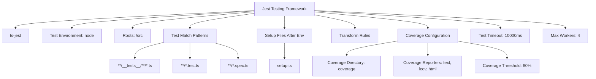

**Diagram sources**
- [jest.config.js](file://jest.config.js#L0-L30)

**Section sources**
- [jest.config.js](file://jest.config.js#L0-L30)

## Test Structure and Organization

Tests are organized in a hierarchical structure within the src/__tests__ directory and component-specific __tests__ subdirectories. This organization follows a clear pattern that separates different test types and maintains proximity to the code they test.

```mermaid
graph TD
A[src] --> B[__tests__]
A --> C[clients]
A --> D[config]
A --> E[middleware]
A --> F[routes]
A --> G[services]
A --> H[types]
A --> I[utils]
B --> B1[fixtures]
B --> B2[app.test.ts]
B --> B3[e2e.test.ts]
B --> B4[performance.test.ts]
B --> B5[setup.ts]
C --> C1[__tests__]
C1 --> C1a[novitaClient.test.ts]
C1 --> C1b[webhookClient.test.ts]
D --> D1[__tests__]
D1 --> D1a[config.test.ts]
E --> E1[__tests__]
E1 --> E1a[errorHandler.test.ts]
E1 --> E1b[metricsMiddleware.test.ts]
E1 --> E1c[requestLogger.test.ts]
F --> F1[__tests__]
F1 --> F1a[cache.test.ts]
F1 --> F1b[health.test.ts]
F1 --> F1c[instances.test.ts]
F1 --> F1d[integration.test.ts]
F1 --> F1e[metrics.test.ts]
G --> G1[__tests__]
G1 --> G1a[cacheService.test.ts]
G1 --> G1b[instanceCreationWorkflow.test.ts]
G1 --> G1c[instanceService.test.ts]
G1 --> G1d[jobIntegration.test.ts]
G1 --> G1e[jobQueueService.test.ts]
G1 --> G1f[jobWorkerService.test.ts]
G1 --> G1g[metricsService.test.ts]
G1 --> G1h[novitaApiService.test.ts]
G1 --> G1i[productService.test.ts]
G1 --> G1j[templateService.test.ts]
G1 --> G1k[workflowIntegration.test.ts]
H --> H1[__tests__]
H1 --> H1a[validation.test.ts]
I --> I1[__tests__]
I1 --> I1a[logger.test.ts]
```

**Diagram sources**
- [project structure](file://#L1-L100)

**Section sources**
- [project structure](file://#L1-L100)

## Unit Testing Strategy

Unit tests in the novitai application focus on testing individual functions, classes, and modules in isolation. Each service, utility, and middleware component has dedicated unit tests that verify functionality with mocked dependencies.

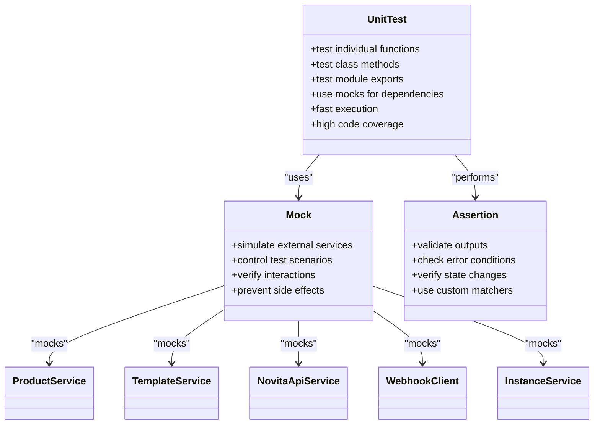

**Diagram sources**
- [src/services/__tests__/productService.test.ts](file://src/services/__tests__/productService.test.ts)
- [src/services/__tests__/templateService.test.ts](file://src/services/__tests__/templateService.test.ts)
- [src/services/__tests__/novitaApiService.test.ts](file://src/services/__tests__/novitaApiService.test.ts)
- [src/services/__tests__/webhookClient.test.ts](file://src/clients/__tests__/webhookClient.test.ts)
- [src/services/__tests__/instanceService.test.ts](file://src/services/__tests__/instanceService.test.ts)

**Section sources**
- [src/services/__tests__/productService.test.ts](file://src/services/__tests__/productService.test.ts)
- [src/services/__tests__/templateService.test.ts](file://src/services/__tests__/templateService.test.ts)
- [src/services/__tests__/novitaApiService.test.ts](file://src/services/__tests__/novitaApiService.test.ts)
- [src/clients/__tests__/webhookClient.test.ts](file://src/clients/__tests__/webhookClient.test.ts)
- [src/services/__tests__/instanceService.test.ts](file://src/services/__tests__/instanceService.test.ts)

## Integration Testing Approach

Integration tests verify the interaction between multiple components, particularly focusing on route handlers, middleware, and service integrations. These tests use Supertest to simulate HTTP requests and validate API behavior.

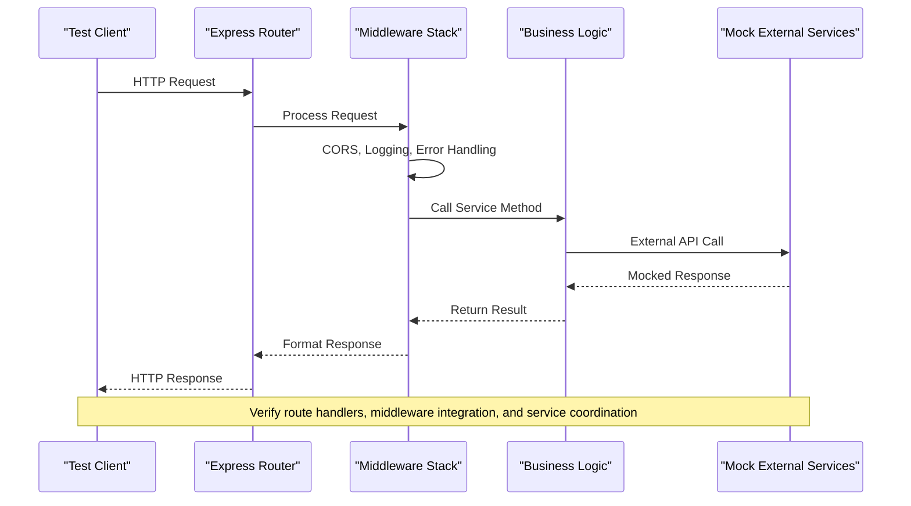

**Diagram sources**
- [src/routes/__tests__/instances.test.ts](file://src/routes/__tests__/instances.test.ts)
- [src/routes/__tests__/integration.test.ts](file://src/routes/__tests__/integration.test.ts)
- [src/routes/__tests__/health.test.ts](file://src/routes/__tests__/health.test.ts)
- [src/middleware/__tests__/errorHandler.test.ts](file://src/middleware/__tests__/errorHandler.test.ts)
- [src/middleware/__tests__/requestLogger.test.ts](file://src/middleware/__tests__/requestLogger.test.ts)

**Section sources**
- [src/routes/__tests__/instances.test.ts](file://src/routes/__tests__/instances.test.ts)
- [src/routes/__tests__/integration.test.ts](file://src/routes/__tests__/integration.test.ts)
- [src/routes/__tests__/health.test.ts](file://src/routes/__tests__/health.test.ts)
- [src/middleware/__tests__/errorHandler.test.ts](file://src/middleware/__tests__/errorHandler.test.ts)
- [src/middleware/__tests__/requestLogger.test.ts](file://src/middleware/__tests__/requestLogger.test.ts)

## End-to-End Testing

End-to-end tests validate the complete instance creation workflow, simulating real user interactions and verifying system behavior from request initiation to completion.

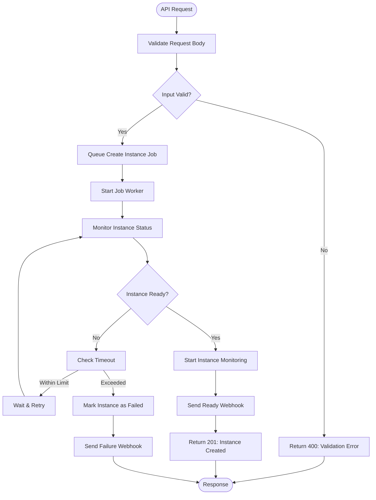

**Diagram sources**
- [src/__tests__/e2e.test.ts](file://src/__tests__/e2e.test.ts)
- [src/services/__tests__/workflowIntegration.test.ts](file://src/services/__tests__/workflowIntegration.test.ts)
- [src/services/__tests__/jobIntegration.test.ts](file://src/services/__tests__/jobIntegration.test.ts)

**Section sources**
- [src/__tests__/e2e.test.ts](file://src/__tests__/e2e.test.ts)
- [src/services/__tests__/workflowIntegration.test.ts](file://src/services/__tests__/workflowIntegration.test.ts)
- [src/services/__tests__/jobIntegration.test.ts](file://src/services/__tests__/jobIntegration.test.ts)

## Performance Testing

Performance tests measure API response times under various load conditions and ensure the system meets performance requirements.

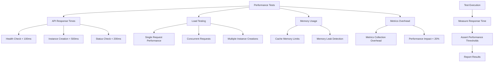

**Diagram sources**
- [src/__tests__/performance.test.ts](file://src/__tests__/performance.test.ts)
- [src/services/__tests__/metricsService.test.ts](file://src/services/__tests__/metricsService.test.ts)
- [src/middleware/__tests__/metricsMiddleware.test.ts](file://src/middleware/__tests__/metricsMiddleware.test.ts)

**Section sources**
- [src/__tests__/performance.test.ts](file://src/__tests__/performance.test.ts)
- [src/services/__tests__/metricsService.test.ts](file://src/services/__tests__/metricsService.test.ts)
- [src/middleware/__tests__/metricsMiddleware.test.ts](file://src/middleware/__tests__/metricsMiddleware.test.ts)

## Test Setup and Teardown

The test environment is configured through setup.ts, which establishes global test configurations, mocks, and utilities used across all test files.

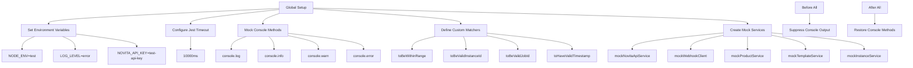

**Diagram sources**
- [src/__tests__/setup.ts](file://src/__tests__/setup.ts#L0-L316)

**Section sources**
- [src/__tests__/setup.ts](file://src/__tests__/setup.ts#L0-L316)

## Test Fixtures and Mock Data

The application uses a centralized fixtures system to provide consistent test data across all test files, ensuring reliability and maintainability.

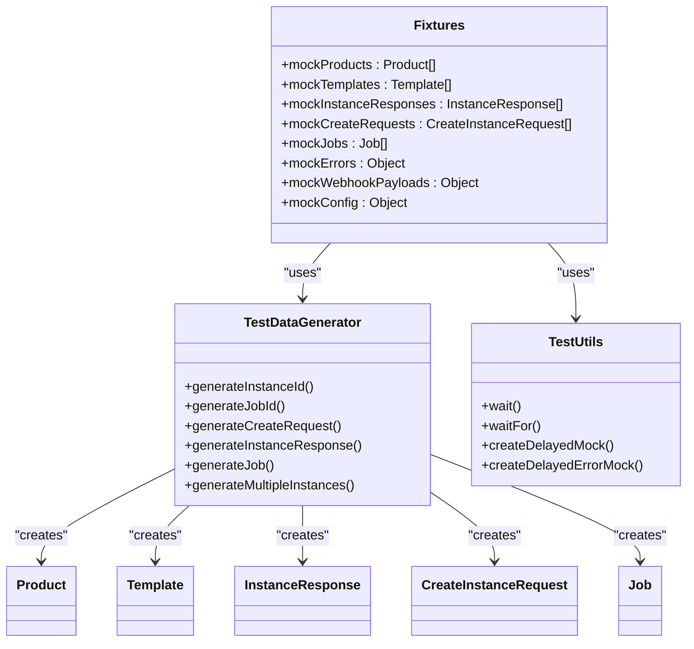

**Diagram sources**
- [src/__tests__/fixtures/index.ts](file://src/__tests__/fixtures/index.ts#L0-L468)

**Section sources**
- [src/__tests__/fixtures/index.ts](file://src/__tests__/fixtures/index.ts#L0-L468)

## Writing New Tests

When writing new tests for the novitai application, follow these conventions to ensure consistency with the existing test suite.

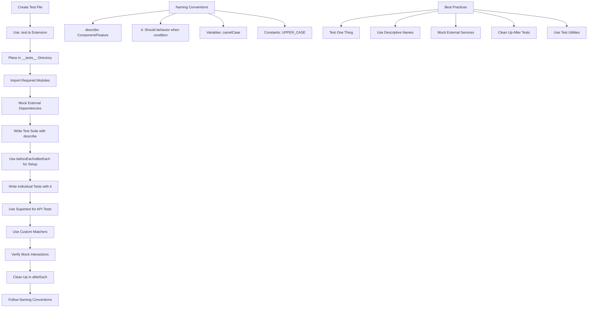

**Section sources**
- [src/__tests__/app.test.ts](file://src/__tests__/app.test.ts)
- [src/routes/__tests__/instances.test.ts](file://src/routes/__tests__/instances.test.ts)
- [src/services/__tests__/instanceService.test.ts](file://src/services/__tests__/instanceService.test.ts)

## Code Coverage and CI Integration

Code coverage is enforced through Jest configuration with specific thresholds, and test execution is integrated into the CI/CD pipeline via the Makefile.

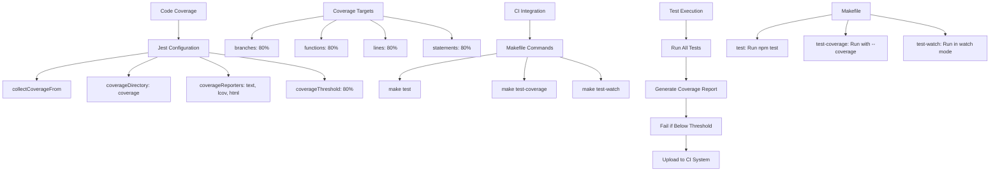

**Diagram sources**
- [jest.config.js](file://jest.config.js#L0-L30)
- [Makefile](file://Makefile#L0-L141)

**Section sources**
- [jest.config.js](file://jest.config.js#L0-L30)
- [Makefile](file://Makefile#L0-L141)

## Troubleshooting and Debugging

This section provides guidance for troubleshooting common test issues and debugging strategies for the novitai application.

```mermaid
flowchart TD
A[Troubleshooting] --> B[Flaky Tests]
A --> C[Timeout Errors]
A --> D[Mock Issues]
A --> E[Coverage Gaps]
B --> B1[Increase testTimeout]
B --> B2[Check async operations]
B --> B3[Verify mock reset]
B --> B4[Use done callback]
C --> C1[Check Jest timeout setting]
C --> C2[Review async/await usage]
C --> C3[Inspect Promise chains]
C --> C4[Add console logs]
D --> D1[Verify mock implementation]
D --> D2[Check mock call order]
D --> D3[Ensure proper mocking]
D --> D4[Use mockReset/mockClear]
E --> E1[Identify uncovered lines]
E --> E2[Add targeted tests]
E --> E3[Review coverage report]
E --> E4[Check ignore patterns]
F[Debugging Strategies] --> G[Enable verbose logging]
F --> H[Use console.log in tests]
F --> I[Run single test with only]
F --> J[Use debugger statement]
F --> K[Check coverage reports]
F --> L[Review error stack traces]
```

**Section sources**
- [src/__tests__/setup.ts](file://src/__tests__/setup.ts)
- [jest.config.js](file://jest.config.js)
- [src/__tests__/app.test.ts](file://src/__tests__/app.test.ts)
- [src/routes/__tests__/instances.test.ts](file://src/routes/__tests__/instances.test.ts)