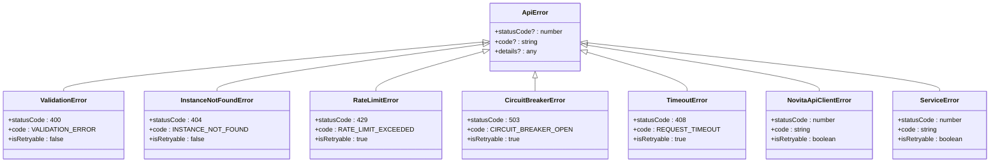
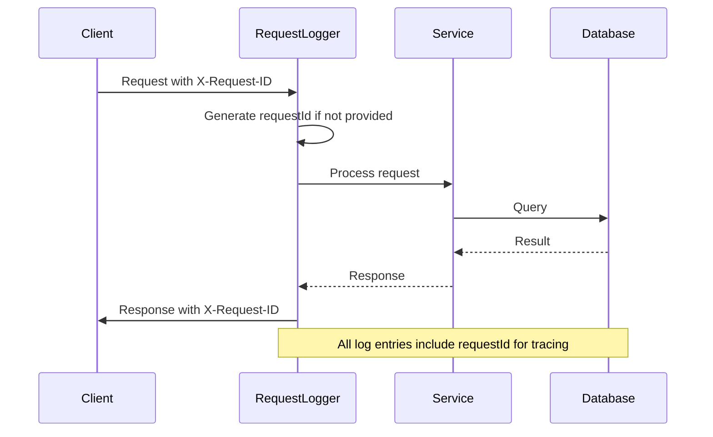
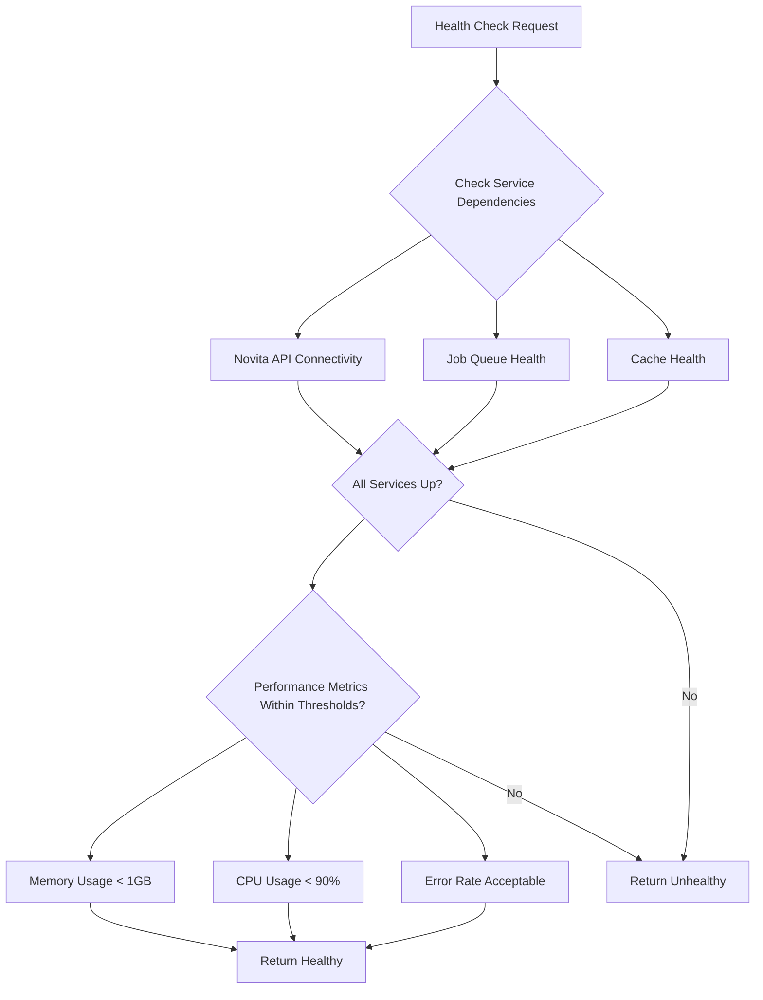
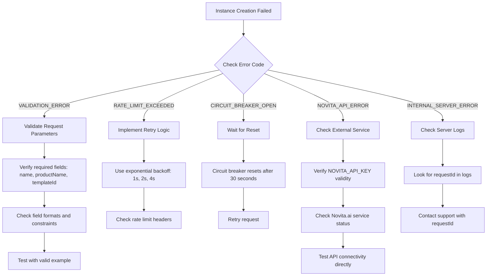
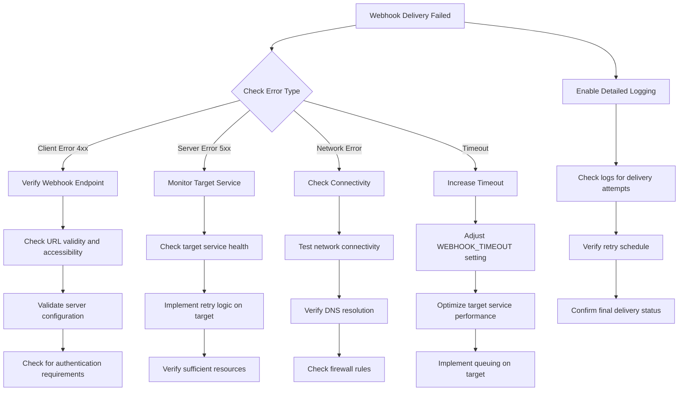
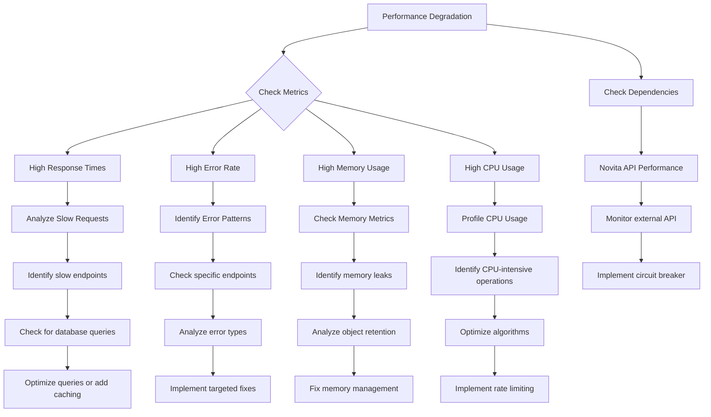

# Troubleshooting Guide

<cite>
**Referenced Files in This Document**   
- [src/middleware/errorHandler.ts](file://src/middleware/errorHandler.ts)
- [src/routes/health.ts](file://src/routes/health.ts)
- [src/routes/metrics.ts](file://src/routes/metrics.ts)
- [src/utils/logger.ts](file://src/utils/logger.ts)
- [src/middleware/requestLogger.ts](file://src/middleware/requestLogger.ts)
- [src/clients/webhookClient.ts](file://src/clients/webhookClient.ts)
- [src/services/jobWorkerService.ts](file://src/services/jobWorkerService.ts)
- [src/config/README.md](file://src/config/README.md)
- [scripts/health-check.sh](file://scripts/health-check.sh)
- [DOCKER_DEPLOYMENT_SUMMARY.md](file://DOCKER_DEPLOYMENT_SUMMARY.md)
- [DEPLOYMENT.md](file://DEPLOYMENT.md)
</cite>

## Table of Contents
1. [Diagnostic Tools and Techniques](#diagnostic-tools-and-techniques)
2. [Error Catalog](#error-catalog)
3. [Common Issues and Solutions](#common-issues-and-solutions)
4. [Log Analysis with Correlation IDs](#log-analysis-with-correlation-ids)
5. [Health and Metrics Endpoints](#health-and-metrics-endpoints)
6. [Troubleshooting Procedures](#troubleshooting-procedures)
7. [Debugging Commands and Scripts](#debugging-commands-and-scripts)
8. [Monitoring Setup](#monitoring-setup)
9. [Escalation Paths and Support](#escalation-paths-and-support)
10. [Diagnostic Trees](#diagnostic-trees)

## Diagnostic Tools and Techniques

The novitai application provides comprehensive diagnostic tools for monitoring and troubleshooting system health. The primary diagnostic mechanisms include structured logging, metrics endpoints, and health checks that work together to provide visibility into system operations.

Structured logging is implemented through the Winston logging library with custom formatting that includes timestamps, log levels, service information, and correlation data. Each log entry contains requestId and correlationId fields that enable tracing requests across system boundaries. The logging system differentiates between development and production environments, providing more detailed debug information in development mode while maintaining performance in production.

Metrics collection is handled by the MetricsService, which tracks request metrics, job processing metrics, and system-level metrics. Request metrics include counts, duration statistics, status codes, and endpoint-specific data. Job metrics track processing rates, success/failure rates, and queue sizes. System metrics capture memory usage, CPU utilization, and process uptime.

Health checks provide a comprehensive view of system health by validating service dependencies and performance thresholds. The health endpoint checks the status of critical dependencies including the Novita API, job queue, and cache services. It also evaluates system performance metrics such as memory usage and error rates to determine overall health status.

**Section sources**
- [src/utils/logger.ts](file://src/utils/logger.ts#L0-L38)
- [src/services/metricsService.ts](file://src/services/metricsService.ts#L335-L391)
- [src/routes/health.ts](file://src/routes/health.ts#L16-L45)

## Error Catalog

The novitai application implements a comprehensive error handling system that categorizes errors and maps them to appropriate HTTP status codes and response formats. The error catalog includes client errors, server errors, external API errors, and specialized error types for specific failure modes.



**Diagram sources**
- [src/middleware/errorHandler.ts](file://src/middleware/errorHandler.ts#L0-L50)
- [src/utils/errorHandler.ts](file://src/utils/errorHandler.ts#L105-L131)

### Error Code Mapping

| Error Code | HTTP Status | Category | Retryable | Root Cause | Solution |
|-----------|------------|---------|----------|-----------|----------|
| VALIDATION_ERROR | 400 | VALIDATION_ERROR | No | Invalid request parameters | Validate request body against API specification |
| INSTANCE_NOT_FOUND | 404 | CLIENT_ERROR | No | Non-existent instance ID | Verify instance ID exists using GET /api/instances |
| RATE_LIMIT_EXCEEDED | 429 | RATE_LIMIT_ERROR | Yes | Too many requests | Implement exponential backoff and retry logic |
| CIRCUIT_BREAKER_OPEN | 503 | CIRCUIT_BREAKER_ERROR | Yes | External service failure | Wait for circuit breaker to reset, typically 30 seconds |
| REQUEST_TIMEOUT | 408 | TIMEOUT_ERROR | Yes | Operation exceeded timeout | Retry with longer timeout or check network connectivity |
| NOVITA_API_ERROR | 500/4xx | EXTERNAL_API_ERROR | Conditional | Novita.ai API failure | Check Novita.ai service status, verify API key |
| INTERNAL_SERVER_ERROR | 500 | SERVER_ERROR | No | Unhandled application error | Check server logs, contact support |

**Section sources**
- [src/middleware/errorHandler.ts](file://src/middleware/errorHandler.ts#L52-L139)
- [src/utils/errorHandler.ts](file://src/utils/errorHandler.ts#L105-L131)

## Common Issues and Solutions

### Failed Instance Creation

Instance creation failures can occur due to various reasons including validation errors, resource constraints, or external API failures. The system handles instance creation through a job queue workflow that includes creation, monitoring, and notification steps.

When instance creation fails, the system updates the instance state to FAILED and queues a failure webhook if configured. Common causes include invalid template IDs, insufficient GPU resources, or region-specific constraints. The error response typically includes specific details about the failure reason.

### Webhook Delivery Failures

Webhook delivery failures are handled with a retry mechanism that follows exponential backoff patterns. The webhook client retries failed deliveries up to three times with delays of 1s, 2s, and 4s between attempts. Client errors (4xx status codes) are not retried, while server errors (5xx) and network errors trigger retries.

Webhook delivery can fail due to invalid URLs, network connectivity issues, or target service unavailability. The system logs detailed information about each delivery attempt, including response codes and error messages, to aid in troubleshooting.

### Configuration Errors

Configuration errors typically occur when required environment variables are missing or have invalid values. The most critical configuration is the NOVITA_API_KEY, which is required for all API operations. Other common configuration issues include invalid webhook URLs, incorrect region settings, or misconfigured resource limits.

The application validates configuration at startup and fails fast with descriptive error messages when validation fails. Configuration validation uses Joi schemas to ensure all required fields are present and have valid values according to defined constraints.

### Performance Degradation

Performance degradation can manifest as increased response times, higher error rates, or resource exhaustion. The system monitors key performance indicators including requests per minute, average response time, error rate, and job processing rate.

Common causes of performance issues include high load on the Novita API, job queue backlog, memory leaks, or CPU bottlenecks. The health check endpoint evaluates performance metrics against thresholds to determine overall system health.

**Section sources**
- [src/services/jobWorkerService.ts](file://src/services/jobWorkerService.ts#L183-L250)
- [src/clients/webhookClient.ts](file://src/clients/webhookClient.ts#L91-L179)
- [src/config/README.md](file://src/config/README.md#L96-L157)

## Log Analysis with Correlation IDs

The novitai application implements comprehensive request tracing using correlation IDs to track requests throughout their lifecycle. Each incoming request is assigned a requestId and correlationId, which are included in all subsequent log entries related to that request.

The requestLoggerMiddleware extracts or generates these identifiers and sets them as response headers, enabling clients to include them in follow-up requests for end-to-end tracing. Log entries include contextual information such as method, URL, status code, duration, and relevant metadata to facilitate debugging.



**Diagram sources**
- [src/middleware/requestLogger.ts](file://src/middleware/requestLogger.ts#L0-L38)
- [src/utils/logger.ts](file://src/utils/logger.ts#L0-L38)

Log entries are structured as JSON objects with consistent fields including timestamp, level, service, message, requestId, and correlationId. This structure enables efficient parsing and analysis using log management tools. Performance-related logs are generated for slow requests (over 5 seconds) to help identify bottlenecks.

**Section sources**
- [src/middleware/requestLogger.ts](file://src/middleware/requestLogger.ts#L176-L233)
- [src/utils/logger.ts](file://src/utils/logger.ts#L0-L38)

## Health and Metrics Endpoints

The novitai application provides two primary endpoints for system diagnosis: /health and /api/metrics. These endpoints offer different levels of detail for monitoring system health and performance.

### Health Endpoint (/health)

The health endpoint provides a comprehensive assessment of system health by checking service dependencies and performance thresholds. It returns a 200 status code for healthy systems and 503 for unhealthy systems.



**Diagram sources**
- [src/routes/health.ts](file://src/routes/health.ts#L16-L45)
- [src/routes/health.ts](file://src/routes/health.ts#L110-L152)

The health response includes detailed information about each dependency, performance metrics, and system information. In development mode, additional debug information is included such as version, node version, and platform details.

### Metrics Endpoint (/api/metrics)

The metrics endpoint provides detailed performance and system metrics through several sub-endpoints:

- **GET /api/metrics/summary**: Aggregated metrics including request statistics, job processing rates, and system health
- **GET /api/metrics/system**: System-level metrics including memory usage, CPU utilization, and process uptime
- **POST /api/metrics/reset**: Reset all metrics (for testing/debugging)

The metrics service collects data on requests, jobs, and system resources, providing insights into application performance and resource utilization.

**Section sources**
- [src/routes/health.ts](file://src/routes/health.ts#L0-L14)
- [src/routes/metrics.ts](file://src/routes/metrics.ts#L85-L136)

## Troubleshooting Procedures

### Docker Deployment Issues

Docker deployment issues can typically be resolved by following a systematic approach:

1. **Verify container status**:
```bash
docker-compose ps
docker ps --filter "name=novita-gpu-instance-api"
```

2. **Check container logs**:
```bash
docker-compose logs -f novita-gpu-api
docker-compose logs --json novita-gpu-api | jq '.'
```

3. **Validate configuration**:
```bash
docker-compose config
cat .env
```

4. **Test service connectivity**:
```bash
curl http://localhost:3000/health
docker-compose exec novita-gpu-api curl -f http://localhost:3000/health
```

5. **Verify volume permissions**:
```bash
sudo chown -R 1001:1001 ./logs
sudo chmod 755 ./logs
```

### Network Connectivity Problems

Network connectivity issues can be diagnosed using the following steps:

1. **Test external API connectivity**:
```bash
docker-compose exec novita-gpu-api curl -H "Authorization: Bearer $NOVITA_API_KEY" https://api.novita.ai/v1/products
```

2. **Check DNS resolution**:
```bash
docker-compose exec novita-gpu-api nslookup api.novita.ai
```

3. **Test network connectivity**:
```bash
docker-compose exec novita-gpu-api ping api.novita.ai
```

4. **Verify firewall rules**:
Ensure outbound connections to api.novita.ai on port 443 are allowed.

### External API Failures

External API failures from Novita.ai can be addressed by:

1. **Verifying API key validity**:
Check that the NOVITA_API_KEY environment variable contains a valid key.

2. **Checking service status**:
Monitor Novita.ai service status through their official channels.

3. **Implementing retry logic**:
The application automatically retries failed requests with exponential backoff.

4. **Reviewing rate limits**:
Ensure requests stay within rate limit thresholds.

**Section sources**
- [DEPLOYMENT.md](file://DEPLOYMENT.md#L330-L336)
- [DOCKER_DEPLOYMENT_SUMMARY.md](file://DOCKER_DEPLOYMENT_SUMMARY.md#L178-L185)

## Debugging Commands and Scripts

The novitai application includes several debugging commands and scripts to facilitate rapid diagnosis of issues.

### Health Check Script

The health-check.sh script performs comprehensive health verification:

```bash
#!/bin/bash
# Configuration
SERVICE_URL="${SERVICE_URL:-http://localhost:3000}"
TIMEOUT="${TIMEOUT:-10}"

# Perform health checks
check_endpoint "/health" "Health endpoint"
check_json_endpoint "/metrics" "Metrics endpoint"

# Additional checks
echo "  Checking service responsiveness..."
start_time=$(date +%s%N)
if curl -f -s --max-time $TIMEOUT "$SERVICE_URL/health" > /dev/null; then
    end_time=$(date +%s%N)
    response_time=$(( (end_time - start_time) / 1000000 ))
    echo "  Response time: ${response_time}ms"
fi

# Check Docker container status
if command -v docker > /dev/null 2>&1; then
    echo "  Checking Docker container status..."
    if docker ps --format "table {{.Names}}\t{{.Status}}" | grep -q "novita-gpu-instance-api"; then
        container_status=$(docker ps --format "{{.Status}}" --filter "name=novita-gpu-instance-api")
        echo "  Container status: $container_status"
    fi
fi
```

This script can be executed directly or through the Makefile:

```bash
make health
# or
./scripts/health-check.sh
```

### Makefile Commands

The Makefile provides convenient commands for common operations:

```bash
make setup     # Setup development environment
make dev       # Start development server
make prod      # Deploy to production
make logs      # View development logs
make prod-logs # View production logs
make backup    # Create backup
make docker-reset # Clean reset
```

**Section sources**
- [scripts/health-check.sh](file://scripts/health-check.sh#L0-L96)
- [DOCKER_DEPLOYMENT_SUMMARY.md](file://DOCKER_DEPLOYMENT_SUMMARY.md#L51-L86)

## Monitoring Setup

Proper monitoring setup is essential for proactive issue detection and system reliability. The novitai application provides several mechanisms for monitoring system health and performance.

### Built-in Monitoring

The application exposes metrics in a format compatible with Prometheus, enabling integration with monitoring solutions like Grafana and AlertManager. Key metrics include:

- Request rates and durations
- Error rates by endpoint and status code
- Job processing rates and queue sizes
- System resource utilization (memory, CPU)
- Cache hit ratios and sizes

### External Monitoring

For production deployments, configure external monitoring to:

1. **Set up health checks**: Configure monitoring tools to call the /health endpoint at regular intervals.

2. **Monitor metrics endpoints**: Collect and visualize metrics from /api/metrics/summary and /api/metrics/system.

3. **Configure alerts**: Set up alerts for critical conditions such as:
   - Health endpoint returning 503
   - Error rate exceeding 5%
   - Memory usage exceeding 80%
   - Job queue backlog growing

4. **Log aggregation**: Use log management solutions to aggregate and analyze application logs.

### Performance Monitoring

Implement performance monitoring to detect issues before they impact users:

1. **Response time monitoring**: Track average and p95 response times for key endpoints.

2. **Error rate monitoring**: Monitor error rates by endpoint and error type.

3. **Resource utilization**: Track memory and CPU usage over time.

4. **Dependency monitoring**: Monitor the health and performance of external dependencies.

**Section sources**
- [client-examples/README.md](file://client-examples/README.md#L82-L150)
- [DOCKER_DEPLOYMENT_SUMMARY.md](file://DOCKER_DEPLOYMENT_SUMMARY.md#L0-L49)

## Escalation Paths and Support

When issues cannot be resolved using the provided troubleshooting procedures, follow these escalation paths:

### Internal Escalation

1. **Development team**: For issues related to application logic or code defects.
2. **Operations team**: For infrastructure, deployment, or configuration issues.
3. **Security team**: For security-related concerns or vulnerabilities.

### External Support

1. **Novita.ai Support**: For issues related to the Novita API or service availability.
2. **Community Forums**: For general questions and peer support.
3. **Documentation**: Refer to the comprehensive documentation in the docs/ directory.

### Support Resources

- **Health Check**: `make health` or `./scripts/health-check.sh`
- **View Logs**: `make logs` or `make prod-logs`
- **Backup**: `make backup`
- **Clean Reset**: `make docker-reset`
- **API Documentation**: `API_ENDPOINTS_SUMMARY.md`
- **Deployment Guide**: `DEPLOYMENT.md`

When contacting support, provide the following information:
- Request IDs and correlation IDs from relevant log entries
- Timestamps of when the issue occurred
- Complete error messages and stack traces (in development mode)
- Steps to reproduce the issue
- Environment details (version, configuration)

**Section sources**
- [DEPLOYMENT.md](file://DEPLOYMENT.md#L330-L336)
- [DOCKER_DEPLOYMENT_SUMMARY.md](file://DOCKER_DEPLOYMENT_SUMMARY.md#L178-L185)

## Diagnostic Trees

### Instance Creation Failure



**Diagram sources**
- [src/services/jobWorkerService.ts](file://src/services/jobWorkerService.ts#L469-L511)
- [src/clients/webhookClient.ts](file://src/clients/webhookClient.ts#L181-L242)

### Webhook Delivery Failure



**Diagram sources**
- [src/clients/webhookClient.ts](file://src/clients/webhookClient.ts#L91-L179)
- [src/services/jobWorkerService.ts](file://src/services/jobWorkerService.ts#L213-L250)

### Performance Degradation



**Diagram sources**
- [src/routes/health.ts](file://src/routes/health.ts#L16-L45)
- [src/services/metricsService.ts](file://src/services/metricsService.ts#L241-L286)