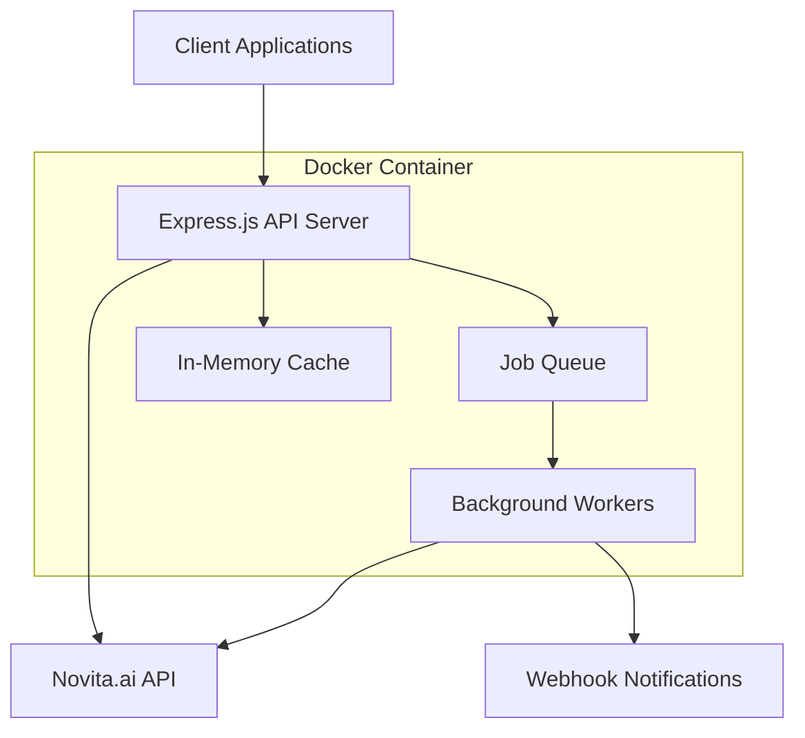

# Novita GPU Instance API Documentation

## Overview

The Novita GPU Instance API is a TypeScript/Node.js service that provides automated lifecycle management for Novita.ai GPU instances. It offers RESTful endpoints for creating, monitoring, and managing GPU instances with optimal pricing selection and webhook notifications.

## Documentation Index

### Getting Started
- **[API Documentation](./API.md)** - Complete API reference with request/response examples
- **[Deployment Guide](./DEPLOYMENT.md)** - Docker Compose deployment instructions
- **[Usage Examples](./EXAMPLES.md)** - Client code examples and integration patterns

### Configuration and Operations
- **[Configuration Reference](./CONFIGURATION.md)** - Complete environment variable reference
- **[Troubleshooting Guide](./TROUBLESHOOTING.md)** - Common issues and solutions
- **[Operations Runbook](./OPERATIONS.md)** - Monitoring, maintenance, and incident response

## Quick Start

### 1. Prerequisites
- Docker 20.10+ and Docker Compose 2.0+
- Novita.ai API key
- At least 512MB RAM and 1 CPU core

### 2. Installation
```bash
# Clone the repository
git clone <repository-url>
cd novita-gpu-instance-api

# Copy environment template
cp .env.example .env

# Configure your API key
echo "NOVITA_API_KEY=your_api_key_here" >> .env

# Start the service
docker-compose up -d
```

### 3. Verify Installation
```bash
# Check service health
curl http://localhost:3000/health

# Create a test instance
curl -X POST http://localhost:3000/api/instances \
  -H "Content-Type: application/json" \
  -d '{
    "name": "test-instance",
    "productName": "RTX 4090 24GB",
    "templateId": "pytorch-jupyter"
  }'
```

## Key Features

### 🚀 Automated Instance Management
- Create GPU instances with minimal configuration
- Automatic instance startup and monitoring
- Optimal pricing selection (lowest spot price)
- Webhook notifications when instances are ready

### 🔧 Production Ready
- Docker containerization with health checks
- Comprehensive error handling and retry logic
- Circuit breaker pattern for external API resilience
- Structured logging and metrics collection

### 📊 Monitoring and Observability
- Health check endpoints for container orchestration
- Detailed metrics for performance monitoring
- Request/response logging with correlation IDs
- Cache performance and hit rate tracking

### 🛡️ Security and Reliability
- API key authentication
- Rate limiting and request validation
- CORS configuration for browser clients
- Graceful shutdown and error recovery

## API Endpoints

| Method | Endpoint | Description |
|--------|----------|-------------|
| GET | `/health` | Service health check |
| POST | `/api/instances` | Create new GPU instance |
| GET | `/api/instances/{id}` | Get instance status |
| GET | `/api/instances` | List all instances |
| GET | `/api/metrics` | Service metrics |

## Architecture



## Configuration

### Required Environment Variables
```bash
# Novita.ai API Configuration
NOVITA_API_KEY=your_novita_api_key_here

# Server Configuration
PORT=3000
NODE_ENV=production
```

### Optional Configuration
```bash
# Webhook Configuration
WEBHOOK_URL=https://your-app.com/webhook
WEBHOOK_SECRET=your_webhook_secret

# Instance Configuration
INSTANCE_POLL_INTERVAL=30000
INSTANCE_STARTUP_TIMEOUT=600000
DEFAULT_REGION=CN-HK-01

# Logging Configuration
LOG_LEVEL=info
LOG_FORMAT=json
```

See the [Configuration Reference](./CONFIGURATION.md) for complete details.

## Usage Examples

### JavaScript/Node.js
```javascript
const axios = require('axios');

// Create instance
const response = await axios.post('http://localhost:3000/api/instances', {
  name: 'ml-training-job',
  productName: 'RTX 4090 24GB',
  templateId: 'pytorch-jupyter',
  gpuNum: 2,
  webhookUrl: 'https://your-app.com/webhook'
});

console.log('Instance created:', response.data.instanceId);
```

### Python
```python
import requests

# Create instance
response = requests.post('http://localhost:3000/api/instances', json={
    'name': 'ml-training-job',
    'productName': 'RTX 4090 24GB',
    'templateId': 'pytorch-jupyter',
    'gpuNum': 2,
    'webhookUrl': 'https://your-app.com/webhook'
})

print('Instance created:', response.json()['instanceId'])
```

### cURL
```bash
curl -X POST http://localhost:3000/api/instances \
  -H "Content-Type: application/json" \
  -d '{
    "name": "ml-training-job",
    "productName": "RTX 4090 24GB",
    "templateId": "pytorch-jupyter",
    "gpuNum": 2,
    "webhookUrl": "https://your-app.com/webhook"
  }'
```

See [Usage Examples](./EXAMPLES.md) for more detailed examples and integration patterns.

## Monitoring

### Health Check
```bash
curl http://localhost:3000/health
```

### Metrics
```bash
curl http://localhost:3000/api/metrics
```

### Logs
```bash
# View logs
docker-compose logs -f novita-api

# Check specific errors
docker-compose logs novita-api | grep ERROR
```

## Troubleshooting

### Common Issues

1. **Service won't start**
   - Check API key configuration
   - Verify port availability
   - Review container logs

2. **Instance creation fails**
   - Verify product name and template ID
   - Check Novita.ai API connectivity
   - Review account quotas and limits

3. **Webhook delivery fails**
   - Verify webhook URL accessibility
   - Check webhook secret configuration
   - Review network connectivity

See the [Troubleshooting Guide](./TROUBLESHOOTING.md) for detailed solutions.

## Support

### Documentation
- [API Reference](./API.md) - Complete API documentation
- [Deployment Guide](./DEPLOYMENT.md) - Production deployment
- [Configuration Reference](./CONFIGURATION.md) - All configuration options
- [Operations Runbook](./OPERATIONS.md) - Monitoring and maintenance

### Getting Help
- **GitHub Issues**: Report bugs and feature requests
- **Documentation**: Check the complete documentation set
- **Community**: Join discussions and share solutions

### Contributing
1. Fork the repository
2. Create a feature branch
3. Make your changes
4. Add tests and documentation
5. Submit a pull request

## License

This project is licensed under the MIT License. See the LICENSE file for details.

## Changelog

### Version 1.0.0
- Initial release
- Core instance management functionality
- Docker Compose deployment
- Comprehensive documentation
- Production-ready monitoring and logging

---

For detailed information on any topic, please refer to the specific documentation files linked above.